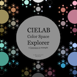

# 

[](https://www.npmjs.com/package/tapspace)
[](https://travis-ci.com/github/taataa/tapspace)

We believe **zoomable user interfaces** to be the best way for humans to explore and manipulate two-dimensional content. Therefore we built **Tapspace.js**, a **JavaScript** library dedicated for building such **dynamic front-ends**. It provides an **infinite, scalable, and rotatable space** for you to represent **HTML content** and for your users to play with. Tapspace.js uses **pure CSS3 and DOM** instead of Canvas or WebGL and therefore is able to handle any HTML content you throw at it, including iframes and SVG, and also Canvas- and WebGL-rendered elements. And of course, we provide a clean, documented API for you to **build your best**.

## Examples

<a href="https://taataa.github.io/tapspace/examples/treeloader/index.html"></a>
<a href="https://taataa.github.io/tapspace/examples/cielab/index.html"></a>
<a href="https://taataa.github.io/tapspace/examples/go/index.html"></a>
<a href="https://taataa.github.io/tapspace/examples/book/index.html"></a>
<a href="https://taataa.github.io/tapspace/examples/gears/index.html"></a>
<a href="https://taataa.github.io/tapspace/examples/html/index.html"></a>

See [all example apps](https://taataa.github.io/tapspace/#examples).

## Install

With [npm](https://www.npmjs.com/package/tapspace) or [yarn](https://yarnpkg.com/en/package/tapspace):

    $ npm install tapspace@alpha
    $ yarn add tapspace@alpha

This installs an alpha version of Tapspace.js 2.x. For the earlier and stable Tapspace.js 1.x, see [1.6-stable](https://github.com/taataa/tapspace/tree/1.6-stable) branch.

Via [unpkg](https://www.unpkg.com/browse/tapspace@2.0.0-alpha.16/):

```
<script src="https://unpkg.com/tapspace@2.0.0-alpha.16/dist/tapspace.min.js"></script>
```


## Documentation

See [taataa.github.io/tapspace](http://taataa.github.io/tapspace) for:
- [Tutorial](http://taataa.github.io/tapspace/tutorial)
- [Features](http://taataa.github.io/tapspace#features)
- [Examples](http://taataa.github.io/tapspace#examples)
- [API Reference](https://taataa.github.io/tapspace/api/v2/)
- [Developer's Cheat Sheet](http://taataa.github.io/tapspace/dev)

**In a nutshell**, Tapspace.js consists of component classes that each wrap an HTML element.
These classes allow the elements to be positioned freely on a transformable and infinite space.
A hierarchy of these components form a subtree in the browser DOM.
This subtree, which we call the *affine subtree*, has a tensor matrix backbone that
makes projecting points, vectors, and other geometry between the components
**extremely easy**.

Most of the methods in Tapspace, like Viewport:translateBy,
take in tensor geometry objects, like Point, Distance, and Box.
The tensor aspect makes the geometries exist in all coordinate spaces at the same time,
practically freeing you from the need to think how to transit geometry from
an HTML element coordinate space into another coordinate space like onto the viewport or another element.
This comes handy with – and does enable – wild arrangements of components in various scales and angles,
and dynamic interaction driven with multitouch, mouse, or other input devices.

Under the hood Tapspace.js uses CSS 2D transforms. In comparison with CSS 3D transforms,
2D offers unbeatable rendering speed, full browser compatibility, and ease of navigation.
Even CSS 2D transforms can slow down under thousands of elements and break in deep depths.
Large, deep, or infinite visualisations can use tapspace.loaders.TreeLoader
to **escape the limits of browser rendering engine and floating point arithmetics.**

## Supporters

We have developed Tapspace.js in collaboration with the following organizations.

<a href="https://lincsproject.ca/" target="_blank"></a>
<a href="https://www.uoguelph.ca/" target="_blank"></a>
<a href="https://codhr.dh.tamu.edu/" target="_blank"></a>
<a href="https://www.tamu.edu/" target="_blank"></a>
<a href="https://www.tuni.fi/en" target="_blank"></a>

## Contribute

Issues, pull requests and [bug reports](https://github.com/taataa/tapspace/issues) are highly appreciated. Please test your contribution with the following scripts:

Run test suite:

    $ npm run test

Run only linter:

    $ npm run lint

See [testing docs](https://taataa.github.io/tapspace/dev/#testing) for details.

## License

[MIT](LICENSE)
