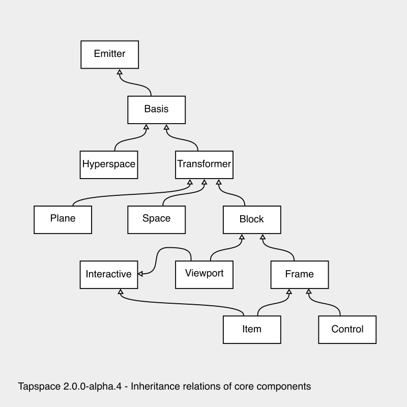

<a name="top"></a>
# Tapspace API Documentation v2.0.0-alpha.2


Welcome to Tapspace API documentation.
Build your zoomable application with the tools documented here.
This document is generated with [yamdog](https://github.com/axelpale/yamdog).

This document follows these naming conventions: `ClassName`, `namespace`, `.CONSTANT`, `.classMethod()`, `:instanceProperty`, `:instanceMethod()`, and `[optionalParameter]`.

See also: [Introduction](https://taataa.github.io/tapspace/) – [Tutorial](https://taataa.github.io/tapspace/tutorial/) - [GitHub](https://github.com/taataa/tapspace)


<a name="tapspace"></a>
## [tapspace](#tapspace)

The [tapspace](#tapspace) namespace provides [components](#tapspacecomponents) for space,
[geometry](#tapspacegeometry) classes,
and [interaction](#tapspaceinteraction) tools.
There are also [loaders](#tapspaceloaders) to help in managing
components, images, and other resources.


<p style="margin-bottom: 0"><strong>Contents:</strong></p>


- [tapspace.capturers](#tapspacecapturers)
- [tapspace.components](#tapspacecomponents)
- [tapspace.createBasis](#tapspacecreatebasis)
- [tapspace.createCircle](#tapspacecreatecircle)
- [tapspace.createEdge](#tapspacecreateedge)
- [tapspace.createItem](#tapspacecreateitem)
- [tapspace.createSpace](#tapspacecreatespace)
- [tapspace.effects](#tapspaceeffects)
- [tapspace.geometry](#tapspacegeometry)
- [tapspace.interaction](#tapspaceinteraction)
- [tapspace.loaders](#tapspaceloaders)
- [tapspace.version](#tapspaceversion)


Source: [lib/index.js](https://github.com/taataa/tapspace/blob/2.0-dev/lib/index.js)

<a name="tapspacecapturers"></a>
## [tapspace](#tapspace).[capturers](#tapspacecapturers)

Classes to capture and preprocess input such as touch gestures
and mouse wheel movements.


<p style="margin-bottom: 0"><strong>Contents:</strong></p>


- [tapspace.capturers.GestureCapturer](#tapspacecapturersgesturecapturer)
- [tapspace.capturers.ResizeCapturer](#tapspacecapturersresizecapturer)
- [tapspace.capturers.WheelCapturer](#tapspacecapturerswheelcapturer)


Source: [capturers/index.js](https://github.com/taataa/tapspace/blob/2.0-dev/lib/capturers/index.js)

<a name="tapspacecapturersgesturecapturer"></a>
## [tapspace](#tapspace).[capturers](#tapspacecapturers).[GestureCapturer](#tapspacecapturersgesturecapturer)(component, options)

Begin to capture and recognize pointer gestures
on the given affine element and emit them as gesture events.

<p style="margin-bottom: 0"><strong>Parameters:</strong></p>


- *component*
  - a [Plane](#tapspacecomponentsplane) or an affine [HTMLElement](https://developer.mozilla.org/en-US/docs/Web/API/HTMLElement).
  - The input events will be listened for and captured here.
- *options*
  - an optional object with props:
    - *freedom*
      - optional object with props
        - *type*
          - optional string, default 'TSR'. The movement type.
        - *pivot*
          - optional [point2](https://axelpale.github.io/affineplane/docs/API.html#affineplanepoint2) on the view or [Point](#tapspacegeometrypoint).
          - The pivot point for types 'S', 'R', and 'SR'.
          - If a [Point](#tapspacegeometrypoint), the basis is preserved and followed.
        - *angle*
          - optional number in radians or [Direction](#tapspacegeometrydirection).
          - The line angle for type 'L'.
          - If a [Direction](#tapspacegeometrydirection), the basis is preserved and followed.
    - *preventDefault*
      - an optional boolean, default true. Set false allow default browser behavior on all handled events.
    - *stopPropagation*
      - an optional boolean, default false. Set true to stop event bubbling on all handled events.


<p style="margin-bottom: 0">Emits</p>


- *gesturestart* with a gesture event object
- *gesturemove* with a gesture event object
- *gestureend* with a gesture event object
- *gesturecancel* with a gesture event object


<p style="margin-bottom: 0">Gesture event objects have following properties:</p>


- *travel*
  - a number, total travel in viewport pixels. Manhattan distance.
- *duration*
  - a number, duration of the gesture in milliseconds
- *component*
  - a [Plane](#tapspacecomponentsplane) where the input events were listened and captured.
- *target*
  - a [Plane](#tapspacecomponentsplane) where the input landed. Helps e.g. in determining depth.
- *mean*
  - a [Point](#tapspacegeometrypoint), the average of the coordinates of active pointers.
- *transform*
  - a [Transform](#tapspacegeometrytransform), the total transformation on the viewport, the sum of all movements from the gesture start to this event.
- *transformOrigin*
  - a [Point](#tapspacegeometrypoint). The position of the transform on the viewport.
- *delta*
  - a [Transform](#tapspacegeometrytransform), difference to the previous gesture event. Measured on the viewport.
- *deltaOrigin*
  - a [Point](#tapspacegeometrypoint). The position of the delta transform on the viewport.


<p style="margin-bottom: 0"><strong>Contents:</strong></p>


- [tapspace.capturers.GestureCapturer:getFreedom](#tapspacecapturersgesturecapturergetfreedom)
- [tapspace.capturers.GestureCapturer:unbind](#tapspacecapturersgesturecapturerunbind)
- [tapspace.capturers.GestureCapturer:update](#tapspacecapturersgesturecapturerupdate)


Source: [GestureCapturer/index.js](https://github.com/taataa/tapspace/blob/2.0-dev/lib/capturers/GestureCapturer/index.js)

<a name="tapspacecapturersgesturecapturergetfreedom"></a>
## [tapspace](#tapspace).[capturers](#tapspacecapturers).[GestureCapturer](#tapspacecapturersgesturecapturer):[getFreedom](#tapspacecapturersgesturecapturergetfreedom)()

Get freedom object for example for debugging.

Source: [GestureCapturer/index.js](https://github.com/taataa/tapspace/blob/2.0-dev/lib/capturers/GestureCapturer/index.js)

<a name="tapspacecapturersgesturecapturerunbind"></a>
## [tapspace](#tapspace).[capturers](#tapspacecapturers).[GestureCapturer](#tapspacecapturersgesturecapturer):[unbind](#tapspacecapturersgesturecapturerunbind)()

Unbind the DOM element listeners of the sensor.
Unbind own listeners, if any.

Source: [GestureCapturer/index.js](https://github.com/taataa/tapspace/blob/2.0-dev/lib/capturers/GestureCapturer/index.js)

<a name="tapspacecapturersgesturecapturerupdate"></a>
## [tapspace](#tapspace).[capturers](#tapspacecapturers).[GestureCapturer](#tapspacecapturersgesturecapturer):[update](#tapspacecapturersgesturecapturerupdate)(options)

Update capturer options.

<p style="margin-bottom: 0"><strong>Parameters:</strong></p>


- options, object with properties:
  - *freedom*
    - optional object
  - *preventDefault*
    - optional boolean
  - *stopPropagation*
    - optional boolean


Source: [GestureCapturer/index.js](https://github.com/taataa/tapspace/blob/2.0-dev/lib/capturers/GestureCapturer/index.js)

<a name="tapspacecapturersresizecapturer"></a>
## [tapspace](#tapspace).[capturers](#tapspacecapturers).[ResizeCapturer](#tapspacecapturersresizecapturer)(component, options)

Resize event capturer.

<p style="margin-bottom: 0"><strong>Parameters:</strong></p>


- *component*
  - a [Plane](#tapspacecomponentsplane), the source for the resize events
- options, optional object with props:
  - *TODO*


<p style="margin-bottom: 0">Emits</p>


- resize with new size dimensions of the element.


<p style="margin-bottom: 0">Resize event object has properties:</p>


- *size*
  - a [Size](#tapspacegeometrysize), the new size
- *prevSize*
  - a [Size](#tapspacegeometrysize), the old size
- *target*
  - a [Plane](#tapspacecomponentsplane)
- TODO deltaW
- TODO  horizontal movement in viewport pixels
- TODO deltaH
- TODO  vertical movement in viewport pixels


<p style="margin-bottom: 0"><strong>Contents:</strong></p>


- [tapspace.capturers.ResizeCapturer:unbind](#tapspacecapturersresizecapturerunbind)
- [tapspace.capturers.ResizeCapturer:update](#tapspacecapturersresizecapturerupdate)


Source: [ResizeCapturer/index.js](https://github.com/taataa/tapspace/blob/2.0-dev/lib/capturers/ResizeCapturer/index.js)

<a name="tapspacecapturersresizecapturerunbind"></a>
## [tapspace](#tapspace).[capturers](#tapspacecapturers).[ResizeCapturer](#tapspacecapturersresizecapturer):[unbind](#tapspacecapturersresizecapturerunbind)()

Stop resize observation.

Source: [ResizeCapturer/index.js](https://github.com/taataa/tapspace/blob/2.0-dev/lib/capturers/ResizeCapturer/index.js)

<a name="tapspacecapturersresizecapturerupdate"></a>
## [tapspace](#tapspace).[capturers](#tapspacecapturers).[ResizeCapturer](#tapspacecapturersresizecapturer):[update](#tapspacecapturersresizecapturerupdate)(options)

Update capturer options.

Source: [ResizeCapturer/index.js](https://github.com/taataa/tapspace/blob/2.0-dev/lib/capturers/ResizeCapturer/index.js)

<a name="tapspacecapturerswheelcapturer"></a>
## [tapspace](#tapspace).[capturers](#tapspacecapturers).[WheelCapturer](#tapspacecapturerswheelcapturer)(component, options)

Mouse wheel capturer. Attempts to normalise and add compatibility
to wheeling and scrolling.

<p style="margin-bottom: 0"><strong>Parameters:</strong></p>


- *component*
  - a [Plane](#tapspacecomponentsplane), the source for the wheel events
- options, optional object with props:
  - *preventDefault*
    - an optional boolean, default true. Set false to allow default browser behavior on all handled events.
  - *stopPropagation*
    - an optional boolean, default false. Set true to stop event bubbling on all handled events.


<p style="margin-bottom: 0">Emits</p>


- wheel with wheel-gesture object


<p style="margin-bottom: 0">Wheel-gesture object has properties:</p>


- *center*
  - a [Point](#tapspacegeometrypoint), the pointer location.
- *component*
  - a [Plane](#tapspacecomponentsplane) on which the center is measured. The viewport.
- *target*
  - a [Plane](#tapspacecomponentsplane) closest to the original event target.
- *deltaX*
  - a number, normalized horizontal movement of the mouse wheel.
- *deltaY*
  - a number, normalized vertical movement of the mouse wheel.


<p style="margin-bottom: 0"><strong>Contents:</strong></p>


- [tapspace.capturers.WheelCapturer:unbind](#tapspacecapturerswheelcapturerunbind)
- [tapspace.capturers.WheelCapturer:update](#tapspacecapturerswheelcapturerupdate)


Source: [WheelCapturer/index.js](https://github.com/taataa/tapspace/blob/2.0-dev/lib/capturers/WheelCapturer/index.js)

<a name="tapspacecapturerswheelcapturerunbind"></a>
## [tapspace](#tapspace).[capturers](#tapspacecapturers).[WheelCapturer](#tapspacecapturerswheelcapturer):[unbind](#tapspacecapturerswheelcapturerunbind)()

Remove all wheel capturer event listeners from the element.

Source: [WheelCapturer/index.js](https://github.com/taataa/tapspace/blob/2.0-dev/lib/capturers/WheelCapturer/index.js)

<a name="tapspacecapturerswheelcapturerupdate"></a>
## [tapspace](#tapspace).[capturers](#tapspacecapturers).[WheelCapturer](#tapspacecapturerswheelcapturer):[update](#tapspacecapturerswheelcapturerupdate)(options)

Update capturer options.

Source: [WheelCapturer/index.js](https://github.com/taataa/tapspace/blob/2.0-dev/lib/capturers/WheelCapturer/index.js)

<a name="tapspacecomponents"></a>
## [tapspace](#tapspace).[components](#tapspacecomponents)

Various components to render into space.

<p style="margin-bottom: 0"><strong>Core components:</strong></p>


- [Item](#tapspacecomponentsitem), a movable HTML container in space.
- [Space](#tapspacecomponentsspace), the container for all space items.
- [Group](#tapspacecomponentsgroup), a set of items and other groups.
- [Viewport](#tapspacecomponentsviewport), a viewport to space. The root element.


<p style="margin-bottom: 0"><strong>Special components:</strong></p>


- [Circle](#tapspacecomponentscircle), a round HTML element in space.
- [Edge](#tapspacecomponentsedge), a CSS border as a line segment in space.


<p style="margin-bottom: 0"><strong>Viewport controls:</strong></p>


- [ZoomControl](#tapspacecomponentszoomcontrol), a button pair for zooming in and out.


<p style="margin-bottom: 0"><strong>Abstract components:</strong></p>


- [Basis](#tapspacecomponentsbasis) is a node in affine space.
- [Plane](#tapspacecomponentsplane) is a [Basis](#tapspacecomponentsbasis) that is transformable.
- [Block](#tapspacecomponentsblock) is a [Plane](#tapspacecomponentsplane) that has rectangular boundaries and size.
- [Frame](#tapspacecomponentsframe) is a [Block](#tapspacecomponentsblock) that has known size which can be changed.
- [Control](#tapspacecomponentscontrol) is a [Frame](#tapspacecomponentsframe) that stays fixed to the viewport.
- [Interactive](#tapspacecomponentsinteractive) is a [Plane](#tapspacecomponentsplane) that can capture touch and mouse gestures.


**Inheritance chart:**




<p style="margin-bottom: 0"><strong>Contents:</strong></p>


- [tapspace.components.Basis](#tapspacecomponentsbasis)
- [tapspace.components.Block](#tapspacecomponentsblock)
- [tapspace.components.Circle](#tapspacecomponentscircle)
- [tapspace.components.Control](#tapspacecomponentscontrol)
- [tapspace.components.Edge](#tapspacecomponentsedge)
- [tapspace.components.Frame](#tapspacecomponentsframe)
- [tapspace.components.Group](#tapspacecomponentsgroup)
- [tapspace.components.Interactive](#tapspacecomponentsinteractive)
- [tapspace.components.Item](#tapspacecomponentsitem)
- [tapspace.components.Plane](#tapspacecomponentsplane)
- [tapspace.components.Space](#tapspacecomponentsspace)
- [tapspace.components.Viewport](#tapspacecomponentsviewport)
- [tapspace.components.ZoomControl](#tapspacecomponentszoomcontrol)


Source: [components/index.js](https://github.com/taataa/tapspace/blob/2.0-dev/lib/components/index.js)

<a name="tapspacecomponentsbasis"></a>
## [tapspace](#tapspace).[components](#tapspacecomponents).[Basis](#tapspacecomponentsbasis)(element)

Inherits [Emitter](https://www.npmjs.com/package/component-emitter)

[Basis](#tapspacecomponentsbasis) is an abstract class for all affine components that have
an HTML element and a position within a [Space](#tapspacecomponentsspace).
Multiple bases together form an *affine subtree* in DOM.

<p style="margin-bottom: 0"><strong>Parameters:</strong></p>


- *element*
  - an [HTMLElement](https://developer.mozilla.org/en-US/docs/Web/API/HTMLElement)


<p style="margin-bottom: 0"><strong>Contents:</strong></p>


- [tapspace.components.Basis:add](#tapspacecomponentsbasisadd)
- [tapspace.components.Basis:addChild](#tapspacecomponentsbasisaddchild)
- [tapspace.components.Basis:addClass](#tapspacecomponentsbasisaddclass)
- [tapspace.components.Basis:findCommonAncestor](#tapspacecomponentsbasisfindcommonancestor)
- [tapspace.components.Basis:getAncestors](#tapspacecomponentsbasisgetancestors)
- [tapspace.components.Basis:getChildren](#tapspacecomponentsbasisgetchildren)
- [tapspace.components.Basis:getDescendants](#tapspacecomponentsbasisgetdescendants)
- [tapspace.components.Basis:getElement](#tapspacecomponentsbasisgetelement)
- [tapspace.components.Basis:getLeaves](#tapspacecomponentsbasisgetleaves)
- [tapspace.components.Basis:getParent](#tapspacecomponentsbasisgetparent)
- [tapspace.components.Basis:getRoot](#tapspacecomponentsbasisgetroot)
- [tapspace.components.Basis:getTransitionFrom](#tapspacecomponentsbasisgettransitionfrom)
- [tapspace.components.Basis:getTransitionTo](#tapspacecomponentsbasisgettransitionto)
- [tapspace.components.Basis:getTransitionToParent](#tapspacecomponentsbasisgettransitiontoparent)
- [tapspace.components.Basis:getTransitionToParentOf](#tapspacecomponentsbasisgettransitiontoparentof)
- [tapspace.components.Basis:isLeaf](#tapspacecomponentsbasisisleaf)
- [tapspace.components.Basis:isRoot](#tapspacecomponentsbasisisroot)
- [tapspace.components.Basis:removeClass](#tapspacecomponentsbasisremoveclass)
- [tapspace.components.Basis:setParent](#tapspacecomponentsbasissetparent)
- [tapspace.components.Basis.findAffineAncestor](#tapspacecomponentsbasisfindaffineancestor)
- [tapspace.components.Basis.isAffine](#tapspacecomponentsbasisisaffine)


Source: [Basis/index.js](https://github.com/taataa/tapspace/blob/2.0-dev/lib/components/Basis/index.js)

<a name="tapspacecomponentsbasisadd"></a>
## [tapspace](#tapspace).[components](#tapspacecomponents).[Basis](#tapspacecomponentsbasis):[add](#tapspacecomponentsbasisadd)

Alias of [tapspace.components.Basis:addChild](#tapspacecomponentsbasisaddchild)

Source: [addChild.js](https://github.com/taataa/tapspace/blob/2.0-dev/lib/components/Basis/addChild.js)

<a name="tapspacecomponentsbasisaddchild"></a>
## [tapspace](#tapspace).[components](#tapspacecomponents).[Basis](#tapspacecomponentsbasis):[addChild](#tapspacecomponentsbasisaddchild)(component, position)

Place a component onto this basis.

<p style="margin-bottom: 0"><strong>Parameters:</strong></p>


- *component*
  - a [Basis](#tapspacecomponentsbasis)
- *position*
  - optional [Point](#tapspacegeometrypoint) or {x,y} or {x,y,z}.
  - Defines the initial position for the component.
  - You can leave the position parameter undefined and move the component to its position afterwards.
  - Also, if you have already prepared the local coordinates of the component and want to preserve them as is, then leave the position parameter undefined.


<p style="margin-bottom: 0"><strong>Returns:</strong></p>


- this, for chaining


Aliases: [tapspace.components.Basis:add](#tapspacecomponentsbasisadd)

Source: [addChild.js](https://github.com/taataa/tapspace/blob/2.0-dev/lib/components/Basis/addChild.js)

<a name="tapspacecomponentsbasisaddclass"></a>
## [tapspace](#tapspace).[components](#tapspacecomponents).[Basis](#tapspacecomponentsbasis):[addClass](#tapspacecomponentsbasisaddclass)

Add a CSS class name into the affine element.
This is equivalent to `basis.element.classList.add(className)`.

<p style="margin-bottom: 0"><strong>Parameters:</strong></p>


- *className*
  - a string, for example 'my-item'


<p style="margin-bottom: 0"><strong>Returns:</strong></p>


- this, for chaining


Source: [addClass.js](https://github.com/taataa/tapspace/blob/2.0-dev/lib/components/Basis/addClass.js)

<a name="tapspacecomponentsbasisfindcommonancestor"></a>
## [tapspace](#tapspace).[components](#tapspacecomponents).[Basis](#tapspacecomponentsbasis):[findCommonAncestor](#tapspacecomponentsbasisfindcommonancestor)(node)

Find lowest common affine ancestor of this and the given node.
If a mother has two children and the father of the mother is
the grandfather of the children, then the lowest common ancestor
for the children is the mother. If the mother has a sister from
the same father, then the grandfather is the lowest common ancestor
of the sister and one of the children.

<p style="margin-bottom: 0"><strong>Parameters:</strong></p>


- *node*
  - a [Basis](#tapspacecomponentsbasis)


<p style="margin-bottom: 0"><strong>Returns:</strong></p>


- a [Basis](#tapspacecomponentsbasis). Null if no common ancestor is found.


<p style="margin-bottom: 0">Note that the result might not be a true ancestor:</p>


- If this is an ancestor of the given node, then this is returned.
- If the given node is an ancestor of this node, then the given node is returned.
- If this node equals the given node, then this is returned.


Source: [findCommonAncestor.js](https://github.com/taataa/tapspace/blob/2.0-dev/lib/components/Basis/findCommonAncestor.js)

<a name="tapspacecomponentsbasisgetancestors"></a>
## [tapspace](#tapspace).[components](#tapspacecomponents).[Basis](#tapspacecomponentsbasis):[getAncestors](#tapspacecomponentsbasisgetancestors)()

Get an array of affine ancestors of this node, ordered from
the immediate parent to the farthest ancestor, the immediate parent first.
The list of ancestors includes a space and a viewport, given that
the node is placed in a space.

<p style="margin-bottom: 0"><strong>Returns:</strong></p>


- array of [Basis](#tapspacecomponentsbasis)


Source: [getAncestors.js](https://github.com/taataa/tapspace/blob/2.0-dev/lib/components/Basis/getAncestors.js)

<a name="tapspacecomponentsbasisgetchildren"></a>
## [tapspace](#tapspace).[components](#tapspacecomponents).[Basis](#tapspacecomponentsbasis):[getChildren](#tapspacecomponentsbasisgetchildren)()

Get all affine child nodes of this node. The children are found via DOM.
The children in DOM that do not have affine properties will be skipped.

<p style="margin-bottom: 0"><strong>Returns:</strong></p>


- array of [Basis](#tapspacecomponentsbasis)


Source: [getChildren.js](https://github.com/taataa/tapspace/blob/2.0-dev/lib/components/Basis/getChildren.js)

<a name="tapspacecomponentsbasisgetdescendants"></a>
## [tapspace](#tapspace).[components](#tapspacecomponents).[Basis](#tapspacecomponentsbasis):[getDescendants](#tapspacecomponentsbasisgetdescendants)()

All affine descendants in a list, including the children of this node.
The affine descendants must be connected in affine part of DOM.

<p style="margin-bottom: 0"><strong>Returns:</strong></p>


- array of [Basis](#tapspacecomponentsbasis)


Source: [getDescendants.js](https://github.com/taataa/tapspace/blob/2.0-dev/lib/components/Basis/getDescendants.js)

<a name="tapspacecomponentsbasisgetelement"></a>
## [tapspace](#tapspace).[components](#tapspacecomponents).[Basis](#tapspacecomponentsbasis):[getElement](#tapspacecomponentsbasisgetelement)()

Get the affine element of the node. Each [Basis](#tapspacecomponentsbasis) has one affine element.
This element can wrap further affine or non-affine content.

<p style="margin-bottom: 0"><strong>Returns:</strong></p>


- an [HTMLElement](https://developer.mozilla.org/en-US/docs/Web/API/HTMLElement)


Source: [getElement.js](https://github.com/taataa/tapspace/blob/2.0-dev/lib/components/Basis/getElement.js)

<a name="tapspacecomponentsbasisgetleaves"></a>
## [tapspace](#tapspace).[components](#tapspacecomponents).[Basis](#tapspacecomponentsbasis):[getLeaves](#tapspacecomponentsbasisgetleaves)()

All affine leaf descendants in a list. A leaf has no own children.
The affine leaves must be connected to this node in the subset of DOM.
An affine leaf may have non-affine children in DOM.

<p style="margin-bottom: 0"><strong>Returns:</strong></p>


- array of [Basis](#tapspacecomponentsbasis)


Source: [getLeaves.js](https://github.com/taataa/tapspace/blob/2.0-dev/lib/components/Basis/getLeaves.js)

<a name="tapspacecomponentsbasisgetparent"></a>
## [tapspace](#tapspace).[components](#tapspacecomponents).[Basis](#tapspacecomponentsbasis):[getParent](#tapspacecomponentsbasisgetparent)()

Get the affine parent of the plane. Null if no affine parent.

<p style="margin-bottom: 0"><strong>Returns:</strong></p>


- a [Basis](#tapspacecomponentsbasis), the parent.
- null if no affine parent.


Source: [getParent.js](https://github.com/taataa/tapspace/blob/2.0-dev/lib/components/Basis/getParent.js)

<a name="tapspacecomponentsbasisgetroot"></a>
## [tapspace](#tapspace).[components](#tapspacecomponents).[Basis](#tapspacecomponentsbasis):[getRoot](#tapspacecomponentsbasisgetroot)()

Get the affine root. Will return self if has no affine parent.

<p style="margin-bottom: 0"><strong>Returns:</strong></p>


- a [Basis](#tapspacecomponentsbasis)


Source: [getRoot.js](https://github.com/taataa/tapspace/blob/2.0-dev/lib/components/Basis/getRoot.js)

<a name="tapspacecomponentsbasisgettransitionfrom"></a>
## [tapspace](#tapspace).[components](#tapspacecomponents).[Basis](#tapspacecomponentsbasis):[getTransitionFrom](#tapspacecomponentsbasisgettransitionfrom)(source)

Compute a coordinate transition matrix from the source basis
to this basis. The transition matrix can be used to convert
coordinates and geometry between bases.
Note that if one of the two bases or a basis between them moves
then you should compute the transition matrix again.

<p style="margin-bottom: 0"><strong>Parameters:</strong></p>


- *source*
  - a [Basis](#tapspacecomponentsbasis)


<p style="margin-bottom: 0"><strong>Returns:</strong></p>


- a [plane3](https://axelpale.github.io/affineplane/docs/API.html#affineplaneplane3), a basis transition matrix.


Source: [getTransitionFrom.js](https://github.com/taataa/tapspace/blob/2.0-dev/lib/components/Basis/getTransitionFrom.js)

<a name="tapspacecomponentsbasisgettransitionto"></a>
## [tapspace](#tapspace).[components](#tapspacecomponents).[Basis](#tapspacecomponentsbasis):[getTransitionTo](#tapspacecomponentsbasisgettransitionto)(target)

Compute a transition that maps the coordinate system of this basis
to the coordinate system of the target basis. The resulting transition
is an affine transformation that can be applied to geometry on this basis
to compute the same geometry represented on the the target basis.

<p style="margin-bottom: 0"><strong>Parameters:</strong></p>


- *target*
  - a [Basis](#tapspacecomponentsbasis)


<p style="margin-bottom: 0"><strong>Returns:</strong></p>


- a [plane3](https://axelpale.github.io/affineplane/docs/API.html#affineplaneplane3). A transition from this plane to the target plane.


<p style="margin-bottom: 0"><strong>Throws:</strong></p>


- If the planes are not connected. Probably app programming error.


Source: [getTransitionTo.js](https://github.com/taataa/tapspace/blob/2.0-dev/lib/components/Basis/getTransitionTo.js)

<a name="tapspacecomponentsbasisgettransitiontoparent"></a>
## [tapspace](#tapspace).[components](#tapspacecomponents).[Basis](#tapspacecomponentsbasis):[getTransitionToParent](#tapspacecomponentsbasisgettransitiontoparent)()

Get a coordinate transition matrix from this basis to its parent basis.
If this basis does not have a parent, it is either root affine node in DOM
or is not yet added to DOM, and in this case a transition matrix to
a virtual parent is returned.

<p style="margin-bottom: 0"><strong>Returns:</strong></p>


- a [plane3](https://axelpale.github.io/affineplane/docs/API.html#affineplaneplane3), the coordinate transition matrix from this to parent.


Source: [getTransitionToParent.js](https://github.com/taataa/tapspace/blob/2.0-dev/lib/components/Basis/getTransitionToParent.js)

<a name="tapspacecomponentsbasisgettransitiontoparentof"></a>
## [tapspace](#tapspace).[components](#tapspacecomponents).[Basis](#tapspacecomponentsbasis):[getTransitionToParentOf](#tapspacecomponentsbasisgettransitiontoparentof)(target)

Get transition from this basis to the parent basis of the target.
If the target is a root, then transition is to its virtual parent.

<p style="margin-bottom: 0"><strong>Parameters:</strong></p>


- *target*
  - a [Basis](#tapspacecomponentsbasis)


<p style="margin-bottom: 0"><strong>Returns:</strong></p>


- a [plane3](https://axelpale.github.io/affineplane/docs/API.html#affineplaneplane3), a transition to the real or virtual parent of the target.


Source: [getTransitionToParentOf.js](https://github.com/taataa/tapspace/blob/2.0-dev/lib/components/Basis/getTransitionToParentOf.js)

<a name="tapspacecomponentsbasisisleaf"></a>
## [tapspace](#tapspace).[components](#tapspacecomponents).[Basis](#tapspacecomponentsbasis):[isLeaf](#tapspacecomponentsbasisisleaf)()

This basis is a leaf if it has no affine children in DOM.
A leaf can have non-affine children in DOM.
A basis that is not a leaf has one or more affine children and
may also have non-affine chilren.

<p style="margin-bottom: 0"><strong>Returns:</strong></p>


- a boolean, true if the basis has no affine children.


Source: [isLeaf.js](https://github.com/taataa/tapspace/blob/2.0-dev/lib/components/Basis/isLeaf.js)

<a name="tapspacecomponentsbasisisroot"></a>
## [tapspace](#tapspace).[components](#tapspacecomponents).[Basis](#tapspacecomponentsbasis):[isRoot](#tapspacecomponentsbasisisroot)()

Test is the basis an affine root i.e.
does the element have no affine parent.
A root basis can have non-affine parent in DOM.

<p style="margin-bottom: 0"><strong>Returns:</strong></p>


- a boolean


Source: [isRoot.js](https://github.com/taataa/tapspace/blob/2.0-dev/lib/components/Basis/isRoot.js)

<a name="tapspacecomponentsbasisremoveclass"></a>
## [tapspace](#tapspace).[components](#tapspacecomponents).[Basis](#tapspacecomponentsbasis):[removeClass](#tapspacecomponentsbasisremoveclass)

Remove a CSS class name from the affine element.
This is equivalent to `basis.element.classList.remove(className)`.

<p style="margin-bottom: 0"><strong>Parameters:</strong></p>


- *className*
  - a string, for example 'my-item'


<p style="margin-bottom: 0"><strong>Returns:</strong></p>


- this, for chaining


Source: [removeClass.js](https://github.com/taataa/tapspace/blob/2.0-dev/lib/components/Basis/removeClass.js)

<a name="tapspacecomponentsbasissetparent"></a>
## [tapspace](#tapspace).[components](#tapspacecomponents).[Basis](#tapspacecomponentsbasis):[setParent](#tapspacecomponentsbasissetparent)(newParent)

Appends the basis node as a child of another basis.
Removes the basis from the current parent, if any.
Appending places the node after its siblings in DOM.

The operation keeps the basis transition intact.
Inheriting classes may overwrite setParent for example to match
the position if the new parent belongs to the same space.

<p style="margin-bottom: 0"><strong>Parameters:</strong></p>


- *newParent*
  - a [Basis](#tapspacecomponentsbasis).


<p style="margin-bottom: 0"><strong>Returns:</strong></p>


- this, for chaining


Source: [setParent.js](https://github.com/taataa/tapspace/blob/2.0-dev/lib/components/Basis/setParent.js)

<a name="tapspacecomponentsbasisfindaffineancestor"></a>
## [tapspace](#tapspace).[components](#tapspacecomponents).[Basis](#tapspacecomponentsbasis).[findAffineAncestor](#tapspacecomponentsbasisfindaffineancestor)(el)

Find the nearest affine element, if any.
Travels DOM towards document root and tests each element along the way for
affine properties until one is found or the document root is reached.

**Example:**
```
const btn = document.getElementById('mybutton')
const affine = Basis.findAffineAncestor(btn)
if (affine) { affine.rotateByDegrees(10) }
```

<p style="margin-bottom: 0"><strong>Parameters:</strong></p>


- *el*
  - *HTMLElement*


<p style="margin-bottom: 0"><strong>Returns:</strong></p>


- null, if no affine ancestor.
- a [Basis](#tapspacecomponentsbasis), if has affine ancestor.


Source: [findAffineAncestor.js](https://github.com/taataa/tapspace/blob/2.0-dev/lib/components/Basis/dom/findAffineAncestor.js)

<a name="tapspacecomponentsbasisisaffine"></a>
## [tapspace](#tapspace).[components](#tapspacecomponents).[Basis](#tapspacecomponentsbasis).[isAffine](#tapspacecomponentsbasisisaffine)(element)

Test if the given [HTMLElement](https://developer.mozilla.org/en-US/docs/Web/API/HTMLElement) is affine.
An [HTMLElement](https://developer.mozilla.org/en-US/docs/Web/API/HTMLElement) is affine if elem.affine object is set
and that the elem.affine is a [Basis](#tapspacecomponentsbasis) or inherits [Basis](#tapspacecomponentsbasis).

**Example:**
```
const el = document.getElementById('myelem')
if (Basis.isAffine(el)) { ... }
```

<p style="margin-bottom: 0"><strong>Parameters:</strong></p>


- *element*
  - an [HTMLElement](https://developer.mozilla.org/en-US/docs/Web/API/HTMLElement) or any other object.


<p style="margin-bottom: 0"><strong>Returns:</strong></p>


- boolean. True if the given element is [HTMLElement](https://developer.mozilla.org/en-US/docs/Web/API/HTMLElement) with affine property.


Source: [isAffine.js](https://github.com/taataa/tapspace/blob/2.0-dev/lib/components/Basis/dom/isAffine.js)

<a name="tapspacecomponentsblock"></a>
## [tapspace](#tapspace).[components](#tapspacecomponents).[Block](#tapspacecomponentsblock)(element)

Inherits [Plane](#tapspacecomponentsplane)

[Block](#tapspacecomponentsblock) is an abstract class for rectangular affine components that
cannot change their size or the size depends on the browser layout.
For example, View is a [Block](#tapspacecomponentsblock) because its dimensions depend on
external CSS rules and page dimensions.

Subclasses must override methods: atNorm, atToNorm, getHeight, getSize,
getWidth.

<p style="margin-bottom: 0"><strong>Parameters:</strong></p>


- *element*
  - an [HTMLElement](https://developer.mozilla.org/en-US/docs/Web/API/HTMLElement). The element does not need to be in DOM.


<p style="margin-bottom: 0"><strong>Contents:</strong></p>


- [tapspace.components.Block:atBottomLeft](#tapspacecomponentsblockatbottomleft)
- [tapspace.components.Block:atBottomMid](#tapspacecomponentsblockatbottommid)
- [tapspace.components.Block:atBottomRight](#tapspacecomponentsblockatbottomright)
- [tapspace.components.Block:atCenter](#tapspacecomponentsblockatcenter)
- [tapspace.components.Block:atMid](#tapspacecomponentsblockatmid)
- [tapspace.components.Block:atMidLeft](#tapspacecomponentsblockatmidleft)
- [tapspace.components.Block:atMidMid](#tapspacecomponentsblockatmidmid)
- [tapspace.components.Block:atMidRight](#tapspacecomponentsblockatmidright)
- [tapspace.components.Block:atMiddle](#tapspacecomponentsblockatmiddle)
- [tapspace.components.Block:atNorm](#tapspacecomponentsblockatnorm)
- [tapspace.components.Block:atToNorm](#tapspacecomponentsblockattonorm)
- [tapspace.components.Block:atTopLeft](#tapspacecomponentsblockattopleft)
- [tapspace.components.Block:atTopMid](#tapspacecomponentsblockattopmid)
- [tapspace.components.Block:atTopRight](#tapspacecomponentsblockattopright)
- [tapspace.components.Block:getHeight](#tapspacecomponentsblockgetheight)
- [tapspace.components.Block:getSize](#tapspacecomponentsblockgetsize)
- [tapspace.components.Block:getWidth](#tapspacecomponentsblockgetwidth)
- [tapspace.components.Block:moveCenterTo](#tapspacecomponentsblockmovecenterto)


Source: [Block/index.js](https://github.com/taataa/tapspace/blob/2.0-dev/lib/components/Block/index.js)

<a name="tapspacecomponentsblockatbottomleft"></a>
## [tapspace](#tapspace).[components](#tapspacecomponents).[Block](#tapspacecomponentsblock):[atBottomLeft](#tapspacecomponentsblockatbottomleft)()

Get point at the bottom left corner of the element.

<p style="margin-bottom: 0"><strong>Returns:</strong></p>


- a [Point](#tapspacegeometrypoint)


Source: [atBottomLeft.js](https://github.com/taataa/tapspace/blob/2.0-dev/lib/components/Block/atBottomLeft.js)

<a name="tapspacecomponentsblockatbottommid"></a>
## [tapspace](#tapspace).[components](#tapspacecomponents).[Block](#tapspacecomponentsblock):[atBottomMid](#tapspacecomponentsblockatbottommid)()

Get point at the middle of the bottom edge of the element.

<p style="margin-bottom: 0"><strong>Returns:</strong></p>


- a [Point](#tapspacegeometrypoint)


Source: [atBottomMid.js](https://github.com/taataa/tapspace/blob/2.0-dev/lib/components/Block/atBottomMid.js)

<a name="tapspacecomponentsblockatbottomright"></a>
## [tapspace](#tapspace).[components](#tapspacecomponents).[Block](#tapspacecomponentsblock):[atBottomRight](#tapspacecomponentsblockatbottomright)()

Get point at the bottom right corner of the element.

<p style="margin-bottom: 0"><strong>Returns:</strong></p>


- a [Point](#tapspacegeometrypoint)


Source: [atBottomRight.js](https://github.com/taataa/tapspace/blob/2.0-dev/lib/components/Block/atBottomRight.js)

<a name="tapspacecomponentsblockatcenter"></a>
## [tapspace](#tapspace).[components](#tapspacecomponents).[Block](#tapspacecomponentsblock):[atCenter](#tapspacecomponentsblockatcenter)

Alias of [tapspace.components.Block:atMid](#tapspacecomponentsblockatmid)

Source: [atMidMid.js](https://github.com/taataa/tapspace/blob/2.0-dev/lib/components/Block/atMidMid.js)

<a name="tapspacecomponentsblockatmid"></a>
## [tapspace](#tapspace).[components](#tapspacecomponents).[Block](#tapspacecomponentsblock):[atMid](#tapspacecomponentsblockatmid)()

Get point at the middle the element.

<p style="margin-bottom: 0"><strong>Returns:</strong></p>


- a [Point](#tapspacegeometrypoint)


Aliases: [tapspace.components.Block:atMidMid](#tapspacecomponentsblockatmidmid), [tapspace.components.Block:atMiddle](#tapspacecomponentsblockatmiddle), [tapspace.components.Block:atCenter](#tapspacecomponentsblockatcenter)

Source: [atMidMid.js](https://github.com/taataa/tapspace/blob/2.0-dev/lib/components/Block/atMidMid.js)

<a name="tapspacecomponentsblockatmidleft"></a>
## [tapspace](#tapspace).[components](#tapspacecomponents).[Block](#tapspacecomponentsblock):[atMidLeft](#tapspacecomponentsblockatmidleft)()

Get point at the middle of the left edge of the element.

<p style="margin-bottom: 0"><strong>Returns:</strong></p>


- a [Point](#tapspacegeometrypoint)


Source: [atMidLeft.js](https://github.com/taataa/tapspace/blob/2.0-dev/lib/components/Block/atMidLeft.js)

<a name="tapspacecomponentsblockatmidmid"></a>
## [tapspace](#tapspace).[components](#tapspacecomponents).[Block](#tapspacecomponentsblock):[atMidMid](#tapspacecomponentsblockatmidmid)

Alias of [tapspace.components.Block:atMid](#tapspacecomponentsblockatmid)

Source: [atMidMid.js](https://github.com/taataa/tapspace/blob/2.0-dev/lib/components/Block/atMidMid.js)

<a name="tapspacecomponentsblockatmidright"></a>
## [tapspace](#tapspace).[components](#tapspacecomponents).[Block](#tapspacecomponentsblock):[atMidRight](#tapspacecomponentsblockatmidright)()

Get point at the middle of the right edge of the element.

<p style="margin-bottom: 0"><strong>Returns:</strong></p>


- a [Point](#tapspacegeometrypoint)


Source: [atMidRight.js](https://github.com/taataa/tapspace/blob/2.0-dev/lib/components/Block/atMidRight.js)

<a name="tapspacecomponentsblockatmiddle"></a>
## [tapspace](#tapspace).[components](#tapspacecomponents).[Block](#tapspacecomponentsblock):[atMiddle](#tapspacecomponentsblockatmiddle)

Alias of [tapspace.components.Block:atMid](#tapspacecomponentsblockatmid)

Source: [atMidMid.js](https://github.com/taataa/tapspace/blob/2.0-dev/lib/components/Block/atMidMid.js)

<a name="tapspacecomponentsblockatnorm"></a>
## [tapspace](#tapspace).[components](#tapspacecomponents).[Block](#tapspacecomponentsblock):[atNorm](#tapspacecomponentsblockatnorm)(rx, ry)

**Subclasses must override this method.**

Get a point by coordinates that are normalized over the width and height
so that (0,0) means the top-left and (1,1) the bottom-right corner.

<p style="margin-bottom: 0"><strong>Parameters:</strong></p>


- *rx*
  - a number
- *ry*
  - a number


<p style="margin-bottom: 0"><strong>Returns:</strong></p>


- a [Point](#tapspacegeometrypoint)


Source: [atNorm.js](https://github.com/taataa/tapspace/blob/2.0-dev/lib/components/Block/atNorm.js)

<a name="tapspacecomponentsblockattonorm"></a>
## [tapspace](#tapspace).[components](#tapspacecomponents).[Block](#tapspacecomponentsblock):[atToNorm](#tapspacecomponentsblockattonorm)(x, y)

**Subclasses must override this method.**

Get relative coordinates from absolute coordinates.
Practically this is the inverse of atNorm(rx, ry).
For example, let frame have size (4, 4). Then the relative coords
for the point (2, 1) are (0.5, 0.25).

<p style="margin-bottom: 0"><strong>Parameters:</strong></p>


- *x*
  - a number or a [Point](#tapspacegeometrypoint)
- *y*
  - a number


<p style="margin-bottom: 0"><strong>Returns:</strong></p>


- a { rx, ry }. If size is zero, will return { rx: 0, ry: 0 }.


Source: [atToNorm.js](https://github.com/taataa/tapspace/blob/2.0-dev/lib/components/Block/atToNorm.js)

<a name="tapspacecomponentsblockattopleft"></a>
## [tapspace](#tapspace).[components](#tapspacecomponents).[Block](#tapspacecomponentsblock):[atTopLeft](#tapspacecomponentsblockattopleft)()

Get point at the top left corner of the element.

<p style="margin-bottom: 0"><strong>Returns:</strong></p>


- a [Point](#tapspacegeometrypoint)


Source: [atTopLeft.js](https://github.com/taataa/tapspace/blob/2.0-dev/lib/components/Block/atTopLeft.js)

<a name="tapspacecomponentsblockattopmid"></a>
## [tapspace](#tapspace).[components](#tapspacecomponents).[Block](#tapspacecomponentsblock):[atTopMid](#tapspacecomponentsblockattopmid)()

Get point at the middle of the top edge of the element.

<p style="margin-bottom: 0"><strong>Returns:</strong></p>


- a [Point](#tapspacegeometrypoint)


Source: [atTopMid.js](https://github.com/taataa/tapspace/blob/2.0-dev/lib/components/Block/atTopMid.js)

<a name="tapspacecomponentsblockattopright"></a>
## [tapspace](#tapspace).[components](#tapspacecomponents).[Block](#tapspacecomponentsblock):[atTopRight](#tapspacecomponentsblockattopright)()

Get point at the top right corner of the element.

<p style="margin-bottom: 0"><strong>Returns:</strong></p>


- a [Point](#tapspacegeometrypoint)


Source: [atTopRight.js](https://github.com/taataa/tapspace/blob/2.0-dev/lib/components/Block/atTopRight.js)

<a name="tapspacecomponentsblockgetheight"></a>
## [tapspace](#tapspace).[components](#tapspacecomponents).[Block](#tapspacecomponentsblock):[getHeight](#tapspacecomponentsblockgetheight)()

**Subclasses must override this method.**

Get block height as a [Distance](#tapspacegeometrydistance).

<p style="margin-bottom: 0"><strong>Returns:</strong></p>


- a [Distance](#tapspacegeometrydistance)


Source: [getHeight.js](https://github.com/taataa/tapspace/blob/2.0-dev/lib/components/Block/getHeight.js)

<a name="tapspacecomponentsblockgetsize"></a>
## [tapspace](#tapspace).[components](#tapspacecomponents).[Block](#tapspacecomponentsblock):[getSize](#tapspacecomponentsblockgetsize)()

**Subclasses must override this method.**

Get block size dimensions.

<p style="margin-bottom: 0"><strong>Returns:</strong></p>


- a [Size](#tapspacegeometrysize)


Source: [getSize.js](https://github.com/taataa/tapspace/blob/2.0-dev/lib/components/Block/getSize.js)

<a name="tapspacecomponentsblockgetwidth"></a>
## [tapspace](#tapspace).[components](#tapspacecomponents).[Block](#tapspacecomponentsblock):[getWidth](#tapspacecomponentsblockgetwidth)()

**Subclasses must override this method.**

Get block width as a [Distance](#tapspacegeometrydistance).

<p style="margin-bottom: 0"><strong>Returns:</strong></p>


- a [Distance](#tapspacegeometrydistance)


Source: [getWidth.js](https://github.com/taataa/tapspace/blob/2.0-dev/lib/components/Block/getWidth.js)

<a name="tapspacecomponentsblockmovecenterto"></a>
## [tapspace](#tapspace).[components](#tapspacecomponents).[Block](#tapspacecomponentsblock):[moveCenterTo](#tapspacecomponentsblockmovecenterto)(position)

Translate the block so that its middle point matches the given point.

<p style="margin-bottom: 0"><strong>Parameters:</strong></p>


- *position*
  - a [Point](#tapspacegeometrypoint), or a [point2](https://axelpale.github.io/affineplane/docs/API.html#affineplanepoint2) { x, y } on the parent basis. The block will be moved on the parent so that the center of the block matches the position.


<p style="margin-bottom: 0"><strong>Returns:</strong></p>


- this, for chaining


Source: [moveCenterTo.js](https://github.com/taataa/tapspace/blob/2.0-dev/lib/components/Block/moveCenterTo.js)

<a name="tapspacecomponentscircle"></a>
## [tapspace](#tapspace).[components](#tapspacecomponents).[Circle](#tapspacecomponentscircle)(radius, color)

Inherits [Frame](#tapspacecomponentsframe)

A colorful circle.
Instance class for a circle-like object on an affine plane.
Useful for debugging coordinate positions.

<p style="margin-bottom: 0"><strong>Parameters:</strong></p>


- *radius*
  - a number.
- *color*
  - a string. A CSS color e.g. '#ff2200' or 'rgb(123,123,123)'


Source: [Circle/index.js](https://github.com/taataa/tapspace/blob/2.0-dev/lib/components/Circle/index.js)

<a name="tapspacecomponentscontrol"></a>
## [tapspace](#tapspace).[components](#tapspacecomponents).[Control](#tapspacecomponentscontrol)(element)

Inherits [Frame](#tapspacecomponentsframe)

Base class for viewport control areas.

<p style="margin-bottom: 0"><strong>Parameters:</strong></p>


- *element*
  - an [HTMLElement](https://developer.mozilla.org/en-US/docs/Web/API/HTMLElement). The element does not need to be in DOM.


Source: [Control/index.js](https://github.com/taataa/tapspace/blob/2.0-dev/lib/components/Control/index.js)

<a name="tapspacecomponentsedge"></a>
## [tapspace](#tapspace).[components](#tapspacecomponents).[Edge](#tapspacecomponentsedge)(border)

Inherits [Frame](#tapspacecomponentsframe)

[Edge](#tapspacecomponentsedge) is an instance class for a div with one visible border.
It can be used as a line. Lines can visually connect components.
[Edge](#tapspacecomponentsedge) is rendered in 3D. Use setPoints(start, end) to place the edge.

<p style="margin-bottom: 0"><strong>Parameters:</strong></p>


- border, either string or object.
  - *string*
    - A CSS border style e.g. '1px solid #ff2200'
  - object with properties
    - width: number or string, e.g. 10 or '10px' or '1em'
    - style: string, e.g. 'solid'
    - color: string, e.g. 'red'


<p style="margin-bottom: 0"><strong>Contents:</strong></p>


- [tapspace.components.Edge:atEnd](#tapspacecomponentsedgeatend)
- [tapspace.components.Edge:atStart](#tapspacecomponentsedgeatstart)
- [tapspace.components.Edge:getLength](#tapspacecomponentsedgegetlength)
- [tapspace.components.Edge:renderTransform](#tapspacecomponentsedgerendertransform)
- [tapspace.components.Edge:setPoints](#tapspacecomponentsedgesetpoints)
- [tapspace.components.Edge.create](#tapspacecomponentsedgecreate)


Source: [Edge/index.js](https://github.com/taataa/tapspace/blob/2.0-dev/lib/components/Edge/index.js)

<a name="tapspacecomponentsedgeatend"></a>
## [tapspace](#tapspace).[components](#tapspacecomponents).[Edge](#tapspacecomponentsedge):[atEnd](#tapspacecomponentsedgeatend)()

Get the [Point](#tapspacegeometrypoint) at the edge ending, at the middle of the border.

**Returns:** a [Point](#tapspacegeometrypoint)

Source: [atEnd.js](https://github.com/taataa/tapspace/blob/2.0-dev/lib/components/Edge/atEnd.js)

<a name="tapspacecomponentsedgeatstart"></a>
## [tapspace](#tapspace).[components](#tapspacecomponents).[Edge](#tapspacecomponentsedge):[atStart](#tapspacecomponentsedgeatstart)()

Get the [Point](#tapspacegeometrypoint) at the edge beginning, at the middle of the border.

**Returns:** a [Point](#tapspacegeometrypoint)

Source: [atStart.js](https://github.com/taataa/tapspace/blob/2.0-dev/lib/components/Edge/atStart.js)

<a name="tapspacecomponentsedgegetlength"></a>
## [tapspace](#tapspace).[components](#tapspacecomponents).[Edge](#tapspacecomponentsedge):[getLength](#tapspacecomponentsedgegetlength)()

Get length of the edge in local pixels.

<p style="margin-bottom: 0"><strong>Returns:</strong></p>


- a number, pixels on the edge plane.


Source: [getLength.js](https://github.com/taataa/tapspace/blob/2.0-dev/lib/components/Edge/getLength.js)

<a name="tapspacecomponentsedgerendertransform"></a>
## [tapspace](#tapspace).[components](#tapspacecomponents).[Edge](#tapspacecomponentsedge):[renderTransform](#tapspacecomponentsedgerendertransform)()

Refresh the edge orientation.

Source: [renderTransform.js](https://github.com/taataa/tapspace/blob/2.0-dev/lib/components/Edge/renderTransform.js)

<a name="tapspacecomponentsedgesetpoints"></a>
## [tapspace](#tapspace).[components](#tapspacecomponents).[Edge](#tapspacecomponentsedge):[setPoints](#tapspacecomponentsedgesetpoints)(startPoint, endPoint)

Set edge start and end points.
Note that this does not scale the edge.

<p style="margin-bottom: 0"><strong>Parameters:</strong></p>


- *startPoint*
  - a [Point](#tapspacegeometrypoint)
- *endPoint*
  - a [Point](#tapspacegeometrypoint)


<p style="margin-bottom: 0"><strong>Returns:</strong></p>


- this, for chaining


Source: [setPoints.js](https://github.com/taataa/tapspace/blob/2.0-dev/lib/components/Edge/setPoints.js)

<a name="tapspacecomponentsedgecreate"></a>
## [tapspace](#tapspace).[components](#tapspacecomponents).[Edge](#tapspacecomponentsedge).[create](#tapspacecomponentsedgecreate)

Alias of [tapspace.createEdge](#tapspacecreateedge)

Source: [create.js](https://github.com/taataa/tapspace/blob/2.0-dev/lib/components/Edge/create.js)

<a name="tapspacecomponentsframe"></a>
## [tapspace](#tapspace).[components](#tapspacecomponents).[Frame](#tapspacecomponentsframe)(element)

Inherits [Block](#tapspacecomponentsblock)

Abstract class for rectangular affine components that can
change their size.

<p style="margin-bottom: 0"><strong>Parameters:</strong></p>


- *element*
  - an [HTMLElement](https://developer.mozilla.org/en-US/docs/Web/API/HTMLElement). The element does not need to be in DOM.


<p style="margin-bottom: 0"><strong>Contents:</strong></p>


- [tapspace.components.Frame:atNorm](#tapspacecomponentsframeatnorm)
- [tapspace.components.Frame:atToNorm](#tapspacecomponentsframeattonorm)
- [tapspace.components.Frame:getHeight](#tapspacecomponentsframegetheight)
- [tapspace.components.Frame:getSize](#tapspacecomponentsframegetsize)
- [tapspace.components.Frame:getWidth](#tapspacecomponentsframegetwidth)
- [tapspace.components.Frame:matchPixelSize](#tapspacecomponentsframematchpixelsize)
- [tapspace.components.Frame:matchSize](#tapspacecomponentsframematchsize)
- [tapspace.components.Frame:resize](#tapspacecomponentsframeresize)
- [tapspace.components.Frame:setSize](#tapspacecomponentsframesetsize)


Source: [Frame/index.js](https://github.com/taataa/tapspace/blob/2.0-dev/lib/components/Frame/index.js)

<a name="tapspacecomponentsframeatnorm"></a>
## [tapspace](#tapspace).[components](#tapspacecomponents).[Frame](#tapspacecomponentsframe):[atNorm](#tapspacecomponentsframeatnorm)(rx, ry[, rz])

Get a point from unit coordinates that map the element width and height.

<p style="margin-bottom: 0"><strong>Parameters:</strong></p>


- *rx*
  - number. 0 at left edge, 1 at right edge.
- *ry*
  - number. 0 at top edge, 1 at bottom edge.
- *rz*
  - optional number. 0 at frame plane, 1 at height depth.


<p style="margin-bottom: 0"><strong>Returns:</strong></p>


- a [Point](#tapspacegeometrypoint) on the element


Source: [atNorm.js](https://github.com/taataa/tapspace/blob/2.0-dev/lib/components/Frame/atNorm.js)

<a name="tapspacecomponentsframeattonorm"></a>
## [tapspace](#tapspace).[components](#tapspacecomponents).[Frame](#tapspacecomponentsframe):[atToNorm](#tapspacecomponentsframeattonorm)(x, y)

Get relative coordinates from absolute coordinates.
Practically this is the inverse of [Frame:atNorm](#tapspacecomponentsframeatnorm).
For example, let frame have size (4, 4). Then the relative coords
for the point (2, 1) are (0.5, 0.25).

<p style="margin-bottom: 0"><strong>Parameters:</strong></p>


- *x*
  - a number or a [Point](#tapspacegeometrypoint)
- *y*
  - a number


<p style="margin-bottom: 0"><strong>Returns:</strong></p>


- a { rx, ry }. If size is zero, will return { rx: 0, ry: 0 }.


Source: [atToNorm.js](https://github.com/taataa/tapspace/blob/2.0-dev/lib/components/Frame/atToNorm.js)

<a name="tapspacecomponentsframegetheight"></a>
## [tapspace](#tapspace).[components](#tapspacecomponents).[Frame](#tapspacecomponentsframe):[getHeight](#tapspacecomponentsframegetheight)()

Get frame height as a [Distance](#tapspacegeometrydistance).

<p style="margin-bottom: 0"><strong>Returns:</strong></p>


- a [Distance](#tapspacegeometrydistance)


Source: [getHeight.js](https://github.com/taataa/tapspace/blob/2.0-dev/lib/components/Frame/getHeight.js)

<a name="tapspacecomponentsframegetsize"></a>
## [tapspace](#tapspace).[components](#tapspacecomponents).[Frame](#tapspacecomponentsframe):[getSize](#tapspacecomponentsframegetsize)()

Get frame size dimensions in pixels.

<p style="margin-bottom: 0"><strong>Returns:</strong></p>


- a [Size](#tapspacegeometrysize)


Source: [getSize.js](https://github.com/taataa/tapspace/blob/2.0-dev/lib/components/Frame/getSize.js)

<a name="tapspacecomponentsframegetwidth"></a>
## [tapspace](#tapspace).[components](#tapspacecomponents).[Frame](#tapspacecomponentsframe):[getWidth](#tapspacecomponentsframegetwidth)()

Get frame width as a [Distance](#tapspacegeometrydistance).

<p style="margin-bottom: 0"><strong>Returns:</strong></p>


- a [Distance](#tapspacegeometrydistance)


Source: [getWidth.js](https://github.com/taataa/tapspace/blob/2.0-dev/lib/components/Frame/getWidth.js)

<a name="tapspacecomponentsframematchpixelsize"></a>
## [tapspace](#tapspace).[components](#tapspacecomponents).[Frame](#tapspacecomponentsframe):[matchPixelSize](#tapspacecomponentsframematchpixelsize)(target)

Resize this frame so that its pixel size matches the pixel size
of the target regardless of their scale. If you need to match their
physical sizes after scale, use [Frame:matchSize](#tapspacecomponentsframematchsize).

<p style="margin-bottom: 0"><strong>Parameters:</strong></p>


- *target*
  - a [Frame](#tapspacecomponentsframe)


<p style="margin-bottom: 0"><strong>Returns:</strong></p>


- this, for chaining


Source: [matchPixelSize.js](https://github.com/taataa/tapspace/blob/2.0-dev/lib/components/Frame/matchPixelSize.js)

<a name="tapspacecomponentsframematchsize"></a>
## [tapspace](#tapspace).[components](#tapspacecomponents).[Frame](#tapspacecomponentsframe):[matchSize](#tapspacecomponentsframematchsize)(target)

Resize this frame so that its physical size matches the physical size
of the target. The physical size is the size after scaling.
If you need to match the inner width and height in pixels regardless of
scale, use [Frame:matchPixelSize](#tapspacecomponentsframematchpixelsize).

<p style="margin-bottom: 0"><strong>Parameters:</strong></p>


- *target*
  - a [Frame](#tapspacecomponentsframe)


<p style="margin-bottom: 0"><strong>Returns:</strong></p>


- this, for chaining


Source: [matchSize.js](https://github.com/taataa/tapspace/blob/2.0-dev/lib/components/Frame/matchSize.js)

<a name="tapspacecomponentsframeresize"></a>
## [tapspace](#tapspace).[components](#tapspacecomponents).[Frame](#tapspacecomponentsframe):[resize](#tapspacecomponentsframeresize)(newSize)

Set component size and move component so that both the anchor position in
space and the anchor position relative to the component size are preserved.

For example, let component be 100x100 and anchor at (50,50).
Then resize component to the size 200x100. New anchor becomes (100, 50)
and the component is translated in space by (-50,0) to match the anchor.

To preserve the anchor's absolute position, i.e. pixels from
the top-left corner of the component to the anchor,
see [Frame:setSize](#tapspacecomponentsframesetsize).

<p style="margin-bottom: 0"><strong>Parameters:</strong></p>


- *newSize*
  - a {w,h}, a {width,height}, or a [Size](#tapspacegeometrysize). If {w,h} or {width,height} format is used, the dimensions can be either number of pixels or CSS length strings. Note that if the component is not yet in DOM, relative length units might not work.


<p style="margin-bottom: 0"><strong>Returns:</strong></p>


- this, for chaining


Source: [resize.js](https://github.com/taataa/tapspace/blob/2.0-dev/lib/components/Frame/resize.js)

<a name="tapspacecomponentsframesetsize"></a>
## [tapspace](#tapspace).[components](#tapspacecomponents).[Frame](#tapspacecomponentsframe):[setSize](#tapspacecomponentsframesetsize)(newSize)

Set component size. This does not change the scale or depth of the
element, only the local pixel width and height.

Note this method preserves the absolute position of the anchor.
Therefore the relative anchor position (relative to the size) will change.
To preserve the relative anchor position, see [Frame:resize](#tapspacecomponentsframeresize)().

<p style="margin-bottom: 0"><strong>Parameters:</strong></p>


- *newSize*
  - a {w,h}, a {width,height}, or a [Size](#tapspacegeometrysize). If {w,h} or {width,height} format is used, the dimensions can be either number of pixels or CSS length strings. Note that if the component is not yet in DOM, relative length units might not work.


<p style="margin-bottom: 0"><strong>Returns:</strong></p>


- this, for chaining


Source: [setSize.js](https://github.com/taataa/tapspace/blob/2.0-dev/lib/components/Frame/setSize.js)

<a name="tapspacecomponentsgroup"></a>
## [tapspace](#tapspace).[components](#tapspacecomponents).[Group](#tapspacecomponentsgroup)(element)

Inherits [Plane](#tapspacecomponentsplane) and [Interactive](#tapspacecomponentsinteractive)

A container for affine components.
The group element has zero width and height.
Still, it can be interacted on its content.

<p style="margin-bottom: 0"><strong>Parameters:</strong></p>


- *element*
  - an [HTMLElement](https://developer.mozilla.org/en-US/docs/Web/API/HTMLElement)


<p style="margin-bottom: 0"><strong>Contents:</strong></p>


- [tapspace.components.Group.create](#tapspacecomponentsgroupcreate)


Source: [Group/index.js](https://github.com/taataa/tapspace/blob/2.0-dev/lib/components/Group/index.js)

<a name="tapspacecomponentsgroupcreate"></a>
## [tapspace](#tapspace).[components](#tapspacecomponents).[Group](#tapspacecomponentsgroup).[create](#tapspacecomponentsgroupcreate)

Alias of [tapspace.createBasis](#tapspacecreatebasis)

Source: [create.js](https://github.com/taataa/tapspace/blob/2.0-dev/lib/components/Group/create.js)

<a name="tapspacecomponentsinteractive"></a>
## [tapspace](#tapspace).[components](#tapspacecomponents).[Interactive](#tapspacecomponentsinteractive)()

Interaction methods for affine components.
Designed to be inherited by instance classes that
inherit also from [Plane](#tapspacecomponentsplane).


<p style="margin-bottom: 0"><strong>Contents:</strong></p>


- [tapspace.components.Interactive:addInteraction](#tapspacecomponentsinteractiveaddinteraction)
- [tapspace.components.Interactive:capturer](#tapspacecomponentsinteractivecapturer)
- [tapspace.components.Interactive:converter](#tapspacecomponentsinteractiveconverter)
- [tapspace.components.Interactive:getInteraction](#tapspacecomponentsinteractivegetinteraction)
- [tapspace.components.Interactive:removeInteraction](#tapspacecomponentsinteractiveremoveinteraction)


Source: [Interactive/index.js](https://github.com/taataa/tapspace/blob/2.0-dev/lib/components/Interactive/index.js)

<a name="tapspacecomponentsinteractiveaddinteraction"></a>
## [tapspace](#tapspace).[components](#tapspacecomponents).[Interactive](#tapspacecomponentsinteractive):[addInteraction](#tapspacecomponentsinteractiveaddinteraction)(name, interaction)

Register an interaction. Throws if interaction for this name
already exists.

<p style="margin-bottom: 0"><strong>Parameters:</strong></p>


- *name*
  - a string, name of the interaction. Necessary to prevent duplicate interactions.
- *interaction*
  - an Interaction


<p style="margin-bottom: 0"><strong>Returns:</strong></p>


- this, for chaining


Source: [addInteraction.js](https://github.com/taataa/tapspace/blob/2.0-dev/lib/components/Interactive/addInteraction.js)

<a name="tapspacecomponentsinteractivecapturer"></a>
## [tapspace](#tapspace).[components](#tapspacecomponents).[Interactive](#tapspacecomponentsinteractive):[capturer](#tapspacecomponentsinteractivecapturer)(capturerName, opts)

Get or create an input capturer.
For Tapspace internal use.

<p style="margin-bottom: 0"><strong>Parameters:</strong></p>


- *capturerName*
  - a string. One of 'gesture', 'keyboard', 'resize', 'wheel'
- *opts*
  - options for the capturer.


<p style="margin-bottom: 0"><strong>Returns:</strong></p>


- a capturer


Source: [capturer.js](https://github.com/taataa/tapspace/blob/2.0-dev/lib/components/Interactive/capturer.js)

<a name="tapspacecomponentsinteractiveconverter"></a>
## [tapspace](#tapspace).[components](#tapspacecomponents).[Interactive](#tapspacecomponentsinteractive):[converter](#tapspacecomponentsinteractiveconverter)(converterName, opts)

Get or create an input converter.
The converters modify or redirect input events.
For Tapspace internal use.

<p style="margin-bottom: 0"><strong>Parameters:</strong></p>


- *converterName*
  - a string. One of 'mouse'
- *opts*
  - options for the converter.


<p style="margin-bottom: 0"><strong>Returns:</strong></p>


- a converter


Source: [converter.js](https://github.com/taataa/tapspace/blob/2.0-dev/lib/components/Interactive/converter.js)

<a name="tapspacecomponentsinteractivegetinteraction"></a>
## [tapspace](#tapspace).[components](#tapspacecomponents).[Interactive](#tapspacecomponentsinteractive):[getInteraction](#tapspacecomponentsinteractivegetinteraction)(name)

Get an interaction. Might be null.

<p style="margin-bottom: 0"><strong>Returns:</strong></p>


- an Interaction or null if no such interaction is registered.


Source: [getInteraction.js](https://github.com/taataa/tapspace/blob/2.0-dev/lib/components/Interactive/getInteraction.js)

<a name="tapspacecomponentsinteractiveremoveinteraction"></a>
## [tapspace](#tapspace).[components](#tapspacecomponents).[Interactive](#tapspacecomponentsinteractive):[removeInteraction](#tapspacecomponentsinteractiveremoveinteraction)(name)

Unregister an interaction. If interaction does not exist,
does nothing.

<p style="margin-bottom: 0"><strong>Parameters:</strong></p>


- *name*
  - a string, name of the interaction to remove.


<p style="margin-bottom: 0"><strong>Returns:</strong></p>


- this, for chaining


Source: [removeInteraction.js](https://github.com/taataa/tapspace/blob/2.0-dev/lib/components/Interactive/removeInteraction.js)

<a name="tapspacecomponentsitem"></a>
## [tapspace](#tapspace).[components](#tapspacecomponents).[Item](#tapspacecomponentsitem)(element)

Inherits [Frame](#tapspacecomponentsframe) and [Interactive](#tapspacecomponentsinteractive)

[Item](#tapspacecomponentsitem) is an instance class for interactive material items in affine space.
The items can have abilities like slidable, tappable, or draggable.

<p style="margin-bottom: 0"><strong>Parameters:</strong></p>


- *element*
  - an [HTMLElement](https://developer.mozilla.org/en-US/docs/Web/API/HTMLElement). The element does not need to be in DOM.


<p style="margin-bottom: 0"><strong>Contents:</strong></p>


- [tapspace.components.Item:dilatable](#tapspacecomponentsitemdilatable)
- [tapspace.components.Item:draggable](#tapspacecomponentsitemdraggable)
- [tapspace.components.Item:holdable](#tapspacecomponentsitemholdable)
- [tapspace.components.Item:html](#tapspacecomponentsitemhtml)
- [tapspace.components.Item:pannable](#tapspacecomponentsitempannable)
- [tapspace.components.Item:rotatable](#tapspacecomponentsitemrotatable)
- [tapspace.components.Item:rotateable](#tapspacecomponentsitemrotateable)
- [tapspace.components.Item:scalable](#tapspacecomponentsitemscalable)
- [tapspace.components.Item:slidable](#tapspacecomponentsitemslidable)
- [tapspace.components.Item:slideable](#tapspacecomponentsitemslideable)
- [tapspace.components.Item:tappable](#tapspacecomponentsitemtappable)
- [tapspace.components.Item:translatable](#tapspacecomponentsitemtranslatable)


Source: [Item/index.js](https://github.com/taataa/tapspace/blob/2.0-dev/lib/components/Item/index.js)

<a name="tapspacecomponentsitemdilatable"></a>
## [tapspace](#tapspace).[components](#tapspacecomponents).[Item](#tapspacecomponentsitem):[dilatable](#tapspacecomponentsitemdilatable)

Alias of [tapspace.components.Item:scalable](#tapspacecomponentsitemscalable)

Source: [scalable.js](https://github.com/taataa/tapspace/blob/2.0-dev/lib/components/Item/scalable.js)

<a name="tapspacecomponentsitemdraggable"></a>
## [tapspace](#tapspace).[components](#tapspacecomponents).[Item](#tapspacecomponentsitem):[draggable](#tapspacecomponentsitemdraggable)(options)

Make item draggable.
The item can be moved freely by a set of pointers.
The item maintains the size and the angle.

<p style="margin-bottom: 0"><strong>Parameters:</strong></p>


- options, various types:
  - a boolean. Set false to disable draggability.


<p style="margin-bottom: 0"><strong>Returns:</strong></p>


- this, for chaining


Aliases: [tapspace.components.Item:pannable](#tapspacecomponentsitempannable), [tapspace.components.Item:translatable](#tapspacecomponentsitemtranslatable)

Source: [draggable.js](https://github.com/taataa/tapspace/blob/2.0-dev/lib/components/Item/draggable.js)

<a name="tapspacecomponentsitemholdable"></a>
## [tapspace](#tapspace).[components](#tapspacecomponents).[Item](#tapspacecomponentsitem):[holdable](#tapspacecomponentsitemholdable)(options)

Make the item holdable and emit hold events. See interaction.Hold.

<p style="margin-bottom: 0"><strong>Returns:</strong></p>


- this, for chaining


Source: [holdable.js](https://github.com/taataa/tapspace/blob/2.0-dev/lib/components/Item/holdable.js)

<a name="tapspacecomponentsitemhtml"></a>
## [tapspace](#tapspace).[components](#tapspacecomponents).[Item](#tapspacecomponentsitem):[html](#tapspacecomponentsitemhtml)(content)

Set affine element contents. Any pre-existing content is removed.

<p style="margin-bottom: 0">content</p>


- an [HTMLElement](https://developer.mozilla.org/en-US/docs/Web/API/HTMLElement) or HTML string. The given element(s) will replace the affine element contents.


<p style="margin-bottom: 0"><strong>Returns:</strong></p>


- this, for chaining


Source: [html.js](https://github.com/taataa/tapspace/blob/2.0-dev/lib/components/Item/html.js)

<a name="tapspacecomponentsitempannable"></a>
## [tapspace](#tapspace).[components](#tapspacecomponents).[Item](#tapspacecomponentsitem):[pannable](#tapspacecomponentsitempannable)

Alias of [tapspace.components.Item:draggable](#tapspacecomponentsitemdraggable)

Source: [draggable.js](https://github.com/taataa/tapspace/blob/2.0-dev/lib/components/Item/draggable.js)

<a name="tapspacecomponentsitemrotatable"></a>
## [tapspace](#tapspace).[components](#tapspacecomponents).[Item](#tapspacecomponentsitem):[rotatable](#tapspacecomponentsitemrotatable)(options)

A rotatable item can be turned around a pivot point.

<p style="margin-bottom: 0"><strong>Parameters:</strong></p>


- options, various types:
  - a boolean, set false to disable the ability to rotate.
  - an optional object with properties:
    - *pivot*
      - optional [Point](#tapspacegeometrypoint). Specifies a fixed point about which the item can be rotated. If the point is relative to the inner basis of the item, then the rotation center follows possible translations of the item.


<p style="margin-bottom: 0"><strong>Returns:</strong></p>


- this, for chaining


Aliases: [tapspace.components.Item:rotateable](#tapspacecomponentsitemrotateable)

Source: [rotatable.js](https://github.com/taataa/tapspace/blob/2.0-dev/lib/components/Item/rotatable.js)

<a name="tapspacecomponentsitemrotateable"></a>
## [tapspace](#tapspace).[components](#tapspacecomponents).[Item](#tapspacecomponentsitem):[rotateable](#tapspacecomponentsitemrotateable)

Alias of [tapspace.components.Item:rotatable](#tapspacecomponentsitemrotatable)

Source: [rotatable.js](https://github.com/taataa/tapspace/blob/2.0-dev/lib/components/Item/rotatable.js)

<a name="tapspacecomponentsitemscalable"></a>
## [tapspace](#tapspace).[components](#tapspacecomponents).[Item](#tapspacecomponentsitem):[scalable](#tapspacecomponentsitemscalable)(options)

A dilatable item can be scaled larger and smaller.
[Control](#tapspacecomponentscontrol)s item scale but does not affect item pixel size.

<p style="margin-bottom: 0"><strong>Parameters:</strong></p>


- options, various types:
  - a boolean, set false to disable the ability to dilate.
  - an optional object with properties:
    - *pivot*
      - optional [Point](#tapspacegeometrypoint). Specifies a fixed point that stays fixed during dilation. If the point is relative to the inner basis of the item, then the dilation center follows possible translations of the item.


<p style="margin-bottom: 0"><strong>Returns:</strong></p>


- this, for chaining


Aliases: [tapspace.components.Item:dilatable](#tapspacecomponentsitemdilatable)

Source: [scalable.js](https://github.com/taataa/tapspace/blob/2.0-dev/lib/components/Item/scalable.js)

<a name="tapspacecomponentsitemslidable"></a>
## [tapspace](#tapspace).[components](#tapspacecomponents).[Item](#tapspacecomponentsitem):[slidable](#tapspacecomponentsitemslidable)(options)

A slidable component can be moved along a straight line.

<p style="margin-bottom: 0"><strong>Parameters:</strong></p>


- *options*
  - optional, various types:
    - a boolean, set false to disable the slide ability.
    - an object with properties:
      - *direction*
        - a [Direction](#tapspacegeometrydirection) or [Vector](#tapspacegeometryvector). Specifies a line along which the item can be slid.


<p style="margin-bottom: 0"><strong>Returns:</strong></p>


- this, for chaining


Aliases: [tapspace.components.Item:slideable](#tapspacecomponentsitemslideable)

Source: [slidable.js](https://github.com/taataa/tapspace/blob/2.0-dev/lib/components/Item/slidable.js)

<a name="tapspacecomponentsitemslideable"></a>
## [tapspace](#tapspace).[components](#tapspacecomponents).[Item](#tapspacecomponentsitem):[slideable](#tapspacecomponentsitemslideable)

Alias of [tapspace.components.Item:slidable](#tapspacecomponentsitemslidable)

Source: [slidable.js](https://github.com/taataa/tapspace/blob/2.0-dev/lib/components/Item/slidable.js)

<a name="tapspacecomponentsitemtappable"></a>
## [tapspace](#tapspace).[components](#tapspacecomponents).[Item](#tapspacecomponentsitem):[tappable](#tapspacecomponentsitemtappable)(options)

Make item tappable i.e. make it emit tap events.

<p style="margin-bottom: 0"><strong>Parameters:</strong></p>


- *options*
  - optional object with properties
    - *TODO*


<p style="margin-bottom: 0">Makes the component emit events:</p>


- *tap*
- *tapstart*
- *tapcancel*
- *tapend*


<p style="margin-bottom: 0"><strong>Returns:</strong></p>


- this, for chaining


Source: [tappable.js](https://github.com/taataa/tapspace/blob/2.0-dev/lib/components/Item/tappable.js)

<a name="tapspacecomponentsitemtranslatable"></a>
## [tapspace](#tapspace).[components](#tapspacecomponents).[Item](#tapspacecomponentsitem):[translatable](#tapspacecomponentsitemtranslatable)

Alias of [tapspace.components.Item:draggable](#tapspacecomponentsitemdraggable)

Source: [draggable.js](https://github.com/taataa/tapspace/blob/2.0-dev/lib/components/Item/draggable.js)

<a name="tapspacecomponentsplane"></a>
## [tapspace](#tapspace).[components](#tapspacecomponents).[Plane](#tapspacecomponentsplane)(element)

Inherits [Basis](#tapspacecomponentsbasis)

Abstract class for affine components that behave like a transformable
2D plane in 3D space.

<p style="margin-bottom: 0"><strong>Parameters:</strong></p>


- *element*
  - an [HTMLElement](https://developer.mozilla.org/en-US/docs/Web/API/HTMLElement)


<p style="margin-bottom: 0"><strong>Contents:</strong></p>


- [tapspace.components.Plane:animate](#tapspacecomponentsplaneanimate)
- [tapspace.components.Plane:at](#tapspacecomponentsplaneat)
- [tapspace.components.Plane:atAnchor](#tapspacecomponentsplaneatanchor)
- [tapspace.components.Plane:getDirection](#tapspacecomponentsplanegetdirection)
- [tapspace.components.Plane:getDistanceTo](#tapspacecomponentsplanegetdistanceto)
- [tapspace.components.Plane:getPosition](#tapspacecomponentsplanegetposition)
- [tapspace.components.Plane:getScale](#tapspacecomponentsplanegetscale)
- [tapspace.components.Plane:getVectorTo](#tapspacecomponentsplanegetvectorto)
- [tapspace.components.Plane:match](#tapspacecomponentsplanematch)
- [tapspace.components.Plane:matchOrientation](#tapspacecomponentsplanematchorientation)
- [tapspace.components.Plane:matchPoints](#tapspacecomponentsplanematchpoints)
- [tapspace.components.Plane:matchPosition](#tapspacecomponentsplanematchposition)
- [tapspace.components.Plane:matchScale](#tapspacecomponentsplanematchscale)
- [tapspace.components.Plane:renderTransform](#tapspacecomponentsplanerendertransform)
- [tapspace.components.Plane:rotateBy](#tapspacecomponentsplanerotateby)
- [tapspace.components.Plane:rotateByDegrees](#tapspacecomponentsplanerotatebydegrees)
- [tapspace.components.Plane:scaleBy](#tapspacecomponentsplanescaleby)
- [tapspace.components.Plane:setAnchor](#tapspacecomponentsplanesetanchor)
- [tapspace.components.Plane:setScale](#tapspacecomponentsplanesetscale)
- [tapspace.components.Plane:snapPixels](#tapspacecomponentsplanesnappixels)
- [tapspace.components.Plane:transformBy](#tapspacecomponentsplanetransformby)
- [tapspace.components.Plane:translateBy](#tapspacecomponentsplanetranslateby)
- [tapspace.components.Plane:translateTo](#tapspacecomponentsplanetranslateto)


Source: [Plane/index.js](https://github.com/taataa/tapspace/blob/2.0-dev/lib/components/Plane/index.js)

<a name="tapspacecomponentsplaneanimate"></a>
## [tapspace](#tapspace).[components](#tapspacecomponents).[Plane](#tapspacecomponentsplane):[animate](#tapspacecomponentsplaneanimate)(options)

Update CSS transition animation properties of the component.

<p style="margin-bottom: 0"><strong>Parameters:</strong></p>


- *options*
  - boolean or optional object with properties:
    - *duration*
      - optional string. The transition-duration value, e.g. '500ms' or '2s'. Default is '200ms'.
    - *easing*
      - optional string. The transition-timing-function, e.g. 'linear' or 'cubic-bezier(0.33, 1, 0.68, 1)'. Default is 'ease'.
    - *delay*
      - optional string. The transition-delay value, e.g. '500ms' or '2s'. Default is '0ms'.
  - If boolean false, animation becomes disabled.


<p style="margin-bottom: 0"><strong>Returns:</strong></p>


- this, for chaining


Source: [animate.js](https://github.com/taataa/tapspace/blob/2.0-dev/lib/components/Plane/animate.js)

<a name="tapspacecomponentsplaneat"></a>
## [tapspace](#tapspace).[components](#tapspacecomponents).[Plane](#tapspacecomponentsplane):[at](#tapspacecomponentsplaneat)(x, y, z)

Get a point on the plane by using local plane coordinates.

<p style="margin-bottom: 0"><strong>Parameters:</strong></p>


- *x*
  - Any of the following:
    - a number, the x coordinate on the plane.
    - a [point2](https://axelpale.github.io/affineplane/docs/API.html#affineplanepoint2), {x,y} relative to the plane.
    - a [point3](https://axelpale.github.io/affineplane/docs/API.html#affineplanepoint3), {x,y,z} relative to the plane.
    - a [Point](#tapspacegeometrypoint), relative to its basis.
- *y*
  - a number, the y coordinate on the plane. Required if x is a number.
- *z*
  - optional number, the z coordinate relative to the plane.


<p style="margin-bottom: 0"><strong>Returns:</strong></p>


- a [Point](#tapspacegeometrypoint), relative to the plane


Source: [at.js](https://github.com/taataa/tapspace/blob/2.0-dev/lib/components/Plane/at.js)

<a name="tapspacecomponentsplaneatanchor"></a>
## [tapspace](#tapspace).[components](#tapspacecomponents).[Plane](#tapspacecomponentsplane):[atAnchor](#tapspacecomponentsplaneatanchor)(alt)

Get the plane anchor point or the optional given point on the plane.

<p style="margin-bottom: 0"><strong>Parameters:</strong></p>


- *alt*
  - optional [point2](https://axelpale.github.io/affineplane/docs/API.html#affineplanepoint2) or [Point](#tapspacegeometrypoint). If given, returns this point instead,
  - after transited onto the plane. Useful way to default a point to the
  - plane anchor if the point is nullish.


<p style="margin-bottom: 0"><strong>Returns:</strong></p>


- a [Point](#tapspacegeometrypoint)


Source: [atAnchor.js](https://github.com/taataa/tapspace/blob/2.0-dev/lib/components/Plane/atAnchor.js)

<a name="tapspacecomponentsplanegetdirection"></a>
## [tapspace](#tapspace).[components](#tapspacecomponents).[Plane](#tapspacecomponentsplane):[getDirection](#tapspacecomponentsplanegetdirection)(theta[, phi])

Get a direction from the spherical coordinate angles theta and phi
relative to the inner basis.

<p style="margin-bottom: 0"><strong>Parameters:</strong></p>


- *theta*
  - a number in radians. The angle from positive x-axis around z-axis according to the right-hand rule.
- *phi*
  - optional number, default PI/2 (=90deg). The angle in radians from positive z-axis.


<p style="margin-bottom: 0"><strong>Returns:</strong></p>


- a [Direction](#tapspacegeometrydirection)


Source: [getDirection.js](https://github.com/taataa/tapspace/blob/2.0-dev/lib/components/Plane/getDirection.js)

<a name="tapspacecomponentsplanegetdistanceto"></a>
## [tapspace](#tapspace).[components](#tapspacecomponents).[Plane](#tapspacecomponentsplane):[getDistanceTo](#tapspacecomponentsplanegetdistanceto)(plane)

Get distance between the anchors of two planes.

<p style="margin-bottom: 0"><strong>Parameters:</strong></p>


- *plane*
  - a [Plane](#tapspacecomponentsplane)


<p style="margin-bottom: 0"><strong>Returns:</strong></p>


- a [Distance](#tapspacegeometrydistance)


Source: [getDistanceTo.js](https://github.com/taataa/tapspace/blob/2.0-dev/lib/components/Plane/getDistanceTo.js)

<a name="tapspacecomponentsplanegetposition"></a>
## [tapspace](#tapspace).[components](#tapspacecomponents).[Plane](#tapspacecomponentsplane):[getPosition](#tapspacecomponentsplanegetposition)()

Get the position of the plane anchor, represented on the parent.
The main difference between getPosition and atAnchor is that getPosition
will return null if the plane has no parent.

<p style="margin-bottom: 0"><strong>Returns:</strong></p>


- a [Point](#tapspacegeometrypoint) or null if no parent.


Source: [getPosition.js](https://github.com/taataa/tapspace/blob/2.0-dev/lib/components/Plane/getPosition.js)

<a name="tapspacecomponentsplanegetscale"></a>
## [tapspace](#tapspace).[components](#tapspacecomponents).[Plane](#tapspacecomponentsplane):[getScale](#tapspacecomponentsplanegetscale)()

The scale of the plane.

<p style="margin-bottom: 0"><strong>Returns:</strong></p>


- a [Scale](#tapspacegeometryscale)


Source: [getScale.js](https://github.com/taataa/tapspace/blob/2.0-dev/lib/components/Plane/getScale.js)

<a name="tapspacecomponentsplanegetvectorto"></a>
## [tapspace](#tapspace).[components](#tapspacecomponents).[Plane](#tapspacecomponentsplane):[getVectorTo](#tapspacecomponentsplanegetvectorto)(plane)

Get vector from this anchor to the anchor of the given plane.

<p style="margin-bottom: 0"><strong>Parameters:</strong></p>


- *plane*
  - a [Plane](#tapspacecomponentsplane)


<p style="margin-bottom: 0"><strong>Returns:</strong></p>


- a [Vector](#tapspacegeometryvector), represented on this plane.


Source: [getVectorTo.js](https://github.com/taataa/tapspace/blob/2.0-dev/lib/components/Plane/getVectorTo.js)

<a name="tapspacecomponentsplanematch"></a>
## [tapspace](#tapspace).[components](#tapspacecomponents).[Plane](#tapspacecomponentsplane):[match](#tapspacecomponentsplanematch)(params)

Matching is a powerful way to position elements without the need to know
their exact rotation, scaling, or translation. Give one or more source
points and their targets. The match operation attempts to move the plane
so that the source points match their target points exactly or as
closely as possible.

<p style="margin-bottom: 0"><strong>Parameters:</strong></p>


- **Parameters:**, object with properties
  - source, alias sources
    - a [Point](#tapspacegeometrypoint) or an array of [Point](#tapspacegeometrypoint)s. The length must match the targets. Alias: source.
  - target, alias targets
    - a [Point](#tapspacegeometrypoint) or an array of [Point](#tapspacegeometrypoint)s. The length must match the sources. Alias: target.
  - *estimator*
    - string. The estimator type restricts the ways the plane is allowed to move during the operation. For details on the estimator types, see [nudged.estimate](https://github.com/axelpale/nudged/).
      - 'TSR': allow translation, scaling, and rotation. The default.
      - 'SR': allow scaling and rotation around the pivot point.
      - 'TR': allow translation and rotation but no scaling.
      - 'TS': allow translation and scaling but no rotation.
      - 'R': allow only rotation around the pivot point.
      - 'S': allow only scaling about the pivot point.
      - 'T': allow only translation aka panning.
      - 'X': allow only translation along the x-axis of the plane.
      - 'Y': allow only translation along the y-axis of the plane.
      - 'L': allow only translation along the given angle.
  - *pivot*
    - a [Point](#tapspacegeometrypoint) or {x,y}. Optional. The pivot for the estimators 'SR', 'R', and 'S' acts as a fixed center of rotation and scaling.
  - *angle*
    - a number in radians or [Direction](#tapspacegeometrydirection). Optional. The angle for the estimator 'L'.


<p style="margin-bottom: 0"><strong>Returns:</strong></p>


- this, for chaining


Source: [match.js](https://github.com/taataa/tapspace/blob/2.0-dev/lib/components/Plane/match.js)

<a name="tapspacecomponentsplanematchorientation"></a>
## [tapspace](#tapspace).[components](#tapspacecomponents).[Plane](#tapspacecomponentsplane):[matchOrientation](#tapspacecomponentsplanematchorientation)(target)

Rotate this plane so that its orientation matches
the target plane.

<p style="margin-bottom: 0"><strong>Parameters:</strong></p>


- *target*
  - a [Plane](#tapspacecomponentsplane)


<p style="margin-bottom: 0"><strong>Returns:</strong></p>


- this, for chaining


Source: [matchOrientation.js](https://github.com/taataa/tapspace/blob/2.0-dev/lib/components/Plane/matchOrientation.js)

<a name="tapspacecomponentsplanematchpoints"></a>
## [tapspace](#tapspace).[components](#tapspacecomponents).[Plane](#tapspacecomponentsplane):[matchPoints](#tapspacecomponentsplanematchpoints)(source, target)

Moves the element so that source point position on the element
matches the target position.

<p style="margin-bottom: 0"><strong>Parameters:</strong></p>


- *source*
  - a [Point](#tapspacegeometrypoint)
- *target*
  - a [Point](#tapspacegeometrypoint)


<p style="margin-bottom: 0"><strong>Returns:</strong></p>


- this, for chaining


Source: [matchPoints.js](https://github.com/taataa/tapspace/blob/2.0-dev/lib/components/Plane/matchPoints.js)

<a name="tapspacecomponentsplanematchposition"></a>
## [tapspace](#tapspace).[components](#tapspacecomponents).[Plane](#tapspacecomponentsplane):[matchPosition](#tapspacecomponentsplanematchposition)(target)

Translate this plane so that its anchor matches the anchor
of the target plane.

<p style="margin-bottom: 0"><strong>Parameters:</strong></p>


- *target*
  - a [Plane](#tapspacecomponentsplane)


<p style="margin-bottom: 0"><strong>Returns:</strong></p>


- this, for chaining


Source: [matchPosition.js](https://github.com/taataa/tapspace/blob/2.0-dev/lib/components/Plane/matchPosition.js)

<a name="tapspacecomponentsplanematchscale"></a>
## [tapspace](#tapspace).[components](#tapspacecomponents).[Plane](#tapspacecomponentsplane):[matchScale](#tapspacecomponentsplanematchscale)(target)

Dilate this plane so that its scale matches
the scale of the target plane.

<p style="margin-bottom: 0"><strong>Parameters:</strong></p>


- *target*
  - a [Plane](#tapspacecomponentsplane)


<p style="margin-bottom: 0"><strong>Returns:</strong></p>


- this, for chaining


Source: [matchScale.js](https://github.com/taataa/tapspace/blob/2.0-dev/lib/components/Plane/matchScale.js)

<a name="tapspacecomponentsplanerendertransform"></a>
## [tapspace](#tapspace).[components](#tapspacecomponents).[Plane](#tapspacecomponentsplane):[renderTransform](#tapspacecomponentsplanerendertransform)(alt)

Update the element.style.transform according to the plane placement.

You need to call this function only when you have manually edited
or replaced the component.tran object.

<p style="margin-bottom: 0"><strong>Parameters:</strong></p>


- *alt*
  - optional [plane3](https://axelpale.github.io/affineplane/docs/API.html#affineplaneplane3) transition to be used instead of this.tran. Useful when the position needs visual adjustment without modifying the transition. See for example snapPixels.


Source: [renderTransform.js](https://github.com/taataa/tapspace/blob/2.0-dev/lib/components/Plane/renderTransform.js)

<a name="tapspacecomponentsplanerotateby"></a>
## [tapspace](#tapspace).[components](#tapspacecomponents).[Plane](#tapspacecomponentsplane):[rotateBy](#tapspacecomponentsplanerotateby)(radians, pivot)

Rotate the element.

<p style="margin-bottom: 0"><strong>Parameters:</strong></p>


- *radians*
  - a number, delta angle to rotate.
- *pivot*
  - optional [Point](#tapspacegeometrypoint). Rotation is performed around this point. Defaults to the plane anchor.


<p style="margin-bottom: 0"><strong>Returns:</strong></p>


- this, for chaining


Source: [rotateBy.js](https://github.com/taataa/tapspace/blob/2.0-dev/lib/components/Plane/rotateBy.js)

<a name="tapspacecomponentsplanerotatebydegrees"></a>
## [tapspace](#tapspace).[components](#tapspacecomponents).[Plane](#tapspacecomponentsplane):[rotateByDegrees](#tapspacecomponentsplanerotatebydegrees)(degrees, pivot)

Rotate the element by degrees around an optional pivot point.

<p style="margin-bottom: 0"><strong>Parameters:</strong></p>


- *degrees*
  - a number, delta angle to rotate.
- *pivot*
  - optional [Point](#tapspacegeometrypoint). Rotation is performed around this point. Defaults to the plane anchor.


<p style="margin-bottom: 0"><strong>Returns:</strong></p>


- this, for chaining


Source: [rotateByDegrees.js](https://github.com/taataa/tapspace/blob/2.0-dev/lib/components/Plane/rotateByDegrees.js)

<a name="tapspacecomponentsplanescaleby"></a>
## [tapspace](#tapspace).[components](#tapspacecomponents).[Plane](#tapspacecomponentsplane):[scaleBy](#tapspacecomponentsplanescaleby)(multiplier, pivot)

[Scale](#tapspacegeometryscale) the element.

<p style="margin-bottom: 0"><strong>Parameters:</strong></p>


- *multiplier*
  - a number, the scale multiplier.
- *pivot*
  - optional [Point](#tapspacegeometrypoint). Scaling is performed about this point. Defaults to the plane anchor.


<p style="margin-bottom: 0"><strong>Returns:</strong></p>


- this, for chaining


Source: [scaleBy.js](https://github.com/taataa/tapspace/blob/2.0-dev/lib/components/Plane/scaleBy.js)

<a name="tapspacecomponentsplanesetanchor"></a>
## [tapspace](#tapspace).[components](#tapspacecomponents).[Plane](#tapspacecomponentsplane):[setAnchor](#tapspacecomponentsplanesetanchor)(point)

Set the anchor point of the plane. This does not move the plane.

<p style="margin-bottom: 0"><strong>Parameters:</strong></p>


- *point*
  - a [point2](https://axelpale.github.io/affineplane/docs/API.html#affineplanepoint2) on the plane or a [Point](#tapspacegeometrypoint). The new anchor point.


<p style="margin-bottom: 0"><strong>Returns:</strong></p>


- this, for chaining


Source: [setAnchor.js](https://github.com/taataa/tapspace/blob/2.0-dev/lib/components/Plane/setAnchor.js)

<a name="tapspacecomponentsplanesetscale"></a>
## [tapspace](#tapspace).[components](#tapspacecomponents).[Plane](#tapspacecomponentsplane):[setScale](#tapspacecomponentsplanesetscale)(scale)

Dilate this plane so that its scale matches
the given scale. The dilation is performed about the plane anchor.

<p style="margin-bottom: 0"><strong>Parameters:</strong></p>


- *scale*
  - a [Scale](#tapspacegeometryscale) or number. If number, it is relative to the parent plane.


<p style="margin-bottom: 0"><strong>Returns:</strong></p>


- this, for chaining


Source: [setScale.js](https://github.com/taataa/tapspace/blob/2.0-dev/lib/components/Plane/setScale.js)

<a name="tapspacecomponentsplanesnappixels"></a>
## [tapspace](#tapspace).[components](#tapspacecomponents).[Plane](#tapspacecomponentsplane):[snapPixels](#tapspacecomponentsplanesnappixels)([pivot])

Coordinates of plane do not always match the pixel grid
of the screen device. This causes especially
rotation and non-integer translation to blur the pixels of images a bit.
This blurring can be annoying if the angle is close to a 90 deg or its
multitude but not exactly.

To make the images crispier and the pixels match the screen pixel grid,
snapPixels method adjusts the translation and visible rotation slightly.

The method does not modify the plane transition, i.e. the true coordinates
of the plane, only the latent CSS rendered by the browser.
However when snapPixels is applied to interactive planes, such as
the viewport, the rounding can affect the input pointer coordinates.
Therefore snapPixels should NOT be used during a gesture,
but immediately after at the gesture end.
Otherwise the gesture appears jittery and unpleasant.

In the perspective view mode (3D) the pixel snapping is a lost cause,
because in that case almost nothing matches the screen pixels exactly.

<p style="margin-bottom: 0"><strong>Parameters:</strong></p>


- *pivot*
  - optional [Point](#tapspacegeometrypoint). Defaults to the plane anchor. The pivot is the point about to perform the rotation snapping. Rotation snapping around a point that is far from the user's gaze point – like viewport (0,0) – can cause visible unexpected movement near the gaze point. Therefore pick a pivot point that is near the gesture and the gaze point.


<p style="margin-bottom: 0"><strong>Returns:</strong></p>


- this, for chaining


Source: [snapPixels.js](https://github.com/taataa/tapspace/blob/2.0-dev/lib/components/Plane/snapPixels.js)

<a name="tapspacecomponentsplanetransformby"></a>
## [tapspace](#tapspace).[components](#tapspacecomponents).[Plane](#tapspacecomponentsplane):[transformBy](#tapspacecomponentsplanetransformby)(tr, origin)

[Transform](#tapspacegeometrytransform) (move) the plane in space.
For example, imagine a transform that rotates the plane
90 degrees clockwise around the plane anchor.
If the plane was already at the angle of 45 degrees, then after
the transformation, the plane is at the angle of 135 degrees.

<p style="margin-bottom: 0"><strong>Parameters:</strong></p>


- *tr*
  - a [Transform](#tapspacegeometrytransform)
- *origin*
  - optional [Point](#tapspacegeometrypoint), default to plane anchor. The transform origin. The scaling and rotation will be applied around this point.


<p style="margin-bottom: 0"><strong>Returns:</strong></p>


- this, for chaining


Source: [transformBy.js](https://github.com/taataa/tapspace/blob/2.0-dev/lib/components/Plane/transformBy.js)

<a name="tapspacecomponentsplanetranslateby"></a>
## [tapspace](#tapspace).[components](#tapspacecomponents).[Plane](#tapspacecomponentsplane):[translateBy](#tapspacecomponentsplanetranslateby)(translation)

Translate the element along x-, y-, and z-axis.
Translation does not rotate or scale the element.
Translation along z-axis can change the perceived size of the element.

**Example:**
```
const vec = item.atTopLeft().getVectorTo(item.atBottomRight())
plane.translateBy(vec)
```

<p style="margin-bottom: 0"><strong>Parameters:</strong></p>


- *translation*
  - Any of the following:
    - a [vec3](https://axelpale.github.io/affineplane/docs/API.html#affineplanevec3) {x,y,z} represented on the parent.
    - a [Vector](#tapspacegeometryvector).
    - a [Transform](#tapspacegeometrytransform), from which only the translation is extracted.


<p style="margin-bottom: 0"><strong>Returns:</strong></p>


- this, for chaining


Source: [translateBy.js](https://github.com/taataa/tapspace/blob/2.0-dev/lib/components/Plane/translateBy.js)

<a name="tapspacecomponentsplanetranslateto"></a>
## [tapspace](#tapspace).[components](#tapspacecomponents).[Plane](#tapspacecomponentsplane):[translateTo](#tapspacecomponentsplanetranslateto)(point)

Translate the element along x-, y-, and z-axis so that its anchor
matches the given point.
Translation does not rotate or scale the element.
Translation along z-axis can change the perceived size of the element
depending on the viewport projection mode.

<p style="margin-bottom: 0"><strong>Parameters:</strong></p>


- *point*
  - a [Point](#tapspacegeometrypoint)


<p style="margin-bottom: 0"><strong>Returns:</strong></p>


- this, for chaining


Source: [translateTo.js](https://github.com/taataa/tapspace/blob/2.0-dev/lib/components/Plane/translateTo.js)

<a name="tapspacecomponentsspace"></a>
## [tapspace](#tapspace).[components](#tapspacecomponents).[Space](#tapspacecomponentsspace)(viewport)

Inherits [Basis](#tapspacecomponentsbasis)

[Space](#tapspacecomponentsspace) is a part of viewport and acts as a container for basis and planes.
[Viewport](#tapspacecomponentsviewport) needs [Space](#tapspacecomponentsspace) to keep [Control](#tapspacecomponentscontrol)s and [Plane](#tapspacecomponentsplane)s separate and
still enable transitions between controls and the space content.

<p style="margin-bottom: 0"><strong>Parameters:</strong></p>


- *viewport*
  - a [Viewport](#tapspacecomponentsviewport), reference to the viewport


The space has zero size.


<p style="margin-bottom: 0"><strong>Contents:</strong></p>


- [tapspace.components.Space:addBasis](#tapspacecomponentsspaceaddbasis)
- [tapspace.components.Space:addPlane](#tapspacecomponentsspaceaddplane)
- [tapspace.components.Space:getView](#tapspacecomponentsspacegetview)
- [tapspace.components.Space:getViewport](#tapspacecomponentsspacegetviewport)
- [tapspace.components.Space:transformBy](#tapspacecomponentsspacetransformby)
- [tapspace.components.Space:translateBy](#tapspacecomponentsspacetranslateby)
- [tapspace.components.Space.create](#tapspacecomponentsspacecreate)


Source: [Space/index.js](https://github.com/taataa/tapspace/blob/2.0-dev/lib/components/Space/index.js)

<a name="tapspacecomponentsspaceaddbasis"></a>
## [tapspace](#tapspace).[components](#tapspacecomponents).[Space](#tapspacecomponentsspace):[addBasis](#tapspacecomponentsspaceaddbasis)(position)

Create an origin plane for further content. Origin planes
are immediate children of the space. Each origin plane
spans a coordinate system, unlike the space.

<p style="margin-bottom: 0"><strong>Parameters:</strong></p>


- *position*
  - a [Point](#tapspacegeometrypoint), the origin of the plane.


<p style="margin-bottom: 0"><strong>Returns:</strong></p>


- a [Group](#tapspacecomponentsgroup)


Aliases: [tapspace.components.Space:addPlane](#tapspacecomponentsspaceaddplane)

Source: [addBasis.js](https://github.com/taataa/tapspace/blob/2.0-dev/lib/components/Space/addBasis.js)

<a name="tapspacecomponentsspaceaddplane"></a>
## [tapspace](#tapspace).[components](#tapspacecomponents).[Space](#tapspacecomponentsspace):[addPlane](#tapspacecomponentsspaceaddplane)

Alias of [tapspace.components.Space:addBasis](#tapspacecomponentsspaceaddbasis)

Source: [addBasis.js](https://github.com/taataa/tapspace/blob/2.0-dev/lib/components/Space/addBasis.js)

<a name="tapspacecomponentsspacegetview"></a>
## [tapspace](#tapspace).[components](#tapspacecomponents).[Space](#tapspacecomponentsspace):[getView](#tapspacecomponentsspacegetview)()

Alias of [tapspace.components.Space:getViewport](#tapspacecomponentsspacegetviewport)

Source: [getView.js](https://github.com/taataa/tapspace/blob/2.0-dev/lib/components/Space/getView.js)

<a name="tapspacecomponentsspacegetviewport"></a>
## [tapspace](#tapspace).[components](#tapspacecomponents).[Space](#tapspacecomponentsspace):[getViewport](#tapspacecomponentsspacegetviewport)()

Get the viewport that is associated with the space.
This is the main way for users to access the viewport
after initializing the space.

**Example:**
```
const space = tapspace.createSpace('#space')
const view = space.getViewport()
```

<p style="margin-bottom: 0"><strong>Returns:</strong></p>


- a [Viewport](#tapspacecomponentsviewport)


Aliases: [tapspace.components.Space:getView](#tapspacecomponentsspacegetview)

Source: [getView.js](https://github.com/taataa/tapspace/blob/2.0-dev/lib/components/Space/getView.js)

<a name="tapspacecomponentsspacetransformby"></a>
## [tapspace](#tapspace).[components](#tapspacecomponents).[Space](#tapspacecomponentsspace):[transformBy](#tapspacecomponentsspacetransformby)(tr, origin)

Use this to navigate the space.
[Transform](#tapspacegeometrytransform) the root bases in relation to the viewport. In effect, this
transforms the immediate children of the space.
The transition from space to viewport stays identity and intact.

<p style="margin-bottom: 0"><strong>Parameters:</strong></p>


- *tr*
  - a [Transform](#tapspacegeometrytransform)
- *origin*
  - optional [Point](#tapspacegeometrypoint), default is (0,0). The transform origin. The scaling and rotation will be applied around this point.


<p style="margin-bottom: 0"><strong>Returns:</strong></p>


- this, for chaining


Source: [transformBy.js](https://github.com/taataa/tapspace/blob/2.0-dev/lib/components/Space/transformBy.js)

<a name="tapspacecomponentsspacetranslateby"></a>
## [tapspace](#tapspace).[components](#tapspacecomponents).[Space](#tapspacecomponentsspace):[translateBy](#tapspacecomponentsspacetranslateby)(translation)

Translate the space in relation to the viewport along x, y, and z axis.

<p style="margin-bottom: 0"><strong>Parameters:</strong></p>


- *translation*
  - a [Vector](#tapspacegeometryvector) or [vec2](https://axelpale.github.io/affineplane/docs/API.html#affineplanevec2) or [vec3](https://axelpale.github.io/affineplane/docs/API.html#affineplanevec3)


<p style="margin-bottom: 0"><strong>Returns:</strong></p>


- this, for chaining


Source: [translateBy.js](https://github.com/taataa/tapspace/blob/2.0-dev/lib/components/Space/translateBy.js)

<a name="tapspacecomponentsspacecreate"></a>
## [tapspace](#tapspace).[components](#tapspacecomponents).[Space](#tapspacecomponentsspace).[create](#tapspacecomponentsspacecreate)

Alias of [tapspace.createSpace](#tapspacecreatespace)

Source: [create.js](https://github.com/taataa/tapspace/blob/2.0-dev/lib/components/Space/create.js)

<a name="tapspacecomponentsviewport"></a>
## [tapspace](#tapspace).[components](#tapspacecomponents).[Viewport](#tapspacecomponentsviewport)(element)

Inherits [Block](#tapspacecomponentsblock) and [Interactive](#tapspacecomponentsinteractive)

A view is a viewport to space.
At the same time, it is a rectangular component that can be moved
around in the space. Unlike other space components, viewport width
height cannot be changed via Tapspace API. Instead, the size is
determined by the container element and the host app CSS rules.

<p style="margin-bottom: 0"><strong>Parameters:</strong></p>


- *element*
  - an [HTMLElement](https://developer.mozilla.org/en-US/docs/Web/API/HTMLElement), becomes the viewport.


When the viewport is transformed, it does not move on the page.
Instead, the space and its root planes are moved
in opposite direction. This, combined with overflow CSS styles,
creates an illusion of a viewport into space.


<p style="margin-bottom: 0"><strong>Contents:</strong></p>


- [tapspace.components.Viewport:addControl](#tapspacecomponentsviewportaddcontrol)
- [tapspace.components.Viewport:approach](#tapspacecomponentsviewportapproach)
- [tapspace.components.Viewport:atCamera](#tapspacecomponentsviewportatcamera)
- [tapspace.components.Viewport:atNorm](#tapspacecomponentsviewportatnorm)
- [tapspace.components.Viewport:atPage](#tapspacecomponentsviewportatpage)
- [tapspace.components.Viewport:atPageFn](#tapspacecomponentsviewportatpagefn)
- [tapspace.components.Viewport:findMostDistant](#tapspacecomponentsviewportfindmostdistant)
- [tapspace.components.Viewport:getControls](#tapspacecomponentsviewportgetcontrols)
- [tapspace.components.Viewport:getHeight](#tapspacecomponentsviewportgetheight)
- [tapspace.components.Viewport:getItemAt](#tapspacecomponentsviewportgetitemat)
- [tapspace.components.Viewport:getSize](#tapspacecomponentsviewportgetsize)
- [tapspace.components.Viewport:getSpace](#tapspacecomponentsviewportgetspace)
- [tapspace.components.Viewport:getWidth](#tapspacecomponentsviewportgetwidth)
- [tapspace.components.Viewport:isPerspective](#tapspacecomponentsviewportisperspective)
- [tapspace.components.Viewport:orthogonal](#tapspacecomponentsviewportorthogonal)
- [tapspace.components.Viewport:pannable](#tapspacecomponentsviewportpannable)
- [tapspace.components.Viewport:perspective](#tapspacecomponentsviewportperspective)
- [tapspace.components.Viewport:renderTransform](#tapspacecomponentsviewportrendertransform)
- [tapspace.components.Viewport:responsive](#tapspacecomponentsviewportresponsive)
- [tapspace.components.Viewport:rotatable](#tapspacecomponentsviewportrotatable)
- [tapspace.components.Viewport:rotateBy](#tapspacecomponentsviewportrotateby)
- [tapspace.components.Viewport:scaleBy](#tapspacecomponentsviewportscaleby)
- [tapspace.components.Viewport:snapPixels](#tapspacecomponentsviewportsnappixels)
- [tapspace.components.Viewport:toPage](#tapspacecomponentsviewporttopage)
- [tapspace.components.Viewport:transformBy](#tapspacecomponentsviewporttransformby)
- [tapspace.components.Viewport:translateBy](#tapspacecomponentsviewporttranslateby)
- [tapspace.components.Viewport:zoomable](#tapspacecomponentsviewportzoomable)


Source: [Viewport/index.js](https://github.com/taataa/tapspace/blob/2.0-dev/lib/components/Viewport/index.js)

<a name="tapspacecomponentsviewportaddcontrol"></a>
## [tapspace](#tapspace).[components](#tapspacecomponents).[Viewport](#tapspacecomponentsviewport):[addControl](#tapspacecomponentsviewportaddcontrol)(control, position)

Add new control to the viewport.
[Control](#tapspacecomponentscontrol)s do not move with the space.

<p style="margin-bottom: 0"><strong>Parameters:</strong></p>


- *control*
  - a [Control](#tapspacecomponentscontrol)
- *position*
  - optional {x,y} on the viewport or a [Point](#tapspacegeometrypoint).


<p style="margin-bottom: 0"><strong>Returns:</strong></p>


- this, for chaining


Source: [addControl.js](https://github.com/taataa/tapspace/blob/2.0-dev/lib/components/Viewport/addControl.js)

<a name="tapspacecomponentsviewportapproach"></a>
## [tapspace](#tapspace).[components](#tapspacecomponents).[Viewport](#tapspacecomponentsviewport):[approach](#tapspacecomponentsviewportapproach)(factor, target)

Move the camera towards or away the given target point so that
the apparent scale change at the point depth matches the given factor.
This method of navigation nicely slows down when the target comes close
and prevents viewport flying through the target.

Useful especially in perspective viewports.
In orthogonal mode, the method is equivalent to [Viewport:scaleBy](#tapspacecomponentsviewportscaleby).

<p style="margin-bottom: 0"><strong>Parameters:</strong></p>


- *factor*
  - a number, the scale multiplier
- *target*
  - a [Point](#tapspacegeometrypoint)


<p style="margin-bottom: 0"><strong>Returns:</strong></p>


- this, for chaining


Source: [approach.js](https://github.com/taataa/tapspace/blob/2.0-dev/lib/components/Viewport/approach.js)

<a name="tapspacecomponentsviewportatcamera"></a>
## [tapspace](#tapspace).[components](#tapspacecomponents).[Viewport](#tapspacecomponentsviewport):[atCamera](#tapspacecomponentsviewportatcamera)()

Get camera position relative to the viewport.
If the viewport is not perspective, returns the anchor position
on the viewport.

<p style="margin-bottom: 0"><strong>Returns:</strong></p>


- a [Point](#tapspacegeometrypoint), the camera position in the viewport space.


Source: [atCamera.js](https://github.com/taataa/tapspace/blob/2.0-dev/lib/components/Viewport/atCamera.js)

<a name="tapspacecomponentsviewportatnorm"></a>
## [tapspace](#tapspace).[components](#tapspacecomponents).[Viewport](#tapspacecomponentsviewport):[atNorm](#tapspacecomponentsviewportatnorm)(rx, ry[, rz])

Get a [Point](#tapspacegeometrypoint) by relative coordinates, rounded to nearest integers.

<p style="margin-bottom: 0"><strong>Parameters:</strong></p>


- *rx*
  - number. 0 at left edge, 1 at right edge.
- *ry*
  - number. 0 at top edge, 1 at bottom edge.
- *rz*
  - optional number. 0 at projection image plane, 1 at height depth.


<p style="margin-bottom: 0"><strong>Returns:</strong></p>


- a [Point](#tapspacegeometrypoint) on the element


Source: [atNorm.js](https://github.com/taataa/tapspace/blob/2.0-dev/lib/components/Viewport/atNorm.js)

<a name="tapspacecomponentsviewportatpage"></a>
## [tapspace](#tapspace).[components](#tapspacecomponents).[Viewport](#tapspacecomponentsviewport):[atPage](#tapspacecomponentsviewportatpage)(pageX, pageY)

Compute a point on the viewport from page coordinates.
[Point](#tapspacegeometrypoint)er events are a common source for page coordinates.

<p style="margin-bottom: 0"><strong>Parameters:</strong></p>


- *pageX*
  - a number
- *pageY*
  - a number


<p style="margin-bottom: 0"><strong>Returns:</strong></p>


- a [Point](#tapspacegeometrypoint) on viewport


Source: [atPage.js](https://github.com/taataa/tapspace/blob/2.0-dev/lib/components/Viewport/atPage.js)

<a name="tapspacecomponentsviewportatpagefn"></a>
## [tapspace](#tapspace).[components](#tapspacecomponents).[Viewport](#tapspacecomponentsviewport):[atPageFn](#tapspacecomponentsviewportatpagefn)()

Get a function that computes a point on the viewport from page coords.
[Point](#tapspacegeometrypoint)er events are a common source for page coordinates.

Efficency: we assume that reading values from DOM is relatively slow
and that with lots of points, it is better to query DOM once
and apply that to each point, than query DOM for each point separately.
TODO proof the efficency

<p style="margin-bottom: 0"><strong>Parameters:</strong></p>


<p style="margin-bottom: 0"><strong>Returns:</strong></p>


- a function
  - *Parameters*
    - *pageX*
      - a number
    - *pageY*
      - a number
  - *Returns*
    - a [Point](#tapspacegeometrypoint) on viewport


Source: [atPageFn.js](https://github.com/taataa/tapspace/blob/2.0-dev/lib/components/Viewport/atPageFn.js)

<a name="tapspacecomponentsviewportfindmostdistant"></a>
## [tapspace](#tapspace).[components](#tapspacecomponents).[Viewport](#tapspacecomponentsviewport):[findMostDistant](#tapspacecomponentsviewportfindmostdistant)()

Find most distant frame or item.
The distance here is directed, and computed along positive z dimension.

<p style="margin-bottom: 0"><strong>Returns:</strong></p>


- a [Frame](#tapspacecomponentsframe), or null if space is empty


Source: [findMostDistant.js](https://github.com/taataa/tapspace/blob/2.0-dev/lib/components/Viewport/findMostDistant.js)

<a name="tapspacecomponentsviewportgetcontrols"></a>
## [tapspace](#tapspace).[components](#tapspacecomponents).[Viewport](#tapspacecomponentsviewport):[getControls](#tapspacecomponentsviewportgetcontrols)()

**Returns:** all control group components of the viewport.

<p style="margin-bottom: 0"><strong>Returns:</strong></p>


- array of [Control](#tapspacecomponentscontrol)


Source: [getControls.js](https://github.com/taataa/tapspace/blob/2.0-dev/lib/components/Viewport/getControls.js)

<a name="tapspacecomponentsviewportgetheight"></a>
## [tapspace](#tapspace).[components](#tapspacecomponents).[Viewport](#tapspacecomponentsviewport):[getHeight](#tapspacecomponentsviewportgetheight)()

Get viewport height as a [Distance](#tapspacegeometrydistance).

<p style="margin-bottom: 0"><strong>Returns:</strong></p>


- a [Distance](#tapspacegeometrydistance)


Source: [getHeight.js](https://github.com/taataa/tapspace/blob/2.0-dev/lib/components/Viewport/getHeight.js)

<a name="tapspacecomponentsviewportgetitemat"></a>
## [tapspace](#tapspace).[components](#tapspacecomponents).[Viewport](#tapspacecomponentsviewport):[getItemAt](#tapspacecomponentsviewportgetitemat)(point)

Find affine item under the given point.

<p style="margin-bottom: 0"><strong>Parameters:</strong></p>


- *point*
  - a [Point](#tapspacegeometrypoint)


<p style="margin-bottom: 0"><strong>Returns:</strong></p>


- a [Block](#tapspacecomponentsblock). The affine component that is under the point.
- a [Viewport](#tapspacecomponentsviewport), if no other elements at the point.


Source: [getItemAt.js](https://github.com/taataa/tapspace/blob/2.0-dev/lib/components/Viewport/getItemAt.js)

<a name="tapspacecomponentsviewportgetsize"></a>
## [tapspace](#tapspace).[components](#tapspacecomponents).[Viewport](#tapspacecomponentsviewport):[getSize](#tapspacecomponentsviewportgetsize)()

Get viewport size. The size is read from the viewport
element.offsetWidth and element.offsetHeight.

<p style="margin-bottom: 0"><strong>Returns:</strong></p>


- a [Size](#tapspacegeometrysize)


Source: [getSize.js](https://github.com/taataa/tapspace/blob/2.0-dev/lib/components/Viewport/getSize.js)

<a name="tapspacecomponentsviewportgetspace"></a>
## [tapspace](#tapspace).[components](#tapspacecomponents).[Viewport](#tapspacecomponentsviewport):[getSpace](#tapspacecomponentsviewportgetspace)()

Get the space revealed by this viewport.

<p style="margin-bottom: 0"><strong>Returns:</strong></p>


- a [Space](#tapspacecomponentsspace)


Source: [getSpace.js](https://github.com/taataa/tapspace/blob/2.0-dev/lib/components/Viewport/getSpace.js)

<a name="tapspacecomponentsviewportgetwidth"></a>
## [tapspace](#tapspace).[components](#tapspacecomponents).[Viewport](#tapspacecomponentsviewport):[getWidth](#tapspacecomponentsviewportgetwidth)()

Get viewport width as a [Distance](#tapspacegeometrydistance).

<p style="margin-bottom: 0"><strong>Returns:</strong></p>


- a [Distance](#tapspacegeometrydistance)


Source: [getWidth.js](https://github.com/taataa/tapspace/blob/2.0-dev/lib/components/Viewport/getWidth.js)

<a name="tapspacecomponentsviewportisperspective"></a>
## [tapspace](#tapspace).[components](#tapspacecomponents).[Viewport](#tapspacecomponentsviewport):[isPerspective](#tapspacecomponentsviewportisperspective)()

Check if the viewport projection mode is perspective.

<p style="margin-bottom: 0"><strong>Returns:</strong></p>


- a boolean


Source: [isPerspective.js](https://github.com/taataa/tapspace/blob/2.0-dev/lib/components/Viewport/isPerspective.js)

<a name="tapspacecomponentsviewportorthogonal"></a>
## [tapspace](#tapspace).[components](#tapspacecomponents).[Viewport](#tapspacecomponentsviewport):[orthogonal](#tapspacecomponentsviewportorthogonal)()

Set viewport projection to orthogonal.
The z-dimension of elements is disregarded, the space becomes flat.
[Item](#tapspacecomponentsitem)s far away appear same size as items close by.
Zooming the viewport is implemented via scaling.

See also @Viewport:perspective

<p style="margin-bottom: 0"><strong>Returns:</strong></p>


- this, for chaining


Source: [orthogonal.js](https://github.com/taataa/tapspace/blob/2.0-dev/lib/components/Viewport/orthogonal.js)

<a name="tapspacecomponentsviewportpannable"></a>
## [tapspace](#tapspace).[components](#tapspacecomponents).[Viewport](#tapspacecomponentsviewport):[pannable](#tapspacecomponentsviewportpannable)(options)

Make the viewport pannable (= draggable).
The view can be moved freely by a set of pointers.
The view maintains the size and the angle.

<p style="margin-bottom: 0"><strong>Parameters:</strong></p>


- options, various types:
  - a boolean. Set false to disable.


<p style="margin-bottom: 0"><strong>Returns:</strong></p>


- this, for chaining


Source: [pannable.js](https://github.com/taataa/tapspace/blob/2.0-dev/lib/components/Viewport/pannable.js)

<a name="tapspacecomponentsviewportperspective"></a>
## [tapspace](#tapspace).[components](#tapspacecomponents).[Viewport](#tapspacecomponentsviewport):[perspective](#tapspacecomponentsviewportperspective)(distance)

Set viewport projection to perspective.
[Item](#tapspacecomponentsitem)s far away in z-dimension are rendered smaller
and exhibit motion parallax when viewport is panned.
Zooming the viewport is implemented via moving the viewport deeper.

<p style="margin-bottom: 0"><strong>Parameters:</strong></p>


- *distance*
  - optional positive number. Default 300.
  - The distance of the user from the projection image plane measured in the units of the image plane.
  - Larger values cause smaller perspective effect.


<p style="margin-bottom: 0"><strong>Returns:</strong></p>


- this, for chaining


See also @Viewport:perspective

Source: [perspective.js](https://github.com/taataa/tapspace/blob/2.0-dev/lib/components/Viewport/perspective.js)

<a name="tapspacecomponentsviewportrendertransform"></a>
## [tapspace](#tapspace).[components](#tapspacecomponents).[Viewport](#tapspacecomponentsviewport):[renderTransform](#tapspacecomponentsviewportrendertransform)(alt)

Updates the element.style.transform according to the plane transition.

You need to call this function only when you have manually edited
or replaced a plane.tran object.

<p style="margin-bottom: 0"><strong>Parameters:</strong></p>


- *alt*
  - optional [plane3](https://axelpale.github.io/affineplane/docs/API.html#affineplaneplane3) transition to render instead of this.tran. See [Plane:renderTransform](#tapspacecomponentsplanerendertransform) for details.


Source: [renderTransform.js](https://github.com/taataa/tapspace/blob/2.0-dev/lib/components/Viewport/renderTransform.js)

<a name="tapspacecomponentsviewportresponsive"></a>
## [tapspace](#tapspace).[components](#tapspacecomponents).[Viewport](#tapspacecomponentsviewport):[responsive](#tapspacecomponentsviewportresponsive)(opts)

Make the viewport responsive to container size changes.
Keeps the viewport center at the same position relative to its size.

<p style="margin-bottom: 0"><strong>Parameters:</strong></p>


- *opts*
  - optional boolean false to disable the ability.
  - optional object with props:
    - *relativeAnchor*
      - optional { rx, ry }, the relative point to keep fixed while resizing. Default { rx: 0.5, ry: 0.5 }


<p style="margin-bottom: 0"><strong>Returns:</strong></p>


- this, for chaining


Source: [responsive.js](https://github.com/taataa/tapspace/blob/2.0-dev/lib/components/Viewport/responsive.js)

<a name="tapspacecomponentsviewportrotatable"></a>
## [tapspace](#tapspace).[components](#tapspacecomponents).[Viewport](#tapspacecomponentsviewport):[rotatable](#tapspacecomponentsviewportrotatable)(options)

Make the viewport rotatable.
The viewport can be rotated by pinch gesture and mouse wheel.
If a pivot point is given, a single-pointer drag gesture
is enough to rotate.

<p style="margin-bottom: 0"><strong>Parameters:</strong></p>


- options, various types:
  - a boolean, set false to disable the ability.
  - an object with props:
    - *pivot*
      - a [Point](#tapspacegeometrypoint), the fixed point for rotation center.


<p style="margin-bottom: 0"><strong>Returns:</strong></p>


- this, for chaining


Source: [rotatable.js](https://github.com/taataa/tapspace/blob/2.0-dev/lib/components/Viewport/rotatable.js)

<a name="tapspacecomponentsviewportrotateby"></a>
## [tapspace](#tapspace).[components](#tapspacecomponents).[Viewport](#tapspacecomponentsviewport):[rotateBy](#tapspacecomponentsviewportrotateby)(angle, pivot)

Rotate the viewport in space around a pivot point.

<p style="margin-bottom: 0"><strong>Parameters:</strong></p>


- *angle*
  - a number, the delta angle to rotate the viewport.
- *pivot*
  - optional [Point](#tapspacegeometrypoint). Scaling is performed about this point. Defaults to the viewport anchor.


<p style="margin-bottom: 0"><strong>Returns:</strong></p>


- this, for chaining


Source: [rotateBy.js](https://github.com/taataa/tapspace/blob/2.0-dev/lib/components/Viewport/rotateBy.js)

<a name="tapspacecomponentsviewportscaleby"></a>
## [tapspace](#tapspace).[components](#tapspacecomponents).[Viewport](#tapspacecomponentsviewport):[scaleBy](#tapspacecomponentsviewportscaleby)(factor, pivot)

[Scale](#tapspacegeometryscale) the viewport in space about a pivot point.

<p style="margin-bottom: 0"><strong>Parameters:</strong></p>


- *factor*
  - a number
- *pivot*
  - optional [Point](#tapspacegeometrypoint). Scaling is performed about this point. Defaults to the viewport anchor.


<p style="margin-bottom: 0"><strong>Returns:</strong></p>


- this, for chaining


Source: [scaleBy.js](https://github.com/taataa/tapspace/blob/2.0-dev/lib/components/Viewport/scaleBy.js)

<a name="tapspacecomponentsviewportsnappixels"></a>
## [tapspace](#tapspace).[components](#tapspacecomponents).[Viewport](#tapspacecomponentsviewport):[snapPixels](#tapspacecomponentsviewportsnappixels)([pivot])

Snap viewport position and angle to pixels when the angle is near
a multitude of 90 degrees.
Note that in perspective view mode the snapping is a lost cause,
because almost nothing is exact.

<p style="margin-bottom: 0"><strong>Parameters:</strong></p>


- *pivot*
  - optional [Point](#tapspacegeometrypoint). Snap rotation around this point.


<p style="margin-bottom: 0"><strong>Returns:</strong></p>


- this, for chaining


Source: [snapPixels.js](https://github.com/taataa/tapspace/blob/2.0-dev/lib/components/Viewport/snapPixels.js)

<a name="tapspacecomponentsviewporttopage"></a>
## [tapspace](#tapspace).[components](#tapspacecomponents).[Viewport](#tapspacecomponentsviewport):[toPage](#tapspacecomponentsviewporttopage)(viewX, viewY)

Compute a point on the page from a point on the viewport.
Practical if points need to be normalised on the page.

<p style="margin-bottom: 0"><strong>Parameters:</strong></p>


- *viewX*
  - a number
- *viewY*
  - a number


<p style="margin-bottom: 0"><strong>Returns:</strong></p>


- a [point2](https://axelpale.github.io/affineplane/docs/API.html#affineplanepoint2) on the page


Source: [toPage.js](https://github.com/taataa/tapspace/blob/2.0-dev/lib/components/Viewport/toPage.js)

<a name="tapspacecomponentsviewporttransformby"></a>
## [tapspace](#tapspace).[components](#tapspacecomponents).[Viewport](#tapspacecomponentsviewport):[transformBy](#tapspacecomponentsviewporttransformby)(tr, origin)

Overwrites [Plane:transformBy](#tapspacecomponentsplanetransformby)

[Transform](#tapspacegeometrytransform) the viewport in relation to the root bases. In effect, this
transforms all root bases with the inversion of the transform.

<p style="margin-bottom: 0"><strong>Parameters:</strong></p>


- *tr*
  - a [Transform](#tapspacegeometrytransform)
- *origin*
  - optional [Point](#tapspacegeometrypoint), default is the viewport anchor. The transform origin. The scaling and rotation will be applied around this point.


<p style="margin-bottom: 0"><strong>Returns:</strong></p>


- this, for chaining


Source: [transformBy.js](https://github.com/taataa/tapspace/blob/2.0-dev/lib/components/Viewport/transformBy.js)

<a name="tapspacecomponentsviewporttranslateby"></a>
## [tapspace](#tapspace).[components](#tapspacecomponents).[Viewport](#tapspacecomponentsviewport):[translateBy](#tapspacecomponentsviewporttranslateby)(translation, opts)

Translate the viewport in space along x, y, and z axis.

<p style="margin-bottom: 0"><strong>Parameters:</strong></p>


- *translation*
  - a [Vector](#tapspacegeometryvector) or [vec2](https://axelpale.github.io/affineplane/docs/API.html#affineplanevec2) or [vec3](https://axelpale.github.io/affineplane/docs/API.html#affineplanevec3)


<p style="margin-bottom: 0"><strong>Returns:</strong></p>


- this, for chaining


Source: [translateBy.js](https://github.com/taataa/tapspace/blob/2.0-dev/lib/components/Viewport/translateBy.js)

<a name="tapspacecomponentsviewportzoomable"></a>
## [tapspace](#tapspace).[components](#tapspacecomponents).[Viewport](#tapspacecomponentsviewport):[zoomable](#tapspacecomponentsviewportzoomable)(options)

Make the viewport zoomable.
The viewport can be scaled by pinch gesture and mouse wheel.
If the pivot is not set, the viewport can also be panned meaning that
the viewport can be moved and zoomed freely. If the pivot point is set
then no pan is possible and zooming happens about the pivot.

**Example:**
```
const view = space.getViewport()
view.zoomable()
```

<p style="margin-bottom: 0"><strong>Parameters:</strong></p>


- options, optional boolean or object with props:
  - *pivot*
    - a [Point](#tapspacegeometrypoint), the vanishing point for zoom, the center for scaling.
    - If not set, enables viewport translation aka panning.


<p style="margin-bottom: 0"><strong>Returns:</strong></p>


- this, for chaining


Source: [zoomable.js](https://github.com/taataa/tapspace/blob/2.0-dev/lib/components/Viewport/zoomable.js)

<a name="tapspacecomponentszoomcontrol"></a>
## [tapspace](#tapspace).[components](#tapspacecomponents).[ZoomControl](#tapspacecomponentszoomcontrol)(options)

Inherits [Control](#tapspacecomponentscontrol)

This control provides basic +/- buttons to zoom the viewport in and out.

<p style="margin-bottom: 0"><strong>Parameters:</strong></p>


- *options*
  - optional object with properties:
    - *scaleStep*
      - optional number, default 1.2.
      - The scale multiplier of single zoom step.


Source: [ZoomControl/index.js](https://github.com/taataa/tapspace/blob/2.0-dev/lib/components/ZoomControl/index.js)

<a name="tapspacecreatebasis"></a>
## [tapspace](#tapspace).[createBasis](#tapspacecreatebasis)()

Create a group for further content.
[Group](#tapspacecomponentsgroup)s can be used for root planes.
Root planes are immediate children of the space.
Each root plane spans a coordinate system, unlike the space.

[Group](#tapspacecomponentsgroup) has zero width and height.

<p style="margin-bottom: 0"><strong>Returns:</strong></p>


- a [Group](#tapspacecomponentsgroup)


Aliases: [tapspace.components.Group.create](#tapspacecomponentsgroupcreate)

Source: [create.js](https://github.com/taataa/tapspace/blob/2.0-dev/lib/components/Group/create.js)

<a name="tapspacecreatecircle"></a>
## [tapspace](#tapspace).[createCircle](#tapspacecreatecircle)(radius, color)

Make a circle-shaped element.

<p style="margin-bottom: 0"><strong>Parameters:</strong></p>


- *radius*
  - a number
- *color*
  - a CSS color string


<p style="margin-bottom: 0"><strong>Returns:</strong></p>


- a [Circle](#tapspacecomponentscircle)


Source: [create.js](https://github.com/taataa/tapspace/blob/2.0-dev/lib/components/Circle/create.js)

<a name="tapspacecreateedge"></a>
## [tapspace](#tapspace).[createEdge](#tapspacecreateedge)(border)

Create an edge component. The edge is a straight line between
two points. Set points after adding the edge to basis.

**Parameters:** see [Edge](#tapspacecomponentsedge)

<p style="margin-bottom: 0"><strong>Returns:</strong></p>


- an [Edge](#tapspacecomponentsedge)


Aliases: [tapspace.components.Edge.create](#tapspacecomponentsedgecreate)

Source: [create.js](https://github.com/taataa/tapspace/blob/2.0-dev/lib/components/Edge/create.js)

<a name="tapspacecreateitem"></a>
## [tapspace](#tapspace).[createItem](#tapspacecreateitem)(content)

Make an affine item from HTML content. Wraps the content inside a div.

<p style="margin-bottom: 0"><strong>Parameters:</strong></p>


- *content*
  - an [HTMLElement](https://developer.mozilla.org/en-US/docs/Web/API/HTMLElement) or HTML string. The given element(s) will be wrapped in a div.


<p style="margin-bottom: 0"><strong>Returns:</strong></p>


- a [Item](#tapspacecomponentsitem)


Source: [create.js](https://github.com/taataa/tapspace/blob/2.0-dev/lib/components/Item/create.js)

<a name="tapspacecreatespace"></a>
## [tapspace](#tapspace).[createSpace](#tapspacecreatespace)(element)

Elevate an element into a zoomable space.

**Example:**
```
const space = tapspace.createSpace('#space')
```

<p style="margin-bottom: 0"><strong>Parameters:</strong></p>


- *element*
  - an [HTMLElement](https://developer.mozilla.org/en-US/docs/Web/API/HTMLElement) or query string. The element will become the main container for viewport, space, and space contents.


<p style="margin-bottom: 0"><strong>Returns:</strong></p>


- a [Space](#tapspacecomponentsspace)


Aliases: [tapspace.components.Space.create](#tapspacecomponentsspacecreate)

Source: [create.js](https://github.com/taataa/tapspace/blob/2.0-dev/lib/components/Space/create.js)

<a name="tapspaceeffects"></a>
## [tapspace](#tapspace).[effects](#tapspaceeffects)

Effects are animations that can be triggered
programmatically for example as part of interaction.


<p style="margin-bottom: 0"><strong>Contents:</strong></p>


- [tapspace.effects.press](#tapspaceeffectspress)


Source: [effects/index.js](https://github.com/taataa/tapspace/blob/2.0-dev/lib/effects/index.js)

<a name="tapspaceeffectspress"></a>
## [tapspace](#tapspace).[effects](#tapspaceeffects).[press](#tapspaceeffectspress)

Pressing effect: the element moves down a bit and then back up.

<p style="margin-bottom: 0"><strong>Parameters:</strong></p>


- *options*
  - *distance*
    - optional number. Displacement during press in pixels. Default 2.
  - *attack*
    - time to press down. ms
  - *hold*
    - time between presses. ms
  - *release*
    - time to press up. ms


Source: [press/index.js](https://github.com/taataa/tapspace/blob/2.0-dev/lib/effects/press/index.js)

<a name="tapspacegeometry"></a>
## [tapspace](#tapspace).[geometry](#tapspacegeometry)

Various geometries in affine space.

All geometry models are *immutable* meaning that their state
does not change and new objects are returned instead. For example,
`vec.rotateBy(PI)` does not change `vec` but returns a new rotated vector.

Each geometry provides methods to transit it between affine elements,
meaning that its coordinates can be mapped and represented in the
coordinate systems of other elements.

Geometry transitions are *passive transformations* in a sense that
they do not change the geometry, only the frame of reference.

An example of an *active transformation* is the [Transform](#tapspacegeometrytransform) class
which can be used to move both geometry and affine elements around.


<p style="margin-bottom: 0"><strong>Contents:</strong></p>


- [tapspace.geometry.Direction](#tapspacegeometrydirection)
- [tapspace.geometry.Distance](#tapspacegeometrydistance)
- [tapspace.geometry.Path](#tapspacegeometrypath)
- [tapspace.geometry.Point](#tapspacegeometrypoint)
- [tapspace.geometry.Scale](#tapspacegeometryscale)
- [tapspace.geometry.Size](#tapspacegeometrysize)
- [tapspace.geometry.Transform](#tapspacegeometrytransform)
- [tapspace.geometry.Vector](#tapspacegeometryvector)


Source: [geometry/index.js](https://github.com/taataa/tapspace/blob/2.0-dev/lib/geometry/index.js)

<a name="tapspacegeometrydirection"></a>
## [tapspace](#tapspace).[geometry](#tapspacegeometry).[Direction](#tapspacegeometrydirection)(basis, vec)

[Direction](#tapspacegeometrydirection) in 3D space, modeled as a unit vector.

The values of the direction depend on the orientation of the coordinate
space and therefore they need conversion when transited between planes.
[Direction](#tapspacegeometrydirection) models a passive shape in space. Its active variant is Rotation.

<p style="margin-bottom: 0"><strong>Parameters:</strong></p>


- *basis*
  - a [Basis](#tapspacecomponentsbasis)
- *vec*
  - a [Vector](#tapspacegeometryvector), or {x,y,z} relative to the basis.


<p style="margin-bottom: 0"><strong>Contents:</strong></p>


- [tapspace.geometry.Direction:basis](#tapspacegeometrydirectionbasis)
- [tapspace.geometry.Direction:changeBasis](#tapspacegeometrydirectionchangebasis)
- [tapspace.geometry.Direction:dir](#tapspacegeometrydirectiondir)
- [tapspace.geometry.Direction:fromSpherical](#tapspacegeometrydirectionfromspherical)
- [tapspace.geometry.Direction:fromVector](#tapspacegeometrydirectionfromvector)
- [tapspace.geometry.Direction:getRaw](#tapspacegeometrydirectiongetraw)
- [tapspace.geometry.Direction:getVector](#tapspacegeometrydirectiongetvector)
- [tapspace.geometry.Direction:transitRaw](#tapspacegeometrydirectiontransitraw)


Source: [Direction/index.js](https://github.com/taataa/tapspace/blob/2.0-dev/lib/geometry/Direction/index.js)

<a name="tapspacegeometrydirectionbasis"></a>
## [tapspace](#tapspace).[geometry](#tapspacegeometry).[Direction](#tapspacegeometrydirection):[basis](#tapspacegeometrydirectionbasis)

Property for the basis component. Usage: `dir.basis`.

Source: [Direction/index.js](https://github.com/taataa/tapspace/blob/2.0-dev/lib/geometry/Direction/index.js)

<a name="tapspacegeometrydirectionchangebasis"></a>
## [tapspace](#tapspace).[geometry](#tapspacegeometry).[Direction](#tapspacegeometrydirection):[changeBasis](#tapspacegeometrydirectionchangebasis)(newBasis)

<p style="margin-bottom: 0"><strong>Parameters:</strong></p>


- *newBasis*
  - a [Basis](#tapspacecomponentsbasis)


<p style="margin-bottom: 0"><strong>Returns:</strong></p>


- a [Direction](#tapspacegeometrydirection)


Source: [changeBasis.js](https://github.com/taataa/tapspace/blob/2.0-dev/lib/geometry/Direction/changeBasis.js)

<a name="tapspacegeometrydirectiondir"></a>
## [tapspace](#tapspace).[geometry](#tapspacegeometry).[Direction](#tapspacegeometrydirection):[dir](#tapspacegeometrydirectiondir)

Property for the unit vector, affineplane.dir3. Usage: `dir.dir`.

Source: [Direction/index.js](https://github.com/taataa/tapspace/blob/2.0-dev/lib/geometry/Direction/index.js)

<a name="tapspacegeometrydirectionfromspherical"></a>
## [tapspace](#tapspace).[geometry](#tapspacegeometry).[Direction](#tapspacegeometrydirection):[fromSpherical](#tapspacegeometrydirectionfromspherical)(basis, theta, phi)

Create a direction from [spherical coordinates](
https://en.wikipedia.org/wiki/Spherical_coordinate_system).

<p style="margin-bottom: 0"><strong>Parameters:</strong></p>


- *basis*
  - a [Basis](#tapspacecomponentsbasis)
- *theta*
  - a number, an angle in radians around z-axis of the basis, measured from positive x-axis according to the right-hand rule.
- *phi*
  - a number, an angle in radians away from z-axis of the basis.


<p style="margin-bottom: 0"><strong>Returns:</strong></p>


- a [Direction](#tapspacegeometrydirection)


Source: [fromSpherical.js](https://github.com/taataa/tapspace/blob/2.0-dev/lib/geometry/Direction/fromSpherical.js)

<a name="tapspacegeometrydirectionfromvector"></a>
## [tapspace](#tapspace).[geometry](#tapspacegeometry).[Direction](#tapspacegeometrydirection):[fromVector](#tapspacegeometrydirectionfromvector)(basis, vec)

Create a [Direction](#tapspacegeometrydirection) from a vector.

<p style="margin-bottom: 0"><strong>Parameters:</strong></p>


- *basis*
  - a [Basis](#tapspacecomponentsbasis)
- *vec*
  - a [Vector](#tapspacegeometryvector), or {x,y,z} relative to the basis.


<p style="margin-bottom: 0"><strong>Returns:</strong></p>


- a [Direction](#tapspacegeometrydirection)


Source: [fromVector.js](https://github.com/taataa/tapspace/blob/2.0-dev/lib/geometry/Direction/fromVector.js)

<a name="tapspacegeometrydirectiongetraw"></a>
## [tapspace](#tapspace).[geometry](#tapspacegeometry).[Direction](#tapspacegeometrydirection):[getRaw](#tapspacegeometrydirectiongetraw)()

**Returns:** plain [dir3](https://axelpale.github.io/affineplane/docs/API.html#affineplanedir3) object {x,y,z} without basis data.

Source: [getRaw.js](https://github.com/taataa/tapspace/blob/2.0-dev/lib/geometry/Direction/getRaw.js)

<a name="tapspacegeometrydirectiongetvector"></a>
## [tapspace](#tapspace).[geometry](#tapspacegeometry).[Direction](#tapspacegeometrydirection):[getVector](#tapspacegeometrydirectiongetvector)(magnitude)

Create a vector from direction by giving it a length.

<p style="margin-bottom: 0"><strong>Parameters:</strong></p>


- *magnitude*
  - a number or [Distance](#tapspacegeometrydistance), the length of the vector to create.
  - A negative magnitude creates a vector to opposite direction.


<p style="margin-bottom: 0"><strong>Returns:</strong></p>


- a [Vector](#tapspacegeometryvector)


Source: [getVector.js](https://github.com/taataa/tapspace/blob/2.0-dev/lib/geometry/Direction/getVector.js)

<a name="tapspacegeometrydirectiontransitraw"></a>
## [tapspace](#tapspace).[geometry](#tapspacegeometry).[Direction](#tapspacegeometrydirection):[transitRaw](#tapspacegeometrydirectiontransitraw)(newBasis)

Represent the direction in another basis.
Unlike changeBasis, returns a plain object without basis data.

<p style="margin-bottom: 0"><strong>Parameters:</strong></p>


- *newBasis*
  - a [Basis](#tapspacecomponentsbasis)


<p style="margin-bottom: 0"><strong>Returns:</strong></p>


- a [dir3](https://axelpale.github.io/affineplane/docs/API.html#affineplanedir3) unit vector


Source: [transitRaw.js](https://github.com/taataa/tapspace/blob/2.0-dev/lib/geometry/Direction/transitRaw.js)

<a name="tapspacegeometrydistance"></a>
## [tapspace](#tapspace).[geometry](#tapspacegeometry).[Distance](#tapspacegeometrydistance)(basis, dist)

[Distance](#tapspacegeometrydistance) represents a scalar measure in affine space.
In coordinate system transitions, rotations and translations do
not affect the distance. Only the scale does.

<p style="margin-bottom: 0"><strong>Parameters:</strong></p>


- *basis*
  - a [Basis](#tapspacecomponentsbasis), the frame of reference for the distance.
- *dist*
  - a number, a measure. Cannot be negative.


<p style="margin-bottom: 0">Properties:</p>


- *basis*
- *dist*


<p style="margin-bottom: 0"><strong>Contents:</strong></p>


- [tapspace.geometry.Distance:changeBasis](#tapspacegeometrydistancechangebasis)
- [tapspace.geometry.Distance:getNumber](#tapspacegeometrydistancegetnumber)
- [tapspace.geometry.Distance:getRaw](#tapspacegeometrydistancegetraw)
- [tapspace.geometry.Distance:getVector](#tapspacegeometrydistancegetvector)
- [tapspace.geometry.Distance:multiply](#tapspacegeometrydistancemultiply)
- [tapspace.geometry.Distance:scaleBy](#tapspacegeometrydistancescaleby)
- [tapspace.geometry.Distance:transitRaw](#tapspacegeometrydistancetransitraw)


Source: [Distance/index.js](https://github.com/taataa/tapspace/blob/2.0-dev/lib/geometry/Distance/index.js)

<a name="tapspacegeometrydistancechangebasis"></a>
## [tapspace](#tapspace).[geometry](#tapspacegeometry).[Distance](#tapspacegeometrydistance):[changeBasis](#tapspacegeometrydistancechangebasis)(newBasis)

<p style="margin-bottom: 0"><strong>Parameters:</strong></p>


- *newBasis*
  - a [Basis](#tapspacecomponentsbasis)


<p style="margin-bottom: 0"><strong>Returns:</strong></p>


- a [Distance](#tapspacegeometrydistance)


Source: [changeBasis.js](https://github.com/taataa/tapspace/blob/2.0-dev/lib/geometry/Distance/changeBasis.js)

<a name="tapspacegeometrydistancegetnumber"></a>
## [tapspace](#tapspace).[geometry](#tapspacegeometry).[Distance](#tapspacegeometrydistance):[getNumber](#tapspacegeometrydistancegetnumber)()

Get the distance as a number on this basis.

<p style="margin-bottom: 0"><strong>Returns:</strong></p>


- a number


Source: [getNumber.js](https://github.com/taataa/tapspace/blob/2.0-dev/lib/geometry/Distance/getNumber.js)

<a name="tapspacegeometrydistancegetraw"></a>
## [tapspace](#tapspace).[geometry](#tapspacegeometry).[Distance](#tapspacegeometrydistance):[getRaw](#tapspacegeometrydistancegetraw)()

<p style="margin-bottom: 0"><strong>Returns:</strong></p>


- a [dist3](https://axelpale.github.io/affineplane/docs/API.html#affineplanedist3), a number without basis data.


Source: [getRaw.js](https://github.com/taataa/tapspace/blob/2.0-dev/lib/geometry/Distance/getRaw.js)

<a name="tapspacegeometrydistancegetvector"></a>
## [tapspace](#tapspace).[geometry](#tapspacegeometry).[Distance](#tapspacegeometrydistance):[getVector](#tapspacegeometrydistancegetvector)(dir)

<p style="margin-bottom: 0"><strong>Parameters:</strong></p>


- *dir*
  - a [Direction](#tapspacegeometrydirection)


<p style="margin-bottom: 0"><strong>Returns:</strong></p>


- a [Vector](#tapspacegeometryvector)


Source: [getVector.js](https://github.com/taataa/tapspace/blob/2.0-dev/lib/geometry/Distance/getVector.js)

<a name="tapspacegeometrydistancemultiply"></a>
## [tapspace](#tapspace).[geometry](#tapspacegeometry).[Distance](#tapspacegeometrydistance):[multiply](#tapspacegeometrydistancemultiply)

Alias of [tapspace.geometry.Distance:scaleBy](#tapspacegeometrydistancescaleby)

Source: [scaleBy.js](https://github.com/taataa/tapspace/blob/2.0-dev/lib/geometry/Distance/scaleBy.js)

<a name="tapspacegeometrydistancescaleby"></a>
## [tapspace](#tapspace).[geometry](#tapspacegeometry).[Distance](#tapspacegeometrydistance):[scaleBy](#tapspacegeometrydistancescaleby)(multiplier)

Multiply the distance. Returns new [Distance](#tapspacegeometrydistance).

<p style="margin-bottom: 0"><strong>Parameters:</strong></p>


- *multiplier*
  - a number


<p style="margin-bottom: 0"><strong>Returns:</strong></p>


- a [Distance](#tapspacegeometrydistance)


Aliases: [tapspace.geometry.Distance:multiply](#tapspacegeometrydistancemultiply)

Source: [scaleBy.js](https://github.com/taataa/tapspace/blob/2.0-dev/lib/geometry/Distance/scaleBy.js)

<a name="tapspacegeometrydistancetransitraw"></a>
## [tapspace](#tapspace).[geometry](#tapspacegeometry).[Distance](#tapspacegeometrydistance):[transitRaw](#tapspacegeometrydistancetransitraw)(newBasis)

Represent the distance in another basis.
Unlike changeBasis, returns a plain object without basis data.

<p style="margin-bottom: 0"><strong>Parameters:</strong></p>


- *newBasis*
  - a [Basis](#tapspacecomponentsbasis)


<p style="margin-bottom: 0"><strong>Returns:</strong></p>


- a [dist3](https://axelpale.github.io/affineplane/docs/API.html#affineplanedist3) number


Source: [transitRaw.js](https://github.com/taataa/tapspace/blob/2.0-dev/lib/geometry/Distance/transitRaw.js)

<a name="tapspacegeometrypath"></a>
## [tapspace](#tapspace).[geometry](#tapspacegeometry).[Path](#tapspacegeometrypath)(basis, points)

A sequence of [Point](#tapspacegeometrypoint)s in 3D space.

**Example:**
```
let pa = new tapspace.geometry.Path(basis, [
  { x: 0, y: 1, z: 2 },
  { x: 1, y: 2, z: 3 },
])
```

<p style="margin-bottom: 0"><strong>Parameters:</strong></p>


- *basis*
  - a [Basis](#tapspacecomponentsbasis)
- *points*
  - an array of plain point objects {x,y,z}


<p style="margin-bottom: 0"><strong>Contents:</strong></p>


- [tapspace.geometry.Path:changeBasis](#tapspacegeometrypathchangebasis)
- [tapspace.geometry.Path:getRaw](#tapspacegeometrypathgetraw)
- [tapspace.geometry.Path:transitRaw](#tapspacegeometrypathtransitraw)


Source: [Path/index.js](https://github.com/taataa/tapspace/blob/2.0-dev/lib/geometry/Path/index.js)

<a name="tapspacegeometrypathchangebasis"></a>
## [tapspace](#tapspace).[geometry](#tapspacegeometry).[Path](#tapspacegeometrypath):[changeBasis](#tapspacegeometrypathchangebasis)(newBasis)

Transit the path to another coordinate basis.

<p style="margin-bottom: 0"><strong>Parameters:</strong></p>


- *newBasis*
  - a [Basis](#tapspacecomponentsbasis)


<p style="margin-bottom: 0"><strong>Returns:</strong></p>


- a [Path](#tapspacegeometrypath)


Source: [changeBasis.js](https://github.com/taataa/tapspace/blob/2.0-dev/lib/geometry/Path/changeBasis.js)

<a name="tapspacegeometrypathgetraw"></a>
## [tapspace](#tapspace).[geometry](#tapspacegeometry).[Path](#tapspacegeometrypath):[getRaw](#tapspacegeometrypathgetraw)()

**Returns:** plain [path3](https://axelpale.github.io/affineplane/docs/API.html#affineplanepath3) object without basis data.

Source: [getRaw.js](https://github.com/taataa/tapspace/blob/2.0-dev/lib/geometry/Path/getRaw.js)

<a name="tapspacegeometrypathtransitraw"></a>
## [tapspace](#tapspace).[geometry](#tapspacegeometry).[Path](#tapspacegeometrypath):[transitRaw](#tapspacegeometrypathtransitraw)(newBasis)

Represent the path in another basis.
Unlike changeBasis, returns a plain object without basis data.

<p style="margin-bottom: 0"><strong>Parameters:</strong></p>


- *newBasis*
  - a [Basis](#tapspacecomponentsbasis)


<p style="margin-bottom: 0"><strong>Returns:</strong></p>


- a [path3](https://axelpale.github.io/affineplane/docs/API.html#affineplanepath3), an array of [point3](https://axelpale.github.io/affineplane/docs/API.html#affineplanepoint3)


Source: [transitRaw.js](https://github.com/taataa/tapspace/blob/2.0-dev/lib/geometry/Path/transitRaw.js)

<a name="tapspacegeometrypoint"></a>
## [tapspace](#tapspace).[geometry](#tapspacegeometry).[Point](#tapspacegeometrypoint)(basis, point)

A 3D point in a space. This can also be called a 3D *position vector*.
See [Vector](#tapspacegeometryvector) for a 3D *displacement vector*.

**Example:**
```
let p = new tapspace.geometry.Point(basis, { x: 1, y: 2, z: 3 })
```

<p style="margin-bottom: 0"><strong>Parameters:</strong></p>


- *basis*
  - a [Basis](#tapspacecomponentsbasis)
- *point*
  - an object {x,y,z}, the coordinates.


<p style="margin-bottom: 0"><strong>Contents:</strong></p>


- [tapspace.geometry.Point:addVector](#tapspacegeometrypointaddvector)
- [tapspace.geometry.Point:changeBasis](#tapspacegeometrypointchangebasis)
- [tapspace.geometry.Point:getDirectionTo](#tapspacegeometrypointgetdirectionto)
- [tapspace.geometry.Point:getDistanceTo](#tapspacegeometrypointgetdistanceto)
- [tapspace.geometry.Point:getRaw](#tapspacegeometrypointgetraw)
- [tapspace.geometry.Point:getVectorTo](#tapspacegeometrypointgetvectorto)
- [tapspace.geometry.Point:offset](#tapspacegeometrypointoffset)
- [tapspace.geometry.Point:polarOffset](#tapspacegeometrypointpolaroffset)
- [tapspace.geometry.Point:projectTo](#tapspacegeometrypointprojectto)
- [tapspace.geometry.Point:round](#tapspacegeometrypointround)
- [tapspace.geometry.Point:transitRaw](#tapspacegeometrypointtransitraw)
- [tapspace.geometry.Point.fromAverage](#tapspacegeometrypointfromaverage)
- [tapspace.geometry.Point.fromMean](#tapspacegeometrypointfrommean)


Source: [Point/index.js](https://github.com/taataa/tapspace/blob/2.0-dev/lib/geometry/Point/index.js)

<a name="tapspacegeometrypointaddvector"></a>
## [tapspace](#tapspace).[geometry](#tapspacegeometry).[Point](#tapspacegeometrypoint):[addVector](#tapspacegeometrypointaddvector)(vec)

Translate the point by a vector.

<p style="margin-bottom: 0"><strong>Parameters:</strong></p>


- *vec*
  - a [Vector](#tapspacegeometryvector)


<p style="margin-bottom: 0"><strong>Returns:</strong></p>


- a [Point](#tapspacegeometrypoint)


Source: [addVector.js](https://github.com/taataa/tapspace/blob/2.0-dev/lib/geometry/Point/addVector.js)

<a name="tapspacegeometrypointchangebasis"></a>
## [tapspace](#tapspace).[geometry](#tapspacegeometry).[Point](#tapspacegeometrypoint):[changeBasis](#tapspacegeometrypointchangebasis)(newBasis)

<p style="margin-bottom: 0"><strong>Parameters:</strong></p>


- *newBasis*
  - a [Basis](#tapspacecomponentsbasis)


<p style="margin-bottom: 0"><strong>Returns:</strong></p>


- a [Point](#tapspacegeometrypoint)


Source: [changeBasis.js](https://github.com/taataa/tapspace/blob/2.0-dev/lib/geometry/Point/changeBasis.js)

<a name="tapspacegeometrypointgetdirectionto"></a>
## [tapspace](#tapspace).[geometry](#tapspacegeometry).[Point](#tapspacegeometrypoint):[getDirectionTo](#tapspacegeometrypointgetdirectionto)(p)

[Direction](#tapspacegeometrydirection) from this point to another.

<p style="margin-bottom: 0"><strong>Parameters:</strong></p>


- *p*
  - a [Point](#tapspacegeometrypoint) or {x,y,z}. The latter is assumed to be on the same basis.


<p style="margin-bottom: 0"><strong>Returns:</strong></p>


- a [Distance](#tapspacegeometrydistance)


Source: [getDirectionTo.js](https://github.com/taataa/tapspace/blob/2.0-dev/lib/geometry/Point/getDirectionTo.js)

<a name="tapspacegeometrypointgetdistanceto"></a>
## [tapspace](#tapspace).[geometry](#tapspacegeometry).[Point](#tapspacegeometrypoint):[getDistanceTo](#tapspacegeometrypointgetdistanceto)(p)

[Distance](#tapspacegeometrydistance) between points.

<p style="margin-bottom: 0"><strong>Parameters:</strong></p>


- *p*
  - a [Point](#tapspacegeometrypoint) or {x,y,z}. The latter is assumed to be on the same basis.


<p style="margin-bottom: 0"><strong>Returns:</strong></p>


- a [Distance](#tapspacegeometrydistance)


Source: [getDistanceTo.js](https://github.com/taataa/tapspace/blob/2.0-dev/lib/geometry/Point/getDistanceTo.js)

<a name="tapspacegeometrypointgetraw"></a>
## [tapspace](#tapspace).[geometry](#tapspacegeometry).[Point](#tapspacegeometrypoint):[getRaw](#tapspacegeometrypointgetraw)()

**Returns:** plain [point3](https://axelpale.github.io/affineplane/docs/API.html#affineplanepoint3) object {x,y,z} without basis data.

Source: [getRaw.js](https://github.com/taataa/tapspace/blob/2.0-dev/lib/geometry/Point/getRaw.js)

<a name="tapspacegeometrypointgetvectorto"></a>
## [tapspace](#tapspace).[geometry](#tapspacegeometry).[Point](#tapspacegeometrypoint):[getVectorTo](#tapspacegeometrypointgetvectorto)(p)

Get a vector from this to the point p.

<p style="margin-bottom: 0"><strong>Parameters:</strong></p>


- *p*
  - a [Point](#tapspacegeometrypoint)


<p style="margin-bottom: 0"><strong>Returns:</strong></p>


- a [Vector](#tapspacegeometryvector) on this basis.


Source: [getVectorTo.js](https://github.com/taataa/tapspace/blob/2.0-dev/lib/geometry/Point/getVectorTo.js)

<a name="tapspacegeometrypointoffset"></a>
## [tapspace](#tapspace).[geometry](#tapspacegeometry).[Point](#tapspacegeometrypoint):[offset](#tapspacegeometrypointoffset)(dx, dy, dz)

Get a point when the current point is offset by dx, dy, and dz.

<p style="margin-bottom: 0"><strong>Parameters:</strong></p>


- *dx*
  - a number of pixels to move horizontally.
- *dy*
  - a number of pixels to move vertically.
- *dz*
  - optional number of pixels to move deeper. Default 0.


<p style="margin-bottom: 0"><strong>Returns:</strong></p>


- a [Point](#tapspacegeometrypoint)


Source: [offset.js](https://github.com/taataa/tapspace/blob/2.0-dev/lib/geometry/Point/offset.js)

<a name="tapspacegeometrypointpolaroffset"></a>
## [tapspace](#tapspace).[geometry](#tapspacegeometry).[Point](#tapspacegeometrypoint):[polarOffset](#tapspacegeometrypointpolaroffset)(distance, direction)

Get the point at the given distance and direction.

<p style="margin-bottom: 0"><strong>Parameters:</strong></p>


- *distance*
  - accepts any of the following:
    - a [Distance](#tapspacegeometrydistance)
    - a number, a distance measure in the basis of the point.
- *direction*
  - accepts any of the following:
    - a [Direction](#tapspacegeometrydirection), pointing to the desired direction.
    - a [Vector](#tapspacegeometryvector), pointing to the desired direction.
    - a number, angle in radians around z-axis in the basis of the point.


<p style="margin-bottom: 0"><strong>Returns:</strong></p>


- a [Point](#tapspacegeometrypoint)


Source: [polarOffset.js](https://github.com/taataa/tapspace/blob/2.0-dev/lib/geometry/Point/polarOffset.js)

<a name="tapspacegeometrypointprojectto"></a>
## [tapspace](#tapspace).[geometry](#tapspacegeometry).[Point](#tapspacegeometrypoint):[projectTo](#tapspacegeometrypointprojectto)(plane, camera)

Project the point onto a plane.

<p style="margin-bottom: 0"><strong>Parameters:</strong></p>


- *plane*
  - a [Plane](#tapspacecomponentsplane), the target plane.
- *camera*
  - a [Point](#tapspacegeometrypoint), relative to the reference basis.


<p style="margin-bottom: 0"><strong>Returns:</strong></p>


- a [Point](#tapspacegeometrypoint), represented on the target basis.


Source: [projectTo.js](https://github.com/taataa/tapspace/blob/2.0-dev/lib/geometry/Point/projectTo.js)

<a name="tapspacegeometrypointround"></a>
## [tapspace](#tapspace).[geometry](#tapspacegeometry).[Point](#tapspacegeometrypoint):[round](#tapspacegeometrypointround)()

Round the point to nearest integers.

<p style="margin-bottom: 0"><strong>Returns:</strong></p>


- a [Point](#tapspacegeometrypoint)


Source: [round.js](https://github.com/taataa/tapspace/blob/2.0-dev/lib/geometry/Point/round.js)

<a name="tapspacegeometrypointtransitraw"></a>
## [tapspace](#tapspace).[geometry](#tapspacegeometry).[Point](#tapspacegeometrypoint):[transitRaw](#tapspacegeometrypointtransitraw)(newBasis)

Represent the point in another basis.
Unlike changeBasis, returns a plain object without basis data.

<p style="margin-bottom: 0"><strong>Parameters:</strong></p>


- *newBasis*
  - a [Basis](#tapspacecomponentsbasis)


<p style="margin-bottom: 0"><strong>Returns:</strong></p>


- a [point3](https://axelpale.github.io/affineplane/docs/API.html#affineplanepoint3), an object.


Source: [transitRaw.js](https://github.com/taataa/tapspace/blob/2.0-dev/lib/geometry/Point/transitRaw.js)

<a name="tapspacegeometrypointfromaverage"></a>
## [tapspace](#tapspace).[geometry](#tapspacegeometry).[Point](#tapspacegeometrypoint).[fromAverage](#tapspacegeometrypointfromaverage)(basis, points)

Mean of an array of points.

<p style="margin-bottom: 0"><strong>Parameters:</strong></p>


- *basis*
  - a [Basis](#tapspacecomponentsbasis)
- *points*
  - an array of [Point](#tapspacegeometrypoint) instances


<p style="margin-bottom: 0"><strong>Returns:</strong></p>


- a [Point](#tapspacegeometrypoint) on the given basis


**Example:**
```
const mean = tapspace.Point.fromAverage(basis, points)
```

Aliases: [tapspace.geometry.Point.fromMean](#tapspacegeometrypointfrommean)

Source: [fromAverage.js](https://github.com/taataa/tapspace/blob/2.0-dev/lib/geometry/Point/fromAverage.js)

<a name="tapspacegeometrypointfrommean"></a>
## [tapspace](#tapspace).[geometry](#tapspacegeometry).[Point](#tapspacegeometrypoint).[fromMean](#tapspacegeometrypointfrommean)

Alias of [tapspace.geometry.Point.fromAverage](#tapspacegeometrypointfromaverage)

Source: [fromAverage.js](https://github.com/taataa/tapspace/blob/2.0-dev/lib/geometry/Point/fromAverage.js)

<a name="tapspacegeometryscale"></a>
## [tapspace](#tapspace).[geometry](#tapspacegeometry).[Scale](#tapspacegeometryscale)(basis, multiplier)

The scale in space.
The scale depends on the scale of the coordinate space and
therefore needs conversion between planes.

In contrast, a scaling aka dilation is not the same as the scale.
Dilation is a change in the scale, for example doubling,
and therefore does not depend on the plane.

<p style="margin-bottom: 0"><strong>Parameters:</strong></p>


- *basis*
  - a [Basis](#tapspacecomponentsbasis)
- *multiplier*
  - a number, the scale multiplier relative to the basis scale.


<p style="margin-bottom: 0"><strong>Contents:</strong></p>


- [tapspace.geometry.Scale:changeBasis](#tapspacegeometryscalechangebasis)
- [tapspace.geometry.Scale:getRaw](#tapspacegeometryscalegetraw)
- [tapspace.geometry.Scale:scaleBy](#tapspacegeometryscalescaleby)
- [tapspace.geometry.Scale:transitRaw](#tapspacegeometryscaletransitraw)


Source: [Scale/index.js](https://github.com/taataa/tapspace/blob/2.0-dev/lib/geometry/Scale/index.js)

<a name="tapspacegeometryscalechangebasis"></a>
## [tapspace](#tapspace).[geometry](#tapspacegeometry).[Scale](#tapspacegeometryscale):[changeBasis](#tapspacegeometryscalechangebasis)(newBasis)

Represent the scale in another coordinate basis.

<p style="margin-bottom: 0"><strong>Parameters:</strong></p>


- *newBasis*
  - a [Basis](#tapspacecomponentsbasis)


<p style="margin-bottom: 0"><strong>Returns:</strong></p>


- a [Scale](#tapspacegeometryscale)


Source: [changeBasis.js](https://github.com/taataa/tapspace/blob/2.0-dev/lib/geometry/Scale/changeBasis.js)

<a name="tapspacegeometryscalegetraw"></a>
## [tapspace](#tapspace).[geometry](#tapspacegeometry).[Scale](#tapspacegeometryscale):[getRaw](#tapspacegeometryscalegetraw)()

**Returns:** plain scale multiplier as a number without basis data.

Source: [getRaw.js](https://github.com/taataa/tapspace/blob/2.0-dev/lib/geometry/Scale/getRaw.js)

<a name="tapspacegeometryscalescaleby"></a>
## [tapspace](#tapspace).[geometry](#tapspacegeometry).[Scale](#tapspacegeometryscale):[scaleBy](#tapspacegeometryscalescaleby)(multiplier)

Multiply the scale. Returns new [Scale](#tapspacegeometryscale).

<p style="margin-bottom: 0"><strong>Parameters:</strong></p>


- *multiplier*
  - a number


<p style="margin-bottom: 0"><strong>Returns:</strong></p>


- a [Scale](#tapspacegeometryscale)


Source: [scaleBy.js](https://github.com/taataa/tapspace/blob/2.0-dev/lib/geometry/Scale/scaleBy.js)

<a name="tapspacegeometryscaletransitraw"></a>
## [tapspace](#tapspace).[geometry](#tapspacegeometry).[Scale](#tapspacegeometryscale):[transitRaw](#tapspacegeometryscaletransitraw)(newBasis)

Represent the scale in another basis.
Unlike changeBasis, returns a plain number without basis data.

<p style="margin-bottom: 0"><strong>Parameters:</strong></p>


- *newBasis*
  - a [Basis](#tapspacecomponentsbasis)


<p style="margin-bottom: 0"><strong>Returns:</strong></p>


- a [dist3](https://axelpale.github.io/affineplane/docs/API.html#affineplanedist3), a number.


Source: [transitRaw.js](https://github.com/taataa/tapspace/blob/2.0-dev/lib/geometry/Scale/transitRaw.js)

<a name="tapspacegeometrysize"></a>
## [tapspace](#tapspace).[geometry](#tapspacegeometry).[Size](#tapspacegeometrysize)(basis, size)

A rectangular size in space. Basically it is two-dimensional distance.
If you need to represent a rectangular shape in space, use [Path](#tapspacegeometrypath) or Polygon
instead.

<p style="margin-bottom: 0"><strong>Parameters:</strong></p>


- *basis*
  - a [Basis](#tapspacecomponentsbasis)
- *size*
  - a [size2](https://axelpale.github.io/affineplane/docs/API.html#affineplanesize2) object `{ w, h }`.


<p style="margin-bottom: 0"><strong>Contents:</strong></p>


- [tapspace.geometry.Size:at](#tapspacegeometrysizeat)
- [tapspace.geometry.Size:atNorm](#tapspacegeometrysizeatnorm)
- [tapspace.geometry.Size:atToNorm](#tapspacegeometrysizeattonorm)
- [tapspace.geometry.Size:changeBasis](#tapspacegeometrysizechangebasis)
- [tapspace.geometry.Size:getRaw](#tapspacegeometrysizegetraw)
- [tapspace.geometry.Size:scaleBy](#tapspacegeometrysizescaleby)
- [tapspace.geometry.Size:transitRaw](#tapspacegeometrysizetransitraw)


Source: [Size/index.js](https://github.com/taataa/tapspace/blob/2.0-dev/lib/geometry/Size/index.js)

<a name="tapspacegeometrysizeat"></a>
## [tapspace](#tapspace).[geometry](#tapspacegeometry).[Size](#tapspacegeometrysize):[at](#tapspacegeometrysizeat)(x, y)

Get point at (x,y).

<p style="margin-bottom: 0"><strong>Parameters:</strong></p>


- *x*
  - a number
- *y*
  - a number


<p style="margin-bottom: 0"><strong>Returns:</strong></p>


- a [Point](#tapspacegeometrypoint)


Source: [at.js](https://github.com/taataa/tapspace/blob/2.0-dev/lib/geometry/Size/at.js)

<a name="tapspacegeometrysizeatnorm"></a>
## [tapspace](#tapspace).[geometry](#tapspacegeometry).[Size](#tapspacegeometrysize):[atNorm](#tapspacegeometrysizeatnorm)(rx, ry)

Get point at (rx, ry) where rx is relative to the width and
the ry is relative to the height.

<p style="margin-bottom: 0"><strong>Parameters:</strong></p>


- *rx*
  - a number. Value of 1 will return a point with x = width.
- *ry*
  - a number. Value of 1 will return a point with y = height.


<p style="margin-bottom: 0"><strong>Returns:</strong></p>


- a [Point](#tapspacegeometrypoint)


Source: [atNorm.js](https://github.com/taataa/tapspace/blob/2.0-dev/lib/geometry/Size/atNorm.js)

<a name="tapspacegeometrysizeattonorm"></a>
## [tapspace](#tapspace).[geometry](#tapspacegeometry).[Size](#tapspacegeometrysize):[atToNorm](#tapspacegeometrysizeattonorm)(x, y)

Get point at (x,y) and return its relative coordinates.
For example, relative coords of point (2, 1) in size (4, 4) is (0.5, 0.25)

<p style="margin-bottom: 0"><strong>Parameters:</strong></p>


- *x*
  - a number or a [Point](#tapspacegeometrypoint)
- *y*
  - a number


<p style="margin-bottom: 0"><strong>Returns:</strong></p>


- a { rx, ry }. If size is zero, will return { rx: 0, ry: 0 }


Source: [atToNorm.js](https://github.com/taataa/tapspace/blob/2.0-dev/lib/geometry/Size/atToNorm.js)

<a name="tapspacegeometrysizechangebasis"></a>
## [tapspace](#tapspace).[geometry](#tapspacegeometry).[Size](#tapspacegeometrysize):[changeBasis](#tapspacegeometrysizechangebasis)(newBasis)

TODO This is impossible. Rotation cannot be applied to size.

<p style="margin-bottom: 0"><strong>Parameters:</strong></p>


- *newBasis*
  - a [Basis](#tapspacecomponentsbasis)


<p style="margin-bottom: 0"><strong>Returns:</strong></p>


- a [Size](#tapspacegeometrysize)


Source: [changeBasis.js](https://github.com/taataa/tapspace/blob/2.0-dev/lib/geometry/Size/changeBasis.js)

<a name="tapspacegeometrysizegetraw"></a>
## [tapspace](#tapspace).[geometry](#tapspacegeometry).[Size](#tapspacegeometrysize):[getRaw](#tapspacegeometrysizegetraw)()

**Returns:** plain size3 object `{ w, h }` without basis data.

Source: [getRaw.js](https://github.com/taataa/tapspace/blob/2.0-dev/lib/geometry/Size/getRaw.js)

<a name="tapspacegeometrysizescaleby"></a>
## [tapspace](#tapspace).[geometry](#tapspacegeometry).[Size](#tapspacegeometrysize):[scaleBy](#tapspacegeometrysizescaleby)(multiplier)

Multiply the size.

<p style="margin-bottom: 0"><strong>Parameters:</strong></p>


- *multiplier*
  - a number


<p style="margin-bottom: 0"><strong>Returns:</strong></p>


- a [Size](#tapspacegeometrysize)


Source: [scaleBy.js](https://github.com/taataa/tapspace/blob/2.0-dev/lib/geometry/Size/scaleBy.js)

<a name="tapspacegeometrysizetransitraw"></a>
## [tapspace](#tapspace).[geometry](#tapspacegeometry).[Size](#tapspacegeometrysize):[transitRaw](#tapspacegeometrysizetransitraw)(newBasis)

Represent the size in another basis.
Unlike changeBasis, returns a plain object without basis data.

<p style="margin-bottom: 0"><strong>Parameters:</strong></p>


- *newBasis*
  - a [Basis](#tapspacecomponentsbasis)


<p style="margin-bottom: 0"><strong>Returns:</strong></p>


- a [size2](https://axelpale.github.io/affineplane/docs/API.html#affineplanesize2), an object.


Source: [transitRaw.js](https://github.com/taataa/tapspace/blob/2.0-dev/lib/geometry/Size/transitRaw.js)

<a name="tapspacegeometrytransform"></a>
## [tapspace](#tapspace).[geometry](#tapspacegeometry).[Transform](#tapspacegeometrytransform)(basis, helmert)

The [Transform](#tapspacegeometrytransform) models rotations on xy-plane, uniform scalings and
translations in xyz-space.
The [Transform](#tapspacegeometrytransform) also has a reference to its basis element
which allows us to represent the transform in other bases when needed.
The [Transform](#tapspacegeometrytransform) is a compact special case of a
Helmert transformation, and more generally, a special case of
a homogeneous (aka augmented) 4x4 transform matrix for 3D space.

<p style="margin-bottom: 0"><strong>Parameters:</strong></p>


- *basis*
  - a [Basis](#tapspacecomponentsbasis)
- *helmert*
  - a [helm3](https://axelpale.github.io/affineplane/docs/API.html#affineplanehelm3) object, a Helmert transformation.


<p style="margin-bottom: 0">Properties:</p>


- basis, helm


<p style="margin-bottom: 0"><strong>Contents:</strong></p>


- [tapspace.geometry.Transform:changeBasis](#tapspacegeometrytransformchangebasis)
- [tapspace.geometry.Transform:fromFeatures](#tapspacegeometrytransformfromfeatures)
- [tapspace.geometry.Transform:getRaw](#tapspacegeometrytransformgetraw)
- [tapspace.geometry.Transform:getRotation](#tapspacegeometrytransformgetrotation)
- [tapspace.geometry.Transform:getTranslation](#tapspacegeometrytransformgettranslation)
- [tapspace.geometry.Transform:getVector](#tapspacegeometrytransformgetvector)
- [tapspace.geometry.Transform:inverse](#tapspacegeometrytransforminverse)
- [tapspace.geometry.Transform:invert](#tapspacegeometrytransforminvert)
- [tapspace.geometry.Transform:transitRaw](#tapspacegeometrytransformtransitraw)


Source: [Transform/index.js](https://github.com/taataa/tapspace/blob/2.0-dev/lib/geometry/Transform/index.js)

<a name="tapspacegeometrytransformchangebasis"></a>
## [tapspace](#tapspace).[geometry](#tapspacegeometry).[Transform](#tapspacegeometrytransform):[changeBasis](#tapspacegeometrytransformchangebasis)(newBasis)

Represent the transform on another plane.

<p style="margin-bottom: 0"><strong>Parameters:</strong></p>


- *newBasis*
  - a [Basis](#tapspacecomponentsbasis)


<p style="margin-bottom: 0"><strong>Returns:</strong></p>


- a [Transform](#tapspacegeometrytransform)


Source: [changeBasis.js](https://github.com/taataa/tapspace/blob/2.0-dev/lib/geometry/Transform/changeBasis.js)

<a name="tapspacegeometrytransformfromfeatures"></a>
## [tapspace](#tapspace).[geometry](#tapspacegeometry).[Transform](#tapspacegeometrytransform):[fromFeatures](#tapspacegeometrytransformfromfeatures)(params)

Create transform in intuitive way from human-readable parameters.

<p style="margin-bottom: 0"><strong>Parameters:</strong></p>


- **Parameters:**, object with properties:
  - *basis*
    - a [Basis](#tapspacecomponentsbasis), required.
  - *rotate*
    - number, radians. Optional, default 0.
  - *scale*
    - number, multiplier. Optional, default 1.
  - *translate*
    - a [vec3](https://axelpale.github.io/affineplane/docs/API.html#affineplanevec3), { x, y, z }. Optional, default { x: 0, y: 0, z: 0 }.


<p style="margin-bottom: 0"><strong>Returns:</strong></p>


- a [Transform](#tapspacegeometrytransform)


Source: [fromFeatures.js](https://github.com/taataa/tapspace/blob/2.0-dev/lib/geometry/Transform/fromFeatures.js)

<a name="tapspacegeometrytransformgetraw"></a>
## [tapspace](#tapspace).[geometry](#tapspacegeometry).[Transform](#tapspacegeometrytransform):[getRaw](#tapspacegeometrytransformgetraw)()

**Returns:** plain [helm3](https://axelpale.github.io/affineplane/docs/API.html#affineplanehelm3) object `{a,b,x,y,z}` without basis data.

Source: [getRaw.js](https://github.com/taataa/tapspace/blob/2.0-dev/lib/geometry/Transform/getRaw.js)

<a name="tapspacegeometrytransformgetrotation"></a>
## [tapspace](#tapspace).[geometry](#tapspacegeometry).[Transform](#tapspacegeometrytransform):[getRotation](#tapspacegeometrytransformgetrotation)()

Get the rotating component of the transform without translation
and scaling.

<p style="margin-bottom: 0"><strong>Returns:</strong></p>


- a [Transform](#tapspacegeometrytransform)


Source: [getRotation.js](https://github.com/taataa/tapspace/blob/2.0-dev/lib/geometry/Transform/getRotation.js)

<a name="tapspacegeometrytransformgettranslation"></a>
## [tapspace](#tapspace).[geometry](#tapspacegeometry).[Transform](#tapspacegeometrytransform):[getTranslation](#tapspacegeometrytransformgettranslation)()

Get the translation component of the transform without rotation
and scaling.

<p style="margin-bottom: 0"><strong>Returns:</strong></p>


- a [Transform](#tapspacegeometrytransform)


Source: [getTranslation.js](https://github.com/taataa/tapspace/blob/2.0-dev/lib/geometry/Transform/getTranslation.js)

<a name="tapspacegeometrytransformgetvector"></a>
## [tapspace](#tapspace).[geometry](#tapspacegeometry).[Transform](#tapspacegeometrytransform):[getVector](#tapspacegeometrytransformgetvector)()

Get the translation component of the transform as a [Vector](#tapspacegeometryvector).

<p style="margin-bottom: 0"><strong>Returns:</strong></p>


- a [Vector](#tapspacegeometryvector)


Source: [getVector.js](https://github.com/taataa/tapspace/blob/2.0-dev/lib/geometry/Transform/getVector.js)

<a name="tapspacegeometrytransforminverse"></a>
## [tapspace](#tapspace).[geometry](#tapspacegeometry).[Transform](#tapspacegeometrytransform):[inverse](#tapspacegeometrytransforminverse)

Alias of [tapspace.geometry.Transform:invert](#tapspacegeometrytransforminvert)

Source: [inverse.js](https://github.com/taataa/tapspace/blob/2.0-dev/lib/geometry/Transform/inverse.js)

<a name="tapspacegeometrytransforminvert"></a>
## [tapspace](#tapspace).[geometry](#tapspacegeometry).[Transform](#tapspacegeometrytransform):[invert](#tapspacegeometrytransforminvert)()

Invert the transform.

<p style="margin-bottom: 0"><strong>Returns:</strong></p>


- a [Transform](#tapspacegeometrytransform)


Aliases: [tapspace.geometry.Transform:inverse](#tapspacegeometrytransforminverse)

Source: [inverse.js](https://github.com/taataa/tapspace/blob/2.0-dev/lib/geometry/Transform/inverse.js)

<a name="tapspacegeometrytransformtransitraw"></a>
## [tapspace](#tapspace).[geometry](#tapspacegeometry).[Transform](#tapspacegeometrytransform):[transitRaw](#tapspacegeometrytransformtransitraw)(newBasis)

Represent the transform in another basis.
Unlike changeBasis, returns a plain object without basis data.

<p style="margin-bottom: 0"><strong>Parameters:</strong></p>


- *newBasis*
  - a [Basis](#tapspacecomponentsbasis)


<p style="margin-bottom: 0"><strong>Returns:</strong></p>


- a [helm3](https://axelpale.github.io/affineplane/docs/API.html#affineplanehelm3), an object.


Source: [transitRaw.js](https://github.com/taataa/tapspace/blob/2.0-dev/lib/geometry/Transform/transitRaw.js)

<a name="tapspacegeometryvector"></a>
## [tapspace](#tapspace).[geometry](#tapspacegeometry).[Vector](#tapspacegeometryvector)(basis, vec)

Creates a vector that can be transited between bases.
The vector has length and direction but no position.

<p style="margin-bottom: 0"><strong>Parameters:</strong></p>


- *basis*
  - a [Basis](#tapspacecomponentsbasis)
- *vec*
  - a [vec3](https://axelpale.github.io/affineplane/docs/API.html#affineplanevec3) object {x,y,z}


<p style="margin-bottom: 0"><strong>Contents:</strong></p>


- [tapspace.geometry.Vector:add](#tapspacegeometryvectoradd)
- [tapspace.geometry.Vector:almostEqual](#tapspacegeometryvectoralmostequal)
- [tapspace.geometry.Vector:changeBasis](#tapspacegeometryvectorchangebasis)
- [tapspace.geometry.Vector:copy](#tapspacegeometryvectorcopy)
- [tapspace.geometry.Vector:cross](#tapspacegeometryvectorcross)
- [tapspace.geometry.Vector:difference](#tapspacegeometryvectordifference)
- [tapspace.geometry.Vector:dot](#tapspacegeometryvectordot)
- [tapspace.geometry.Vector:getDirection](#tapspacegeometryvectorgetdirection)
- [tapspace.geometry.Vector:getDistance](#tapspacegeometryvectorgetdistance)
- [tapspace.geometry.Vector:getRaw](#tapspacegeometryvectorgetraw)
- [tapspace.geometry.Vector:negate](#tapspacegeometryvectornegate)
- [tapspace.geometry.Vector:norm](#tapspacegeometryvectornorm)
- [tapspace.geometry.Vector:normalize](#tapspacegeometryvectornormalize)
- [tapspace.geometry.Vector:rotateBy](#tapspacegeometryvectorrotateby)
- [tapspace.geometry.Vector:scaleBy](#tapspacegeometryvectorscaleby)
- [tapspace.geometry.Vector:scaleTo](#tapspacegeometryvectorscaleto)
- [tapspace.geometry.Vector:subtract](#tapspacegeometryvectorsubtract)
- [tapspace.geometry.Vector:transformBy](#tapspacegeometryvectortransformby)
- [tapspace.geometry.Vector:transitRaw](#tapspacegeometryvectortransitraw)
- [tapspace.geometry.Vector.fromAverage](#tapspacegeometryvectorfromaverage)
- [tapspace.geometry.Vector.fromPolar](#tapspacegeometryvectorfrompolar)
- [tapspace.geometry.Vector.fromSpherical](#tapspacegeometryvectorfromspherical)


Source: [Vector/index.js](https://github.com/taataa/tapspace/blob/2.0-dev/lib/geometry/Vector/index.js)

<a name="tapspacegeometryvectoradd"></a>
## [tapspace](#tapspace).[geometry](#tapspacegeometry).[Vector](#tapspacegeometryvector):[add](#tapspacegeometryvectoradd)(vec)

[Vector](#tapspacegeometryvector) addition, this plus the given vector.

<p style="margin-bottom: 0"><strong>Parameters:</strong></p>


- *vec*
  - a [Vector](#tapspacegeometryvector), or {x,y,z} in the same space.


<p style="margin-bottom: 0"><strong>Returns:</strong></p>


- a [Vector](#tapspacegeometryvector)


Source: [add.js](https://github.com/taataa/tapspace/blob/2.0-dev/lib/geometry/Vector/add.js)

<a name="tapspacegeometryvectoralmostequal"></a>
## [tapspace](#tapspace).[geometry](#tapspacegeometry).[Vector](#tapspacegeometryvector):[almostEqual](#tapspacegeometryvectoralmostequal)(vec[, tolerance])

Test if vectors are almost equal.

<p style="margin-bottom: 0"><strong>Parameters:</strong></p>


- *vec*
  - a [Vector](#tapspacegeometryvector), or {x,y,z} in the same space.
- *tolerance*
  - optional number. Defaults to affineplane.epsilon


<p style="margin-bottom: 0"><strong>Returns:</strong></p>


- a boolean


Source: [almostEqual.js](https://github.com/taataa/tapspace/blob/2.0-dev/lib/geometry/Vector/almostEqual.js)

<a name="tapspacegeometryvectorchangebasis"></a>
## [tapspace](#tapspace).[geometry](#tapspacegeometry).[Vector](#tapspacegeometryvector):[changeBasis](#tapspacegeometryvectorchangebasis)(newBasis)

Represent the vector in another basis.
Note that vectors are only affected by
scale and angle differences between bases.

<p style="margin-bottom: 0"><strong>Parameters:</strong></p>


- *newBasis*
  - a [Basis](#tapspacecomponentsbasis)


<p style="margin-bottom: 0"><strong>Returns:</strong></p>


- a [Vector](#tapspacegeometryvector)


Source: [changeBasis.js](https://github.com/taataa/tapspace/blob/2.0-dev/lib/geometry/Vector/changeBasis.js)

<a name="tapspacegeometryvectorcopy"></a>
## [tapspace](#tapspace).[geometry](#tapspacegeometry).[Vector](#tapspacegeometryvector):[copy](#tapspacegeometryvectorcopy)()

Clone the vector.

<p style="margin-bottom: 0"><strong>Returns:</strong></p>


- a [Vector](#tapspacegeometryvector), the clone.


Source: [copy.js](https://github.com/taataa/tapspace/blob/2.0-dev/lib/geometry/Vector/copy.js)

<a name="tapspacegeometryvectorcross"></a>
## [tapspace](#tapspace).[geometry](#tapspacegeometry).[Vector](#tapspacegeometryvector):[cross](#tapspacegeometryvectorcross)(vec)

Get cross product with another vector.

<p style="margin-bottom: 0"><strong>Parameters:</strong></p>


- *vec*
  - a [Vector](#tapspacegeometryvector), or {x,y,z} in the same space.


<p style="margin-bottom: 0"><strong>Returns:</strong></p>


- a [Vector](#tapspacegeometryvector)


Source: [cross.js](https://github.com/taataa/tapspace/blob/2.0-dev/lib/geometry/Vector/cross.js)

<a name="tapspacegeometryvectordifference"></a>
## [tapspace](#tapspace).[geometry](#tapspacegeometry).[Vector](#tapspacegeometryvector):[difference](#tapspacegeometryvectordifference)(vec)

[Vector](#tapspacegeometryvector) subtraction, this minus the given vector.

<p style="margin-bottom: 0"><strong>Parameters:</strong></p>


- *vec*
  - a [Vector](#tapspacegeometryvector), or {x,y,z} on the same basis.


<p style="margin-bottom: 0"><strong>Returns:</strong></p>


- a [Vector](#tapspacegeometryvector)


Aliases: [tapspace.geometry.Vector:subtract](#tapspacegeometryvectorsubtract)

Source: [difference.js](https://github.com/taataa/tapspace/blob/2.0-dev/lib/geometry/Vector/difference.js)

<a name="tapspacegeometryvectordot"></a>
## [tapspace](#tapspace).[geometry](#tapspacegeometry).[Vector](#tapspacegeometryvector):[dot](#tapspacegeometryvectordot)(vec)

Get dot product with another vector.

<p style="margin-bottom: 0"><strong>Parameters:</strong></p>


- *vec*
  - a [Vector](#tapspacegeometryvector), or {x,y,z} in the same space.


<p style="margin-bottom: 0"><strong>Returns:</strong></p>


- a [Distance](#tapspacegeometrydistance)


Source: [dot.js](https://github.com/taataa/tapspace/blob/2.0-dev/lib/geometry/Vector/dot.js)

<a name="tapspacegeometryvectorgetdirection"></a>
## [tapspace](#tapspace).[geometry](#tapspacegeometry).[Vector](#tapspacegeometryvector):[getDirection](#tapspacegeometryvectorgetdirection)()

Get vector direction.

<p style="margin-bottom: 0"><strong>Returns:</strong></p>


- a [Direction](#tapspacegeometrydirection)


Source: [getDirection.js](https://github.com/taataa/tapspace/blob/2.0-dev/lib/geometry/Vector/getDirection.js)

<a name="tapspacegeometryvectorgetdistance"></a>
## [tapspace](#tapspace).[geometry](#tapspacegeometry).[Vector](#tapspacegeometryvector):[getDistance](#tapspacegeometryvectorgetdistance)()

Get vector norm as a [Distance](#tapspacegeometrydistance).

<p style="margin-bottom: 0"><strong>Returns:</strong></p>


- a [Distance](#tapspacegeometrydistance)


Aliases: [tapspace.geometry.Vector:norm](#tapspacegeometryvectornorm)

Source: [getDistance.js](https://github.com/taataa/tapspace/blob/2.0-dev/lib/geometry/Vector/getDistance.js)

<a name="tapspacegeometryvectorgetraw"></a>
## [tapspace](#tapspace).[geometry](#tapspacegeometry).[Vector](#tapspacegeometryvector):[getRaw](#tapspacegeometryvectorgetraw)()

**Returns:** plain [vec3](https://axelpale.github.io/affineplane/docs/API.html#affineplanevec3) object {x,y,z} without basis data.

Source: [getRaw.js](https://github.com/taataa/tapspace/blob/2.0-dev/lib/geometry/Vector/getRaw.js)

<a name="tapspacegeometryvectornegate"></a>
## [tapspace](#tapspace).[geometry](#tapspacegeometry).[Vector](#tapspacegeometryvector):[negate](#tapspacegeometryvectornegate)()

Get same vector but in opposite direction.

<p style="margin-bottom: 0"><strong>Returns:</strong></p>


- a [Vector](#tapspacegeometryvector)


Source: [negate.js](https://github.com/taataa/tapspace/blob/2.0-dev/lib/geometry/Vector/negate.js)

<a name="tapspacegeometryvectornorm"></a>
## [tapspace](#tapspace).[geometry](#tapspacegeometry).[Vector](#tapspacegeometryvector):[norm](#tapspacegeometryvectornorm)

Alias of [tapspace.geometry.Vector:getDistance](#tapspacegeometryvectorgetdistance)

Source: [getDistance.js](https://github.com/taataa/tapspace/blob/2.0-dev/lib/geometry/Vector/getDistance.js)

<a name="tapspacegeometryvectornormalize"></a>
## [tapspace](#tapspace).[geometry](#tapspacegeometry).[Vector](#tapspacegeometryvector):[normalize](#tapspacegeometryvectornormalize)([magnitude])

[Scale](#tapspacegeometryscale) the vector uniformly so that its length
becomes the given optional magnitude, 1 by default.

<p style="margin-bottom: 0"><strong>Parameters:</strong></p>


- *magnitude*
  - optional number or a [Distance](#tapspacegeometrydistance). Default 1.


<p style="margin-bottom: 0"><strong>Returns:</strong></p>


- a [Vector](#tapspacegeometryvector)


Aliases: [tapspace.geometry.Vector:scaleTo](#tapspacegeometryvectorscaleto)

Source: [normalize.js](https://github.com/taataa/tapspace/blob/2.0-dev/lib/geometry/Vector/normalize.js)

<a name="tapspacegeometryvectorrotateby"></a>
## [tapspace](#tapspace).[geometry](#tapspacegeometry).[Vector](#tapspacegeometryvector):[rotateBy](#tapspacegeometryvectorrotateby)(roll[, pitch])

Rotate the vector. The vector magnitude stays the same.

<p style="margin-bottom: 0"><strong>Parameters:</strong></p>


- *roll*
  - a number, roll angle in radians. Right-hand rotation around z-axis.
- *pitch*
  - optional number, pitch angle in radians. Default 0. Right-hand rotation around x-axis.


<p style="margin-bottom: 0"><strong>Returns:</strong></p>


- a [Vector](#tapspacegeometryvector)


Source: [rotateBy.js](https://github.com/taataa/tapspace/blob/2.0-dev/lib/geometry/Vector/rotateBy.js)

<a name="tapspacegeometryvectorscaleby"></a>
## [tapspace](#tapspace).[geometry](#tapspacegeometry).[Vector](#tapspacegeometryvector):[scaleBy](#tapspacegeometryvectorscaleby)(multiplier)

[Scale](#tapspacegeometryscale) the vector uniformly with multiplier.

<p style="margin-bottom: 0"><strong>Parameters:</strong></p>


- *multiplier*
  - a number


<p style="margin-bottom: 0"><strong>Returns:</strong></p>


- a [Vector](#tapspacegeometryvector)


Source: [scaleBy.js](https://github.com/taataa/tapspace/blob/2.0-dev/lib/geometry/Vector/scaleBy.js)

<a name="tapspacegeometryvectorscaleto"></a>
## [tapspace](#tapspace).[geometry](#tapspacegeometry).[Vector](#tapspacegeometryvector):[scaleTo](#tapspacegeometryvectorscaleto)

Alias of [tapspace.geometry.Vector:normalize](#tapspacegeometryvectornormalize)

Source: [normalize.js](https://github.com/taataa/tapspace/blob/2.0-dev/lib/geometry/Vector/normalize.js)

<a name="tapspacegeometryvectorsubtract"></a>
## [tapspace](#tapspace).[geometry](#tapspacegeometry).[Vector](#tapspacegeometryvector):[subtract](#tapspacegeometryvectorsubtract)

Alias of [tapspace.geometry.Vector:difference](#tapspacegeometryvectordifference)

Source: [difference.js](https://github.com/taataa/tapspace/blob/2.0-dev/lib/geometry/Vector/difference.js)

<a name="tapspacegeometryvectortransformby"></a>
## [tapspace](#tapspace).[geometry](#tapspacegeometry).[Vector](#tapspacegeometryvector):[transformBy](#tapspacegeometryvectortransformby)(tr)

[Transform](#tapspacegeometrytransform) the displacement vector by affine transformation.
This can rotate and scale the vector but cannot translate it
because only position vectors can be translated.

<p style="margin-bottom: 0"><strong>Parameters:</strong></p>


- *tr*
  - a [Transform](#tapspacegeometrytransform)


<p style="margin-bottom: 0"><strong>Returns:</strong></p>


- a [Vector](#tapspacegeometryvector)


Source: [transformBy.js](https://github.com/taataa/tapspace/blob/2.0-dev/lib/geometry/Vector/transformBy.js)

<a name="tapspacegeometryvectortransitraw"></a>
## [tapspace](#tapspace).[geometry](#tapspacegeometry).[Vector](#tapspacegeometryvector):[transitRaw](#tapspacegeometryvectortransitraw)(newBasis)

Represent the vector in another basis.
Unlike changeBasis, returns a plain object without basis data.

<p style="margin-bottom: 0"><strong>Parameters:</strong></p>


- *newBasis*
  - a [Basis](#tapspacecomponentsbasis)


<p style="margin-bottom: 0"><strong>Returns:</strong></p>


- a [vec3](https://axelpale.github.io/affineplane/docs/API.html#affineplanevec3), an object.


Source: [transitRaw.js](https://github.com/taataa/tapspace/blob/2.0-dev/lib/geometry/Vector/transitRaw.js)

<a name="tapspacegeometryvectorfromaverage"></a>
## [tapspace](#tapspace).[geometry](#tapspacegeometry).[Vector](#tapspacegeometryvector).[fromAverage](#tapspacegeometryvectorfromaverage)(vecs)

<p style="margin-bottom: 0"><strong>Parameters:</strong></p>


- *basis*
  - a [Basis](#tapspacecomponentsbasis), the basis for the vector to return. In other words, the given vectors will be transited to this basis and then averaged.
- *vecs*
  - array of [Vector](#tapspacegeometryvector)


<p style="margin-bottom: 0"><strong>Returns:</strong></p>


- a [Vector](#tapspacegeometryvector), on the given basis.


Source: [fromAverage.js](https://github.com/taataa/tapspace/blob/2.0-dev/lib/geometry/Vector/fromAverage.js)

<a name="tapspacegeometryvectorfrompolar"></a>
## [tapspace](#tapspace).[geometry](#tapspacegeometry).[Vector](#tapspacegeometryvector).[fromPolar](#tapspacegeometryvectorfrompolar)(basis, radius, angle, depth)

Create a vector from cylindrical polar coordinates.

<p style="margin-bottom: 0"><strong>Parameters:</strong></p>


- *basis*
  - a [Basis](#tapspacecomponentsbasis), the basis for the vector to return.
- *radius*
  - a number, a distance on the basis. The radial distance. Equals the length of the vector if the depth is zero.
- *angle*
  - a number, the azimuth angle in radians around z-axis of the basis, measured from positive x-axis according to the right-hand rule.
- *depth*
  - optional number, default 0. The z coordinate of the vector. Sometimes also called the height of the cylinder.


<p style="margin-bottom: 0"><strong>Returns:</strong></p>


- a [Vector](#tapspacegeometryvector), on the given basis.


Source: [fromPolar.js](https://github.com/taataa/tapspace/blob/2.0-dev/lib/geometry/Vector/fromPolar.js)

<a name="tapspacegeometryvectorfromspherical"></a>
## [tapspace](#tapspace).[geometry](#tapspacegeometry).[Vector](#tapspacegeometryvector).[fromSpherical](#tapspacegeometryvectorfromspherical)(basis, magnitude, theta, phi)

<p style="margin-bottom: 0"><strong>Parameters:</strong></p>


- *basis*
  - a [Basis](#tapspacecomponentsbasis), the basis for the vector to return.
- *magnitude*
  - a number, a distance on the basis. The length of the vector.
- *theta*
  - a number, an angle in radians around z-axis of the basis, measured from positive x-axis according to the right-hand rule.
- *phi*
  - a number, an angle in radians away from z-axis of the basis.


<p style="margin-bottom: 0"><strong>Returns:</strong></p>


- a [Vector](#tapspacegeometryvector), on the given basis.


Source: [fromSpherical.js](https://github.com/taataa/tapspace/blob/2.0-dev/lib/geometry/Vector/fromSpherical.js)

<a name="tapspaceinteraction"></a>
## [tapspace](#tapspace).[interaction](#tapspaceinteraction)

Interactions define how gestures affect components.

Interactions do not share a common interface.
Interactions are not emitters. They make the components emit.


<p style="margin-bottom: 0"><strong>Contents:</strong></p>


- [tapspace.interaction.Hold](#tapspaceinteractionhold)
- [tapspace.interaction.Pinch](#tapspaceinteractionpinch)
- [tapspace.interaction.RealignView](#tapspaceinteractionrealignview)
- [tapspace.interaction.Slide](#tapspaceinteractionslide)
- [tapspace.interaction.Tap](#tapspaceinteractiontap)
- [tapspace.interaction.WheelRotate](#tapspaceinteractionwheelrotate)
- [tapspace.interaction.WheelZoom](#tapspaceinteractionwheelzoom)


Source: [interaction/index.js](https://github.com/taataa/tapspace/blob/2.0-dev/lib/interaction/index.js)

<a name="tapspaceinteractionhold"></a>
## [tapspace](#tapspace).[interaction](#tapspaceinteraction).[Hold](#tapspaceinteractionhold)(source, target, options)

Hold interaction. A successful hold gesture requires the user to keep
one or more pointers pressed calmly on the source component.

Hold is a **time-restricted gesture**. Time-restricted gestures
are difficult for users to find and execute. Therefore it is
strongly recommended to animate or other way communicate that
"if you hold your pointer here longer you will see something happen".
Use _holdstart_ and _holdprogress_ events for that.

Hold is also a **space-restricted gesture** as it is limited by
the distance the pointers are allowed to move. Therefore adjust
the maxTravel option to the required duration and the shakiness
of the environment and the motor skills of your users.

<p style="margin-bottom: 0"><strong>Parameters:</strong></p>


- *source*
  - a [Plane](#tapspacecomponentsplane). The hold input source. The source begins to emit hold events.
- *target*
  - a [Plane](#tapspacecomponentsplane). The target for the hold effects, if any.
- *options*
  - *holdDuration*
    - optional number, default 500. The time in milliseconds the pointers need to stay still before hold event can be emitted.
  - *progressInterval*
    - optional number, default 100.
    - The time in milliseconds between holdprogress events.
  - *maxTravel*
    - optional number, default 20. The travel distance in viewport pixels. If the pointers moves more than this, the hold gesture becomes cancelled.


<p style="margin-bottom: 0">Makes the source emit:</p>


- *holdstart*
  - when the first pointer lands on the source.
- *holdprogress*
  - at each progress interval until 'hold' event is emitted.
  - The event object has properties:
    - component, the affine source of input.
    - duration, a number elapsed time in milliseconds.
    - progress, a number between 0..1.
    - travel, a number in viewport pixels. How far pointers traveled during the gesture.
- *hold*
  - when the hold has lasted at least the specified duration.
  - Emitted once. Stops emission of holdprogress.
- *holdend*
  - when the last pointer is removed after successful hold.
  - Requires the hold event to be emitted first.
- *holdcancel*
  - when the last pointer is removed before successful hold or when the gesture travels too much to be considered a hold.


<p style="margin-bottom: 0"><strong>Contents:</strong></p>


- [tapspace.interaction.Hold:bind](#tapspaceinteractionholdbind)
- [tapspace.interaction.Hold:unbind](#tapspaceinteractionholdunbind)


Source: [Hold/index.js](https://github.com/taataa/tapspace/blob/2.0-dev/lib/interaction/Hold/index.js)

<a name="tapspaceinteractionholdbind"></a>
## [tapspace](#tapspace).[interaction](#tapspaceinteraction).[Hold](#tapspaceinteractionhold):[bind](#tapspaceinteractionholdbind)()

Bind gesture event listeners.

Source: [Hold/index.js](https://github.com/taataa/tapspace/blob/2.0-dev/lib/interaction/Hold/index.js)

<a name="tapspaceinteractionholdunbind"></a>
## [tapspace](#tapspace).[interaction](#tapspaceinteraction).[Hold](#tapspaceinteractionhold):[unbind](#tapspaceinteractionholdunbind)()

Unbind capturer.

Source: [Hold/index.js](https://github.com/taataa/tapspace/blob/2.0-dev/lib/interaction/Hold/index.js)

<a name="tapspaceinteractionpinch"></a>
## [tapspace](#tapspace).[interaction](#tapspaceinteraction).[Pinch](#tapspaceinteractionpinch)(source, target, options)

Pinch transform interaction for items and other interactive planes.
Drag, scale, and rotate items by using pointers.
During pinch the target has the class `active-pinch`.

<p style="margin-bottom: 0"><strong>Parameters:</strong></p>


- *source*
  - a [Plane](#tapspacecomponentsplane). Get gesture input from this component. The source begins to emit pinch events.
- *target*
  - a [Plane](#tapspacecomponentsplane). Apply gesture effects to this component.
- options, object with properties:
  - *freedom*
    - optional object with properties:
      - *type*
        - a string, for example 'TS'
      - *pivot*
        - a [Point](#tapspacegeometrypoint). The pivot point for the types 'S', 'R', 'SR'. Default is null.
      - *angle*
        - a [Direction](#tapspacegeometrydirection). The line angle for the freedom type 'L'. Default is null.
  - *applicator*
    - optional string, one of 'item', 'viewport'. Default is 'item'. This selects the applicator function that applies the pinch transformation to the target element.


<p style="margin-bottom: 0">Makes the source emit:</p>


- *pinchstart*
  - when the first pointer enters
- *pinchmove*
  - when the pointers move
- *pinchend*
  - when the last pointer leaves
- *pinchcancel*
  - when the last pointer cancels
- *pinch*
  - alias for pinchmove


<p style="margin-bottom: 0"><strong>Contents:</strong></p>


- [tapspace.interaction.Pinch:bind](#tapspaceinteractionpinchbind)
- [tapspace.interaction.Pinch:disableDilation](#tapspaceinteractionpinchdisabledilation)
- [tapspace.interaction.Pinch:disableRotation](#tapspaceinteractionpinchdisablerotation)
- [tapspace.interaction.Pinch:disableTranslation](#tapspaceinteractionpinchdisabletranslation)
- [tapspace.interaction.Pinch:enableDilation](#tapspaceinteractionpinchenabledilation)
- [tapspace.interaction.Pinch:enableRotation](#tapspaceinteractionpinchenablerotation)
- [tapspace.interaction.Pinch:enableTranslation](#tapspaceinteractionpinchenabletranslation)
- [tapspace.interaction.Pinch:getFreedom](#tapspaceinteractionpinchgetfreedom)
- [tapspace.interaction.Pinch:hasAnyFreedom](#tapspaceinteractionpinchhasanyfreedom)
- [tapspace.interaction.Pinch:unbind](#tapspaceinteractionpinchunbind)


Source: [Pinch/index.js](https://github.com/taataa/tapspace/blob/2.0-dev/lib/interaction/Pinch/index.js)

<a name="tapspaceinteractionpinchbind"></a>
## [tapspace](#tapspace).[interaction](#tapspaceinteraction).[Pinch](#tapspaceinteractionpinch):[bind](#tapspaceinteractionpinchbind)()

Bind gesture event listeners.

Source: [Pinch/index.js](https://github.com/taataa/tapspace/blob/2.0-dev/lib/interaction/Pinch/index.js)

<a name="tapspaceinteractionpinchdisabledilation"></a>
## [tapspace](#tapspace).[interaction](#tapspaceinteraction).[Pinch](#tapspaceinteractionpinch):[disableDilation](#tapspaceinteractionpinchdisabledilation)()

Disable scaling freedom. Preserve other enabled freedoms.

<p style="margin-bottom: 0"><strong>Returns:</strong></p>


- this, for chaining


Source: [disableDilation.js](https://github.com/taataa/tapspace/blob/2.0-dev/lib/interaction/Pinch/disableDilation.js)

<a name="tapspaceinteractionpinchdisablerotation"></a>
## [tapspace](#tapspace).[interaction](#tapspaceinteraction).[Pinch](#tapspaceinteractionpinch):[disableRotation](#tapspaceinteractionpinchdisablerotation)()

Disable rotation freedom. Preserve other enabled freedoms.

<p style="margin-bottom: 0"><strong>Returns:</strong></p>


- this, for chaining


Source: [disableRotation.js](https://github.com/taataa/tapspace/blob/2.0-dev/lib/interaction/Pinch/disableRotation.js)

<a name="tapspaceinteractionpinchdisabletranslation"></a>
## [tapspace](#tapspace).[interaction](#tapspaceinteraction).[Pinch](#tapspaceinteractionpinch):[disableTranslation](#tapspaceinteractionpinchdisabletranslation)()

Disable translation freedom. Preserve other enabled freedoms.
If freedom did not have a pivot set,
the item anchor becomes the new pivot.

<p style="margin-bottom: 0"><strong>Returns:</strong></p>


- this, for chaining


Source: [disableTranslation.js](https://github.com/taataa/tapspace/blob/2.0-dev/lib/interaction/Pinch/disableTranslation.js)

<a name="tapspaceinteractionpinchenabledilation"></a>
## [tapspace](#tapspace).[interaction](#tapspaceinteraction).[Pinch](#tapspaceinteractionpinch):[enableDilation](#tapspaceinteractionpinchenabledilation)(pivot)

Enable scaling freedom. Mix it with other enabled freedoms.

<p style="margin-bottom: 0"><strong>Parameters:</strong></p>


- *pivot*
  - optional [Point](#tapspacegeometrypoint). The scaling is only allowed about this fixed point.


<p style="margin-bottom: 0"><strong>Returns:</strong></p>


- this, for chaining


Source: [enableDilation.js](https://github.com/taataa/tapspace/blob/2.0-dev/lib/interaction/Pinch/enableDilation.js)

<a name="tapspaceinteractionpinchenablerotation"></a>
## [tapspace](#tapspace).[interaction](#tapspaceinteraction).[Pinch](#tapspaceinteractionpinch):[enableRotation](#tapspaceinteractionpinchenablerotation)(pivot)

Enable rotation freedom. Mix it with other enabled freedoms.

<p style="margin-bottom: 0"><strong>Parameters:</strong></p>


- *pivot*
  - optional [Point](#tapspacegeometrypoint). The rotation is allowed only around this point.


<p style="margin-bottom: 0"><strong>Returns:</strong></p>


- this, for chaining


Source: [enableRotation.js](https://github.com/taataa/tapspace/blob/2.0-dev/lib/interaction/Pinch/enableRotation.js)

<a name="tapspaceinteractionpinchenabletranslation"></a>
## [tapspace](#tapspace).[interaction](#tapspaceinteraction).[Pinch](#tapspaceinteractionpinch):[enableTranslation](#tapspaceinteractionpinchenabletranslation)()

Enable translation freedom. Mix it with other enabled freedoms.
This cancels any fixed pivot points.

<p style="margin-bottom: 0"><strong>Returns:</strong></p>


- this, for chaining


Source: [enableTranslation.js](https://github.com/taataa/tapspace/blob/2.0-dev/lib/interaction/Pinch/enableTranslation.js)

<a name="tapspaceinteractionpinchgetfreedom"></a>
## [tapspace](#tapspace).[interaction](#tapspaceinteraction).[Pinch](#tapspaceinteractionpinch):[getFreedom](#tapspaceinteractionpinchgetfreedom)()

<p style="margin-bottom: 0"><strong>Returns:</strong></p>


- object, the freedom object


Source: [getFreedom.js](https://github.com/taataa/tapspace/blob/2.0-dev/lib/interaction/Pinch/getFreedom.js)

<a name="tapspaceinteractionpinchhasanyfreedom"></a>
## [tapspace](#tapspace).[interaction](#tapspaceinteraction).[Pinch](#tapspaceinteractionpinch):[hasAnyFreedom](#tapspaceinteractionpinchhasanyfreedom)()

Test if the interaction has any freedom dimensions enabled.
No freedoms is equivalent to disabled interaction.

<p style="margin-bottom: 0"><strong>Returns:</strong></p>


- a boolean


Source: [hasAnyFreedom.js](https://github.com/taataa/tapspace/blob/2.0-dev/lib/interaction/Pinch/hasAnyFreedom.js)

<a name="tapspaceinteractionpinchunbind"></a>
## [tapspace](#tapspace).[interaction](#tapspaceinteraction).[Pinch](#tapspaceinteractionpinch):[unbind](#tapspaceinteractionpinchunbind)()

Unbind listeners and stop the ongoing gesture if any.

Source: [unbind.js](https://github.com/taataa/tapspace/blob/2.0-dev/lib/interaction/Pinch/unbind.js)

<a name="tapspaceinteractionrealignview"></a>
## [tapspace](#tapspace).[interaction](#tapspaceinteraction).[RealignView](#tapspaceinteractionrealignview)(viewport, options)

Re-align the viewport on resize.
Keeps the viewport anchor at the same position relative to the space.
Pan the viewport during the resize so that the anchor stays fixed to
the same position in space.

<p style="margin-bottom: 0"><strong>Parameters:</strong></p>


- *viewport*
  - a [Viewport](#tapspacecomponentsviewport). Resize events will be observed form this component.
- options, object with properties:
  - *relativeAnchor*
    - optional { rx, ry }. The relative point on the viewport to keep fixed during the resize.


<p style="margin-bottom: 0">Emits via viewport:</p>


- *resize*
  - with resize event object


<p style="margin-bottom: 0"><strong>Contents:</strong></p>


- [tapspace.interaction.RealignView:bind](#tapspaceinteractionrealignviewbind)
- [tapspace.interaction.RealignView:unbind](#tapspaceinteractionrealignviewunbind)


Source: [RealignView/index.js](https://github.com/taataa/tapspace/blob/2.0-dev/lib/interaction/RealignView/index.js)

<a name="tapspaceinteractionrealignviewbind"></a>
## [tapspace](#tapspace).[interaction](#tapspaceinteraction).[RealignView](#tapspaceinteractionrealignview):[bind](#tapspaceinteractionrealignviewbind)()

Bind event listeners

Source: [RealignView/index.js](https://github.com/taataa/tapspace/blob/2.0-dev/lib/interaction/RealignView/index.js)

<a name="tapspaceinteractionrealignviewunbind"></a>
## [tapspace](#tapspace).[interaction](#tapspaceinteraction).[RealignView](#tapspaceinteractionrealignview):[unbind](#tapspaceinteractionrealignviewunbind)()

Unbind listeners

Source: [RealignView/index.js](https://github.com/taataa/tapspace/blob/2.0-dev/lib/interaction/RealignView/index.js)

<a name="tapspaceinteractionslide"></a>
## [tapspace](#tapspace).[interaction](#tapspaceinteraction).[Slide](#tapspaceinteractionslide)(source, target, options)

Slide interaction. Slide is like dragging and panning but only
allows movement along a certain direction.

<p style="margin-bottom: 0"><strong>Parameters:</strong></p>


- *source*
  - a [Plane](#tapspacecomponentsplane). The slide input source. The source will emit slide events.
- *target*
  - a [Plane](#tapspacecomponentsplane). The target for the slide transformation and effects.
- *options*
  - *direction*
    - optional [Direction](#tapspacegeometrydirection) or [Vector](#tapspacegeometryvector). Default to inner x-axis of the source. The movement is allowed only along the line specified by this direction.
  - *minTravel*
    - optional number in viewport pixels. Default is 5. The minimum pointer travel required for the slide to begin. Set zero or negative for the slide to begin immediately at the first pointer.


<p style="margin-bottom: 0">Makes the source emit:</p>


- *slidestart*
  - when the slide begins and the minimum travel distance has occurred.
- *slidemove*
  - when the slide has started and one or more pointers move the item.
- *slideend*
  - when the last pointer leaves the slidable item. The slide is complete.
- *slidecancel*
  - when slide was cancelled. The item state should revert back to the state before sliding.
- *slide*
  - alias of slidemove


<p style="margin-bottom: 0"><strong>Contents:</strong></p>


- [tapspace.interaction.Slide:bind](#tapspaceinteractionslidebind)
- [tapspace.interaction.Slide:unbind](#tapspaceinteractionslideunbind)


Source: [Slide/index.js](https://github.com/taataa/tapspace/blob/2.0-dev/lib/interaction/Slide/index.js)

<a name="tapspaceinteractionslidebind"></a>
## [tapspace](#tapspace).[interaction](#tapspaceinteraction).[Slide](#tapspaceinteractionslide):[bind](#tapspaceinteractionslidebind)()

Bind gesture event listeners.

<p style="margin-bottom: 0"><strong>Returns:</strong></p>


- a boolean. True if already bound.


Source: [Slide/index.js](https://github.com/taataa/tapspace/blob/2.0-dev/lib/interaction/Slide/index.js)

<a name="tapspaceinteractionslideunbind"></a>
## [tapspace](#tapspace).[interaction](#tapspaceinteraction).[Slide](#tapspaceinteractionslide):[unbind](#tapspaceinteractionslideunbind)()

Unbind capturer.

Source: [Slide/index.js](https://github.com/taataa/tapspace/blob/2.0-dev/lib/interaction/Slide/index.js)

<a name="tapspaceinteractiontap"></a>
## [tapspace](#tapspace).[interaction](#tapspaceinteraction).[Tap](#tapspaceinteractiontap)(source, target, options)

Tap interaction.

<p style="margin-bottom: 0"><strong>Parameters:</strong></p>


- *source*
  - a [Plane](#tapspacecomponentsplane). The tap input source. The source will emit 'tap' events.
- *target*
  - a [Plane](#tapspacecomponentsplane). The target for the tap effect
- *options*
  - *effect*
    - TODO string, one of 'shrink', 'shake', 'down'.
  - *maxTravel*
    - optional number in viewport pixels. default 20.


<p style="margin-bottom: 0">Makes the source emit:</p>


- *tapstart*
  - when the first pointer enters the element.
- *tapend*
  - when the tap gesture ends succesfully, before the tap event.
- *tapcancel*
  - when the tap gesture was cancelled or unsuccessful.
  - The gesture is unsuccessful if the gesture requirements were not met.
- *tap*
  - when the tap was successful.


<p style="margin-bottom: 0"><strong>Contents:</strong></p>


- [tapspace.interaction.Tap:bind](#tapspaceinteractiontapbind)
- [tapspace.interaction.Tap:unbind](#tapspaceinteractiontapunbind)


Source: [Tap/index.js](https://github.com/taataa/tapspace/blob/2.0-dev/lib/interaction/Tap/index.js)

<a name="tapspaceinteractiontapbind"></a>
## [tapspace](#tapspace).[interaction](#tapspaceinteraction).[Tap](#tapspaceinteractiontap):[bind](#tapspaceinteractiontapbind)()

Bind gesture event listeners.

Source: [Tap/index.js](https://github.com/taataa/tapspace/blob/2.0-dev/lib/interaction/Tap/index.js)

<a name="tapspaceinteractiontapunbind"></a>
## [tapspace](#tapspace).[interaction](#tapspaceinteraction).[Tap](#tapspaceinteractiontap):[unbind](#tapspaceinteractiontapunbind)()

Unbind capturer.

Source: [Tap/index.js](https://github.com/taataa/tapspace/blob/2.0-dev/lib/interaction/Tap/index.js)

<a name="tapspaceinteractionwheelrotate"></a>
## [tapspace](#tapspace).[interaction](#tapspaceinteraction).[WheelRotate](#tapspaceinteractionwheelrotate)(viewport, options)

Wheel rotate interaction for viewports.
Rotate the origin planes by mouse wheel left-right axis.

<p style="margin-bottom: 0"><strong>Parameters:</strong></p>


- *viewport*
  - a [Viewport](#tapspacecomponentsviewport). Get input form this component.
- options, object with properties:
  - *pivot*
    - optional [Point](#tapspacegeometrypoint). Defaults to the mouse cursor position. The rotation is performed around this fixed point.


<p style="margin-bottom: 0"><strong>Contents:</strong></p>


- [tapspace.interaction.WheelRotate:bind](#tapspaceinteractionwheelrotatebind)
- [tapspace.interaction.WheelRotate:unbind](#tapspaceinteractionwheelrotateunbind)


Source: [WheelRotate/index.js](https://github.com/taataa/tapspace/blob/2.0-dev/lib/interaction/WheelRotate/index.js)

<a name="tapspaceinteractionwheelrotatebind"></a>
## [tapspace](#tapspace).[interaction](#tapspaceinteraction).[WheelRotate](#tapspaceinteractionwheelrotate):[bind](#tapspaceinteractionwheelrotatebind)()

Bind event listeners

Source: [WheelRotate/index.js](https://github.com/taataa/tapspace/blob/2.0-dev/lib/interaction/WheelRotate/index.js)

<a name="tapspaceinteractionwheelrotateunbind"></a>
## [tapspace](#tapspace).[interaction](#tapspaceinteraction).[WheelRotate](#tapspaceinteractionwheelrotate):[unbind](#tapspaceinteractionwheelrotateunbind)()

Unbind listeners

Source: [WheelRotate/index.js](https://github.com/taataa/tapspace/blob/2.0-dev/lib/interaction/WheelRotate/index.js)

<a name="tapspaceinteractionwheelzoom"></a>
## [tapspace](#tapspace).[interaction](#tapspaceinteraction).[WheelZoom](#tapspaceinteractionwheelzoom)(viewport, options)

Wheel zoom interaction for viewports.
[Scale](#tapspacegeometryscale) the origin planes by mouse wheel.

<p style="margin-bottom: 0"><strong>Parameters:</strong></p>


- *viewport*
  - a [Viewport](#tapspacecomponentsviewport). Get input form this component.
- options, object with properties:
  - *pivot*
    - optional [Point](#tapspacegeometrypoint). Defaults to the cursor position. The scaling is performed about this fixed point.


<p style="margin-bottom: 0"><strong>Contents:</strong></p>


- [tapspace.interaction.WheelZoom:bind](#tapspaceinteractionwheelzoombind)
- [tapspace.interaction.WheelZoom:unbind](#tapspaceinteractionwheelzoomunbind)


Source: [WheelZoom/index.js](https://github.com/taataa/tapspace/blob/2.0-dev/lib/interaction/WheelZoom/index.js)

<a name="tapspaceinteractionwheelzoombind"></a>
## [tapspace](#tapspace).[interaction](#tapspaceinteraction).[WheelZoom](#tapspaceinteractionwheelzoom):[bind](#tapspaceinteractionwheelzoombind)()

Bind event listeners

Source: [WheelZoom/index.js](https://github.com/taataa/tapspace/blob/2.0-dev/lib/interaction/WheelZoom/index.js)

<a name="tapspaceinteractionwheelzoomunbind"></a>
## [tapspace](#tapspace).[interaction](#tapspaceinteraction).[WheelZoom](#tapspaceinteractionwheelzoom):[unbind](#tapspaceinteractionwheelzoomunbind)()

Unbind listeners

Source: [WheelZoom/index.js](https://github.com/taataa/tapspace/blob/2.0-dev/lib/interaction/WheelZoom/index.js)

<a name="tapspaceloaders"></a>
## [tapspace](#tapspace).[loaders](#tapspaceloaders)

Helpers to preload content such as images to determine their dimensions
before inserting to space. Provides also utilities for recursive
loading, construction, and destruction.


<p style="margin-bottom: 0"><strong>Contents:</strong></p>


- [tapspace.loaders.loadImages](#tapspaceloadersloadimages)


Source: [loaders/index.js](https://github.com/taataa/tapspace/blob/2.0-dev/lib/loaders/index.js)

<a name="tapspaceloadersloadimages"></a>
## [tapspace](#tapspace).[loaders](#tapspaceloaders).[loadImages](#tapspaceloadersloadimages)(imgSrcs, callback)

Preload one or more images and call back when finished.

**Usage:**
```
tapspace.loaders.loadImages('hello.png', function (err, img) {
  if (err) { throw err }
  // img is now loaded and has correct dimensions instead of 0x0. 
})
```

See [loadimages](https://www.npmjs.com/package/loadimages) package
for details.

Source: [loadImages.js](https://github.com/taataa/tapspace/blob/2.0-dev/lib/loaders/loadImages.js)

<a name="tapspaceversion"></a>
## [tapspace](#tapspace).[version](#tapspaceversion)

The semantic version string, for example '1.2.3'.
It is identical to the version string in the [tapspace](#tapspace) package.json.

Source: [lib/index.js](https://github.com/taataa/tapspace/blob/2.0-dev/lib/index.js)

<p style="text-align: right">
<a href="#top">&uarr; Back To Top</a>
</p>

