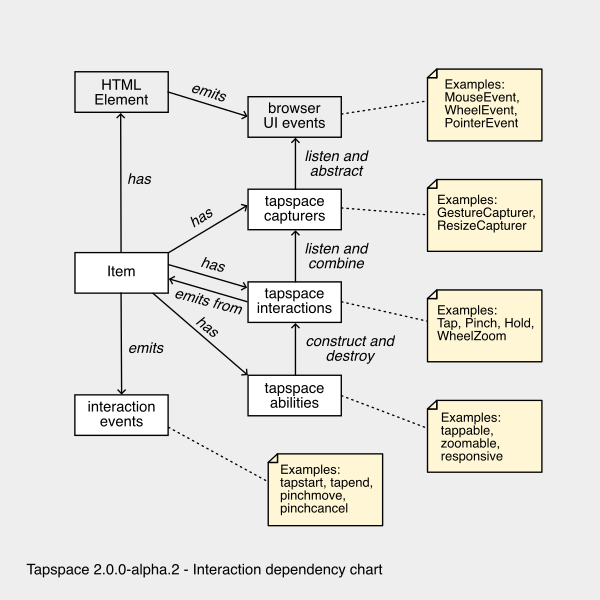

<a name="top"></a>
# Tapspace API Documentation v2.0.0-alpha.7


Welcome to Tapspace API documentation.
Build your zoomable application with the tools documented here.
This document is generated with [yamdog](https://github.com/axelpale/yamdog).

This document follows these naming conventions: `ClassName`, `namespace`, `.CONSTANT`, `.classMethod()`, `:instanceProperty`, `:instanceMethod()`, and `[optionalParameter]`.

See also: [Introduction](https://taataa.github.io/tapspace/) – [Tutorial](https://taataa.github.io/tapspace/tutorial/) - [Glossary](https://taataa.github.io/tapspace/glossary/v2/) - [GitHub](https://github.com/taataa/tapspace)


<a name="tapspace"></a>
## [tapspace](#tapspace)

The [tapspace](#tapspace) namespace provides [components](#tapspacecomponents) for space,
[geometry](#tapspacegeometry) classes,
and [interaction](#tapspaceinteraction) tools.
There are also [loaders](#tapspaceloaders) to help in managing
components, images, and other resources.


<p style="margin-bottom: 0"><strong>Contents:</strong></p>


- [tapspace.capturers](#tapspacecapturers)
- [tapspace.components](#tapspacecomponents)
- [tapspace.createCircle](#tapspacecreatecircle)
- [tapspace.createControl](#tapspacecreatecontrol)
- [tapspace.createGroup](#tapspacecreategroup)
- [tapspace.createItem](#tapspacecreateitem)
- [tapspace.createPlane](#tapspacecreateplane)
- [tapspace.createSpace](#tapspacecreatespace)
- [tapspace.createView](#tapspacecreateview)
- [tapspace.effects](#tapspaceeffects)
- [tapspace.geometry](#tapspacegeometry)
- [tapspace.interaction](#tapspaceinteraction)
- [tapspace.loaders](#tapspaceloaders)
- [tapspace.math](#tapspacemath)
- [tapspace.metrics](#tapspacemetrics)
- [tapspace.version](#tapspaceversion)


Source: [lib/index.js](https://github.com/taataa/tapspace/blob/2.0-dev/lib/index.js)

<a name="tapspacecapturers"></a>
## [tapspace](#tapspace).[capturers](#tapspacecapturers)

Classes to capture and preprocess input such as touch gestures
and mouse wheel movements.


<p style="margin-bottom: 0"><strong>Contents:</strong></p>


- [tapspace.capturers.CameraCapturer](#tapspacecapturerscameracapturer)
- [tapspace.capturers.Capturer](#tapspacecapturerscapturer)
- [tapspace.capturers.GestureCapturer](#tapspacecapturersgesturecapturer)
- [tapspace.capturers.KeyboardCapturer](#tapspacecapturerskeyboardcapturer)
- [tapspace.capturers.ResizeCapturer](#tapspacecapturersresizecapturer)
- [tapspace.capturers.WheelCapturer](#tapspacecapturerswheelcapturer)


Source: [capturers/index.js](https://github.com/taataa/tapspace/blob/2.0-dev/lib/capturers/index.js)

<a name="tapspacecapturerscameracapturer"></a>
## [tapspace](#tapspace).[capturers](#tapspacecapturers).[CameraCapturer](#tapspacecapturerscameracapturer)(component)

Inherits [Capturer](#tapspacecapturerscapturer)

Captures viewport moves towards and away from the plane anchor.
Meant for semantic zoom features.

<p style="margin-bottom: 0"><strong>Parameters:</strong></p>

- *component*
  - a [Plane](#tapspacecomponentsplane), the component to capture.


<p style="margin-bottom: 0">Emits:</p>

- *cameraenter*
  - when camera is moving closer
- *cameraleave*
  - when camera is moving farther
- *camerain*
  - when the camera zooms in
- *cameraout*
  - when the camera zooms out


**Under the hood:**
The viewport iterates planes when necessary and checks if the plane
has an active camera capturer. If so, the viewport is responsible
of informing the camera capturer about the camera movement.
This way the plane can be connected to viewport later, not necessarily
at setup phase.


<p style="margin-bottom: 0"><strong>Contents:</strong></p>


- [tapspace.capturers.CameraCapturer:bind](#tapspacecapturerscameracapturerbind)
- [tapspace.capturers.CameraCapturer:unbind](#tapspacecapturerscameracapturerunbind)


Source: [CameraCapturer/index.js](https://github.com/taataa/tapspace/blob/2.0-dev/lib/capturers/CameraCapturer/index.js)

<a name="tapspacecapturerscameracapturerbind"></a>
## [tapspace](#tapspace).[capturers](#tapspacecapturers).[CameraCapturer](#tapspacecapturerscameracapturer):[bind](#tapspacecapturerscameracapturerbind)()

Attach listeners.

Source: [CameraCapturer/index.js](https://github.com/taataa/tapspace/blob/2.0-dev/lib/capturers/CameraCapturer/index.js)

<a name="tapspacecapturerscameracapturerunbind"></a>
## [tapspace](#tapspace).[capturers](#tapspacecapturers).[CameraCapturer](#tapspacecapturerscameracapturer):[unbind](#tapspacecapturerscameracapturerunbind)()

Detach listeners.

Source: [CameraCapturer/index.js](https://github.com/taataa/tapspace/blob/2.0-dev/lib/capturers/CameraCapturer/index.js)

<a name="tapspacecapturerscapturer"></a>
## [tapspace](#tapspace).[capturers](#tapspacecapturers).[Capturer](#tapspacecapturerscapturer)()

A base class for capturers. Every capturer must implement this interface.
[Capturer](#tapspacecapturerscapturer)s may have extra methods on top of these.

Source: [Capturer/index.js](https://github.com/taataa/tapspace/blob/2.0-dev/lib/capturers/Capturer/index.js)

<a name="tapspacecapturersgesturecapturer"></a>
## [tapspace](#tapspace).[capturers](#tapspacecapturers).[GestureCapturer](#tapspacecapturersgesturecapturer)(component, options)

Inherits [Capturer](#tapspacecapturerscapturer)

Begin to capture and recognize pointer gestures
on the given component and emit them as gesture events.
The component does not need to be connected to camera at
the time of construction, but eventually it needs to be connected
in order to capture gestures.

<p style="margin-bottom: 0"><strong>Parameters:</strong></p>

- *component*
  - a [Plane](#tapspacecomponentsplane), the source of input events.
- *options*
  - an optional object with props:
    - *freedom*
      - optional object with props
        - *type*
          - optional string, default 'TSR'. The movement type.
        - *pivot*
          - optional [point2](https://axelpale.github.io/affineplane/docs/API.html#affineplanepoint2) on the view or [Point](#tapspacegeometrypoint).
          - The pivot point for types 'S', 'R', and 'SR'.
          - If a [Point](#tapspacegeometrypoint), the basis is preserved and followed.
        - *angle*
          - optional number in radians or [Direction](#tapspacegeometrydirection).
          - The line angle for type 'L'.
          - If a [Direction](#tapspacegeometrydirection), the basis is preserved and followed.
    - *preventDefault*
      - an optional boolean, default true. Set false allow default browser behavior on all handled events.
    - *stopPropagation*
      - an optional boolean, default false. Set true to stop event bubbling on all handled events.


<p style="margin-bottom: 0">Emits</p>

- *gesturestart* with a gesture event object
- *gesturemove* with a gesture event object
- *gestureend* with a gesture event object
- *gesturecancel* with a gesture event object


<p style="margin-bottom: 0">Gesture event objects have following properties:</p>

- *travel*
  - a number, total travel in viewport pixels. Manhattan distance.
- *duration*
  - a number, duration of the gesture in milliseconds
- *component*
  - a [Plane](#tapspacecomponentsplane) where the input events were listened and captured.
- *target*
  - a [Plane](#tapspacecomponentsplane) where the input landed. Helps e.g. in determining depth.
- *mean*
  - a [Point](#tapspacegeometrypoint), the average of the coordinates of active pointers.
- *transform*
  - a [Transform](#tapspacegeometrytransform), the total transformation on the viewport, the sum of all movements from the gesture start to this event.
- *transformOrigin*
  - a [Point](#tapspacegeometrypoint). The position of the transform on the viewport.
- *delta*
  - a [Transform](#tapspacegeometrytransform), difference to the previous gesture event. Measured on the viewport.
- *deltaOrigin*
  - a [Point](#tapspacegeometrypoint). The position of the delta transform on the viewport.


<p style="margin-bottom: 0"><strong>Contents:</strong></p>


- [tapspace.capturers.GestureCapturer:bind](#tapspacecapturersgesturecapturerbind)
- [tapspace.capturers.GestureCapturer:getFreedom](#tapspacecapturersgesturecapturergetfreedom)
- [tapspace.capturers.GestureCapturer:unbind](#tapspacecapturersgesturecapturerunbind)
- [tapspace.capturers.GestureCapturer:update](#tapspacecapturersgesturecapturerupdate)


Source: [GestureCapturer/index.js](https://github.com/taataa/tapspace/blob/2.0-dev/lib/capturers/GestureCapturer/index.js)

<a name="tapspacecapturersgesturecapturerbind"></a>
## [tapspace](#tapspace).[capturers](#tapspacecapturers).[GestureCapturer](#tapspacecapturersgesturecapturer):[bind](#tapspacecapturersgesturecapturerbind)()

Start event listeners and gesture capturing.

Source: [GestureCapturer/index.js](https://github.com/taataa/tapspace/blob/2.0-dev/lib/capturers/GestureCapturer/index.js)

<a name="tapspacecapturersgesturecapturergetfreedom"></a>
## [tapspace](#tapspace).[capturers](#tapspacecapturers).[GestureCapturer](#tapspacecapturersgesturecapturer):[getFreedom](#tapspacecapturersgesturecapturergetfreedom)()

Get freedom object for example for debugging.

Source: [GestureCapturer/index.js](https://github.com/taataa/tapspace/blob/2.0-dev/lib/capturers/GestureCapturer/index.js)

<a name="tapspacecapturersgesturecapturerunbind"></a>
## [tapspace](#tapspace).[capturers](#tapspacecapturers).[GestureCapturer](#tapspacecapturersgesturecapturer):[unbind](#tapspacecapturersgesturecapturerunbind)()

Unbind the DOM element listeners of the sensor.
Unbind own listeners, if any.

Source: [GestureCapturer/index.js](https://github.com/taataa/tapspace/blob/2.0-dev/lib/capturers/GestureCapturer/index.js)

<a name="tapspacecapturersgesturecapturerupdate"></a>
## [tapspace](#tapspace).[capturers](#tapspacecapturers).[GestureCapturer](#tapspacecapturersgesturecapturer):[update](#tapspacecapturersgesturecapturerupdate)(options)

Update capturer options.

<p style="margin-bottom: 0"><strong>Parameters:</strong></p>

- options, object with properties:
  - *freedom*
    - optional object
  - *preventDefault*
    - optional boolean
  - *stopPropagation*
    - optional boolean


Source: [GestureCapturer/index.js](https://github.com/taataa/tapspace/blob/2.0-dev/lib/capturers/GestureCapturer/index.js)

<a name="tapspacecapturerskeyboardcapturer"></a>
## [tapspace](#tapspace).[capturers](#tapspacecapturers).[KeyboardCapturer](#tapspacecapturerskeyboardcapturer)(component, options)

Inherits [Capturer](#tapspacecapturerscapturer)

Keyboard capturer detects keyboard events and preprocess them
for further interaction logic.

Note that only focusable HTMLElements emit keyboard events.
Note also that while the keyboard events bubble in DOM,
the capturer will re-emit only those that target the captured element,
not any of its descendants.

<p style="margin-bottom: 0"><strong>Parameters:</strong></p>

- *component*
  - a [Plane](#tapspacecomponentsplane), the source for the keyboard events


<p style="margin-bottom: 0">Emits</p>

- *keydown*
- *keyup*


<p style="margin-bottom: 0"><strong>Contents:</strong></p>


- [tapspace.capturers.KeyboardCapturer:bind](#tapspacecapturerskeyboardcapturerbind)
- [tapspace.capturers.KeyboardCapturer:unbind](#tapspacecapturerskeyboardcapturerunbind)
- [tapspace.capturers.KeyboardCapturer:update](#tapspacecapturerskeyboardcapturerupdate)


Source: [KeyboardCapturer/index.js](https://github.com/taataa/tapspace/blob/2.0-dev/lib/capturers/KeyboardCapturer/index.js)

<a name="tapspacecapturerskeyboardcapturerbind"></a>
## [tapspace](#tapspace).[capturers](#tapspacecapturers).[KeyboardCapturer](#tapspacecapturerskeyboardcapturer):[bind](#tapspacecapturerskeyboardcapturerbind)()

Attach event listeners.

Source: [KeyboardCapturer/index.js](https://github.com/taataa/tapspace/blob/2.0-dev/lib/capturers/KeyboardCapturer/index.js)

<a name="tapspacecapturerskeyboardcapturerunbind"></a>
## [tapspace](#tapspace).[capturers](#tapspacecapturers).[KeyboardCapturer](#tapspacecapturerskeyboardcapturer):[unbind](#tapspacecapturerskeyboardcapturerunbind)()

Remove all keyboard event listeners from the element.

Source: [KeyboardCapturer/index.js](https://github.com/taataa/tapspace/blob/2.0-dev/lib/capturers/KeyboardCapturer/index.js)

<a name="tapspacecapturerskeyboardcapturerupdate"></a>
## [tapspace](#tapspace).[capturers](#tapspacecapturers).[KeyboardCapturer](#tapspacecapturerskeyboardcapturer):[update](#tapspacecapturerskeyboardcapturerupdate)(options)

Update capturer options.

Source: [KeyboardCapturer/index.js](https://github.com/taataa/tapspace/blob/2.0-dev/lib/capturers/KeyboardCapturer/index.js)

<a name="tapspacecapturersresizecapturer"></a>
## [tapspace](#tapspace).[capturers](#tapspacecapturers).[ResizeCapturer](#tapspacecapturersresizecapturer)(component)

Inherits [Capturer](#tapspacecapturerscapturer)

Resize event capturer.

<p style="margin-bottom: 0"><strong>Parameters:</strong></p>

- *component*
  - a [BlockComponent](#tapspacecomponentsblockcomponent), the source for the resize events


<p style="margin-bottom: 0">Emits</p>

- resize with new size dimensions of the element.


<p style="margin-bottom: 0">Resize event object has properties:</p>

- *size*
  - a [Size](#tapspacegeometrysize), the new size
- *previousSize*
  - a [Size](#tapspacegeometrysize), the old size
- *target*
  - a [BlockComponent](#tapspacecomponentsblockcomponent)


<p style="margin-bottom: 0"><strong>Contents:</strong></p>


- [tapspace.capturers.ResizeCapturer:bind](#tapspacecapturersresizecapturerbind)
- [tapspace.capturers.ResizeCapturer:unbind](#tapspacecapturersresizecapturerunbind)


Source: [ResizeCapturer/index.js](https://github.com/taataa/tapspace/blob/2.0-dev/lib/capturers/ResizeCapturer/index.js)

<a name="tapspacecapturersresizecapturerbind"></a>
## [tapspace](#tapspace).[capturers](#tapspacecapturers).[ResizeCapturer](#tapspacecapturersresizecapturer):[bind](#tapspacecapturersresizecapturerbind)()

Start listeners and observers.

Source: [ResizeCapturer/index.js](https://github.com/taataa/tapspace/blob/2.0-dev/lib/capturers/ResizeCapturer/index.js)

<a name="tapspacecapturersresizecapturerunbind"></a>
## [tapspace](#tapspace).[capturers](#tapspacecapturers).[ResizeCapturer](#tapspacecapturersresizecapturer):[unbind](#tapspacecapturersresizecapturerunbind)()

Stop resize observation.

Source: [ResizeCapturer/index.js](https://github.com/taataa/tapspace/blob/2.0-dev/lib/capturers/ResizeCapturer/index.js)

<a name="tapspacecapturerswheelcapturer"></a>
## [tapspace](#tapspace).[capturers](#tapspacecapturers).[WheelCapturer](#tapspacecapturerswheelcapturer)(component, options)

Inherits [Capturer](#tapspacecapturerscapturer)

Mouse wheel capturer. Attempts to normalise and add compatibility
to wheeling and scrolling.

<p style="margin-bottom: 0"><strong>Parameters:</strong></p>

- *component*
  - an [InteractiveComponent](#tapspacecomponentsinteractivecomponent), the source for the wheel events
- options, optional object with props:
  - *preventDefault*
    - an optional boolean, default true. Set false to allow default browser behavior on all handled events.
  - *stopPropagation*
    - an optional boolean, default false. Set true to stop event bubbling on all handled events.


<p style="margin-bottom: 0">Emits</p>

- wheel with wheel-gesture object


<p style="margin-bottom: 0">Wheel-gesture object has properties:</p>

- *center*
  - a [Point](#tapspacegeometrypoint), the pointer location.
- *component*
  - an [InteractiveComponent](#tapspacecomponentsinteractivecomponent) on which the center is measured. The viewport.
- *target*
  - a [BasisComponent](#tapspacecomponentsbasiscomponent) closest to the original event target.
- *deltaX*
  - a number, normalized horizontal movement of the mouse wheel.
- *deltaY*
  - a number, normalized vertical movement of the mouse wheel.


<p style="margin-bottom: 0"><strong>Contents:</strong></p>


- [tapspace.capturers.WheelCapturer:bind](#tapspacecapturerswheelcapturerbind)
- [tapspace.capturers.WheelCapturer:unbind](#tapspacecapturerswheelcapturerunbind)
- [tapspace.capturers.WheelCapturer:update](#tapspacecapturerswheelcapturerupdate)


Source: [WheelCapturer/index.js](https://github.com/taataa/tapspace/blob/2.0-dev/lib/capturers/WheelCapturer/index.js)

<a name="tapspacecapturerswheelcapturerbind"></a>
## [tapspace](#tapspace).[capturers](#tapspacecapturers).[WheelCapturer](#tapspacecapturerswheelcapturer):[bind](#tapspacecapturerswheelcapturerbind)()

Attach event listeners.

Source: [WheelCapturer/index.js](https://github.com/taataa/tapspace/blob/2.0-dev/lib/capturers/WheelCapturer/index.js)

<a name="tapspacecapturerswheelcapturerunbind"></a>
## [tapspace](#tapspace).[capturers](#tapspacecapturers).[WheelCapturer](#tapspacecapturerswheelcapturer):[unbind](#tapspacecapturerswheelcapturerunbind)()

Remove all wheel capturer event listeners from the element.

Source: [WheelCapturer/index.js](https://github.com/taataa/tapspace/blob/2.0-dev/lib/capturers/WheelCapturer/index.js)

<a name="tapspacecapturerswheelcapturerupdate"></a>
## [tapspace](#tapspace).[capturers](#tapspacecapturers).[WheelCapturer](#tapspacecapturerswheelcapturer):[update](#tapspacecapturerswheelcapturerupdate)(options)

Update capturer options.

Source: [WheelCapturer/index.js](https://github.com/taataa/tapspace/blob/2.0-dev/lib/capturers/WheelCapturer/index.js)

<a name="tapspacecomponents"></a>
## [tapspace](#tapspace).[components](#tapspacecomponents)

Various components to render into [tapspace](#tapspace).

<p style="margin-bottom: 0"><strong>Core components:</strong></p>

- [Item](#tapspacecomponentsitem), an interaction-capable HTML container.
- [Space](#tapspacecomponentsspace), a 3D container for items, planes, and other spaces.
- [Plane](#tapspacecomponentsplane), a 2D container for items and other planes.
- [Viewport](#tapspacecomponentsviewport), a viewport to [tapspace](#tapspace). The root element.


<p style="margin-bottom: 0"><strong>Special components:</strong></p>

- [CircleItem](#tapspacecomponentscircleitem), a round HTML element in space.
- [Edge](#tapspacecomponentsedge), a CSS border as a line segment in space.
- [Arc](#tapspacecomponentsarc), a curved CSS border as an arc segment in space.


<p style="margin-bottom: 0"><strong>Viewport controls:</strong></p>

- [ZoomControl](#tapspacecomponentszoomcontrol), a button pair for zooming in and out.


<p style="margin-bottom: 0"><strong>Abstract components:</strong></p>

- [BasisComponent](#tapspacecomponentsbasiscomponent) is a coordinate system in affine space.
- [TransformerComponent](#tapspacecomponentstransformercomponent) is a [BasisComponent](#tapspacecomponentsbasiscomponent) that is transformable.
- [BlockComponent](#tapspacecomponentsblockcomponent) is a [TransformerComponent](#tapspacecomponentstransformercomponent) that has rectangular boundaries and size.
- [FrameComponent](#tapspacecomponentsframecomponent) is a [BlockComponent](#tapspacecomponentsblockcomponent) that has a changeable size.
- [ControlComponent](#tapspacecomponentscontrolcomponent) is a [FrameComponent](#tapspacecomponentsframecomponent) that stays fixed to the viewport.
- [InteractiveComponent](#tapspacecomponentsinteractivecomponent) is a [TransformerComponent](#tapspacecomponentstransformercomponent) that can capture touch and mouse gestures.


**Inheritance chart:**


<p style="margin-bottom: 0"><strong>Contents:</strong></p>


- [tapspace.components.Arc](#tapspacecomponentsarc)
- [tapspace.components.BasisComponent](#tapspacecomponentsbasiscomponent)
- [tapspace.components.BlockComponent](#tapspacecomponentsblockcomponent)
- [tapspace.components.CircleItem](#tapspacecomponentscircleitem)
- [tapspace.components.ControlComponent](#tapspacecomponentscontrolcomponent)
- [tapspace.components.CustomControl](#tapspacecomponentscustomcontrol)
- [tapspace.components.Edge](#tapspacecomponentsedge)
- [tapspace.components.FrameComponent](#tapspacecomponentsframecomponent)
- [tapspace.components.Group](#tapspacecomponentsgroup)
- [tapspace.components.Hyperspace](#tapspacecomponentshyperspace)
- [tapspace.components.InteractiveComponent](#tapspacecomponentsinteractivecomponent)
- [tapspace.components.Item](#tapspacecomponentsitem)
- [tapspace.components.Plane](#tapspacecomponentsplane)
- [tapspace.components.Space](#tapspacecomponentsspace)
- [tapspace.components.TransformerComponent](#tapspacecomponentstransformercomponent)
- [tapspace.components.Viewport](#tapspacecomponentsviewport)
- [tapspace.components.ViewportControls](#tapspacecomponentsviewportcontrols)
- [tapspace.components.ZoomControl](#tapspacecomponentszoomcontrol)


Source: [components/index.js](https://github.com/taataa/tapspace/blob/2.0-dev/lib/components/index.js)

<a name="tapspacecomponentsarc"></a>
## [tapspace](#tapspace).[components](#tapspacecomponents).[Arc](#tapspacecomponentsarc)(angle, border)

Inherits [FrameComponent](#tapspacecomponentsframecomponent)

[Arc](#tapspacecomponentsarc) is an instance class for curved edges.
Use [Arc](#tapspacecomponentsarc) to visually connect components.
[Arc](#tapspacecomponentsarc) is rendered flat (2D). Use setPoints(start, end) to place the arc.

<p style="margin-bottom: 0"><strong>Parameters:</strong></p>

- *angle*
  - a number, the arc angle in radians. A half-circle has the arc angle of π. A straight line has the arc angle of 0. Negative angle makes the arc curve to counter-clockwise direction. Not all angles can be rendered and might be capped to the nearest applicable angle.
- *border*
  - optional string, the border style. The default is '1px solid black'.


**Under the hood:**
[Arc](#tapspacecomponentsarc) is implemented by a rounded-border div that is cropped to display
only a portion of its circle edge by a container with overflow:hidden.


<p style="margin-bottom: 0"><strong>Contents:</strong></p>


- [tapspace.components.Arc:getLength](#tapspacecomponentsarcgetlength)
- [tapspace.components.Arc:getRadius](#tapspacecomponentsarcgetradius)
- [tapspace.components.Arc:setPoints](#tapspacecomponentsarcsetpoints)
- [tapspace.components.Arc.create](#tapspacecomponentsarccreate)


Source: [Arc/index.js](https://github.com/taataa/tapspace/blob/2.0-dev/lib/components/Arc/index.js)

<a name="tapspacecomponentsarcgetlength"></a>
## [tapspace](#tapspace).[components](#tapspacecomponents).[Arc](#tapspacecomponentsarc):[getLength](#tapspacecomponentsarcgetlength)()

Compute arc length.

<p style="margin-bottom: 0"><strong>Returns:</strong></p>

- a [Distance](#tapspacegeometrydistance)


Source: [getLength.js](https://github.com/taataa/tapspace/blob/2.0-dev/lib/components/Arc/getLength.js)

<a name="tapspacecomponentsarcgetradius"></a>
## [tapspace](#tapspace).[components](#tapspacecomponents).[Arc](#tapspacecomponentsarc):[getRadius](#tapspacecomponentsarcgetradius)()

Get the arc radius. The smaller the sector angle, the bigger the radius.

<p style="margin-bottom: 0"><strong>Returns:</strong></p>

- a [Distance](#tapspacegeometrydistance)


Source: [getRadius.js](https://github.com/taataa/tapspace/blob/2.0-dev/lib/components/Arc/getRadius.js)

<a name="tapspacecomponentsarcsetpoints"></a>
## [tapspace](#tapspace).[components](#tapspacecomponents).[Arc](#tapspacecomponentsarc):[setPoints](#tapspacecomponentsarcsetpoints)(startPoint, endPoint)

Set arc start and end points.

<p style="margin-bottom: 0"><strong>Parameters:</strong></p>

- *startPoint*
  - a [Point](#tapspacegeometrypoint)
- *endPoint*
  - a [Point](#tapspacegeometrypoint)


<p style="margin-bottom: 0"><strong>Returns:</strong></p>

- this, for chaining


Source: [setPoints.js](https://github.com/taataa/tapspace/blob/2.0-dev/lib/components/Arc/setPoints.js)

<a name="tapspacecomponentsarccreate"></a>
## [tapspace](#tapspace).[components](#tapspacecomponents).[Arc](#tapspacecomponentsarc).[create](#tapspacecomponentsarccreate)(angle, border)

[tapspace](#tapspace).createArc

Create an [Arc](#tapspacecomponentsarc) item. [Arc](#tapspacecomponentsarc)s are like edges but with a curved shape.

<p style="margin-bottom: 0"><strong>Parameters:</strong></p>

- *angle*
  - a number in degrees. The range is limited between 10 and 180 degrees.
- *border*
  - a string, the border CSS style, for example '1px solid black'.


<p style="margin-bottom: 0"><strong>Returns:</strong></p>

- an [Arc](#tapspacecomponentsarc)


Source: [create.js](https://github.com/taataa/tapspace/blob/2.0-dev/lib/components/Arc/create.js)

<a name="tapspacecomponentsbasiscomponent"></a>
## [tapspace](#tapspace).[components](#tapspacecomponents).[BasisComponent](#tapspacecomponentsbasiscomponent)(element)

Inherits [Emitter](https://www.npmjs.com/package/component-emitter)

[BasisComponent](#tapspacecomponentsbasiscomponent) is an abstract class for all affine components that have
an HTML element and a position within a [Space](#tapspacecomponentsspace).
Multiple bases together form an *affine subtree* in DOM.

<p style="margin-bottom: 0"><strong>Parameters:</strong></p>

- *element*
  - an [HTMLElement](https://developer.mozilla.org/en-US/docs/Web/API/HTMLElement)


<p style="margin-bottom: 0"><strong>Contents:</strong></p>


- [tapspace.components.BasisComponent:addChild](#tapspacecomponentsbasiscomponentaddchild)
- [tapspace.components.BasisComponent:addClass](#tapspacecomponentsbasiscomponentaddclass)
- [tapspace.components.BasisComponent:appendChild](#tapspacecomponentsbasiscomponentappendchild)
- [tapspace.components.BasisComponent:at](#tapspacecomponentsbasiscomponentat)
- [tapspace.components.BasisComponent:findCommonAncestor](#tapspacecomponentsbasiscomponentfindcommonancestor)
- [tapspace.components.BasisComponent:getAncestors](#tapspacecomponentsbasiscomponentgetancestors)
- [tapspace.components.BasisComponent:getBasis](#tapspacecomponentsbasiscomponentgetbasis)
- [tapspace.components.BasisComponent:getChildren](#tapspacecomponentsbasiscomponentgetchildren)
- [tapspace.components.BasisComponent:getDescendants](#tapspacecomponentsbasiscomponentgetdescendants)
- [tapspace.components.BasisComponent:getElement](#tapspacecomponentsbasiscomponentgetelement)
- [tapspace.components.BasisComponent:getLeaves](#tapspacecomponentsbasiscomponentgetleaves)
- [tapspace.components.BasisComponent:getOrientation](#tapspacecomponentsbasiscomponentgetorientation)
- [tapspace.components.BasisComponent:getParent](#tapspacecomponentsbasiscomponentgetparent)
- [tapspace.components.BasisComponent:getPoint](#tapspacecomponentsbasiscomponentgetpoint)
- [tapspace.components.BasisComponent:getRoot](#tapspacecomponentsbasiscomponentgetroot)
- [tapspace.components.BasisComponent:getTransitionFrom](#tapspacecomponentsbasiscomponentgettransitionfrom)
- [tapspace.components.BasisComponent:getTransitionTo](#tapspacecomponentsbasiscomponentgettransitionto)
- [tapspace.components.BasisComponent:getTransitionToParent](#tapspacecomponentsbasiscomponentgettransitiontoparent)
- [tapspace.components.BasisComponent:getTransitionToParentOf](#tapspacecomponentsbasiscomponentgettransitiontoparentof)
- [tapspace.components.BasisComponent:getVector](#tapspacecomponentsbasiscomponentgetvector)
- [tapspace.components.BasisComponent:getViewport](#tapspacecomponentsbasiscomponentgetviewport)
- [tapspace.components.BasisComponent:isLeaf](#tapspacecomponentsbasiscomponentisleaf)
- [tapspace.components.BasisComponent:isPlanar](#tapspacecomponentsbasiscomponentisplanar)
- [tapspace.components.BasisComponent:isRoot](#tapspacecomponentsbasiscomponentisroot)
- [tapspace.components.BasisComponent:prependChild](#tapspacecomponentsbasiscomponentprependchild)
- [tapspace.components.BasisComponent:remove](#tapspacecomponentsbasiscomponentremove)
- [tapspace.components.BasisComponent:removeChild](#tapspacecomponentsbasiscomponentremovechild)
- [tapspace.components.BasisComponent:removeClass](#tapspacecomponentsbasiscomponentremoveclass)
- [tapspace.components.BasisComponent:replaceChild](#tapspacecomponentsbasiscomponentreplacechild)
- [tapspace.components.BasisComponent:replaceParent](#tapspacecomponentsbasiscomponentreplaceparent)
- [tapspace.components.BasisComponent:setId](#tapspacecomponentsbasiscomponentsetid)
- [tapspace.components.BasisComponent:setParent](#tapspacecomponentsbasiscomponentsetparent)
- [tapspace.components.BasisComponent.findAffineAncestor](#tapspacecomponentsbasiscomponentfindaffineancestor)
- [tapspace.components.BasisComponent.isAffine](#tapspacecomponentsbasiscomponentisaffine)


Source: [BasisComponent/index.js](https://github.com/taataa/tapspace/blob/2.0-dev/lib/components/BasisComponent/index.js)

<a name="tapspacecomponentsbasiscomponentaddchild"></a>
## [tapspace](#tapspace).[components](#tapspacecomponents).[BasisComponent](#tapspacecomponentsbasiscomponent):[addChild](#tapspacecomponentsbasiscomponentaddchild)(component, position)

Place a component onto this basis. In DOM, appends the element of
the given component into the element of this basis.
Appending means that the component is added after the last child.
To add before the first child, see [BasisComponent:prependChild](#tapspacecomponentsbasiscomponentprependchild).

<p style="margin-bottom: 0"><strong>Parameters:</strong></p>

- *component*
  - a [BasisComponent](#tapspacecomponentsbasiscomponent)
- *position*
  - optional [Point](#tapspacegeometrypoint) or {x,y} or {x,y,z}.
  - Defines the initial position for the component.
  - You can leave the position parameter undefined and move the component to its position afterwards.
  - Also, if you have already prepared the local transition of the component and want to preserve it as is, then leave the position parameter undefined.


<p style="margin-bottom: 0"><strong>Returns:</strong></p>

- this, for chaining


<p style="margin-bottom: 0"><a href="https://en.wikipedia.org/wiki/Computational_complexity">Complexity</a>:</p>

- with position: O(d) where d is the depth of the affine tree.
- without position: O(1)


Aliases: [tapspace.components.BasisComponent:appendChild](#tapspacecomponentsbasiscomponentappendchild)

Source: [addChild.js](https://github.com/taataa/tapspace/blob/2.0-dev/lib/components/BasisComponent/addChild.js)

<a name="tapspacecomponentsbasiscomponentaddclass"></a>
## [tapspace](#tapspace).[components](#tapspacecomponents).[BasisComponent](#tapspacecomponentsbasiscomponent):[addClass](#tapspacecomponentsbasiscomponentaddclass)(className[, secondClass[, ...]])

Add one or more CSS class name into the affine element, up to three.
This is equivalent to `basis.element.classList.add(className)`.

<p style="margin-bottom: 0"><strong>Example:</strong></p>

- `item.addClass('myitem', 'banner')`


<p style="margin-bottom: 0"><strong>Parameters:</strong></p>

- *className*
  - a string, for example 'my-item'


<p style="margin-bottom: 0"><strong>Returns:</strong></p>

- this, for chaining


<p style="margin-bottom: 0"><a href="https://en.wikipedia.org/wiki/Computational_complexity">Complexity</a>:</p>

- O(1)


Source: [addClass.js](https://github.com/taataa/tapspace/blob/2.0-dev/lib/components/BasisComponent/addClass.js)

<a name="tapspacecomponentsbasiscomponentappendchild"></a>
## [tapspace](#tapspace).[components](#tapspacecomponents).[BasisComponent](#tapspacecomponentsbasiscomponent):[appendChild](#tapspacecomponentsbasiscomponentappendchild)

Alias of [tapspace.components.BasisComponent:addChild](#tapspacecomponentsbasiscomponentaddchild)

Source: [addChild.js](https://github.com/taataa/tapspace/blob/2.0-dev/lib/components/BasisComponent/addChild.js)

<a name="tapspacecomponentsbasiscomponentat"></a>
## [tapspace](#tapspace).[components](#tapspacecomponents).[BasisComponent](#tapspacecomponentsbasiscomponent):[at](#tapspacecomponentsbasiscomponentat)(x, y, z)

Get a [Point](#tapspacegeometrypoint) on the basis from local coordinates.

<p style="margin-bottom: 0"><strong>Parameters:</strong></p>

- *x*
  - Any of the following:
    - a number, the x coordinate on the plane.
    - a [point2](https://axelpale.github.io/affineplane/docs/API.html#affineplanepoint2), {x,y} relative to the plane.
    - a [point3](https://axelpale.github.io/affineplane/docs/API.html#affineplanepoint3), {x,y,z} relative to the plane.
    - a [Point](#tapspacegeometrypoint)
- *y*
  - a number, the y coordinate on the plane. Required if x is a number.
- *z*
  - optional number, the z coordinate relative to the plane.


<p style="margin-bottom: 0"><strong>Returns:</strong></p>

- a [Point](#tapspacegeometrypoint), relative to the basis


Aliases: [tapspace.components.BasisComponent:getPoint](#tapspacecomponentsbasiscomponentgetpoint)

Source: [at.js](https://github.com/taataa/tapspace/blob/2.0-dev/lib/components/BasisComponent/at.js)

<a name="tapspacecomponentsbasiscomponentfindcommonancestor"></a>
## [tapspace](#tapspace).[components](#tapspacecomponents).[BasisComponent](#tapspacecomponentsbasiscomponent):[findCommonAncestor](#tapspacecomponentsbasiscomponentfindcommonancestor)(node)

Find lowest common affine ancestor of this and the given node.
If a mother has two children and the father of the mother is
the grandfather of the children, then the lowest common ancestor
for the children is the mother. If the mother has a sister from
the same father, then the grandfather is the lowest common ancestor
of the sister and one of the children.

<p style="margin-bottom: 0"><strong>Parameters:</strong></p>

- *node*
  - a [BasisComponent](#tapspacecomponentsbasiscomponent)


<p style="margin-bottom: 0"><strong>Returns:</strong></p>

- a [BasisComponent](#tapspacecomponentsbasiscomponent). Null if no common ancestor is found.


<p style="margin-bottom: 0"><a href="https://en.wikipedia.org/wiki/Computational_complexity">Complexity</a>:</p>

- O(d) where d is the depth of the affine tree.


<p style="margin-bottom: 0">Note that the result might not be a true ancestor:</p>

- If this is an ancestor of the given node, then this is returned.
- If the given node is an ancestor of this node, then the given node is returned.
- If this node equals the given node, then this is returned.


Source: [findCommonAncestor.js](https://github.com/taataa/tapspace/blob/2.0-dev/lib/components/BasisComponent/findCommonAncestor.js)

<a name="tapspacecomponentsbasiscomponentgetancestors"></a>
## [tapspace](#tapspace).[components](#tapspacecomponents).[BasisComponent](#tapspacecomponentsbasiscomponent):[getAncestors](#tapspacecomponentsbasiscomponentgetancestors)()

Get an array of affine ancestors of this node, ordered from
the immediate parent to the farthest ancestor, the immediate parent first.
The list of ancestors includes a space and a viewport, given that
the node is placed in a space.

<p style="margin-bottom: 0"><strong>Returns:</strong></p>

- array of [BasisComponent](#tapspacecomponentsbasiscomponent)


<p style="margin-bottom: 0"><a href="https://en.wikipedia.org/wiki/Computational_complexity">Complexity</a></p>

- O(d) where d is the depth of the affine tree


Source: [getAncestors.js](https://github.com/taataa/tapspace/blob/2.0-dev/lib/components/BasisComponent/getAncestors.js)

<a name="tapspacecomponentsbasiscomponentgetbasis"></a>
## [tapspace](#tapspace).[components](#tapspacecomponents).[BasisComponent](#tapspacecomponentsbasiscomponent):[getBasis](#tapspacecomponentsbasiscomponentgetbasis)()

Get the virtual basis of this component.
Provides a way to construct new bases via transformations without
transforming the component itself. Can also be used to match bases
between components.

**Example:**
```
> const basis = item.getBasis().rotateByDegrees(45)
> anotherItem.setBasis(basis)
```

<p style="margin-bottom: 0"><strong>Returns:</strong></p>

- a [Basis](#tapspacegeometrybasis)


Source: [getBasis.js](https://github.com/taataa/tapspace/blob/2.0-dev/lib/components/BasisComponent/getBasis.js)

<a name="tapspacecomponentsbasiscomponentgetchildren"></a>
## [tapspace](#tapspace).[components](#tapspacecomponents).[BasisComponent](#tapspacecomponentsbasiscomponent):[getChildren](#tapspacecomponentsbasiscomponentgetchildren)()

Get all affine child nodes of this node. The children are found via DOM.
The children in DOM that do not have affine properties will be skipped.

<p style="margin-bottom: 0"><strong>Returns:</strong></p>

- array of [BasisComponent](#tapspacecomponentsbasiscomponent)


<p style="margin-bottom: 0"><a href="https://en.wikipedia.org/wiki/Computational_complexity">Complexity</a></p>

- O(c) where c is the number of children


Source: [getChildren.js](https://github.com/taataa/tapspace/blob/2.0-dev/lib/components/BasisComponent/getChildren.js)

<a name="tapspacecomponentsbasiscomponentgetdescendants"></a>
## [tapspace](#tapspace).[components](#tapspacecomponents).[BasisComponent](#tapspacecomponentsbasiscomponent):[getDescendants](#tapspacecomponentsbasiscomponentgetdescendants)()

All affine descendants in a list, including the children of this node.
The affine descendants must be connected in affine part of DOM.

<p style="margin-bottom: 0"><strong>Returns:</strong></p>

- array of [BasisComponent](#tapspacecomponentsbasiscomponent)


<p style="margin-bottom: 0"><a href="https://en.wikipedia.org/wiki/Computational_complexity">Complexity</a>:</p>

- O(n) where n is the number of nodes in the affine tree


Source: [getDescendants.js](https://github.com/taataa/tapspace/blob/2.0-dev/lib/components/BasisComponent/getDescendants.js)

<a name="tapspacecomponentsbasiscomponentgetelement"></a>
## [tapspace](#tapspace).[components](#tapspacecomponents).[BasisComponent](#tapspacecomponentsbasiscomponent):[getElement](#tapspacecomponentsbasiscomponentgetelement)()

Get the affine HTML element of the node.
Each [BasisComponent](#tapspacecomponentsbasiscomponent) has one HTML element.
This element can wrap further affine or non-affine content.

<p style="margin-bottom: 0"><strong>Returns:</strong></p>

- an [HTMLElement](https://developer.mozilla.org/en-US/docs/Web/API/HTMLElement)


<p style="margin-bottom: 0"><a href="https://en.wikipedia.org/wiki/Computational_complexity">Complexity</a>:</p>

- O(1)


Source: [getElement.js](https://github.com/taataa/tapspace/blob/2.0-dev/lib/components/BasisComponent/getElement.js)

<a name="tapspacecomponentsbasiscomponentgetleaves"></a>
## [tapspace](#tapspace).[components](#tapspacecomponents).[BasisComponent](#tapspacecomponentsbasiscomponent):[getLeaves](#tapspacecomponentsbasiscomponentgetleaves)()

All affine leaf descendants in a list. A leaf has no own children.
The affine leaves must be connected to this node in the subset of DOM.
An affine leaf may have non-affine children in DOM.

<p style="margin-bottom: 0"><strong>Returns:</strong></p>

- array of [BasisComponent](#tapspacecomponentsbasiscomponent)


<p style="margin-bottom: 0"><a href="https://en.wikipedia.org/wiki/Computational_complexity">Complexity</a>:</p>

- O(n) where n is the number of nodes in the affine tree.


Source: [getLeaves.js](https://github.com/taataa/tapspace/blob/2.0-dev/lib/components/BasisComponent/getLeaves.js)

<a name="tapspacecomponentsbasiscomponentgetorientation"></a>
## [tapspace](#tapspace).[components](#tapspacecomponents).[BasisComponent](#tapspacecomponentsbasiscomponent):[getOrientation](#tapspacecomponentsbasiscomponentgetorientation)()

Get the orientation of this component.
Provides a way to match the orientation between components.

<p style="margin-bottom: 0"><strong>Returns:</strong></p>

- an [Orientation](#tapspacegeometryorientation)


Source: [getOrientation.js](https://github.com/taataa/tapspace/blob/2.0-dev/lib/components/BasisComponent/getOrientation.js)

<a name="tapspacecomponentsbasiscomponentgetparent"></a>
## [tapspace](#tapspace).[components](#tapspacecomponents).[BasisComponent](#tapspacecomponentsbasiscomponent):[getParent](#tapspacecomponentsbasiscomponentgetparent)()

Get the affine parent of the plane. Null if no affine parent.

<p style="margin-bottom: 0"><strong>Returns:</strong></p>

- a [BasisComponent](#tapspacecomponentsbasiscomponent), the parent.
- null if no affine parent.


<p style="margin-bottom: 0"><a href="https://en.wikipedia.org/wiki/Computational_complexity">Complexity</a>:</p>

- O(1)


Source: [getParent.js](https://github.com/taataa/tapspace/blob/2.0-dev/lib/components/BasisComponent/getParent.js)

<a name="tapspacecomponentsbasiscomponentgetpoint"></a>
## [tapspace](#tapspace).[components](#tapspacecomponents).[BasisComponent](#tapspacecomponentsbasiscomponent):[getPoint](#tapspacecomponentsbasiscomponentgetpoint)

Alias of [tapspace.components.BasisComponent:at](#tapspacecomponentsbasiscomponentat)

Source: [at.js](https://github.com/taataa/tapspace/blob/2.0-dev/lib/components/BasisComponent/at.js)

<a name="tapspacecomponentsbasiscomponentgetroot"></a>
## [tapspace](#tapspace).[components](#tapspacecomponents).[BasisComponent](#tapspacecomponentsbasiscomponent):[getRoot](#tapspacecomponentsbasiscomponentgetroot)()

Get the affine root. Will return self if has no affine parent.

<p style="margin-bottom: 0"><strong>Returns:</strong></p>

- a [BasisComponent](#tapspacecomponentsbasiscomponent)


<p style="margin-bottom: 0"><a href="https://en.wikipedia.org/wiki/Computational_complexity">Complexity</a></p>

- O(d) where d is the depth of the affine tree.


Source: [getRoot.js](https://github.com/taataa/tapspace/blob/2.0-dev/lib/components/BasisComponent/getRoot.js)

<a name="tapspacecomponentsbasiscomponentgettransitionfrom"></a>
## [tapspace](#tapspace).[components](#tapspacecomponents).[BasisComponent](#tapspacecomponentsbasiscomponent):[getTransitionFrom](#tapspacecomponentsbasiscomponentgettransitionfrom)(source)

Compute a coordinate transition matrix from the source basis
to this basis. The transition matrix can be used to convert
coordinates and geometry between bases.
Note that if one of the two bases or a basis between them moves
then you should compute the transition matrix again.

<p style="margin-bottom: 0"><strong>Parameters:</strong></p>

- *source*
  - a [BasisComponent](#tapspacecomponentsbasiscomponent)


<p style="margin-bottom: 0"><strong>Returns:</strong></p>

- a [plane3](https://axelpale.github.io/affineplane/docs/API.html#affineplaneplane3), a basis transition matrix.


<p style="margin-bottom: 0"><a href="https://en.wikipedia.org/wiki/Computational_complexity">Complexity</a></p>

- O(d) where d is the depth of the affine tree.


Source: [getTransitionFrom.js](https://github.com/taataa/tapspace/blob/2.0-dev/lib/components/BasisComponent/getTransitionFrom.js)

<a name="tapspacecomponentsbasiscomponentgettransitionto"></a>
## [tapspace](#tapspace).[components](#tapspacecomponents).[BasisComponent](#tapspacecomponentsbasiscomponent):[getTransitionTo](#tapspacecomponentsbasiscomponentgettransitionto)(target)

Compute a transition that maps the coordinate system of this basis
to the coordinate system of the target basis. The resulting transition
is an affine transformation that can be applied to geometry on this basis
to compute the same geometry represented on the the target basis.

<p style="margin-bottom: 0"><strong>Parameters:</strong></p>

- *target*
  - a [BasisComponent](#tapspacecomponentsbasiscomponent)


<p style="margin-bottom: 0"><strong>Returns:</strong></p>

- a [plane3](https://axelpale.github.io/affineplane/docs/API.html#affineplaneplane3). A transition from this plane to the target plane.


<p style="margin-bottom: 0"><strong>Throws:</strong></p>

- If the planes are not connected. Probably app programming error.


<p style="margin-bottom: 0"><a href="https://en.wikipedia.org/wiki/Computational_complexity">Complexity</a></p>

- O(d) where d is the depth of the affine tree.


Source: [getTransitionTo.js](https://github.com/taataa/tapspace/blob/2.0-dev/lib/components/BasisComponent/getTransitionTo.js)

<a name="tapspacecomponentsbasiscomponentgettransitiontoparent"></a>
## [tapspace](#tapspace).[components](#tapspacecomponents).[BasisComponent](#tapspacecomponentsbasiscomponent):[getTransitionToParent](#tapspacecomponentsbasiscomponentgettransitiontoparent)()

Get a coordinate transition matrix from this basis to its parent basis.
If this basis does not have a parent, it is either root affine node in DOM
or is not yet added to DOM, and in this case a transition matrix to
a virtual parent is returned.

<p style="margin-bottom: 0"><strong>Returns:</strong></p>

- a [plane3](https://axelpale.github.io/affineplane/docs/API.html#affineplaneplane3), the coordinate transition matrix from this to parent.


<p style="margin-bottom: 0"><a href="https://en.wikipedia.org/wiki/Computational_complexity">Complexity</a></p>

- O(1)


Source: [getTransitionToParent.js](https://github.com/taataa/tapspace/blob/2.0-dev/lib/components/BasisComponent/getTransitionToParent.js)

<a name="tapspacecomponentsbasiscomponentgettransitiontoparentof"></a>
## [tapspace](#tapspace).[components](#tapspacecomponents).[BasisComponent](#tapspacecomponentsbasiscomponent):[getTransitionToParentOf](#tapspacecomponentsbasiscomponentgettransitiontoparentof)(target)

Get transition from this basis to the parent basis of the target.
If the target is a root, then transition is to its virtual parent.

<p style="margin-bottom: 0"><strong>Parameters:</strong></p>

- *target*
  - a [BasisComponent](#tapspacecomponentsbasiscomponent)


<p style="margin-bottom: 0"><strong>Returns:</strong></p>

- a [plane3](https://axelpale.github.io/affineplane/docs/API.html#affineplaneplane3), a transition to the real or virtual parent of the target.


<p style="margin-bottom: 0"><a href="https://en.wikipedia.org/wiki/Computational_complexity">Complexity</a></p>

- O(d) where d is the depth of the affine tree.


Source: [getTransitionToParentOf.js](https://github.com/taataa/tapspace/blob/2.0-dev/lib/components/BasisComponent/getTransitionToParentOf.js)

<a name="tapspacecomponentsbasiscomponentgetvector"></a>
## [tapspace](#tapspace).[components](#tapspacecomponents).[BasisComponent](#tapspacecomponentsbasiscomponent):[getVector](#tapspacecomponentsbasiscomponentgetvector)(x, y[, z])

Create a [Vector](#tapspacegeometryvector) on this basis.

<p style="margin-bottom: 0"><strong>Parameters:</strong></p>

- *x*
  - a number
- *y*
  - a number
- *z*
  - optional number, default to zero.


<p style="margin-bottom: 0"><strong>Returns:</strong></p>

- a [Vector](#tapspacegeometryvector)


Source: [getVector.js](https://github.com/taataa/tapspace/blob/2.0-dev/lib/components/BasisComponent/getVector.js)

<a name="tapspacecomponentsbasiscomponentgetviewport"></a>
## [tapspace](#tapspace).[components](#tapspacecomponents).[BasisComponent](#tapspacecomponentsbasiscomponent):[getViewport](#tapspacecomponentsbasiscomponentgetviewport)()

Get the affine viewport this basis currently belongs to, if any.
Will return null if the basis is not connected to a viewport.

<p style="margin-bottom: 0"><strong>Returns:</strong></p>

- a [Viewport](#tapspacecomponentsviewport)


<p style="margin-bottom: 0"><a href="https://en.wikipedia.org/wiki/Computational_complexity">Complexity</a></p>

- O(d) where d is the depth of the affine tree.


Source: [getViewport.js](https://github.com/taataa/tapspace/blob/2.0-dev/lib/components/BasisComponent/getViewport.js)

<a name="tapspacecomponentsbasiscomponentisleaf"></a>
## [tapspace](#tapspace).[components](#tapspacecomponents).[BasisComponent](#tapspacecomponentsbasiscomponent):[isLeaf](#tapspacecomponentsbasiscomponentisleaf)()

This basis is a leaf if it has no affine children in DOM.
A leaf can have non-affine children in DOM.
A basis that is not a leaf has one or more affine children and
may also have non-affine chilren.

<p style="margin-bottom: 0"><strong>Returns:</strong></p>

- a boolean, true if the basis has no affine children.


<p style="margin-bottom: 0"><a href="https://en.wikipedia.org/wiki/Computational_complexity">Complexity</a></p>

- O(c) where c is the number of children.


Source: [isLeaf.js](https://github.com/taataa/tapspace/blob/2.0-dev/lib/components/BasisComponent/isLeaf.js)

<a name="tapspacecomponentsbasiscomponentisplanar"></a>
## [tapspace](#tapspace).[components](#tapspacecomponents).[BasisComponent](#tapspacecomponentsbasiscomponent):[isPlanar](#tapspacecomponentsbasiscomponentisplanar)()

Check if the basis is on a [Plane](#tapspacecomponentsplane).
The basis is on a plane if any of its ancestors is a [Plane](#tapspacecomponentsplane).
[Plane](#tapspacecomponentsplane) itself is not planar except when one of its ancestors is.
[Plane](#tapspacecomponentsplane)s flatten their subspace. Therefore geometry on a plane may appear
rendered flat even when having a non-zero z coordinate.

<p style="margin-bottom: 0"><strong>Returns:</strong></p>

- *boolean*


Source: [isPlanar.js](https://github.com/taataa/tapspace/blob/2.0-dev/lib/components/BasisComponent/isPlanar.js)

<a name="tapspacecomponentsbasiscomponentisroot"></a>
## [tapspace](#tapspace).[components](#tapspacecomponents).[BasisComponent](#tapspacecomponentsbasiscomponent):[isRoot](#tapspacecomponentsbasiscomponentisroot)()

Test is the basis an affine root i.e.
does the element have no affine parent.
A root basis can have non-affine parent in DOM.

<p style="margin-bottom: 0"><strong>Returns:</strong></p>

- a boolean


<p style="margin-bottom: 0"><a href="https://en.wikipedia.org/wiki/Computational_complexity">Complexity</a></p>

- O(1)


Source: [isRoot.js](https://github.com/taataa/tapspace/blob/2.0-dev/lib/components/BasisComponent/isRoot.js)

<a name="tapspacecomponentsbasiscomponentprependchild"></a>
## [tapspace](#tapspace).[components](#tapspacecomponents).[BasisComponent](#tapspacecomponentsbasiscomponent):[prependChild](#tapspacecomponentsbasiscomponentprependchild)(component, position)

Place a component onto this basis. In DOM, adds the element of
the given component into the element of this basis before the first child.
To add after the last child, see [BasisComponent:appendChild](#tapspacecomponentsbasiscomponentappendchild).

<p style="margin-bottom: 0"><strong>Parameters:</strong></p>

- *component*
  - a [BasisComponent](#tapspacecomponentsbasiscomponent)
- *position*
  - optional [Point](#tapspacegeometrypoint) or {x,y} or {x,y,z}.
  - Defines the initial position for the component.
  - You can leave the position parameter undefined and move the component to its position afterwards.
  - Also, if you have already prepared the local coordinates of the component and want to preserve them as is, then leave the position parameter undefined.


<p style="margin-bottom: 0"><strong>Returns:</strong></p>

- this, for chaining


<p style="margin-bottom: 0"><a href="https://en.wikipedia.org/wiki/Computational_complexity">Complexity</a>:</p>

- with position: O(d) where d is the depth of affine tree.
- without position: O(1)


Source: [prependChild.js](https://github.com/taataa/tapspace/blob/2.0-dev/lib/components/BasisComponent/prependChild.js)

<a name="tapspacecomponentsbasiscomponentremove"></a>
## [tapspace](#tapspace).[components](#tapspacecomponents).[BasisComponent](#tapspacecomponentsbasiscomponent):[remove](#tapspacecomponentsbasiscomponentremove)()

Remove this component from its parent, if any.
If you also need to remove active listeners, call `component.off()`.

<p style="margin-bottom: 0"><strong>Returns:</strong></p>

- this, for chaining


Source: [remove.js](https://github.com/taataa/tapspace/blob/2.0-dev/lib/components/BasisComponent/remove.js)

<a name="tapspacecomponentsbasiscomponentremovechild"></a>
## [tapspace](#tapspace).[components](#tapspacecomponents).[BasisComponent](#tapspacecomponentsbasiscomponent):[removeChild](#tapspacecomponentsbasiscomponentremovechild)(child)

Remove the specified child component from this component.
You might want to call `child.off()` to also remove any active listeners.

<p style="margin-bottom: 0"><strong>Parameters:</strong></p>

- *child*
  - a [BasisComponent](#tapspacecomponentsbasiscomponent), the component to remove.


<p style="margin-bottom: 0"><strong>Returns:</strong></p>

- this, for chaining


Source: [removeChild.js](https://github.com/taataa/tapspace/blob/2.0-dev/lib/components/BasisComponent/removeChild.js)

<a name="tapspacecomponentsbasiscomponentremoveclass"></a>
## [tapspace](#tapspace).[components](#tapspacecomponents).[BasisComponent](#tapspacecomponentsbasiscomponent):[removeClass](#tapspacecomponentsbasiscomponentremoveclass)

Remove a CSS class name from the affine element.
This is equivalent to `basis.element.classList.remove(className)`.

<p style="margin-bottom: 0"><strong>Parameters:</strong></p>

- *className*
  - a string, for example 'my-item'


<p style="margin-bottom: 0"><strong>Returns:</strong></p>

- this, for chaining


<p style="margin-bottom: 0"><a href="https://en.wikipedia.org/wiki/Computational_complexity">Complexity</a></p>

- O(1)


Source: [removeClass.js](https://github.com/taataa/tapspace/blob/2.0-dev/lib/components/BasisComponent/removeClass.js)

<a name="tapspacecomponentsbasiscomponentreplacechild"></a>
## [tapspace](#tapspace).[components](#tapspacecomponents).[BasisComponent](#tapspacecomponentsbasiscomponent):[replaceChild](#tapspacecomponentsbasiscomponentreplacechild)(oldChild, newChild)

Removes a child and replaces its position with a new one.
The operation preserves the anchor position, scale, and orientation
of the children. [Size](#tapspacegeometrysize) is not preserved, thus the new child might
occupy larger or smaller area than the replaced one.

<p style="margin-bottom: 0"><strong>Parameters:</strong></p>

- *oldChild*
  - a [BasisComponent](#tapspacecomponentsbasiscomponent). Will be removed from the document.
- *newChild*
  - a [BasisComponent](#tapspacecomponentsbasiscomponent). Will be added to the document or reparented.


<p style="margin-bottom: 0"><strong>Returns:</strong></p>

- this, for chaining


<p style="margin-bottom: 0"><strong>Throws:</strong></p>

- if the old child does not exist. This may reveal a race condition or
- otherwise unexpected situation.


Source: [replaceChild.js](https://github.com/taataa/tapspace/blob/2.0-dev/lib/components/BasisComponent/replaceChild.js)

<a name="tapspacecomponentsbasiscomponentreplaceparent"></a>
## [tapspace](#tapspace).[components](#tapspacecomponents).[BasisComponent](#tapspacecomponentsbasiscomponent):[replaceParent](#tapspacecomponentsbasiscomponentreplaceparent)(newParent)

Switches the parent by preserving the global position.
Useful for example when you need to remove the parent
but want to preserve some of the children at their original positions.

To specify a new position or to preserve the local position with respect
to the parent origin, see [BasisComponent:setParent](#tapspacecomponentsbasiscomponentsetparent).

<p style="margin-bottom: 0"><strong>Parameters:</strong></p>

- *newParent*
  - a [BasisComponent](#tapspacecomponentsbasiscomponent).


<p style="margin-bottom: 0"><strong>Returns:</strong></p>

- this, for chaining


<p style="margin-bottom: 0"><strong>Throws:</strong></p>

- if this basis and the newParent are not in the same space.
- This includes the situation where this has no parent.


Source: [replaceParent.js](https://github.com/taataa/tapspace/blob/2.0-dev/lib/components/BasisComponent/replaceParent.js)

<a name="tapspacecomponentsbasiscomponentsetid"></a>
## [tapspace](#tapspace).[components](#tapspacecomponents).[BasisComponent](#tapspacecomponentsbasiscomponent):[setId](#tapspacecomponentsbasiscomponentsetid)

Set the affine element ID property.
This is equivalent to `basis.element.id = elemId`.

<p style="margin-bottom: 0"><strong>Parameters:</strong></p>

- *elemId*
  - a string, for example 'hero'


<p style="margin-bottom: 0"><strong>Returns:</strong></p>

- this, for chaining


<p style="margin-bottom: 0"><a href="https://en.wikipedia.org/wiki/Computational_complexity">Complexity</a>:</p>

- O(1)


Source: [setId.js](https://github.com/taataa/tapspace/blob/2.0-dev/lib/components/BasisComponent/setId.js)

<a name="tapspacecomponentsbasiscomponentsetparent"></a>
## [tapspace](#tapspace).[components](#tapspacecomponents).[BasisComponent](#tapspacecomponentsbasiscomponent):[setParent](#tapspacecomponentsbasiscomponentsetparent)(newParent[, position])

Appends the basis node as a child of another basis.
Removes the basis from the current parent, if any.
Appending places the node after its siblings in DOM.

The operation allows a position which defines where this node
will be added on the parent. Omitting the position preserves
the local placement of the node while not preserving the global
placement. See [BasisComponent:replaceParent](#tapspacecomponentsbasiscomponentreplaceparent) to preserve the global placement.

<p style="margin-bottom: 0"><strong>Parameters:</strong></p>

- *newParent*
  - a [BasisComponent](#tapspacecomponentsbasiscomponent).
- *position*
  - optional [Point](#tapspacegeometrypoint). If given, translates this node to this
  - position on the new parent. If omitted, preserves the current
  - local placement, if any.


<p style="margin-bottom: 0"><strong>Returns:</strong></p>

- this, for chaining


Source: [setParent.js](https://github.com/taataa/tapspace/blob/2.0-dev/lib/components/BasisComponent/setParent.js)

<a name="tapspacecomponentsbasiscomponentfindaffineancestor"></a>
## [tapspace](#tapspace).[components](#tapspacecomponents).[BasisComponent](#tapspacecomponentsbasiscomponent).[findAffineAncestor](#tapspacecomponentsbasiscomponentfindaffineancestor)(el)

Find the nearest affine element, if any.
Travels DOM towards document root and tests each element along the way for
affine properties until one is found or the document root is reached.

**Example:**
```
const btn = document.getElementById('mybutton')
const affine = BasisComponent.findAffineAncestor(btn)
if (affine) { affine.rotateByDegrees(10) }
```

<p style="margin-bottom: 0"><strong>Parameters:</strong></p>

- *el*
  - *HTMLElement*


<p style="margin-bottom: 0"><strong>Returns:</strong></p>

- null, if no affine ancestor.
- a [BasisComponent](#tapspacecomponentsbasiscomponent), if has affine ancestor.


<p style="margin-bottom: 0"><a href="https://en.wikipedia.org/wiki/Computational_complexity">Complexity</a>:</p>

- O(D) where D is the depth of the document.


Source: [findAffineAncestor.js](https://github.com/taataa/tapspace/blob/2.0-dev/lib/components/BasisComponent/dom/findAffineAncestor.js)

<a name="tapspacecomponentsbasiscomponentisaffine"></a>
## [tapspace](#tapspace).[components](#tapspacecomponents).[BasisComponent](#tapspacecomponentsbasiscomponent).[isAffine](#tapspacecomponentsbasiscomponentisaffine)(element)

Test if the given [HTMLElement](https://developer.mozilla.org/en-US/docs/Web/API/HTMLElement) is affine.
An [HTMLElement](https://developer.mozilla.org/en-US/docs/Web/API/HTMLElement) is affine if elem.affine object is set
and that the elem.affine is a [BasisComponent](#tapspacecomponentsbasiscomponent) or inherits [BasisComponent](#tapspacecomponentsbasiscomponent).

**Example:**
```
const el = document.getElementById('myelem')
if (BasisComponent.isAffine(el)) { ... }
```

<p style="margin-bottom: 0"><strong>Parameters:</strong></p>

- *element*
  - an [HTMLElement](https://developer.mozilla.org/en-US/docs/Web/API/HTMLElement) or any other object.


<p style="margin-bottom: 0"><strong>Returns:</strong></p>

- boolean. True if the given element is [HTMLElement](https://developer.mozilla.org/en-US/docs/Web/API/HTMLElement) with affine property.


<p style="margin-bottom: 0"><a href="https://en.wikipedia.org/wiki/Computational_complexity">Complexity</a>:</p>

- O(1)


Source: [isAffine.js](https://github.com/taataa/tapspace/blob/2.0-dev/lib/components/BasisComponent/dom/isAffine.js)

<a name="tapspacecomponentsblockcomponent"></a>
## [tapspace](#tapspace).[components](#tapspacecomponents).[BlockComponent](#tapspacecomponentsblockcomponent)(element)

Inherits [TransformerComponent](#tapspacecomponentstransformercomponent)

[BlockComponent](#tapspacecomponentsblockcomponent) is an abstract class for rectangular affine components that
cannot change their size or the size depends on the browser layout.
For example, [Viewport](#tapspacecomponentsviewport) is a [BlockComponent](#tapspacecomponentsblockcomponent) because its dimensions depend on
external CSS rules and page dimensions.

<p style="margin-bottom: 0">Subclasses must override methods:</p>

- atNorm, normAt
- getHeight, getSize, getWidth.


<p style="margin-bottom: 0"><strong>Parameters:</strong></p>

- *element*
  - an [HTMLElement](https://developer.mozilla.org/en-US/docs/Web/API/HTMLElement). The element does not need to be in DOM.


<p style="margin-bottom: 0"><strong>Contents:</strong></p>


- [tapspace.components.BlockComponent:atBottomLeft](#tapspacecomponentsblockcomponentatbottomleft)
- [tapspace.components.BlockComponent:atBottomMid](#tapspacecomponentsblockcomponentatbottommid)
- [tapspace.components.BlockComponent:atBottomRight](#tapspacecomponentsblockcomponentatbottomright)
- [tapspace.components.BlockComponent:atCenter](#tapspacecomponentsblockcomponentatcenter)
- [tapspace.components.BlockComponent:atMid](#tapspacecomponentsblockcomponentatmid)
- [tapspace.components.BlockComponent:atMidLeft](#tapspacecomponentsblockcomponentatmidleft)
- [tapspace.components.BlockComponent:atMidMid](#tapspacecomponentsblockcomponentatmidmid)
- [tapspace.components.BlockComponent:atMidRight](#tapspacecomponentsblockcomponentatmidright)
- [tapspace.components.BlockComponent:atMiddle](#tapspacecomponentsblockcomponentatmiddle)
- [tapspace.components.BlockComponent:atNorm](#tapspacecomponentsblockcomponentatnorm)
- [tapspace.components.BlockComponent:atTopLeft](#tapspacecomponentsblockcomponentattopleft)
- [tapspace.components.BlockComponent:atTopMid](#tapspacecomponentsblockcomponentattopmid)
- [tapspace.components.BlockComponent:atTopRight](#tapspacecomponentsblockcomponentattopright)
- [tapspace.components.BlockComponent:getArea](#tapspacecomponentsblockcomponentgetarea)
- [tapspace.components.BlockComponent:getBoundingBox](#tapspacecomponentsblockcomponentgetboundingbox)
- [tapspace.components.BlockComponent:getBoundingSphere](#tapspacecomponentsblockcomponentgetboundingsphere)
- [tapspace.components.BlockComponent:getHeight](#tapspacecomponentsblockcomponentgetheight)
- [tapspace.components.BlockComponent:getNormalizedPoint](#tapspacecomponentsblockcomponentgetnormalizedpoint)
- [tapspace.components.BlockComponent:getSize](#tapspacecomponentsblockcomponentgetsize)
- [tapspace.components.BlockComponent:getWidth](#tapspacecomponentsblockcomponentgetwidth)
- [tapspace.components.BlockComponent:moveCenterTo](#tapspacecomponentsblockcomponentmovecenterto)
- [tapspace.components.BlockComponent:normAt](#tapspacecomponentsblockcomponentnormat)
- [tapspace.components.BlockComponent:scaleToFill](#tapspacecomponentsblockcomponentscaletofill)
- [tapspace.components.BlockComponent:scaleToFit](#tapspacecomponentsblockcomponentscaletofit)
- [tapspace.components.BlockComponent:scaleToHeight](#tapspacecomponentsblockcomponentscaletoheight)
- [tapspace.components.BlockComponent:scaleToWidth](#tapspacecomponentsblockcomponentscaletowidth)


Source: [BlockComponent/index.js](https://github.com/taataa/tapspace/blob/2.0-dev/lib/components/BlockComponent/index.js)

<a name="tapspacecomponentsblockcomponentatbottomleft"></a>
## [tapspace](#tapspace).[components](#tapspacecomponents).[BlockComponent](#tapspacecomponentsblockcomponent):[atBottomLeft](#tapspacecomponentsblockcomponentatbottomleft)()

Get point at the bottom left corner of the element.

<p style="margin-bottom: 0"><strong>Returns:</strong></p>

- a [Point](#tapspacegeometrypoint)


Source: [atBottomLeft.js](https://github.com/taataa/tapspace/blob/2.0-dev/lib/components/BlockComponent/atBottomLeft.js)

<a name="tapspacecomponentsblockcomponentatbottommid"></a>
## [tapspace](#tapspace).[components](#tapspacecomponents).[BlockComponent](#tapspacecomponentsblockcomponent):[atBottomMid](#tapspacecomponentsblockcomponentatbottommid)()

Get point at the middle of the bottom edge of the element.

<p style="margin-bottom: 0"><strong>Returns:</strong></p>

- a [Point](#tapspacegeometrypoint)


Source: [atBottomMid.js](https://github.com/taataa/tapspace/blob/2.0-dev/lib/components/BlockComponent/atBottomMid.js)

<a name="tapspacecomponentsblockcomponentatbottomright"></a>
## [tapspace](#tapspace).[components](#tapspacecomponents).[BlockComponent](#tapspacecomponentsblockcomponent):[atBottomRight](#tapspacecomponentsblockcomponentatbottomright)()

Get point at the bottom right corner of the element.

<p style="margin-bottom: 0"><strong>Returns:</strong></p>

- a [Point](#tapspacegeometrypoint)


Source: [atBottomRight.js](https://github.com/taataa/tapspace/blob/2.0-dev/lib/components/BlockComponent/atBottomRight.js)

<a name="tapspacecomponentsblockcomponentatcenter"></a>
## [tapspace](#tapspace).[components](#tapspacecomponents).[BlockComponent](#tapspacecomponentsblockcomponent):[atCenter](#tapspacecomponentsblockcomponentatcenter)

Alias of [tapspace.components.BlockComponent:atMid](#tapspacecomponentsblockcomponentatmid)

Source: [atMidMid.js](https://github.com/taataa/tapspace/blob/2.0-dev/lib/components/BlockComponent/atMidMid.js)

<a name="tapspacecomponentsblockcomponentatmid"></a>
## [tapspace](#tapspace).[components](#tapspacecomponents).[BlockComponent](#tapspacecomponentsblockcomponent):[atMid](#tapspacecomponentsblockcomponentatmid)()

Get point at the middle the element.

<p style="margin-bottom: 0"><strong>Returns:</strong></p>

- a [Point](#tapspacegeometrypoint)


Aliases: [tapspace.components.BlockComponent:atMidMid](#tapspacecomponentsblockcomponentatmidmid), [tapspace.components.BlockComponent:atMiddle](#tapspacecomponentsblockcomponentatmiddle), [tapspace.components.BlockComponent:atCenter](#tapspacecomponentsblockcomponentatcenter)

Source: [atMidMid.js](https://github.com/taataa/tapspace/blob/2.0-dev/lib/components/BlockComponent/atMidMid.js)

<a name="tapspacecomponentsblockcomponentatmidleft"></a>
## [tapspace](#tapspace).[components](#tapspacecomponents).[BlockComponent](#tapspacecomponentsblockcomponent):[atMidLeft](#tapspacecomponentsblockcomponentatmidleft)()

Get point at the middle of the left edge of the element.

<p style="margin-bottom: 0"><strong>Returns:</strong></p>

- a [Point](#tapspacegeometrypoint)


Source: [atMidLeft.js](https://github.com/taataa/tapspace/blob/2.0-dev/lib/components/BlockComponent/atMidLeft.js)

<a name="tapspacecomponentsblockcomponentatmidmid"></a>
## [tapspace](#tapspace).[components](#tapspacecomponents).[BlockComponent](#tapspacecomponentsblockcomponent):[atMidMid](#tapspacecomponentsblockcomponentatmidmid)

Alias of [tapspace.components.BlockComponent:atMid](#tapspacecomponentsblockcomponentatmid)

Source: [atMidMid.js](https://github.com/taataa/tapspace/blob/2.0-dev/lib/components/BlockComponent/atMidMid.js)

<a name="tapspacecomponentsblockcomponentatmidright"></a>
## [tapspace](#tapspace).[components](#tapspacecomponents).[BlockComponent](#tapspacecomponentsblockcomponent):[atMidRight](#tapspacecomponentsblockcomponentatmidright)()

Get point at the middle of the right edge of the element.

<p style="margin-bottom: 0"><strong>Returns:</strong></p>

- a [Point](#tapspacegeometrypoint)


Source: [atMidRight.js](https://github.com/taataa/tapspace/blob/2.0-dev/lib/components/BlockComponent/atMidRight.js)

<a name="tapspacecomponentsblockcomponentatmiddle"></a>
## [tapspace](#tapspace).[components](#tapspacecomponents).[BlockComponent](#tapspacecomponentsblockcomponent):[atMiddle](#tapspacecomponentsblockcomponentatmiddle)

Alias of [tapspace.components.BlockComponent:atMid](#tapspacecomponentsblockcomponentatmid)

Source: [atMidMid.js](https://github.com/taataa/tapspace/blob/2.0-dev/lib/components/BlockComponent/atMidMid.js)

<a name="tapspacecomponentsblockcomponentatnorm"></a>
## [tapspace](#tapspace).[components](#tapspacecomponents).[BlockComponent](#tapspacecomponentsblockcomponent):[atNorm](#tapspacecomponentsblockcomponentatnorm)(rx, ry)

**Subclasses must override this method.**

Get a point by coordinates that are normalized over the width and height
so that (0,0) means the top-left and (1,1) the bottom-right corner.

<p style="margin-bottom: 0"><strong>Parameters:</strong></p>

- *rx*
  - a number
- *ry*
  - a number


<p style="margin-bottom: 0"><strong>Returns:</strong></p>

- a [Point](#tapspacegeometrypoint)


Aliases: [tapspace.components.BlockComponent:getNormalizedPoint](#tapspacecomponentsblockcomponentgetnormalizedpoint)

Source: [atNorm.js](https://github.com/taataa/tapspace/blob/2.0-dev/lib/components/BlockComponent/atNorm.js)

<a name="tapspacecomponentsblockcomponentattopleft"></a>
## [tapspace](#tapspace).[components](#tapspacecomponents).[BlockComponent](#tapspacecomponentsblockcomponent):[atTopLeft](#tapspacecomponentsblockcomponentattopleft)()

Get point at the top left corner of the element.

<p style="margin-bottom: 0"><strong>Returns:</strong></p>

- a [Point](#tapspacegeometrypoint)


Source: [atTopLeft.js](https://github.com/taataa/tapspace/blob/2.0-dev/lib/components/BlockComponent/atTopLeft.js)

<a name="tapspacecomponentsblockcomponentattopmid"></a>
## [tapspace](#tapspace).[components](#tapspacecomponents).[BlockComponent](#tapspacecomponentsblockcomponent):[atTopMid](#tapspacecomponentsblockcomponentattopmid)()

Get point at the middle of the top edge of the element.

<p style="margin-bottom: 0"><strong>Returns:</strong></p>

- a [Point](#tapspacegeometrypoint)


Source: [atTopMid.js](https://github.com/taataa/tapspace/blob/2.0-dev/lib/components/BlockComponent/atTopMid.js)

<a name="tapspacecomponentsblockcomponentattopright"></a>
## [tapspace](#tapspace).[components](#tapspacecomponents).[BlockComponent](#tapspacecomponentsblockcomponent):[atTopRight](#tapspacecomponentsblockcomponentattopright)()

Get point at the top right corner of the element.

<p style="margin-bottom: 0"><strong>Returns:</strong></p>

- a [Point](#tapspacegeometrypoint)


Source: [atTopRight.js](https://github.com/taataa/tapspace/blob/2.0-dev/lib/components/BlockComponent/atTopRight.js)

<a name="tapspacecomponentsblockcomponentgetarea"></a>
## [tapspace](#tapspace).[components](#tapspacecomponents).[BlockComponent](#tapspacecomponentsblockcomponent):[getArea](#tapspacecomponentsblockcomponentgetarea)()

Get the block area.

<p style="margin-bottom: 0"><strong>Returns:</strong></p>

- an [Area](#tapspacegeometryarea)


Source: [getArea.js](https://github.com/taataa/tapspace/blob/2.0-dev/lib/components/BlockComponent/getArea.js)

<a name="tapspacecomponentsblockcomponentgetboundingbox"></a>
## [tapspace](#tapspace).[components](#tapspacecomponents).[BlockComponent](#tapspacecomponentsblockcomponent):[getBoundingBox](#tapspacecomponentsblockcomponentgetboundingbox)([basis])

Get the bounding box of the block.
If a custom basis is given, the box will have
the orientation of the basis.

<p style="margin-bottom: 0"><strong>Parameters:</strong></p>

- optional [BasisComponent](#tapspacecomponentsbasiscomponent). Default is this.


<p style="margin-bottom: 0"><strong>Returns:</strong></p>

- a [Box](#tapspacegeometrybox)


Source: [getBoundingBox.js](https://github.com/taataa/tapspace/blob/2.0-dev/lib/components/BlockComponent/getBoundingBox.js)

<a name="tapspacecomponentsblockcomponentgetboundingsphere"></a>
## [tapspace](#tapspace).[components](#tapspacecomponents).[BlockComponent](#tapspacecomponentsblockcomponent):[getBoundingSphere](#tapspacecomponentsblockcomponentgetboundingsphere)()

Get the bounding sphere of the block.

<p style="margin-bottom: 0"><strong>Returns:</strong></p>

- a [Sphere](#tapspacegeometrysphere)


Source: [getBoundingSphere.js](https://github.com/taataa/tapspace/blob/2.0-dev/lib/components/BlockComponent/getBoundingSphere.js)

<a name="tapspacecomponentsblockcomponentgetheight"></a>
## [tapspace](#tapspace).[components](#tapspacecomponents).[BlockComponent](#tapspacecomponentsblockcomponent):[getHeight](#tapspacecomponentsblockcomponentgetheight)()

**Subclasses must override this method.**

Get block height as a [Distance](#tapspacegeometrydistance).

<p style="margin-bottom: 0"><strong>Returns:</strong></p>

- a [Distance](#tapspacegeometrydistance)


Source: [getHeight.js](https://github.com/taataa/tapspace/blob/2.0-dev/lib/components/BlockComponent/getHeight.js)

<a name="tapspacecomponentsblockcomponentgetnormalizedpoint"></a>
## [tapspace](#tapspace).[components](#tapspacecomponents).[BlockComponent](#tapspacecomponentsblockcomponent):[getNormalizedPoint](#tapspacecomponentsblockcomponentgetnormalizedpoint)

Alias of [tapspace.components.BlockComponent:atNorm](#tapspacecomponentsblockcomponentatnorm)

Source: [atNorm.js](https://github.com/taataa/tapspace/blob/2.0-dev/lib/components/BlockComponent/atNorm.js)

<a name="tapspacecomponentsblockcomponentgetsize"></a>
## [tapspace](#tapspace).[components](#tapspacecomponents).[BlockComponent](#tapspacecomponentsblockcomponent):[getSize](#tapspacecomponentsblockcomponentgetsize)()

**Subclasses must override this method.**

Get block size dimensions.

<p style="margin-bottom: 0"><strong>Returns:</strong></p>

- a [Size](#tapspacegeometrysize)


Source: [getSize.js](https://github.com/taataa/tapspace/blob/2.0-dev/lib/components/BlockComponent/getSize.js)

<a name="tapspacecomponentsblockcomponentgetwidth"></a>
## [tapspace](#tapspace).[components](#tapspacecomponents).[BlockComponent](#tapspacecomponentsblockcomponent):[getWidth](#tapspacecomponentsblockcomponentgetwidth)()

**Subclasses must override this method.**

Get block width as a [Distance](#tapspacegeometrydistance).

<p style="margin-bottom: 0"><strong>Returns:</strong></p>

- a [Distance](#tapspacegeometrydistance)


Source: [getWidth.js](https://github.com/taataa/tapspace/blob/2.0-dev/lib/components/BlockComponent/getWidth.js)

<a name="tapspacecomponentsblockcomponentmovecenterto"></a>
## [tapspace](#tapspace).[components](#tapspacecomponents).[BlockComponent](#tapspacecomponentsblockcomponent):[moveCenterTo](#tapspacecomponentsblockcomponentmovecenterto)(position)

Translate the block so that its middle point matches the given point.

<p style="margin-bottom: 0"><strong>Parameters:</strong></p>

- *position*
  - a [Point](#tapspacegeometrypoint), or a [point2](https://axelpale.github.io/affineplane/docs/API.html#affineplanepoint2) { x, y } on the parent basis. The block will be moved on the parent so that the center of the block matches the position.


<p style="margin-bottom: 0"><strong>Returns:</strong></p>

- this, for chaining


Source: [moveCenterTo.js](https://github.com/taataa/tapspace/blob/2.0-dev/lib/components/BlockComponent/moveCenterTo.js)

<a name="tapspacecomponentsblockcomponentnormat"></a>
## [tapspace](#tapspace).[components](#tapspacecomponents).[BlockComponent](#tapspacecomponentsblockcomponent):[normAt](#tapspacecomponentsblockcomponentnormat)(x, y)

**Subclasses must override this method.**

Get normalized coordinates from a point.
Practically this is the inverse of [BlockComponent:atNorm](#tapspacecomponentsblockcomponentatnorm).
For example, let a block have size (4, 4). Then the normalized coords
for the point (2, 1) are (0.5, 0.25).

<p style="margin-bottom: 0"><strong>Parameters:</strong></p>

- *x*
  - a number
- *y*
  - a number


<p style="margin-bottom: 0"><strong>Parameters (alternative):</strong></p>

- *point*
  - a [Point](#tapspacegeometrypoint)


<p style="margin-bottom: 0"><strong>Returns:</strong></p>

- a { rx, ry }. If size is zero, will return { rx: 0, ry: 0 }.


Source: [normAt.js](https://github.com/taataa/tapspace/blob/2.0-dev/lib/components/BlockComponent/normAt.js)

<a name="tapspacecomponentsblockcomponentscaletofill"></a>
## [tapspace](#tapspace).[components](#tapspacecomponents).[BlockComponent](#tapspacecomponentsblockcomponent):[scaleToFill](#tapspacecomponentsblockcomponentscaletofill)(size[, pivot])

[Scale](#tapspacegeometryscale) this block so that it can contain the given size.
A rectangle of the given size could just fit inside the scaled block.
The scaling is performed about a pivot point.
See [BlockComponent:scaleToFit](#tapspacecomponentsblockcomponentscaletofit) to fit inside a size.

<p style="margin-bottom: 0"><strong>Parameters:</strong></p>

- *size*
  - a [Size](#tapspacegeometrysize)
- *pivot*
  - optional [Point](#tapspacegeometrypoint), defaults to the transform origin (=anchor)


<p style="margin-bottom: 0"><strong>Returns:</strong></p>

- this, for chaining


Source: [scaleToFill.js](https://github.com/taataa/tapspace/blob/2.0-dev/lib/components/BlockComponent/scaleToFill.js)

<a name="tapspacecomponentsblockcomponentscaletofit"></a>
## [tapspace](#tapspace).[components](#tapspacecomponents).[BlockComponent](#tapspacecomponentsblockcomponent):[scaleToFit](#tapspacecomponentsblockcomponentscaletofit)(size[, pivot])

[Scale](#tapspacegeometryscale) this block to the largest scale that can still fit inside the size.
In other words, a rectangle of the given size could just be able
to contain the scaled block.
The scaling is performed about a pivot point.
See also [BlockComponent:scaleToFill](#tapspacecomponentsblockcomponentscaletofill)

<p style="margin-bottom: 0"><strong>Parameters:</strong></p>

- *size*
  - a [Size](#tapspacegeometrysize)
- *pivot*
  - optional [Point](#tapspacegeometrypoint), defaults to the transform origin (=anchor)


<p style="margin-bottom: 0"><strong>Returns:</strong></p>

- this, for chaining


Source: [scaleToFit.js](https://github.com/taataa/tapspace/blob/2.0-dev/lib/components/BlockComponent/scaleToFit.js)

<a name="tapspacecomponentsblockcomponentscaletoheight"></a>
## [tapspace](#tapspace).[components](#tapspacecomponents).[BlockComponent](#tapspacecomponentsblockcomponent):[scaleToHeight](#tapspacecomponentsblockcomponentscaletoheight)(height[, pivot])

[Scale](#tapspacegeometryscale) this block to the given height and maintain the aspect ratio.
The block is not resized, only its basis scaled.
The scaling is performed about a pivot point.

<p style="margin-bottom: 0"><strong>Parameters:</strong></p>

- *height*
  - a [Distance](#tapspacegeometrydistance), the new height in space.
- *pivot*
  - optional [Point](#tapspacegeometrypoint), defaults to the transform origin (=anchor)


<p style="margin-bottom: 0"><strong>Returns:</strong></p>

- this, for chaining


Source: [scaleToHeight.js](https://github.com/taataa/tapspace/blob/2.0-dev/lib/components/BlockComponent/scaleToHeight.js)

<a name="tapspacecomponentsblockcomponentscaletowidth"></a>
## [tapspace](#tapspace).[components](#tapspacecomponents).[BlockComponent](#tapspacecomponentsblockcomponent):[scaleToWidth](#tapspacecomponentsblockcomponentscaletowidth)(width[, pivot])

[Scale](#tapspacegeometryscale) this block to the given width and maintain aspect ratio.
The block is not resized, only its basis scaled.
The scaling is performed about a pivot point.

<p style="margin-bottom: 0"><strong>Parameters:</strong></p>

- *width*
  - a [Distance](#tapspacegeometrydistance), the new width in space.
- *pivot*
  - optional [Point](#tapspacegeometrypoint), defaults to the transform origin (=anchor)


<p style="margin-bottom: 0"><strong>Returns:</strong></p>

- this, for chaining


Source: [scaleToWidth.js](https://github.com/taataa/tapspace/blob/2.0-dev/lib/components/BlockComponent/scaleToWidth.js)

<a name="tapspacecomponentscircleitem"></a>
## [tapspace](#tapspace).[components](#tapspacecomponents).[CircleItem](#tapspacecomponentscircleitem)(radius, color)

Inherits [Item](#tapspacecomponentsitem)

A colorful circle.
Instance class for a circle-like object on an affine plane.
Useful for debugging coordinate positions.

<p style="margin-bottom: 0"><strong>Parameters:</strong></p>

- *radius*
  - a number.
- *color*
  - optional string. A CSS color e.g. '#ff2200' or 'rgb(123,123,123)'
  - Leave undefined if you want to control the color via CSS classes.


<p style="margin-bottom: 0"><strong>Contents:</strong></p>


- [tapspace.components.CircleItem:getDiameter](#tapspacecomponentscircleitemgetdiameter)
- [tapspace.components.CircleItem:getRadius](#tapspacecomponentscircleitemgetradius)


Source: [CircleItem/index.js](https://github.com/taataa/tapspace/blob/2.0-dev/lib/components/CircleItem/index.js)

<a name="tapspacecomponentscircleitemgetdiameter"></a>
## [tapspace](#tapspace).[components](#tapspacecomponents).[CircleItem](#tapspacecomponentscircleitem):[getDiameter](#tapspacecomponentscircleitemgetdiameter)()

Get the circle diameter.

<p style="margin-bottom: 0"><strong>Returns:</strong></p>

- a [Distance](#tapspacegeometrydistance)


Source: [getDiameter.js](https://github.com/taataa/tapspace/blob/2.0-dev/lib/components/CircleItem/getDiameter.js)

<a name="tapspacecomponentscircleitemgetradius"></a>
## [tapspace](#tapspace).[components](#tapspacecomponents).[CircleItem](#tapspacecomponentscircleitem):[getRadius](#tapspacecomponentscircleitemgetradius)()

Get the circle radius.

<p style="margin-bottom: 0"><strong>Returns:</strong></p>

- a [Distance](#tapspacegeometrydistance)


Source: [getRadius.js](https://github.com/taataa/tapspace/blob/2.0-dev/lib/components/CircleItem/getRadius.js)

<a name="tapspacecomponentscontrolcomponent"></a>
## [tapspace](#tapspace).[components](#tapspacecomponents).[ControlComponent](#tapspacecomponentscontrolcomponent)(element)

Inherits [FrameComponent](#tapspacecomponentsframecomponent)

Base class for viewport control areas.

<p style="margin-bottom: 0"><strong>Parameters:</strong></p>

- *element*
  - an [HTMLElement](https://developer.mozilla.org/en-US/docs/Web/API/HTMLElement). The element does not need to be in DOM.


Source: [ControlComponent/index.js](https://github.com/taataa/tapspace/blob/2.0-dev/lib/components/ControlComponent/index.js)

<a name="tapspacecomponentscustomcontrol"></a>
## [tapspace](#tapspace).[components](#tapspacecomponents).[CustomControl](#tapspacecomponentscustomcontrol)(html)

Inherits [ControlComponent](#tapspacecomponentscontrolcomponent)

This control provides a way to display custom HTML content that is
fixed to the viewport. Useful for logos, search, and legal text.

<p style="margin-bottom: 0"><strong>Parameters:</strong></p>

- *html*
  - an [HTMLElement](https://developer.mozilla.org/en-US/docs/Web/API/HTMLElement) or HTML string.


<p style="margin-bottom: 0"><strong>Contents:</strong></p>


- [tapspace.components.CustomControl:html](#tapspacecomponentscustomcontrolhtml)
- [tapspace.components.CustomControl.create](#tapspacecomponentscustomcontrolcreate)


Source: [CustomControl/index.js](https://github.com/taataa/tapspace/blob/2.0-dev/lib/components/CustomControl/index.js)

<a name="tapspacecomponentscustomcontrolhtml"></a>
## [tapspace](#tapspace).[components](#tapspacecomponents).[CustomControl](#tapspacecomponentscustomcontrol):[html](#tapspacecomponentscustomcontrolhtml)(content)

Set control HTML content. Any pre-existing content is removed.

<p style="margin-bottom: 0">content</p>

- an [HTMLElement](https://developer.mozilla.org/en-US/docs/Web/API/HTMLElement) or HTML string. The given element(s) will replace the current content.


<p style="margin-bottom: 0"><strong>Returns:</strong></p>

- this, for chaining


Source: [html.js](https://github.com/taataa/tapspace/blob/2.0-dev/lib/components/CustomControl/html.js)

<a name="tapspacecomponentscustomcontrolcreate"></a>
## [tapspace](#tapspace).[components](#tapspacecomponents).[CustomControl](#tapspacecomponentscustomcontrol).[create](#tapspacecomponentscustomcontrolcreate)

Alias of [tapspace.createControl](#tapspacecreatecontrol)

Source: [create.js](https://github.com/taataa/tapspace/blob/2.0-dev/lib/components/CustomControl/create.js)

<a name="tapspacecomponentsedge"></a>
## [tapspace](#tapspace).[components](#tapspacecomponents).[Edge](#tapspacecomponentsedge)(border)

Inherits [FrameComponent](#tapspacecomponentsframecomponent)

[Edge](#tapspacecomponentsedge) is an instance class for a div with one visible border.
It can be used as a line. [Line](#tapspacegeometryline)s can visually connect components.
[Edge](#tapspacecomponentsedge) is rendered in 3D. Use setPoints(start, end) to place the edge.

**Example:**
```
const edge = tapspace.createEdge('2px solid white')
edgeGroup.addChild(edge)
edge.setPoints(itemA.atBottomMid(), itemB.atTopMid())
```

<p style="margin-bottom: 0"><strong>Parameters:</strong></p>

- *border*
  - either string or object. This determines the style of border-top.
    - *string*
      - A CSS border style e.g. '1px solid #ff2200'
    - object with properties
      - width: number or string, e.g. 10 or '10px' or '1em'
      - style: string, e.g. 'solid'
      - color: string, e.g. 'red'


**Under the hood:**
The border parameter is required in order to know the border width.
The pixel width determines how much we need to offset the edge element
so that the edge endpoints match the middle of the border.


<p style="margin-bottom: 0"><strong>Contents:</strong></p>


- [tapspace.components.Edge:atEnd](#tapspacecomponentsedgeatend)
- [tapspace.components.Edge:atStart](#tapspacecomponentsedgeatstart)
- [tapspace.components.Edge:getBoundingBox](#tapspacecomponentsedgegetboundingbox)
- [tapspace.components.Edge:getLength](#tapspacecomponentsedgegetlength)
- [tapspace.components.Edge:renderTransform](#tapspacecomponentsedgerendertransform)
- [tapspace.components.Edge:setPoints](#tapspacecomponentsedgesetpoints)
- [tapspace.components.Edge:trimPoints](#tapspacecomponentsedgetrimpoints)


Source: [Edge/index.js](https://github.com/taataa/tapspace/blob/2.0-dev/lib/components/Edge/index.js)

<a name="tapspacecomponentsedgeatend"></a>
## [tapspace](#tapspace).[components](#tapspacecomponents).[Edge](#tapspacecomponentsedge):[atEnd](#tapspacecomponentsedgeatend)()

Get the [Point](#tapspacegeometrypoint) at the edge ending, at the middle of the border.

**Returns:** a [Point](#tapspacegeometrypoint)

Source: [atEnd.js](https://github.com/taataa/tapspace/blob/2.0-dev/lib/components/Edge/atEnd.js)

<a name="tapspacecomponentsedgeatstart"></a>
## [tapspace](#tapspace).[components](#tapspacecomponents).[Edge](#tapspacecomponentsedge):[atStart](#tapspacecomponentsedgeatstart)()

Get the [Point](#tapspacegeometrypoint) at the edge beginning, at the middle of the border.

**Returns:** a [Point](#tapspacegeometrypoint)

Source: [atStart.js](https://github.com/taataa/tapspace/blob/2.0-dev/lib/components/Edge/atStart.js)

<a name="tapspacecomponentsedgegetboundingbox"></a>
## [tapspace](#tapspace).[components](#tapspacecomponents).[Edge](#tapspacecomponentsedge):[getBoundingBox](#tapspacecomponentsedgegetboundingbox)()

Get the bounding box of the edge.

<p style="margin-bottom: 0"><strong>Returns:</strong></p>

- a [Box](#tapspacegeometrybox)


Source: [getBoundingBox.js](https://github.com/taataa/tapspace/blob/2.0-dev/lib/components/Edge/getBoundingBox.js)

<a name="tapspacecomponentsedgegetlength"></a>
## [tapspace](#tapspace).[components](#tapspacecomponents).[Edge](#tapspacecomponentsedge):[getLength](#tapspacecomponentsedgegetlength)()

Get length of the edge.

<p style="margin-bottom: 0"><strong>Returns:</strong></p>

- a [Distance](#tapspacegeometrydistance)


Source: [getLength.js](https://github.com/taataa/tapspace/blob/2.0-dev/lib/components/Edge/getLength.js)

<a name="tapspacecomponentsedgerendertransform"></a>
## [tapspace](#tapspace).[components](#tapspacecomponents).[Edge](#tapspacecomponentsedge):[renderTransform](#tapspacecomponentsedgerendertransform)()

Refresh the edge orientation.

Source: [renderTransform.js](https://github.com/taataa/tapspace/blob/2.0-dev/lib/components/Edge/renderTransform.js)

<a name="tapspacecomponentsedgesetpoints"></a>
## [tapspace](#tapspace).[components](#tapspacecomponents).[Edge](#tapspacecomponentsedge):[setPoints](#tapspacecomponentsedgesetpoints)(startPoint, endPoint)

Set edge start and end points.
Note that this does not scale the edge.

<p style="margin-bottom: 0"><strong>Parameters:</strong></p>

- *startPoint*
  - a [Point](#tapspacegeometrypoint)
- *endPoint*
  - a [Point](#tapspacegeometrypoint)


<p style="margin-bottom: 0"><strong>Returns:</strong></p>

- this, for chaining


Source: [setPoints.js](https://github.com/taataa/tapspace/blob/2.0-dev/lib/components/Edge/setPoints.js)

<a name="tapspacecomponentsedgetrimpoints"></a>
## [tapspace](#tapspace).[components](#tapspacecomponents).[Edge](#tapspacecomponentsedge):[trimPoints](#tapspacecomponentsedgetrimpoints)(startPoint, endPoint, trimStart[, trimEnd])

Set edge points but trim a distance from each end.
Useful for drawing edges between round-shaped nodes.
Note that this does not scale the edge but
translates, resizes and orients it.

<p style="margin-bottom: 0"><strong>Parameters:</strong></p>

- *startPoint*
  - a [Point](#tapspacegeometrypoint)
- *endPoint*
  - a [Point](#tapspacegeometrypoint)
- *trimStart*
  - a [Distance](#tapspacegeometrydistance). The edge will begin this much after the start point.
- *trimEnd*
  - optional [Distance](#tapspacegeometrydistance). The edge will end this much before the end point. If omitted, defaults to the trimStart value, thus making the trim symmetric.


<p style="margin-bottom: 0"><strong>Returns:</strong></p>

- this, for chaining


Source: [trimPoints.js](https://github.com/taataa/tapspace/blob/2.0-dev/lib/components/Edge/trimPoints.js)

<a name="tapspacecomponentsframecomponent"></a>
## [tapspace](#tapspace).[components](#tapspacecomponents).[FrameComponent](#tapspacecomponentsframecomponent)(element)

Inherits [BlockComponent](#tapspacecomponentsblockcomponent)

Abstract class for rectangular affine components that can
change their size.

<p style="margin-bottom: 0"><strong>Parameters:</strong></p>

- *element*
  - an [HTMLElement](https://developer.mozilla.org/en-US/docs/Web/API/HTMLElement). The element does not need to be in DOM.


<p style="margin-bottom: 0"><strong>Contents:</strong></p>


- [tapspace.components.FrameComponent:atNorm](#tapspacecomponentsframecomponentatnorm)
- [tapspace.components.FrameComponent:getHeight](#tapspacecomponentsframecomponentgetheight)
- [tapspace.components.FrameComponent:getMass](#tapspacecomponentsframecomponentgetmass)
- [tapspace.components.FrameComponent:getNormalizedPoint](#tapspacecomponentsframecomponentgetnormalizedpoint)
- [tapspace.components.FrameComponent:getSize](#tapspacecomponentsframecomponentgetsize)
- [tapspace.components.FrameComponent:getWidth](#tapspacecomponentsframecomponentgetwidth)
- [tapspace.components.FrameComponent:isSolid](#tapspacecomponentsframecomponentissolid)
- [tapspace.components.FrameComponent:matchPixelSize](#tapspacecomponentsframecomponentmatchpixelsize)
- [tapspace.components.FrameComponent:matchSize](#tapspacecomponentsframecomponentmatchsize)
- [tapspace.components.FrameComponent:normAt](#tapspacecomponentsframecomponentnormat)
- [tapspace.components.FrameComponent:resizeTo](#tapspacecomponentsframecomponentresizeto)
- [tapspace.components.FrameComponent:setHeight](#tapspacecomponentsframecomponentsetheight)
- [tapspace.components.FrameComponent:setMass](#tapspacecomponentsframecomponentsetmass)
- [tapspace.components.FrameComponent:setSize](#tapspacecomponentsframecomponentsetsize)
- [tapspace.components.FrameComponent:setSolidity](#tapspacecomponentsframecomponentsetsolidity)
- [tapspace.components.FrameComponent:setWidth](#tapspacecomponentsframecomponentsetwidth)


Source: [FrameComponent/index.js](https://github.com/taataa/tapspace/blob/2.0-dev/lib/components/FrameComponent/index.js)

<a name="tapspacecomponentsframecomponentatnorm"></a>
## [tapspace](#tapspace).[components](#tapspacecomponents).[FrameComponent](#tapspacecomponentsframecomponent):[atNorm](#tapspacecomponentsframecomponentatnorm)(rx, ry[, rz])

Get a point from normalized coordinates that are scaled relative to
the element width and height. See also [FrameComponent:normAt](#tapspacecomponentsframecomponentnormat).

<p style="margin-bottom: 0"><strong>Parameters:</strong></p>

- *rx*
  - number. 0 at left edge, 1 at right edge.
- *ry*
  - number. 0 at top edge, 1 at bottom edge.
- *rz*
  - optional number. 0 at frame plane, 1 at height depth.


<p style="margin-bottom: 0"><strong>Returns:</strong></p>

- a [Point](#tapspacegeometrypoint)


Aliases: [tapspace.components.FrameComponent:getNormalizedPoint](#tapspacecomponentsframecomponentgetnormalizedpoint)

Source: [atNorm.js](https://github.com/taataa/tapspace/blob/2.0-dev/lib/components/FrameComponent/atNorm.js)

<a name="tapspacecomponentsframecomponentgetheight"></a>
## [tapspace](#tapspace).[components](#tapspacecomponents).[FrameComponent](#tapspacecomponentsframecomponent):[getHeight](#tapspacecomponentsframecomponentgetheight)()

Get frame height as a [Distance](#tapspacegeometrydistance).

<p style="margin-bottom: 0"><strong>Returns:</strong></p>

- a [Distance](#tapspacegeometrydistance)


Source: [getHeight.js](https://github.com/taataa/tapspace/blob/2.0-dev/lib/components/FrameComponent/getHeight.js)

<a name="tapspacecomponentsframecomponentgetmass"></a>
## [tapspace](#tapspace).[components](#tapspacecomponents).[FrameComponent](#tapspacecomponentsframecomponent):[getMass](#tapspacecomponentsframecomponentgetmass)()

Get the component mass. Mass affects zooming and navigation.

<p style="margin-bottom: 0"><strong>Returns:</strong></p>

- a number


Source: [getMass.js](https://github.com/taataa/tapspace/blob/2.0-dev/lib/components/FrameComponent/getMass.js)

<a name="tapspacecomponentsframecomponentgetnormalizedpoint"></a>
## [tapspace](#tapspace).[components](#tapspacecomponents).[FrameComponent](#tapspacecomponentsframecomponent):[getNormalizedPoint](#tapspacecomponentsframecomponentgetnormalizedpoint)

Alias of [tapspace.components.FrameComponent:atNorm](#tapspacecomponentsframecomponentatnorm)

Source: [atNorm.js](https://github.com/taataa/tapspace/blob/2.0-dev/lib/components/FrameComponent/atNorm.js)

<a name="tapspacecomponentsframecomponentgetsize"></a>
## [tapspace](#tapspace).[components](#tapspacecomponents).[FrameComponent](#tapspacecomponentsframecomponent):[getSize](#tapspacecomponentsframecomponentgetsize)()

Get frame size dimensions in pixels.

<p style="margin-bottom: 0"><strong>Returns:</strong></p>

- a [Size](#tapspacegeometrysize)


Source: [getSize.js](https://github.com/taataa/tapspace/blob/2.0-dev/lib/components/FrameComponent/getSize.js)

<a name="tapspacecomponentsframecomponentgetwidth"></a>
## [tapspace](#tapspace).[components](#tapspacecomponents).[FrameComponent](#tapspacecomponentsframecomponent):[getWidth](#tapspacecomponentsframecomponentgetwidth)()

Get frame width as a [Distance](#tapspacegeometrydistance).

<p style="margin-bottom: 0"><strong>Returns:</strong></p>

- a [Distance](#tapspacegeometrydistance)


Source: [getWidth.js](https://github.com/taataa/tapspace/blob/2.0-dev/lib/components/FrameComponent/getWidth.js)

<a name="tapspacecomponentsframecomponentissolid"></a>
## [tapspace](#tapspace).[components](#tapspacecomponents).[FrameComponent](#tapspacecomponentsframecomponent):[isSolid](#tapspacecomponentsframecomponentissolid)()

Check if the component is solid or not.

<p style="margin-bottom: 0"><strong>Returns:</strong></p>

- a boolean


Source: [isSolid.js](https://github.com/taataa/tapspace/blob/2.0-dev/lib/components/FrameComponent/isSolid.js)

<a name="tapspacecomponentsframecomponentmatchpixelsize"></a>
## [tapspace](#tapspace).[components](#tapspacecomponents).[FrameComponent](#tapspacecomponentsframecomponent):[matchPixelSize](#tapspacecomponentsframecomponentmatchpixelsize)(target)

Resize this frame so that its pixel size matches the pixel size
of the target regardless of their scale. If you need to match their
physical sizes after scale, use [FrameComponent:matchSize](#tapspacecomponentsframecomponentmatchsize).

<p style="margin-bottom: 0"><strong>Parameters:</strong></p>

- *target*
  - a [FrameComponent](#tapspacecomponentsframecomponent)


<p style="margin-bottom: 0"><strong>Returns:</strong></p>

- this, for chaining


Source: [matchPixelSize.js](https://github.com/taataa/tapspace/blob/2.0-dev/lib/components/FrameComponent/matchPixelSize.js)

<a name="tapspacecomponentsframecomponentmatchsize"></a>
## [tapspace](#tapspace).[components](#tapspacecomponents).[FrameComponent](#tapspacecomponentsframecomponent):[matchSize](#tapspacecomponentsframecomponentmatchsize)(target)

Resize this frame so that its physical size matches the physical size
of the target. The physical size is the size after scaling.
If you need to match the inner width and height in pixels regardless of
scale, use [FrameComponent:matchPixelSize](#tapspacecomponentsframecomponentmatchpixelsize).

<p style="margin-bottom: 0"><strong>Parameters:</strong></p>

- *target*
  - a [FrameComponent](#tapspacecomponentsframecomponent)


<p style="margin-bottom: 0"><strong>Returns:</strong></p>

- this, for chaining


Source: [matchSize.js](https://github.com/taataa/tapspace/blob/2.0-dev/lib/components/FrameComponent/matchSize.js)

<a name="tapspacecomponentsframecomponentnormat"></a>
## [tapspace](#tapspace).[components](#tapspacecomponents).[FrameComponent](#tapspacecomponentsframecomponent):[normAt](#tapspacecomponentsframecomponentnormat)(x, y)

Get normalized coordinates from a point.
Practically this is the inverse of [FrameComponent:atNorm](#tapspacecomponentsframecomponentatnorm).
For example, let a frame have size (4, 4). Then the normalized coords
for the point (2, 1) are (0.5, 0.25).

<p style="margin-bottom: 0"><strong>Parameters:</strong></p>

- *x*
  - a number
- *y*
  - a number


<p style="margin-bottom: 0"><strong>Parameters (alternative):</strong></p>

- *point*
  - a [Point](#tapspacegeometrypoint)


<p style="margin-bottom: 0"><strong>Returns:</strong></p>

- a { rx, ry }. If size is zero, will return { rx: 0, ry: 0 }.


Source: [normAt.js](https://github.com/taataa/tapspace/blob/2.0-dev/lib/components/FrameComponent/normAt.js)

<a name="tapspacecomponentsframecomponentresizeto"></a>
## [tapspace](#tapspace).[components](#tapspacecomponents).[FrameComponent](#tapspacecomponentsframecomponent):[resizeTo](#tapspacecomponentsframecomponentresizeto)(newSize[, pivot])

Set the component size to the given size. Additionally, move the component
so that the pivot point position of the box stays intact.
For example, if the pivot is at right edge then a width
decrease would keep the right edge still and bring the left edge closer.

By default, the pivot is equal to the transform origin of the component.
In that case the transform origin stays fixed in space during the resize.
With a custom pivot that is not equal to the transform origin,
the transform origin will move in space during resize but its relative
position on the component is preserved. For example if the transform
origin was at the component center, it is still at the component center
after the resize.

To preserve the absolute position of the transform origin and
the space position of the top left corner, see [FrameComponent:setSize](#tapspacecomponentsframecomponentsetsize).

<p style="margin-bottom: 0"><strong>Parameters:</strong></p>

- *newSize*
  - a {w,h}, a {width,height}, or a [Size](#tapspacegeometrysize). If {w,h} or {width,height} format is used, the dimensions can be either number of pixels or CSS length strings. Note that if the component is not yet in DOM, relative length units might not work.
- *pivot*
  - optional [Point](#tapspacegeometrypoint), default is the transform origin.


<p style="margin-bottom: 0"><strong>Returns:</strong></p>

- this, for chaining


Source: [resizeTo.js](https://github.com/taataa/tapspace/blob/2.0-dev/lib/components/FrameComponent/resizeTo.js)

<a name="tapspacecomponentsframecomponentsetheight"></a>
## [tapspace](#tapspace).[components](#tapspacecomponents).[FrameComponent](#tapspacecomponentsframecomponent):[setHeight](#tapspacecomponentsframecomponentsetheight)(height[, pivot])

Resize this frame to the given height.
Keep width intact thus do not preserve the aspect ratio.
The resize is performed about a fixed pivot point.

<p style="margin-bottom: 0"><strong>Parameters:</strong></p>

- *height*
  - a [Distance](#tapspacegeometrydistance), the new height as a distance in space.
- *pivot*
  - optional [Point](#tapspacegeometrypoint), defaults to the transform origin (=anchor)


<p style="margin-bottom: 0"><strong>Returns:</strong></p>

- this, for chaining


Source: [setHeight.js](https://github.com/taataa/tapspace/blob/2.0-dev/lib/components/FrameComponent/setHeight.js)

<a name="tapspacecomponentsframecomponentsetmass"></a>
## [tapspace](#tapspace).[components](#tapspacecomponents).[FrameComponent](#tapspacecomponentsframecomponent):[setMass](#tapspacecomponentsframecomponentsetmass)(mass)

Make component solid or non-solid.
Non-solid objects can be passed through.
This affects the viewport navigation.

<p style="margin-bottom: 0"><strong>Parameters:</strong></p>

- *mass*
  - a boolean


<p style="margin-bottom: 0"><strong>Returns:</strong></p>

- this, for chaining


Source: [setMass.js](https://github.com/taataa/tapspace/blob/2.0-dev/lib/components/FrameComponent/setMass.js)

<a name="tapspacecomponentsframecomponentsetsize"></a>
## [tapspace](#tapspace).[components](#tapspacecomponents).[FrameComponent](#tapspacecomponentsframecomponent):[setSize](#tapspacecomponentsframecomponentsetsize)(newSize)

Set component size. This does not change the scale or depth of the
element, only the local pixel width and height.

Note this method preserves the absolute position of the anchor.
Therefore the relative anchor position (relative to the size) will change.
To preserve the relative anchor position, see [FrameComponent:resizeTo](#tapspacecomponentsframecomponentresizeto)().

<p style="margin-bottom: 0"><strong>Parameters:</strong></p>

- *newSize*
  - a {w,h}, a {width,height}, or a [Size](#tapspacegeometrysize). If {w,h} or {width,height} format is used, the dimensions can be either number of pixels or CSS length strings. Note that if the component is not yet in DOM, relative length units might not work.


<p style="margin-bottom: 0"><strong>Returns:</strong></p>

- this, for chaining


Source: [setSize.js](https://github.com/taataa/tapspace/blob/2.0-dev/lib/components/FrameComponent/setSize.js)

<a name="tapspacecomponentsframecomponentsetsolidity"></a>
## [tapspace](#tapspace).[components](#tapspacecomponents).[FrameComponent](#tapspacecomponentsframecomponent):[setSolidity](#tapspacecomponentsframecomponentsetsolidity)(isSolid)

Make component solid or non-solid.
This affects the viewport navigation.
Non-solid objects have zero mass and can be passed through.
Solid objects have infinite mass and cannot be passed through.
See also [FrameComponent:setMass](#tapspacecomponentsframecomponentsetmass)

<p style="margin-bottom: 0"><strong>Parameters:</strong></p>

- *isSolid*
  - a boolean


<p style="margin-bottom: 0"><strong>Returns:</strong></p>

- this, for chaining


Source: [setSolidity.js](https://github.com/taataa/tapspace/blob/2.0-dev/lib/components/FrameComponent/setSolidity.js)

<a name="tapspacecomponentsframecomponentsetwidth"></a>
## [tapspace](#tapspace).[components](#tapspacecomponents).[FrameComponent](#tapspacecomponentsframecomponent):[setWidth](#tapspacecomponentsframecomponentsetwidth)(width[, pivot])

Resize this frame to the given width.
Keep height intact thus do not preserve the aspect ratio.
The resize is performed about a fixed pivot point.

<p style="margin-bottom: 0"><strong>Parameters:</strong></p>

- *width*
  - a [Distance](#tapspacegeometrydistance), the new width as a distance in space.
- *pivot*
  - optional [Point](#tapspacegeometrypoint), defaults to the transform origin (=anchor)


<p style="margin-bottom: 0"><strong>Returns:</strong></p>

- this, for chaining


Source: [setWidth.js](https://github.com/taataa/tapspace/blob/2.0-dev/lib/components/FrameComponent/setWidth.js)

<a name="tapspacecomponentsgroup"></a>
## [tapspace](#tapspace).[components](#tapspacecomponents).[Group](#tapspacecomponentsgroup)(element)

Inherits [Plane](#tapspacecomponentsplane) and [InteractiveComponent](#tapspacecomponentsinteractivecomponent)

A container for affine components.
The group element has zero width and height.
Still, it can be interacted on its content.

<p style="margin-bottom: 0"><strong>Parameters:</strong></p>

- *element*
  - an [HTMLElement](https://developer.mozilla.org/en-US/docs/Web/API/HTMLElement)


<p style="margin-bottom: 0"><strong>Contents:</strong></p>


- [tapspace.components.Group.create](#tapspacecomponentsgroupcreate)


Source: [Group/index.js](https://github.com/taataa/tapspace/blob/2.0-dev/lib/components/Group/index.js)

<a name="tapspacecomponentsgroupcreate"></a>
## [tapspace](#tapspace).[components](#tapspacecomponents).[Group](#tapspacecomponentsgroup).[create](#tapspacecomponentsgroupcreate)

Alias of [tapspace.createGroup](#tapspacecreategroup)

Source: [create.js](https://github.com/taataa/tapspace/blob/2.0-dev/lib/components/Group/create.js)

<a name="tapspacecomponentshyperspace"></a>
## [tapspace](#tapspace).[components](#tapspacecomponents).[Hyperspace](#tapspacecomponentshyperspace)()

Inherits [BasisComponent](#tapspacecomponentsbasiscomponent)

[Hyperspace](#tapspacecomponentshyperspace) is a part of viewport and acts as a container for spaces.
[Viewport](#tapspacecomponentsviewport) needs [Hyperspace](#tapspacecomponentshyperspace) to keep [ControlComponent](#tapspacecomponentscontrolcomponent)s and [Space](#tapspacecomponentsspace)s separate
and still enable coordinate transitions between controls and the space.

Unlike [Space](#tapspacecomponentsspace), [Hyperspace](#tapspacecomponentshyperspace) implements a floating origin.
The floating origin adapts to the relative positions of the viewport and
spaces in order to diminish error caused by floating point arithmetic
when the user travels over vast spaces. Therefore the coordinate system
of the hyperspace, unlike the viewport and its spaces, changes over time
and cannot be used as a reliable reference to position content.


<p style="margin-bottom: 0"><strong>Contents:</strong></p>


- [tapspace.components.Hyperspace:renderTransform](#tapspacecomponentshyperspacerendertransform)
- [tapspace.components.Hyperspace:scaleBy](#tapspacecomponentshyperspacescaleby)
- [tapspace.components.Hyperspace:transformBy](#tapspacecomponentshyperspacetransformby)
- [tapspace.components.Hyperspace:translateBy](#tapspacecomponentshyperspacetranslateby)


Source: [Hyperspace/index.js](https://github.com/taataa/tapspace/blob/2.0-dev/lib/components/Hyperspace/index.js)

<a name="tapspacecomponentshyperspacerendertransform"></a>
## [tapspace](#tapspace).[components](#tapspacecomponents).[Hyperspace](#tapspacecomponentshyperspace):[renderTransform](#tapspacecomponentshyperspacerendertransform)()

Update the element.style.transform according to the basis placement.

You need to call this function only when you have manually edited
or replaced the hyperspace.tran object and want to commit the edit
to CSS.

<p style="margin-bottom: 0"><strong>Returns:</strong></p>

- this, for chaining


Source: [renderTransform.js](https://github.com/taataa/tapspace/blob/2.0-dev/lib/components/Hyperspace/renderTransform.js)

<a name="tapspacecomponentshyperspacescaleby"></a>
## [tapspace](#tapspace).[components](#tapspacecomponents).[Hyperspace](#tapspacecomponentshyperspace):[scaleBy](#tapspacecomponentshyperspacescaleby)(multiplier, pivot)

[Scale](#tapspacegeometryscale) the hyperspace with respect to the viewport.

<p style="margin-bottom: 0"><strong>Parameters:</strong></p>

- *multiplier*
  - a number, the scale multiplier.
- *pivot*
  - a [Point](#tapspacegeometrypoint). Scaling is performed about this point. Required.


<p style="margin-bottom: 0"><strong>Returns:</strong></p>

- this, for chaining


Source: [scaleBy.js](https://github.com/taataa/tapspace/blob/2.0-dev/lib/components/Hyperspace/scaleBy.js)

<a name="tapspacecomponentshyperspacetransformby"></a>
## [tapspace](#tapspace).[components](#tapspacecomponents).[Hyperspace](#tapspacecomponentshyperspace):[transformBy](#tapspacecomponentshyperspacetransformby)(tr, origin)

Use this to navigate the spaces.
[Transform](#tapspacegeometrytransform) the spaces in relation to the viewport. In effect, this
transforms the immediate children of the hyperspace.

Currently, the transition from hyperspace to viewport stays at
the identity and intact. In future, the transformation methods of
hyperspace can choose whether to transform the spaces or the hyperspace
in order to bring numerical stability.

<p style="margin-bottom: 0"><strong>Parameters:</strong></p>

- *tr*
  - a [Transform](#tapspacegeometrytransform)
- *origin*
  - optional [Point](#tapspacegeometrypoint), default is (0,0). The transform origin. The scaling and rotation will be applied around this point.


<p style="margin-bottom: 0"><strong>Returns:</strong></p>

- this, for chaining


Source: [transformBy.js](https://github.com/taataa/tapspace/blob/2.0-dev/lib/components/Hyperspace/transformBy.js)

<a name="tapspacecomponentshyperspacetranslateby"></a>
## [tapspace](#tapspace).[components](#tapspacecomponents).[Hyperspace](#tapspacecomponentshyperspace):[translateBy](#tapspacecomponentshyperspacetranslateby)(translation)

Translate the spaces in relation to the viewport along x, y, and z axis.

<p style="margin-bottom: 0"><strong>Parameters:</strong></p>

- *translation*
  - a [Vector](#tapspacegeometryvector) or [vec2](https://axelpale.github.io/affineplane/docs/API.html#affineplanevec2) or [vec3](https://axelpale.github.io/affineplane/docs/API.html#affineplanevec3)


<p style="margin-bottom: 0"><strong>Returns:</strong></p>

- this, for chaining


Source: [translateBy.js](https://github.com/taataa/tapspace/blob/2.0-dev/lib/components/Hyperspace/translateBy.js)

<a name="tapspacecomponentsinteractivecomponent"></a>
## [tapspace](#tapspace).[components](#tapspacecomponents).[InteractiveComponent](#tapspacecomponentsinteractivecomponent)()

Interaction methods for affine components.
Designed to be inherited by instance classes that
also inherit [TransformerComponent](#tapspacecomponentstransformercomponent).


<p style="margin-bottom: 0"><strong>Contents:</strong></p>


- [tapspace.components.InteractiveComponent:addInteraction](#tapspacecomponentsinteractivecomponentaddinteraction)
- [tapspace.components.InteractiveComponent:capturer](#tapspacecomponentsinteractivecomponentcapturer)
- [tapspace.components.InteractiveComponent:converter](#tapspacecomponentsinteractivecomponentconverter)
- [tapspace.components.InteractiveComponent:focus](#tapspacecomponentsinteractivecomponentfocus)
- [tapspace.components.InteractiveComponent:focusable](#tapspacecomponentsinteractivecomponentfocusable)
- [tapspace.components.InteractiveComponent:getCapturer](#tapspacecomponentsinteractivecomponentgetcapturer)
- [tapspace.components.InteractiveComponent:getCapturer](#tapspacecomponentsinteractivecomponentgetcapturer)
- [tapspace.components.InteractiveComponent:getInteraction](#tapspacecomponentsinteractivecomponentgetinteraction)
- [tapspace.components.InteractiveComponent:hasCapturer](#tapspacecomponentsinteractivecomponenthascapturer)
- [tapspace.components.InteractiveComponent:hasInteraction](#tapspacecomponentsinteractivecomponenthasinteraction)
- [tapspace.components.InteractiveComponent:removeAllInteractions](#tapspacecomponentsinteractivecomponentremoveallinteractions)
- [tapspace.components.InteractiveComponent:removeInteraction](#tapspacecomponentsinteractivecomponentremoveinteraction)
- [tapspace.components.InteractiveComponent:setContentInput](#tapspacecomponentsinteractivecomponentsetcontentinput)
- [tapspace.components.InteractiveComponent:startCapturer](#tapspacecomponentsinteractivecomponentstartcapturer)
- [tapspace.components.InteractiveComponent:stopCapturer](#tapspacecomponentsinteractivecomponentstopcapturer)
- [tapspace.components.InteractiveComponent:updateCapturer](#tapspacecomponentsinteractivecomponentupdatecapturer)


Source: [InteractiveComponent/index.js](https://github.com/taataa/tapspace/blob/2.0-dev/lib/components/InteractiveComponent/index.js)

<a name="tapspacecomponentsinteractivecomponentaddinteraction"></a>
## [tapspace](#tapspace).[components](#tapspacecomponents).[InteractiveComponent](#tapspacecomponentsinteractivecomponent):[addInteraction](#tapspacecomponentsinteractivecomponentaddinteraction)(name, interaction)

Register an interaction. Throws if interaction for this name
already exists.

<p style="margin-bottom: 0"><strong>Parameters:</strong></p>

- *name*
  - a string, name of the interaction. Necessary to prevent duplicate interactions.
- *interaction*
  - an Interaction


<p style="margin-bottom: 0"><strong>Returns:</strong></p>

- this, for chaining


Source: [addInteraction.js](https://github.com/taataa/tapspace/blob/2.0-dev/lib/components/InteractiveComponent/addInteraction.js)

<a name="tapspacecomponentsinteractivecomponentcapturer"></a>
## [tapspace](#tapspace).[components](#tapspacecomponents).[InteractiveComponent](#tapspacecomponentsinteractivecomponent):[capturer](#tapspacecomponentsinteractivecomponentcapturer)(capturerName, opts)

Get or create an input capturer.
For Tapspace internal use.

<p style="margin-bottom: 0"><strong>Parameters:</strong></p>

- *capturerName*
  - a string. One of 'gesture', 'keyboard', 'resize', 'wheel'
- *opts*
  - options for the capturer. Optional.


<p style="margin-bottom: 0"><strong>Returns:</strong></p>

- a capturer


Aliases: [tapspace.components.InteractiveComponent:startCapturer](#tapspacecomponentsinteractivecomponentstartcapturer), [tapspace.components.InteractiveComponent:updateCapturer](#tapspacecomponentsinteractivecomponentupdatecapturer), [tapspace.components.InteractiveComponent:getCapturer](#tapspacecomponentsinteractivecomponentgetcapturer)

Source: [capturer.js](https://github.com/taataa/tapspace/blob/2.0-dev/lib/components/InteractiveComponent/capturer.js)

<a name="tapspacecomponentsinteractivecomponentconverter"></a>
## [tapspace](#tapspace).[components](#tapspacecomponents).[InteractiveComponent](#tapspacecomponentsinteractivecomponent):[converter](#tapspacecomponentsinteractivecomponentconverter)(converterName, opts)

Get or create an input converter.
The converters modify or redirect input events.
For Tapspace internal use.

<p style="margin-bottom: 0"><strong>Parameters:</strong></p>

- *converterName*
  - a string. One of 'mouse'
- *opts*
  - options for the converter.


<p style="margin-bottom: 0"><strong>Returns:</strong></p>

- a converter


Source: [converter.js](https://github.com/taataa/tapspace/blob/2.0-dev/lib/components/InteractiveComponent/converter.js)

<a name="tapspacecomponentsinteractivecomponentfocus"></a>
## [tapspace](#tapspace).[components](#tapspacecomponents).[InteractiveComponent](#tapspacecomponentsinteractivecomponent):[focus](#tapspacecomponentsinteractivecomponentfocus)()

Subclasses should implement this method.

Source: [focus.js](https://github.com/taataa/tapspace/blob/2.0-dev/lib/components/InteractiveComponent/focus.js)

<a name="tapspacecomponentsinteractivecomponentfocusable"></a>
## [tapspace](#tapspace).[components](#tapspacecomponents).[InteractiveComponent](#tapspacecomponentsinteractivecomponent):[focusable](#tapspacecomponentsinteractivecomponentfocusable)(options)

Make the item focusable. This means that the item can receive
keyboard events, steal focus from other elements, be reachable by tabbing,
and be visually outlined. [Item](#tapspacecomponentsitem) must be focusable in order to use
[InteractiveComponent:focus](#tapspacecomponentsinteractivecomponentfocus) successfully. Call focusable(false) to disable
the ability.

<p style="margin-bottom: 0"><strong>Parameters:</strong></p>

- *options*
  - optional object with properties:
    - *tabindex*
      - optional integer. Default is 0. Set -1 to make the component unreachable by tabbing. Set 0 to make the component reachable by tabbing in the order defined by the position in DOM. Set to a positive integer, like 3, to control the tabbing order.


<p style="margin-bottom: 0"><strong>Returns:</strong></p>

- this, for chaining


Source: [focusable.js](https://github.com/taataa/tapspace/blob/2.0-dev/lib/components/InteractiveComponent/focusable.js)

<a name="tapspacecomponentsinteractivecomponentgetcapturer"></a>
## [tapspace](#tapspace).[components](#tapspacecomponents).[InteractiveComponent](#tapspacecomponentsinteractivecomponent):[getCapturer](#tapspacecomponentsinteractivecomponentgetcapturer)(capturerName)

Alias of [tapspace.components.InteractiveComponent:capturer](#tapspacecomponentsinteractivecomponentcapturer)

Source: [capturer.js](https://github.com/taataa/tapspace/blob/2.0-dev/lib/components/InteractiveComponent/capturer.js)

<a name="tapspacecomponentsinteractivecomponentgetcapturer"></a>
## [tapspace](#tapspace).[components](#tapspacecomponents).[InteractiveComponent](#tapspacecomponentsinteractivecomponent):[getCapturer](#tapspacecomponentsinteractivecomponentgetcapturer)(capturerName)

Get specific capturer if the component has one. Null if does not.

<p style="margin-bottom: 0"><strong>Parameters:</strong></p>

- *capturerName*
  - a string, for example 'wheel'


<p style="margin-bottom: 0"><strong>Returns:</strong></p>

- a [Capturer](#tapspacecapturerscapturer), or null if not available.


Source: [getCapturer.js](https://github.com/taataa/tapspace/blob/2.0-dev/lib/components/InteractiveComponent/getCapturer.js)

<a name="tapspacecomponentsinteractivecomponentgetinteraction"></a>
## [tapspace](#tapspace).[components](#tapspacecomponents).[InteractiveComponent](#tapspacecomponentsinteractivecomponent):[getInteraction](#tapspacecomponentsinteractivecomponentgetinteraction)(name)

Get an interaction. Might be null.

<p style="margin-bottom: 0"><strong>Returns:</strong></p>

- an Interaction or null if no such interaction is registered.


Source: [getInteraction.js](https://github.com/taataa/tapspace/blob/2.0-dev/lib/components/InteractiveComponent/getInteraction.js)

<a name="tapspacecomponentsinteractivecomponenthascapturer"></a>
## [tapspace](#tapspace).[components](#tapspacecomponents).[InteractiveComponent](#tapspacecomponentsinteractivecomponent):[hasCapturer](#tapspacecomponentsinteractivecomponenthascapturer)(capturerName)

Test if the component has an active capturer.

<p style="margin-bottom: 0"><strong>Parameters:</strong></p>

- *capturerName*
  - a string, for example 'wheel'


<p style="margin-bottom: 0"><strong>Returns:</strong></p>

- this, for chaining


Source: [hasCapturer.js](https://github.com/taataa/tapspace/blob/2.0-dev/lib/components/InteractiveComponent/hasCapturer.js)

<a name="tapspacecomponentsinteractivecomponenthasinteraction"></a>
## [tapspace](#tapspace).[components](#tapspacecomponents).[InteractiveComponent](#tapspacecomponentsinteractivecomponent):[hasInteraction](#tapspacecomponentsinteractivecomponenthasinteraction)(name)

Test if the component has an active interaction.

**Example:**
```
> item.hasInteraction('tap')
false
```

<p style="margin-bottom: 0"><strong>Returns:</strong></p>

- a boolean


Source: [hasInteraction.js](https://github.com/taataa/tapspace/blob/2.0-dev/lib/components/InteractiveComponent/hasInteraction.js)

<a name="tapspacecomponentsinteractivecomponentremoveallinteractions"></a>
## [tapspace](#tapspace).[components](#tapspacecomponents).[InteractiveComponent](#tapspacecomponentsinteractivecomponent):[removeAllInteractions](#tapspacecomponentsinteractivecomponentremoveallinteractions)()

Unregister all interactions.

<p style="margin-bottom: 0"><strong>Returns:</strong></p>

- this, for chaining


Source: [removeAllInteractions.js](https://github.com/taataa/tapspace/blob/2.0-dev/lib/components/InteractiveComponent/removeAllInteractions.js)

<a name="tapspacecomponentsinteractivecomponentremoveinteraction"></a>
## [tapspace](#tapspace).[components](#tapspacecomponents).[InteractiveComponent](#tapspacecomponentsinteractivecomponent):[removeInteraction](#tapspacecomponentsinteractivecomponentremoveinteraction)(name)

Unregister an interaction. If interaction does not exist,
does nothing.

<p style="margin-bottom: 0"><strong>Parameters:</strong></p>

- *name*
  - a string, name of the interaction to remove.


<p style="margin-bottom: 0"><strong>Returns:</strong></p>

- this, for chaining


Source: [removeInteraction.js](https://github.com/taataa/tapspace/blob/2.0-dev/lib/components/InteractiveComponent/removeInteraction.js)

<a name="tapspacecomponentsinteractivecomponentsetcontentinput"></a>
## [tapspace](#tapspace).[components](#tapspacecomponents).[InteractiveComponent](#tapspacecomponentsinteractivecomponent):[setContentInput](#tapspacecomponentsinteractivecomponentsetcontentinput)([device0, device1, ...])

Enable interactions with the content inside item instead of the item.
Select which devices (event sources) become dedicated for the content.
Devices that were not selected, become dedicated for the affine item
and its affine ancestors. Set `false` to disable all interaction with
the content.

**Example 1:** [Item](#tapspacecomponentsitem) has scrollable content that should scroll instead
of the viewport zooming in or out.
```
item.setContentInput('wheel')
```
**Example 2:** [Item](#tapspacecomponentsitem) contains selectable text, forms, or links that should
be interactive instead of the viewport panning.
```
item.setContentInput('pointer')
```
**Example 3:** [Item](#tapspacecomponentsitem) content should not be interactive. All input should
go to the item, for example if the item is draggable, or further to
the viewport.
```
item.setContentInput(false)
```

<p style="margin-bottom: 0"><strong>Parameters:</strong></p>

- *device0*
  - a string, a device name. Available device names: `wheel`, `pointer`.
- *device1*
  - optional string. Another device name.


<p style="margin-bottom: 0"><strong>Parameters (alternative):</strong></p>

- *enabled*
  - a boolean. Set true to enable all interaction with the content. Set false to disable all interaction with the content. True will enable all devices on content and false does the opposite.


<p style="margin-bottom: 0"><strong>Returns:</strong></p>

- this, for chaining.


Source: [setContentInput.js](https://github.com/taataa/tapspace/blob/2.0-dev/lib/components/InteractiveComponent/setContentInput.js)

<a name="tapspacecomponentsinteractivecomponentstartcapturer"></a>
## [tapspace](#tapspace).[components](#tapspacecomponents).[InteractiveComponent](#tapspacecomponentsinteractivecomponent):[startCapturer](#tapspacecomponentsinteractivecomponentstartcapturer)(capturerName, opts)

Alias of [tapspace.components.InteractiveComponent:capturer](#tapspacecomponentsinteractivecomponentcapturer)

Source: [capturer.js](https://github.com/taataa/tapspace/blob/2.0-dev/lib/components/InteractiveComponent/capturer.js)

<a name="tapspacecomponentsinteractivecomponentstopcapturer"></a>
## [tapspace](#tapspace).[components](#tapspacecomponents).[InteractiveComponent](#tapspacecomponentsinteractivecomponent):[stopCapturer](#tapspacecomponentsinteractivecomponentstopcapturer)(capturerName)

Remove element listeners and the capturer.

<p style="margin-bottom: 0"><strong>Parameters:</strong></p>

- *capturerName*
  - a string, for example 'wheel'


<p style="margin-bottom: 0"><strong>Returns:</strong></p>

- this, for chaining


Source: [stopCapturer.js](https://github.com/taataa/tapspace/blob/2.0-dev/lib/components/InteractiveComponent/stopCapturer.js)

<a name="tapspacecomponentsinteractivecomponentupdatecapturer"></a>
## [tapspace](#tapspace).[components](#tapspacecomponents).[InteractiveComponent](#tapspacecomponentsinteractivecomponent):[updateCapturer](#tapspacecomponentsinteractivecomponentupdatecapturer)(capturerName, opts)

Alias of [tapspace.components.InteractiveComponent:capturer](#tapspacecomponentsinteractivecomponentcapturer)

Source: [capturer.js](https://github.com/taataa/tapspace/blob/2.0-dev/lib/components/InteractiveComponent/capturer.js)

<a name="tapspacecomponentsitem"></a>
## [tapspace](#tapspace).[components](#tapspacecomponents).[Item](#tapspacecomponentsitem)(element)

Inherits [FrameComponent](#tapspacecomponentsframecomponent) and [InteractiveComponent](#tapspacecomponentsinteractivecomponent)

[Item](#tapspacecomponentsitem) is an instance class for interactive material items in affine space.
The items can have abilities like slidable, tappable, or draggable.

<p style="margin-bottom: 0"><strong>Parameters:</strong></p>

- *element*
  - an [HTMLElement](https://developer.mozilla.org/en-US/docs/Web/API/HTMLElement). The element does not need to be in DOM.


<p style="margin-bottom: 0"><strong>Contents:</strong></p>


- [tapspace.components.Item:approachable](#tapspacecomponentsitemapproachable)
- [tapspace.components.Item:dilatable](#tapspacecomponentsitemdilatable)
- [tapspace.components.Item:disable](#tapspacecomponentsitemdisable)
- [tapspace.components.Item:draggable](#tapspacecomponentsitemdraggable)
- [tapspace.components.Item:focus](#tapspacecomponentsitemfocus)
- [tapspace.components.Item:holdable](#tapspacecomponentsitemholdable)
- [tapspace.components.Item:html](#tapspacecomponentsitemhtml)
- [tapspace.components.Item:pannable](#tapspacecomponentsitempannable)
- [tapspace.components.Item:rotatable](#tapspacecomponentsitemrotatable)
- [tapspace.components.Item:rotateable](#tapspacecomponentsitemrotateable)
- [tapspace.components.Item:scalable](#tapspacecomponentsitemscalable)
- [tapspace.components.Item:slidable](#tapspacecomponentsitemslidable)
- [tapspace.components.Item:slideable](#tapspacecomponentsitemslideable)
- [tapspace.components.Item:tappable](#tapspacecomponentsitemtappable)
- [tapspace.components.Item:translatable](#tapspacecomponentsitemtranslatable)


Source: [Item/index.js](https://github.com/taataa/tapspace/blob/2.0-dev/lib/components/Item/index.js)

<a name="tapspacecomponentsitemapproachable"></a>
## [tapspace](#tapspace).[components](#tapspacecomponents).[Item](#tapspacecomponentsitem):[approachable](#tapspacecomponentsitemapproachable)(options)

Make the item reactive to camera proximity.

<p style="margin-bottom: 0"><strong>Parameters:</strong></p>

- *options*
  - optional object with properties:
    - *threshold*
      - optional number in viewport pixels. Default is 1000. The radial distance between the item anchor and the camera. Within this distance, the item is being approached.


<p style="margin-bottom: 0"><strong>Parameters (alternative):</strong></p>

- *options*
  - a boolean. Set false to disable the ability.


<p style="margin-bottom: 0">Makes the item emit:</p>

- *approachstart*
  - when camera enters the threshold distance.
- *approachend*
  - when camera exits the threshold distance.


<p style="margin-bottom: 0"><strong>Returns:</strong></p>

- this, for chaining


Source: [approachable.js](https://github.com/taataa/tapspace/blob/2.0-dev/lib/components/Item/approachable.js)

<a name="tapspacecomponentsitemdilatable"></a>
## [tapspace](#tapspace).[components](#tapspacecomponents).[Item](#tapspacecomponentsitem):[dilatable](#tapspacecomponentsitemdilatable)

Alias of [tapspace.components.Item:scalable](#tapspacecomponentsitemscalable)

Source: [scalable.js](https://github.com/taataa/tapspace/blob/2.0-dev/lib/components/Item/scalable.js)

<a name="tapspacecomponentsitemdisable"></a>
## [tapspace](#tapspace).[components](#tapspacecomponents).[Item](#tapspacecomponentsitem):[disable](#tapspacecomponentsitemdisable)()

Makes the item non-operational, a kind of anti-interaction.
In addition to removing all ongoing interactions, it prevents
the default actions of its parents and ancestors.

<p style="margin-bottom: 0"><strong>Returns:</strong></p>

- this, for chaining


Source: [disable.js](https://github.com/taataa/tapspace/blob/2.0-dev/lib/components/Item/disable.js)

<a name="tapspacecomponentsitemdraggable"></a>
## [tapspace](#tapspace).[components](#tapspacecomponents).[Item](#tapspacecomponentsitem):[draggable](#tapspacecomponentsitemdraggable)(options)

Make item draggable.
The item can be moved freely by a set of pointers.
The item maintains the size and the angle.

<p style="margin-bottom: 0"><strong>Parameters:</strong></p>

- options, various types:
  - a boolean. Set false to disable draggability.


<p style="margin-bottom: 0"><strong>Returns:</strong></p>

- this, for chaining


Aliases: [tapspace.components.Item:pannable](#tapspacecomponentsitempannable), [tapspace.components.Item:translatable](#tapspacecomponentsitemtranslatable)

Source: [draggable.js](https://github.com/taataa/tapspace/blob/2.0-dev/lib/components/Item/draggable.js)

<a name="tapspacecomponentsitemfocus"></a>
## [tapspace](#tapspace).[components](#tapspacecomponents).[Item](#tapspacecomponentsitem):[focus](#tapspacecomponentsitemfocus)(options)

Give focus to the item and optionally move viewport to look at it.

<p style="margin-bottom: 0"><strong>Parameters:</strong></p>

- *options*
  - optional object with properties:
    - *aperture*
      - TODO optional number
    - *focusVisible*
      - optional boolean. Default false. Passed to element.focus. Set true to ensure a focus outline, for example a blue border, is applied to the element by the browser. Set false for automatic behavior. Control the appearance via CSS *focus-visible* pseudo-class.
    - *preventScroll*
      - optional boolean. Default false. False to move the viewport to ensure the item is visible. True to prevent viewport being moved. The item might stay outside viewport and cannot be seen by the user.


<p style="margin-bottom: 0"><strong>Returns:</strong></p>

- this, for chaining


Source: [focus.js](https://github.com/taataa/tapspace/blob/2.0-dev/lib/components/Item/focus.js)

<a name="tapspacecomponentsitemholdable"></a>
## [tapspace](#tapspace).[components](#tapspacecomponents).[Item](#tapspacecomponentsitem):[holdable](#tapspacecomponentsitemholdable)(options)

Make the item holdable and emit hold events. See interaction.Hold.

<p style="margin-bottom: 0"><strong>Returns:</strong></p>

- this, for chaining


Source: [holdable.js](https://github.com/taataa/tapspace/blob/2.0-dev/lib/components/Item/holdable.js)

<a name="tapspacecomponentsitemhtml"></a>
## [tapspace](#tapspace).[components](#tapspacecomponents).[Item](#tapspacecomponentsitem):[html](#tapspacecomponentsitemhtml)(content)

Set affine element contents. Any pre-existing content is removed.

<p style="margin-bottom: 0">content</p>

- an [HTMLElement](https://developer.mozilla.org/en-US/docs/Web/API/HTMLElement) or HTML string. The given element(s) will replace the affine element contents.


<p style="margin-bottom: 0"><strong>Returns:</strong></p>

- this, for chaining


Source: [html.js](https://github.com/taataa/tapspace/blob/2.0-dev/lib/components/Item/html.js)

<a name="tapspacecomponentsitempannable"></a>
## [tapspace](#tapspace).[components](#tapspacecomponents).[Item](#tapspacecomponentsitem):[pannable](#tapspacecomponentsitempannable)

Alias of [tapspace.components.Item:draggable](#tapspacecomponentsitemdraggable)

Source: [draggable.js](https://github.com/taataa/tapspace/blob/2.0-dev/lib/components/Item/draggable.js)

<a name="tapspacecomponentsitemrotatable"></a>
## [tapspace](#tapspace).[components](#tapspacecomponents).[Item](#tapspacecomponentsitem):[rotatable](#tapspacecomponentsitemrotatable)(options)

A rotatable item can be turned around a pivot point.

<p style="margin-bottom: 0"><strong>Parameters:</strong></p>

- options, various types:
  - a boolean, set false to disable the ability to rotate.
  - an optional object with properties:
    - *pivot*
      - optional [Point](#tapspacegeometrypoint). Specifies a fixed point about which the item can be rotated. If the point is relative to the inner basis of the item, then the rotation center follows possible translations of the item.


<p style="margin-bottom: 0"><strong>Returns:</strong></p>

- this, for chaining


Aliases: [tapspace.components.Item:rotateable](#tapspacecomponentsitemrotateable)

Source: [rotatable.js](https://github.com/taataa/tapspace/blob/2.0-dev/lib/components/Item/rotatable.js)

<a name="tapspacecomponentsitemrotateable"></a>
## [tapspace](#tapspace).[components](#tapspacecomponents).[Item](#tapspacecomponentsitem):[rotateable](#tapspacecomponentsitemrotateable)

Alias of [tapspace.components.Item:rotatable](#tapspacecomponentsitemrotatable)

Source: [rotatable.js](https://github.com/taataa/tapspace/blob/2.0-dev/lib/components/Item/rotatable.js)

<a name="tapspacecomponentsitemscalable"></a>
## [tapspace](#tapspace).[components](#tapspacecomponents).[Item](#tapspacecomponentsitem):[scalable](#tapspacecomponentsitemscalable)(options)

A dilatable item can be scaled larger and smaller.
Interaction can modify item scale but does not affect the pixel size.

<p style="margin-bottom: 0"><strong>Parameters:</strong></p>

- options, various types:
  - a boolean, set false to disable the ability to dilate.
  - an optional object with properties:
    - *pivot*
      - optional [Point](#tapspacegeometrypoint). Specifies a fixed point that stays fixed during dilation. If the point is relative to the inner basis of the item, then the dilation center follows possible translations of the item.


<p style="margin-bottom: 0"><strong>Returns:</strong></p>

- this, for chaining


Aliases: [tapspace.components.Item:dilatable](#tapspacecomponentsitemdilatable)

Source: [scalable.js](https://github.com/taataa/tapspace/blob/2.0-dev/lib/components/Item/scalable.js)

<a name="tapspacecomponentsitemslidable"></a>
## [tapspace](#tapspace).[components](#tapspacecomponents).[Item](#tapspacecomponentsitem):[slidable](#tapspacecomponentsitemslidable)(options)

A slidable component can be moved along a straight line.

<p style="margin-bottom: 0"><strong>Parameters:</strong></p>

- *options*
  - optional, various types:
    - a boolean, set false to disable the slide ability.
    - an object with properties:
      - *direction*
        - a [Direction](#tapspacegeometrydirection) or [Vector](#tapspacegeometryvector). Specifies a line along which the item can be slid.


<p style="margin-bottom: 0"><strong>Returns:</strong></p>

- this, for chaining


Aliases: [tapspace.components.Item:slideable](#tapspacecomponentsitemslideable)

Source: [slidable.js](https://github.com/taataa/tapspace/blob/2.0-dev/lib/components/Item/slidable.js)

<a name="tapspacecomponentsitemslideable"></a>
## [tapspace](#tapspace).[components](#tapspacecomponents).[Item](#tapspacecomponentsitem):[slideable](#tapspacecomponentsitemslideable)

Alias of [tapspace.components.Item:slidable](#tapspacecomponentsitemslidable)

Source: [slidable.js](https://github.com/taataa/tapspace/blob/2.0-dev/lib/components/Item/slidable.js)

<a name="tapspacecomponentsitemtappable"></a>
## [tapspace](#tapspace).[components](#tapspacecomponents).[Item](#tapspacecomponentsitem):[tappable](#tapspacecomponentsitemtappable)(options)

Make item tappable i.e. make it emit tap events.
See [tapspace.interaction.Tap](#tapspaceinteractiontap) for details.

<p style="margin-bottom: 0"><strong>Parameters:</strong></p>

- *options*
  - optional object with properties:
    - *maxTravel*
      - optional number in viewport pixels. default 20.
    - *preventDefault*
      - a boolean
        - true to prevent further action after tap.
        - false to let ancestors consume the events.


<p style="margin-bottom: 0">Makes the component emit events:</p>

- *tap*
- *tapstart*
- *tapcancel*
- *tapend*


<p style="margin-bottom: 0"><strong>Returns:</strong></p>

- this, for chaining


Source: [tappable.js](https://github.com/taataa/tapspace/blob/2.0-dev/lib/components/Item/tappable.js)

<a name="tapspacecomponentsitemtranslatable"></a>
## [tapspace](#tapspace).[components](#tapspacecomponents).[Item](#tapspacecomponentsitem):[translatable](#tapspacecomponentsitemtranslatable)

Alias of [tapspace.components.Item:draggable](#tapspacecomponentsitemdraggable)

Source: [draggable.js](https://github.com/taataa/tapspace/blob/2.0-dev/lib/components/Item/draggable.js)

<a name="tapspacecomponentsplane"></a>
## [tapspace](#tapspace).[components](#tapspacecomponents).[Plane](#tapspacecomponentsplane)()

Inherits [TransformerComponent](#tapspacecomponentstransformercomponent)

A flat container for space components.
About 10x more lightweight for the browser to render than [Space](#tapspacecomponentsspace). [1]
[Plane](#tapspacecomponentsplane)s flatten their subspace. Therefore components on a plane may appear
rendered flat and on the plane, even if they have a non-zero z coordinate.
Although they appear flat, components and geometry on the plane
do not lose their true z coordinates. The benefit is that we
can move 3D constructions between spaces and planes without
losing 3D information but still rendering faster. For example,
far-away graphs and scenes might benefit from flattening.

**Example:**
```
const nodeplane = tapspace.createPlane()
viewport.addChild(nodeplane)
const node = tapspace.createCircle(20, 'red')
nodeplane.addChild(node)
```

[1] Tested on Chrome v109 in year 2023.


<p style="margin-bottom: 0"><strong>Contents:</strong></p>


- [tapspace.components.Plane:addChild](#tapspacecomponentsplaneaddchild)
- [tapspace.components.Plane:appendChild](#tapspacecomponentsplaneappendchild)
- [tapspace.components.Plane:getBoundingBox](#tapspacecomponentsplanegetboundingbox)
- [tapspace.components.Plane:getBoundingSphere](#tapspacecomponentsplanegetboundingsphere)
- [tapspace.components.Plane.create](#tapspacecomponentsplanecreate)


Source: [Plane/index.js](https://github.com/taataa/tapspace/blob/2.0-dev/lib/components/Plane/index.js)

<a name="tapspacecomponentsplaneaddchild"></a>
## [tapspace](#tapspace).[components](#tapspacecomponents).[Plane](#tapspacecomponentsplane):[addChild](#tapspacecomponentsplaneaddchild)(component, position)

Place a component onto this plane. Same as [BasisComponent:addChild](#tapspacecomponentsbasiscomponentaddchild) but
ensures that the component is not added off the plane, onto different z.
[Space](#tapspacecomponentsspace)s can be added onto the plane although they and their contents are
displayed flat.

<p style="margin-bottom: 0"><strong>Parameters:</strong></p>

- *component*
  - a [BasisComponent](#tapspacecomponentsbasiscomponent)
- *position*
  - optional [Point](#tapspacegeometrypoint)


<p style="margin-bottom: 0"><strong>Returns:</strong></p>

- this, for chaining


Aliases: [tapspace.components.Plane:appendChild](#tapspacecomponentsplaneappendchild)

Source: [addChild.js](https://github.com/taataa/tapspace/blob/2.0-dev/lib/components/Plane/addChild.js)

<a name="tapspacecomponentsplaneappendchild"></a>
## [tapspace](#tapspace).[components](#tapspacecomponents).[Plane](#tapspacecomponentsplane):[appendChild](#tapspacecomponentsplaneappendchild)

Alias of [tapspace.components.Plane:addChild](#tapspacecomponentsplaneaddchild)

Source: [addChild.js](https://github.com/taataa/tapspace/blob/2.0-dev/lib/components/Plane/addChild.js)

<a name="tapspacecomponentsplanegetboundingbox"></a>
## [tapspace](#tapspace).[components](#tapspacecomponents).[Plane](#tapspacecomponentsplane):[getBoundingBox](#tapspacecomponentsplanegetboundingbox)([basis])

Get bounding box of the content on the plane.
Optional basis determines the orientation of the box.

<p style="margin-bottom: 0"><strong>Parameters:</strong></p>

- *basis*
  - optional [BasisComponent](#tapspacecomponentsbasiscomponent), default to this. The resulting box will be
  - in this basis and have the same orientation.


<p style="margin-bottom: 0"><strong>Returns:</strong></p>

- a [Box](#tapspacegeometrybox)


Source: [getBoundingBox.js](https://github.com/taataa/tapspace/blob/2.0-dev/lib/components/Plane/getBoundingBox.js)

<a name="tapspacecomponentsplanegetboundingsphere"></a>
## [tapspace](#tapspace).[components](#tapspacecomponents).[Plane](#tapspacecomponentsplane):[getBoundingSphere](#tapspacecomponentsplanegetboundingsphere)()

Get bounding sphere of the content on the plane.

<p style="margin-bottom: 0"><strong>Returns:</strong></p>

- a [Sphere](#tapspacegeometrysphere)


Source: [getBoundingSphere.js](https://github.com/taataa/tapspace/blob/2.0-dev/lib/components/Plane/getBoundingSphere.js)

<a name="tapspacecomponentsplanecreate"></a>
## [tapspace](#tapspace).[components](#tapspacecomponents).[Plane](#tapspacecomponentsplane).[create](#tapspacecomponentsplanecreate)

Alias of [tapspace.createPlane](#tapspacecreateplane)

Source: [create.js](https://github.com/taataa/tapspace/blob/2.0-dev/lib/components/Plane/create.js)

<a name="tapspacecomponentsspace"></a>
## [tapspace](#tapspace).[components](#tapspacecomponents).[Space](#tapspacecomponentsspace)()

Inherits [TransformerComponent](#tapspacecomponentstransformercomponent)

[Space](#tapspacecomponentsspace) is a 3D basis and container for items, planes, and other spaces.
The space has unlimited width and height. Under the hood, a space is
an [HTMLElement](https://developer.mozilla.org/en-US/docs/Web/API/HTMLElement) with zero size, visible overflow, and it preserves 3D
transformations.


<p style="margin-bottom: 0"><strong>Contents:</strong></p>


- [tapspace.components.Space:atNorm](#tapspacecomponentsspaceatnorm)
- [tapspace.components.Space:getBoundingBox](#tapspacecomponentsspacegetboundingbox)
- [tapspace.components.Space:getBoundingSphere](#tapspacecomponentsspacegetboundingsphere)
- [tapspace.components.Space:getNormalizedPoint](#tapspacecomponentsspacegetnormalizedpoint)
- [tapspace.components.Space:getSize](#tapspacecomponentsspacegetsize)
- [tapspace.components.Space.create](#tapspacecomponentsspacecreate)


Source: [Space/index.js](https://github.com/taataa/tapspace/blob/2.0-dev/lib/components/Space/index.js)

<a name="tapspacecomponentsspaceatnorm"></a>
## [tapspace](#tapspace).[components](#tapspacecomponents).[Space](#tapspacecomponentsspace):[atNorm](#tapspacecomponentsspaceatnorm)(rx, ry[, rz])

Get a point from normalized coordinates in the space bounding box.
If the space is empty, returns the space origin at (0, 0, 0).

<p style="margin-bottom: 0"><strong>Parameters:</strong></p>

- *rx*
  - number. 0 at left edge, 1 at right edge.
- *ry*
  - number. 0 at top edge, 1 at bottom edge.
- *rz*
  - optional number. 0 at front face depth, 1 at back face depth.


<p style="margin-bottom: 0"><strong>Returns:</strong></p>

- a [Point](#tapspacegeometrypoint)


Aliases: [tapspace.components.Space:getNormalizedPoint](#tapspacecomponentsspacegetnormalizedpoint)

Source: [atNorm.js](https://github.com/taataa/tapspace/blob/2.0-dev/lib/components/Space/atNorm.js)

<a name="tapspacecomponentsspacegetboundingbox"></a>
## [tapspace](#tapspace).[components](#tapspacecomponents).[Space](#tapspacecomponentsspace):[getBoundingBox](#tapspacecomponentsspacegetboundingbox)([basis])

Get bounding box of the content in the space.
Optional basis determines the orientation of the box.

<p style="margin-bottom: 0"><strong>Parameters:</strong></p>

- *basis*
  - optional [BasisComponent](#tapspacecomponentsbasiscomponent), default to this. The resulting box will be
  - in this basis and have the same orientation.


<p style="margin-bottom: 0"><strong>Returns:</strong></p>

- a [Box](#tapspacegeometrybox)


Source: [getBoundingBox.js](https://github.com/taataa/tapspace/blob/2.0-dev/lib/components/Space/getBoundingBox.js)

<a name="tapspacecomponentsspacegetboundingsphere"></a>
## [tapspace](#tapspace).[components](#tapspacecomponents).[Space](#tapspacecomponentsspace):[getBoundingSphere](#tapspacecomponentsspacegetboundingsphere)()

Get bounding sphere of the content on the space.

<p style="margin-bottom: 0"><strong>Returns:</strong></p>

- a [Sphere](#tapspacegeometrysphere)


Source: [getBoundingSphere.js](https://github.com/taataa/tapspace/blob/2.0-dev/lib/components/Space/getBoundingSphere.js)

<a name="tapspacecomponentsspacegetnormalizedpoint"></a>
## [tapspace](#tapspace).[components](#tapspacecomponents).[Space](#tapspacecomponentsspace):[getNormalizedPoint](#tapspacecomponentsspacegetnormalizedpoint)

Alias of [tapspace.components.Space:atNorm](#tapspacecomponentsspaceatnorm)

Source: [atNorm.js](https://github.com/taataa/tapspace/blob/2.0-dev/lib/components/Space/atNorm.js)

<a name="tapspacecomponentsspacegetsize"></a>
## [tapspace](#tapspace).[components](#tapspacecomponents).[Space](#tapspacecomponentsspace):[getSize](#tapspacecomponentsspacegetsize)()

Get the size of the bounding box of the space content.

<p style="margin-bottom: 0"><strong>Parameters:</strong></p>

- *rx*
  - number. 0 at left edge, 1 at right edge.
- *ry*
  - number. 0 at top edge, 1 at bottom edge.
- *rz*
  - optional number. 0 at front face depth, 1 at back face depth.


<p style="margin-bottom: 0"><strong>Returns:</strong></p>

- a [Point](#tapspacegeometrypoint)


Source: [getSize.js](https://github.com/taataa/tapspace/blob/2.0-dev/lib/components/Space/getSize.js)

<a name="tapspacecomponentsspacecreate"></a>
## [tapspace](#tapspace).[components](#tapspacecomponents).[Space](#tapspacecomponentsspace).[create](#tapspacecomponentsspacecreate)

Alias of [tapspace.createSpace](#tapspacecreatespace)

Source: [create.js](https://github.com/taataa/tapspace/blob/2.0-dev/lib/components/Space/create.js)

<a name="tapspacecomponentstransformercomponent"></a>
## [tapspace](#tapspace).[components](#tapspacecomponents).[TransformerComponent](#tapspacecomponentstransformercomponent)(element)

Inherits [BasisComponent](#tapspacecomponentsbasiscomponent)

Abstract class for space components that need to be transformable,
meaning that they can be moved around, rotated, and scaled.

<p style="margin-bottom: 0"><strong>Parameters:</strong></p>

- *element*
  - an [HTMLElement](https://developer.mozilla.org/en-US/docs/Web/API/HTMLElement)


<p style="margin-bottom: 0"><strong>Contents:</strong></p>


- [tapspace.components.TransformerComponent:animate](#tapspacecomponentstransformercomponentanimate)
- [tapspace.components.TransformerComponent:animateOnce](#tapspacecomponentstransformercomponentanimateonce)
- [tapspace.components.TransformerComponent:atAnchor](#tapspacecomponentstransformercomponentatanchor)
- [tapspace.components.TransformerComponent:getDirection](#tapspacecomponentstransformercomponentgetdirection)
- [tapspace.components.TransformerComponent:getDistanceTo](#tapspacecomponentstransformercomponentgetdistanceto)
- [tapspace.components.TransformerComponent:getPosition](#tapspacecomponentstransformercomponentgetposition)
- [tapspace.components.TransformerComponent:getScale](#tapspacecomponentstransformercomponentgetscale)
- [tapspace.components.TransformerComponent:getVectorTo](#tapspacecomponentstransformercomponentgetvectorto)
- [tapspace.components.TransformerComponent:match](#tapspacecomponentstransformercomponentmatch)
- [tapspace.components.TransformerComponent:matchPoint](#tapspacecomponentstransformercomponentmatchpoint)
- [tapspace.components.TransformerComponent:renderTransform](#tapspacecomponentstransformercomponentrendertransform)
- [tapspace.components.TransformerComponent:rotateBy](#tapspacecomponentstransformercomponentrotateby)
- [tapspace.components.TransformerComponent:rotateByDegrees](#tapspacecomponentstransformercomponentrotatebydegrees)
- [tapspace.components.TransformerComponent:scaleBy](#tapspacecomponentstransformercomponentscaleby)
- [tapspace.components.TransformerComponent:setAnchor](#tapspacecomponentstransformercomponentsetanchor)
- [tapspace.components.TransformerComponent:setBasis](#tapspacecomponentstransformercomponentsetbasis)
- [tapspace.components.TransformerComponent:setOrientation](#tapspacecomponentstransformercomponentsetorientation)
- [tapspace.components.TransformerComponent:setScale](#tapspacecomponentstransformercomponentsetscale)
- [tapspace.components.TransformerComponent:snapPixels](#tapspacecomponentstransformercomponentsnappixels)
- [tapspace.components.TransformerComponent:transformBy](#tapspacecomponentstransformercomponenttransformby)
- [tapspace.components.TransformerComponent:transformTo](#tapspacecomponentstransformercomponenttransformto)
- [tapspace.components.TransformerComponent:translateBy](#tapspacecomponentstransformercomponenttranslateby)
- [tapspace.components.TransformerComponent:translateTo](#tapspacecomponentstransformercomponenttranslateto)


Source: [TransformerComponent/index.js](https://github.com/taataa/tapspace/blob/2.0-dev/lib/components/TransformerComponent/index.js)

<a name="tapspacecomponentstransformercomponentanimate"></a>
## [tapspace](#tapspace).[components](#tapspacecomponents).[TransformerComponent](#tapspacecomponentstransformercomponent):[animate](#tapspacecomponentstransformercomponentanimate)(options)

Update CSS transition animation properties of the component.

<p style="margin-bottom: 0"><strong>Parameters:</strong></p>

- *options*
  - boolean or optional object with properties:
    - *duration*
      - optional string. The transition-duration value, e.g. '500ms' or '2s'. Default is '200ms'.
    - *easing*
      - optional string. The transition-timing-function, e.g. 'linear' or 'cubic-bezier(0.33, 1, 0.68, 1)'. Default is 'ease'.
    - *delay*
      - optional string. The transition-delay value, e.g. '500ms' or '2s'. Default is '0ms'.
  - If boolean false, animation becomes disabled.


<p style="margin-bottom: 0"><strong>Returns:</strong></p>

- this, for chaining


Source: [animate.js](https://github.com/taataa/tapspace/blob/2.0-dev/lib/components/TransformerComponent/animate.js)

<a name="tapspacecomponentstransformercomponentanimateonce"></a>
## [tapspace](#tapspace).[components](#tapspacecomponents).[TransformerComponent](#tapspacecomponentstransformercomponent):[animateOnce](#tapspacecomponentstransformercomponentanimateonce)

Animate the next move of the component.

<p style="margin-bottom: 0"><strong>Parameters:</strong></p>

- *options*
  - optional object with properties
    - *duration*
      - optional string. The transition-duration value, e.g. '500ms' or '2s'. Default is '200ms'.
    - *easing*
      - optional string. The transition-timing-function, e.g. 'linear' or 'cubic-bezier(0.33, 1, 0.68, 1)'. Default is 'ease'.
    - *delay*
      - optional string. The transition-delay value, e.g. '500ms' or '2s'. Default is '0ms'.


<p style="margin-bottom: 0"><strong>Returns:</strong></p>

- this, for chaining


Source: [animateOnce.js](https://github.com/taataa/tapspace/blob/2.0-dev/lib/components/TransformerComponent/animateOnce.js)

<a name="tapspacecomponentstransformercomponentatanchor"></a>
## [tapspace](#tapspace).[components](#tapspacecomponents).[TransformerComponent](#tapspacecomponentstransformercomponent):[atAnchor](#tapspacecomponentstransformercomponentatanchor)(alt)

Get the transformer anchor point. This is practically the center of mass
of the component. [Transform](#tapspacegeometrytransform)ations that apply a pivot point, will default
to the anchor point.

Optionally, this method can be used to normalize undefined points
to the anchor.

<p style="margin-bottom: 0"><strong>Parameters:</strong></p>

- *alt*
  - optional [point2](https://axelpale.github.io/affineplane/docs/API.html#affineplanepoint2) or [Point](#tapspacegeometrypoint). If given, returns this point instead, after transited onto the basis. Useful way to default a point to the plane anchor if the point is nullish.


<p style="margin-bottom: 0"><strong>Returns:</strong></p>

- a [Point](#tapspacegeometrypoint)


Source: [atAnchor.js](https://github.com/taataa/tapspace/blob/2.0-dev/lib/components/TransformerComponent/atAnchor.js)

<a name="tapspacecomponentstransformercomponentgetdirection"></a>
## [tapspace](#tapspace).[components](#tapspacecomponents).[TransformerComponent](#tapspacecomponentstransformercomponent):[getDirection](#tapspacecomponentstransformercomponentgetdirection)(theta[, phi])

Get a direction from the spherical coordinate angles theta and phi
relative to the inner basis.

<p style="margin-bottom: 0"><strong>Parameters:</strong></p>

- *theta*
  - a number in radians. The angle from positive x-axis around z-axis according to the right-hand rule.
- *phi*
  - optional number, default PI/2 (=90deg). The angle in radians from positive z-axis.


<p style="margin-bottom: 0"><strong>Returns:</strong></p>

- a [Direction](#tapspacegeometrydirection)


Source: [getDirection.js](https://github.com/taataa/tapspace/blob/2.0-dev/lib/components/TransformerComponent/getDirection.js)

<a name="tapspacecomponentstransformercomponentgetdistanceto"></a>
## [tapspace](#tapspace).[components](#tapspacecomponents).[TransformerComponent](#tapspacecomponentstransformercomponent):[getDistanceTo](#tapspacecomponentstransformercomponentgetdistanceto)(basis)

Get distance between the transformer anchor to
the anchor of a [BasisComponent](#tapspacecomponentsbasiscomponent).
If the basis does not have an anchor, default is (0,0).

<p style="margin-bottom: 0"><strong>Parameters:</strong></p>

- *basis*
  - a [BasisComponent](#tapspacecomponentsbasiscomponent)


<p style="margin-bottom: 0"><strong>Returns:</strong></p>

- a [Distance](#tapspacegeometrydistance)


Source: [getDistanceTo.js](https://github.com/taataa/tapspace/blob/2.0-dev/lib/components/TransformerComponent/getDistanceTo.js)

<a name="tapspacecomponentstransformercomponentgetposition"></a>
## [tapspace](#tapspace).[components](#tapspacecomponents).[TransformerComponent](#tapspacecomponentstransformercomponent):[getPosition](#tapspacecomponentstransformercomponentgetposition)()

Get the position of the transformer anchor, represented on the parent.
The main difference between getPosition and atAnchor is that getPosition
will return null if the plane has no parent, where atAnchor will return
the local anchor point regardless.

<p style="margin-bottom: 0"><strong>Returns:</strong></p>

- a [Point](#tapspacegeometrypoint) or null if no parent.


Source: [getPosition.js](https://github.com/taataa/tapspace/blob/2.0-dev/lib/components/TransformerComponent/getPosition.js)

<a name="tapspacecomponentstransformercomponentgetscale"></a>
## [tapspace](#tapspace).[components](#tapspacecomponents).[TransformerComponent](#tapspacecomponentstransformercomponent):[getScale](#tapspacecomponentstransformercomponentgetscale)()

The scale of the basis.

<p style="margin-bottom: 0"><strong>Returns:</strong></p>

- a [Scale](#tapspacegeometryscale)


Source: [getScale.js](https://github.com/taataa/tapspace/blob/2.0-dev/lib/components/TransformerComponent/getScale.js)

<a name="tapspacecomponentstransformercomponentgetvectorto"></a>
## [tapspace](#tapspace).[components](#tapspacecomponents).[TransformerComponent](#tapspacecomponentstransformercomponent):[getVectorTo](#tapspacecomponentstransformercomponentgetvectorto)(basis)

Get vector from this anchor to the anchor of the given basis.
If basis does not have an anchor, we assume (0,0) for the anchor.

<p style="margin-bottom: 0"><strong>Parameters:</strong></p>

- *basis*
  - a [Basis](#tapspacegeometrybasis) or [BasisComponent](#tapspacecomponentsbasiscomponent)


<p style="margin-bottom: 0"><strong>Returns:</strong></p>

- a [Vector](#tapspacegeometryvector), represented on this plane.


Source: [getVectorTo.js](https://github.com/taataa/tapspace/blob/2.0-dev/lib/components/TransformerComponent/getVectorTo.js)

<a name="tapspacecomponentstransformercomponentmatch"></a>
## [tapspace](#tapspace).[components](#tapspacecomponents).[TransformerComponent](#tapspacecomponentstransformercomponent):[match](#tapspacecomponentstransformercomponentmatch)(params)

Matching is a powerful way to position elements without the need to know
their exact rotation, scaling, or translation. Give one or more source
points and their targets. The match operation attempts to move the basis
so that the source points match their target points exactly or as
closely as possible. Supports translations 3D but scalings and rotations
only in 2D on xy-plane.

<p style="margin-bottom: 0"><strong>Parameters:</strong></p>

- **Parameters:**, object with properties
  - source, alias sources
    - a [Point](#tapspacegeometrypoint) or an array of [Point](#tapspacegeometrypoint)s. The length must match the targets. Alias: source.
  - target, alias targets
    - a [Point](#tapspacegeometrypoint) or an array of [Point](#tapspacegeometrypoint)s. The length must match the sources. Alias: target.
  - *estimator*
    - string. The estimator type restricts the ways the plane is allowed to move during the operation. For details on the estimator types, see [nudged.estimate](https://github.com/axelpale/nudged/).
      - 'TSR': allow translation, scaling, and rotation. The default.
      - 'SR': allow scaling and rotation around the pivot point.
      - 'TR': allow translation and rotation but no scaling.
      - 'TS': allow translation and scaling but no rotation.
      - 'R': allow only rotation around the pivot point.
      - 'S': allow only scaling about the pivot point.
      - 'T': allow only translation aka panning.
      - 'X': allow only translation along the x-axis of the plane.
      - 'Y': allow only translation along the y-axis of the plane.
      - 'L': allow only translation along the given angle.
  - *pivot*
    - a [Point](#tapspacegeometrypoint) or {x,y}. Optional. The pivot for the estimators 'SR', 'R', and 'S' acts as a fixed center of rotation and scaling.
  - *angle*
    - a number in radians or [Direction](#tapspacegeometrydirection). Optional. The angle for the estimator 'L'.


<p style="margin-bottom: 0"><strong>Returns:</strong></p>

- this, for chaining


Source: [match.js](https://github.com/taataa/tapspace/blob/2.0-dev/lib/components/TransformerComponent/match.js)

<a name="tapspacecomponentstransformercomponentmatchpoint"></a>
## [tapspace](#tapspace).[components](#tapspacecomponents).[TransformerComponent](#tapspacecomponentstransformercomponent):[matchPoint](#tapspacecomponentstransformercomponentmatchpoint)(source, target)

Moves the element so that source point position on the element
matches the target position.

<p style="margin-bottom: 0"><strong>Parameters:</strong></p>

- *source*
  - a [Point](#tapspacegeometrypoint)
- *target*
  - a [Point](#tapspacegeometrypoint)


<p style="margin-bottom: 0"><strong>Returns:</strong></p>

- this, for chaining


Source: [matchPoint.js](https://github.com/taataa/tapspace/blob/2.0-dev/lib/components/TransformerComponent/matchPoint.js)

<a name="tapspacecomponentstransformercomponentrendertransform"></a>
## [tapspace](#tapspace).[components](#tapspacecomponents).[TransformerComponent](#tapspacecomponentstransformercomponent):[renderTransform](#tapspacecomponentstransformercomponentrendertransform)(alt)

Update the element.style.transform according to the basis placement.

You need to call this function only when you have manually edited
or replaced the component.tran object and want to commit the edit
to CSS.

<p style="margin-bottom: 0"><strong>Parameters:</strong></p>

- *alt*
  - optional [plane3](https://axelpale.github.io/affineplane/docs/API.html#affineplaneplane3) transition to be used instead of this.tran. Useful when the position needs visual adjustment without modifying the transition. See for example snapPixels.


Source: [renderTransform.js](https://github.com/taataa/tapspace/blob/2.0-dev/lib/components/TransformerComponent/renderTransform.js)

<a name="tapspacecomponentstransformercomponentrotateby"></a>
## [tapspace](#tapspace).[components](#tapspacecomponents).[TransformerComponent](#tapspacecomponentstransformercomponent):[rotateBy](#tapspacecomponentstransformercomponentrotateby)(radians, pivot)

Rotate the basis around z axis.

<p style="margin-bottom: 0"><strong>Parameters:</strong></p>

- *radians*
  - a number, delta angle to rotate.
- *pivot*
  - optional [Point](#tapspacegeometrypoint). Rotation is performed around this point. Defaults to the plane anchor.


<p style="margin-bottom: 0"><strong>Returns:</strong></p>

- this, for chaining


Source: [rotateBy.js](https://github.com/taataa/tapspace/blob/2.0-dev/lib/components/TransformerComponent/rotateBy.js)

<a name="tapspacecomponentstransformercomponentrotatebydegrees"></a>
## [tapspace](#tapspace).[components](#tapspacecomponents).[TransformerComponent](#tapspacecomponentstransformercomponent):[rotateByDegrees](#tapspacecomponentstransformercomponentrotatebydegrees)(degrees, pivot)

Rotate the element by degrees around z axis of an optional pivot point.

<p style="margin-bottom: 0"><strong>Parameters:</strong></p>

- *degrees*
  - a number, delta angle to rotate.
- *pivot*
  - optional [Point](#tapspacegeometrypoint). Rotation is performed around this point. Defaults to the transformer anchor.


<p style="margin-bottom: 0"><strong>Returns:</strong></p>

- this, for chaining


Source: [rotateByDegrees.js](https://github.com/taataa/tapspace/blob/2.0-dev/lib/components/TransformerComponent/rotateByDegrees.js)

<a name="tapspacecomponentstransformercomponentscaleby"></a>
## [tapspace](#tapspace).[components](#tapspacecomponents).[TransformerComponent](#tapspacecomponentstransformercomponent):[scaleBy](#tapspacecomponentstransformercomponentscaleby)(multiplier, pivot)

[Scale](#tapspacegeometryscale) the element.

<p style="margin-bottom: 0"><strong>Parameters:</strong></p>

- *multiplier*
  - a number, the scale multiplier.
- *pivot*
  - optional [Point](#tapspacegeometrypoint). Scaling is performed about this point. Defaults to the transformer anchor.


<p style="margin-bottom: 0"><strong>Returns:</strong></p>

- this, for chaining


Source: [scaleBy.js](https://github.com/taataa/tapspace/blob/2.0-dev/lib/components/TransformerComponent/scaleBy.js)

<a name="tapspacecomponentstransformercomponentsetanchor"></a>
## [tapspace](#tapspace).[components](#tapspacecomponents).[TransformerComponent](#tapspacecomponentstransformercomponent):[setAnchor](#tapspacecomponentstransformercomponentsetanchor)(point)

Set the transformer anchor point. This does not move the element.

<p style="margin-bottom: 0"><strong>Parameters:</strong></p>

- *point*
  - a [Point](#tapspacegeometrypoint), or a [point2](https://axelpale.github.io/affineplane/docs/API.html#affineplanepoint2) on the basis. The new anchor point.


<p style="margin-bottom: 0"><strong>Returns:</strong></p>

- this, for chaining


Source: [setAnchor.js](https://github.com/taataa/tapspace/blob/2.0-dev/lib/components/TransformerComponent/setAnchor.js)

<a name="tapspacecomponentstransformercomponentsetbasis"></a>
## [tapspace](#tapspace).[components](#tapspacecomponents).[TransformerComponent](#tapspacecomponentstransformercomponent):[setBasis](#tapspacecomponentstransformercomponentsetbasis)(basis)

[Transform](#tapspacegeometrytransform) this element so that its position, scale, and orientation match
the given basis.

<p style="margin-bottom: 0"><strong>Parameters:</strong></p>

- *basis*
  - a [Basis](#tapspacegeometrybasis) or a [BasisComponent](#tapspacecomponentsbasiscomponent).


<p style="margin-bottom: 0"><strong>Returns:</strong></p>

- this, for chaining


Aliases: [tapspace.components.TransformerComponent:transformTo](#tapspacecomponentstransformercomponenttransformto)

Source: [setBasis.js](https://github.com/taataa/tapspace/blob/2.0-dev/lib/components/TransformerComponent/setBasis.js)

<a name="tapspacecomponentstransformercomponentsetorientation"></a>
## [tapspace](#tapspace).[components](#tapspacecomponents).[TransformerComponent](#tapspacecomponentstransformercomponent):[setOrientation](#tapspacecomponentstransformercomponentsetorientation)(orient[, pivot])

Rotate this basis so that its orientation matches the given orientation.
The rotation is performed around the given pivot point.
Use to match orientation between components.

<p style="margin-bottom: 0"><strong>Parameters:</strong></p>

- *orient*
  - an [Orientation](#tapspacegeometryorientation)
- *pivot*
  - optional [Point](#tapspacegeometrypoint), the transform origin for the rotation.


<p style="margin-bottom: 0"><strong>Returns:</strong></p>

- this, for chaining


Source: [setOrientation.js](https://github.com/taataa/tapspace/blob/2.0-dev/lib/components/TransformerComponent/setOrientation.js)

<a name="tapspacecomponentstransformercomponentsetscale"></a>
## [tapspace](#tapspace).[components](#tapspacecomponents).[TransformerComponent](#tapspacecomponentstransformercomponent):[setScale](#tapspacecomponentstransformercomponentsetscale)(scale[, origin])

Dilate this basis so that its scale matches the given scale.
The dilation is performed about the given origin point.

<p style="margin-bottom: 0"><strong>Parameters:</strong></p>

- *scale*
  - a [Scale](#tapspacegeometryscale) or number. If number, it is relative to the parent plane.
- *origin*
  - optional [Point](#tapspacegeometrypoint), the transform origin for the dilation.


<p style="margin-bottom: 0"><strong>Returns:</strong></p>

- this, for chaining


Source: [setScale.js](https://github.com/taataa/tapspace/blob/2.0-dev/lib/components/TransformerComponent/setScale.js)

<a name="tapspacecomponentstransformercomponentsnappixels"></a>
## [tapspace](#tapspace).[components](#tapspacecomponents).[TransformerComponent](#tapspacecomponentstransformercomponent):[snapPixels](#tapspacecomponentstransformercomponentsnappixels)([pivot])

Coordinates of plane do not always match the pixel grid
of the screen device. This causes especially
rotation and non-integer translation to blur the pixels of images a bit.
This blurring can be annoying if the angle is close to a 90 deg or its
multitude but not exactly.

To make the images crispier and the pixels match the screen pixel grid,
snapPixels method adjusts the translation and visible rotation slightly.

The method does not modify the plane transition, i.e. the true coordinates
of the plane, only the latent CSS rendered by the browser.
However when snapPixels is applied to interactive planes, such as
the viewport, the rounding can affect the input pointer coordinates.
Therefore snapPixels should NOT be used during a gesture,
but immediately after at the gesture end.
Otherwise the gesture appears jittery and unpleasant.

In the perspective view mode (3D) the pixel snapping is a lost cause,
because in that case almost nothing matches the screen pixels exactly.

<p style="margin-bottom: 0"><strong>Parameters:</strong></p>

- *pivot*
  - optional [Point](#tapspacegeometrypoint). Defaults to the plane anchor. The pivot is the point about to perform the rotation snapping. Rotation snapping around a point that is far from the user's gaze point – like viewport (0,0) – can cause visible unexpected movement near the gaze point. Therefore pick a pivot point that is near the gesture and the gaze point.


<p style="margin-bottom: 0"><strong>Returns:</strong></p>

- this, for chaining


Source: [snapPixels.js](https://github.com/taataa/tapspace/blob/2.0-dev/lib/components/TransformerComponent/snapPixels.js)

<a name="tapspacecomponentstransformercomponenttransformby"></a>
## [tapspace](#tapspace).[components](#tapspacecomponents).[TransformerComponent](#tapspacecomponentstransformercomponent):[transformBy](#tapspacecomponentstransformercomponenttransformby)(tr, origin)

[Transform](#tapspacegeometrytransform) (move) the basis in space.
For example, imagine a transform that rotates the basis
90 degrees clockwise around z axis of the transformer anchor.
If the basis was already at the angle of 45 degrees, then after
the transformation, the basis is at the angle of 135 degrees.

<p style="margin-bottom: 0"><strong>Parameters:</strong></p>

- *tr*
  - a [Transform](#tapspacegeometrytransform)
- *origin*
  - optional [Point](#tapspacegeometrypoint), default to transformer anchor. The transform origin. The scaling and rotation will be applied around this point.


<p style="margin-bottom: 0"><strong>Returns:</strong></p>

- this, for chaining


Source: [transformBy.js](https://github.com/taataa/tapspace/blob/2.0-dev/lib/components/TransformerComponent/transformBy.js)

<a name="tapspacecomponentstransformercomponenttransformto"></a>
## [tapspace](#tapspace).[components](#tapspacecomponents).[TransformerComponent](#tapspacecomponentstransformercomponent):[transformTo](#tapspacecomponentstransformercomponenttransformto)

Alias of [tapspace.components.TransformerComponent:setBasis](#tapspacecomponentstransformercomponentsetbasis)

Source: [setBasis.js](https://github.com/taataa/tapspace/blob/2.0-dev/lib/components/TransformerComponent/setBasis.js)

<a name="tapspacecomponentstransformercomponenttranslateby"></a>
## [tapspace](#tapspace).[components](#tapspacecomponents).[TransformerComponent](#tapspacecomponentstransformercomponent):[translateBy](#tapspacecomponentstransformercomponenttranslateby)(translation)

Translate the element along x-, y-, and z-axis.
Translation does not rotate or scale the element.
Translation along z-axis can change the perceived size of the element.

**Example:**
```
const vec = item.atTopLeft().getVectorTo(item.atBottomRight())
plane.translateBy(vec)
```

<p style="margin-bottom: 0"><strong>Parameters:</strong></p>

- *translation*
  - Any of the following:
    - a [vec3](https://axelpale.github.io/affineplane/docs/API.html#affineplanevec3) {x,y,z} represented on the parent.
    - a [Vector](#tapspacegeometryvector).
    - a [Transform](#tapspacegeometrytransform), from which only the translation is extracted.


<p style="margin-bottom: 0"><strong>Returns:</strong></p>

- this, for chaining


Source: [translateBy.js](https://github.com/taataa/tapspace/blob/2.0-dev/lib/components/TransformerComponent/translateBy.js)

<a name="tapspacecomponentstransformercomponenttranslateto"></a>
## [tapspace](#tapspace).[components](#tapspacecomponents).[TransformerComponent](#tapspacecomponentstransformercomponent):[translateTo](#tapspacecomponentstransformercomponenttranslateto)(point)

Translate the element along x-, y-, and z-axis so that its anchor
matches the given point.
Translation does not rotate or scale the element.
Translation along z-axis can change the perceived size of the element
depending on the viewport projection mode.

<p style="margin-bottom: 0"><strong>Parameters:</strong></p>

- *point*
  - a [Point](#tapspacegeometrypoint)


<p style="margin-bottom: 0"><strong>Returns:</strong></p>

- this, for chaining


Source: [translateTo.js](https://github.com/taataa/tapspace/blob/2.0-dev/lib/components/TransformerComponent/translateTo.js)

<a name="tapspacecomponentstransformercomponentdomapplytransition"></a>
## [tapspace](#tapspace).[components](#tapspacecomponents).[TransformerComponent](#tapspacecomponentstransformercomponent).[dom](#tapspacecomponentstransformercomponentdom).[applyTransition](#tapspacecomponentstransformercomponentdomapplytransition)(el, params)

Update transition animation properties of an element.

<p style="margin-bottom: 0"><strong>Parameters:</strong></p>

- *elem*
  - an [HTMLElement](https://developer.mozilla.org/en-US/docs/Web/API/HTMLElement)
- *params*
  - *duration*
    - optional string. The transition-duration value, e.g. '500ms' or '2s'. Default is '200ms'.
  - *easing*
    - optional string. The transition-timing-function, e.g. 'linear' or 'cubic-bezier(0.33, 1, 0.68, 1)'. Default is 'ease'.
  - *delay*
    - optional string. The transition-delay value, e.g. '500ms' or '2s'. Default is '0ms'.


Source: [applyTransition.js](https://github.com/taataa/tapspace/blob/2.0-dev/lib/components/TransformerComponent/dom/applyTransition.js)

<a name="tapspacecomponentsviewport"></a>
## [tapspace](#tapspace).[components](#tapspacecomponents).[Viewport](#tapspacecomponentsviewport)(element)

Inherits [BlockComponent](#tapspacecomponentsblockcomponent) and [InteractiveComponent](#tapspacecomponentsinteractivecomponent)

A view is a viewport to space.
At the same time, it is a rectangular component that can be moved
around in the space. Unlike other space components, viewport width
height cannot be changed via Tapspace API. Instead, the size is
determined by the container element and the host app CSS rules.

<p style="margin-bottom: 0"><strong>Parameters:</strong></p>

- *element*
  - an [HTMLElement](https://developer.mozilla.org/en-US/docs/Web/API/HTMLElement), becomes the viewport.


**Under the hood**
When the viewport is transformed, it does not move on the page.
Instead, the space and its root planes are moved
in opposite direction. This, combined with overflow CSS styles,
creates an illusion of a viewport into space.


<p style="margin-bottom: 0"><strong>Contents:</strong></p>


- [tapspace.components.Viewport:addChild](#tapspacecomponentsviewportaddchild)
- [tapspace.components.Viewport:addControl](#tapspacecomponentsviewportaddcontrol)
- [tapspace.components.Viewport:animate](#tapspacecomponentsviewportanimate)
- [tapspace.components.Viewport:animateOnce](#tapspacecomponentsviewportanimateonce)
- [tapspace.components.Viewport:approach](#tapspacecomponentsviewportapproach)
- [tapspace.components.Viewport:atCamera](#tapspacecomponentsviewportatcamera)
- [tapspace.components.Viewport:atNorm](#tapspacecomponentsviewportatnorm)
- [tapspace.components.Viewport:atPage](#tapspacecomponentsviewportatpage)
- [tapspace.components.Viewport:atPageFn](#tapspacecomponentsviewportatpagefn)
- [tapspace.components.Viewport:balanceOrientation](#tapspacecomponentsviewportbalanceorientation)
- [tapspace.components.Viewport:balanceScale](#tapspacecomponentsviewportbalancescale)
- [tapspace.components.Viewport:findMostDistant](#tapspacecomponentsviewportfindmostdistant)
- [tapspace.components.Viewport:findNearRay](#tapspacecomponentsviewportfindnearray)
- [tapspace.components.Viewport:findNearestProjected](#tapspacecomponentsviewportfindnearestprojected)
- [tapspace.components.Viewport:findWithinDistance](#tapspacecomponentsviewportfindwithindistance)
- [tapspace.components.Viewport:fit](#tapspacecomponentsviewportfit)
- [tapspace.components.Viewport:focus](#tapspacecomponentsviewportfocus)
- [tapspace.components.Viewport:focusTo](#tapspacecomponentsviewportfocusto)
- [tapspace.components.Viewport:getAspectRatio](#tapspacecomponentsviewportgetaspectratio)
- [tapspace.components.Viewport:getCameraBasis](#tapspacecomponentsviewportgetcamerabasis)
- [tapspace.components.Viewport:getCameraDistance](#tapspacecomponentsviewportgetcameradistance)
- [tapspace.components.Viewport:getControls](#tapspacecomponentsviewportgetcontrols)
- [tapspace.components.Viewport:getFieldOfView](#tapspacecomponentsviewportgetfieldofview)
- [tapspace.components.Viewport:getHeight](#tapspacecomponentsviewportgetheight)
- [tapspace.components.Viewport:getHyperspace](#tapspacecomponentsviewportgethyperspace)
- [tapspace.components.Viewport:getItemAt](#tapspacecomponentsviewportgetitemat)
- [tapspace.components.Viewport:getSize](#tapspacecomponentsviewportgetsize)
- [tapspace.components.Viewport:getWidth](#tapspacecomponentsviewportgetwidth)
- [tapspace.components.Viewport:measureAll](#tapspacecomponentsviewportmeasureall)
- [tapspace.components.Viewport:measureDepth](#tapspacecomponentsviewportmeasuredepth)
- [tapspace.components.Viewport:measureDilation](#tapspacecomponentsviewportmeasuredilation)
- [tapspace.components.Viewport:measureGroup](#tapspacecomponentsviewportmeasuregroup)
- [tapspace.components.Viewport:measureOne](#tapspacecomponentsviewportmeasureone)
- [tapspace.components.Viewport:moveTo](#tapspacecomponentsviewportmoveto)
- [tapspace.components.Viewport:normAt](#tapspacecomponentsviewportnormat)
- [tapspace.components.Viewport:pannable](#tapspacecomponentsviewportpannable)
- [tapspace.components.Viewport:removeControl](#tapspacecomponentsviewportremovecontrol)
- [tapspace.components.Viewport:renderTransform](#tapspacecomponentsviewportrendertransform)
- [tapspace.components.Viewport:responsive](#tapspacecomponentsviewportresponsive)
- [tapspace.components.Viewport:rotatable](#tapspacecomponentsviewportrotatable)
- [tapspace.components.Viewport:rotateBy](#tapspacecomponentsviewportrotateby)
- [tapspace.components.Viewport:scaleBy](#tapspacecomponentsviewportscaleby)
- [tapspace.components.Viewport:setCameraDistance](#tapspacecomponentsviewportsetcameradistance)
- [tapspace.components.Viewport:setMeasureMode](#tapspacecomponentsviewportsetmeasuremode)
- [tapspace.components.Viewport:setNavigationBasis](#tapspacecomponentsviewportsetnavigationbasis)
- [tapspace.components.Viewport:setOrientation](#tapspacecomponentsviewportsetorientation)
- [tapspace.components.Viewport:setPerspective](#tapspacecomponentsviewportsetperspective)
- [tapspace.components.Viewport:snapPixels](#tapspacecomponentsviewportsnappixels)
- [tapspace.components.Viewport:tappable](#tapspacecomponentsviewporttappable)
- [tapspace.components.Viewport:toPage](#tapspacecomponentsviewporttopage)
- [tapspace.components.Viewport:transformBy](#tapspacecomponentsviewporttransformby)
- [tapspace.components.Viewport:translateBy](#tapspacecomponentsviewporttranslateby)
- [tapspace.components.Viewport:translateTo](#tapspacecomponentsviewporttranslateto)
- [tapspace.components.Viewport:zoomToFill](#tapspacecomponentsviewportzoomtofill)
- [tapspace.components.Viewport:zoomToFit](#tapspacecomponentsviewportzoomtofit)
- [tapspace.components.Viewport:zoomable](#tapspacecomponentsviewportzoomable)
- [tapspace.components.Viewport.create](#tapspacecomponentsviewportcreate)


Source: [Viewport/index.js](https://github.com/taataa/tapspace/blob/2.0-dev/lib/components/Viewport/index.js)

<a name="tapspacecomponentsviewportaddchild"></a>
## [tapspace](#tapspace).[components](#tapspacecomponents).[Viewport](#tapspacecomponentsviewport):[addChild](#tapspacecomponentsviewportaddchild)(space, position)

Appends a [Space](#tapspacecomponentsspace) or [Plane](#tapspacecomponentsplane) into the [Viewport](#tapspacecomponentsviewport) [Hyperspace](#tapspacecomponentshyperspace).
The placed component becomes an immediate child of viewport's hyperspace
which means that viewport will modify the coordinate transition of
the component in order to navigate the space.

The method cannot add the component as an immediate child of
the [Viewport](#tapspacecomponentsviewport) because those are hard-coded and
have specific responsibilities.

<p style="margin-bottom: 0"><strong>Parameters:</strong></p>

- *space*
  - a [Space](#tapspacecomponentsspace) or [Plane](#tapspacecomponentsplane).
- *position*
  - optional [Point](#tapspacegeometrypoint). The position for the space origin.


<p style="margin-bottom: 0"><strong>Returns:</strong></p>

- this, for chaining


Source: [addChild.js](https://github.com/taataa/tapspace/blob/2.0-dev/lib/components/Viewport/addChild.js)

<a name="tapspacecomponentsviewportaddcontrol"></a>
## [tapspace](#tapspace).[components](#tapspacecomponents).[Viewport](#tapspacecomponentsviewport):[addControl](#tapspacecomponentsviewportaddcontrol)(control, position)

Add new control to the viewport.
Controls do not move with the space.

<p style="margin-bottom: 0"><strong>Parameters:</strong></p>

- *control*
  - a [ControlComponent](#tapspacecomponentscontrolcomponent)
- *position*
  - optional {x,y} on the viewport or a [Point](#tapspacegeometrypoint).


<p style="margin-bottom: 0"><strong>Returns:</strong></p>

- this, for chaining


Source: [addControl.js](https://github.com/taataa/tapspace/blob/2.0-dev/lib/components/Viewport/addControl.js)

<a name="tapspacecomponentsviewportanimate"></a>
## [tapspace](#tapspace).[components](#tapspacecomponents).[Viewport](#tapspacecomponentsviewport):[animate](#tapspacecomponentsviewportanimate)(options)

TODO doc

Source: [animate.js](https://github.com/taataa/tapspace/blob/2.0-dev/lib/components/Viewport/animate.js)

<a name="tapspacecomponentsviewportanimateonce"></a>
## [tapspace](#tapspace).[components](#tapspacecomponents).[Viewport](#tapspacecomponentsviewport):[animateOnce](#tapspacecomponentsviewportanimateonce)(options)

Animate the next viewport transform.

<p style="margin-bottom: 0"><strong>Parameters:</strong></p>

- *options*
  - optional object with properties
    - *duration*
      - optional string. The transition-duration value, e.g. '500ms' or '2s'. Default is '200ms'.
    - *easing*
      - optional string. The transition-timing-function, e.g. 'linear' or 'cubic-bezier(0.33, 1, 0.68, 1)'. Default is 'ease'.
    - *delay*
      - optional string. The transition-delay value, e.g. '500ms' or '2s'. Default is '0ms'.


<p style="margin-bottom: 0"><strong>Returns:</strong></p>

- this, for chaining


Source: [animateOnce.js](https://github.com/taataa/tapspace/blob/2.0-dev/lib/components/Viewport/animateOnce.js)

<a name="tapspacecomponentsviewportapproach"></a>
## [tapspace](#tapspace).[components](#tapspacecomponents).[Viewport](#tapspacecomponentsviewport):[approach](#tapspacecomponentsviewportapproach)(factor, target)

Move the camera towards or away the given target point so that
the apparent scale change at the point depth matches the given factor.
This method of navigation nicely slows down when the target comes close
and prevents viewport flying through the target.

<p style="margin-bottom: 0"><strong>Parameters:</strong></p>

- *factor*
  - a number, the scale multiplier
- *target*
  - a [Point](#tapspacegeometrypoint)


<p style="margin-bottom: 0"><strong>Returns:</strong></p>

- this, for chaining


Source: [approach.js](https://github.com/taataa/tapspace/blob/2.0-dev/lib/components/Viewport/approach.js)

<a name="tapspacecomponentsviewportatcamera"></a>
## [tapspace](#tapspace).[components](#tapspacecomponents).[Viewport](#tapspacecomponentsviewport):[atCamera](#tapspacecomponentsviewportatcamera)()

Get camera position relative to the viewport.
If the viewport is not perspective, returns the middle point
of the viewport.

<p style="margin-bottom: 0"><strong>Returns:</strong></p>

- a [Point](#tapspacegeometrypoint), the camera position in the viewport space.


Source: [atCamera.js](https://github.com/taataa/tapspace/blob/2.0-dev/lib/components/Viewport/atCamera.js)

<a name="tapspacecomponentsviewportatnorm"></a>
## [tapspace](#tapspace).[components](#tapspacecomponents).[Viewport](#tapspacecomponentsviewport):[atNorm](#tapspacecomponentsviewportatnorm)(rx, ry[, rz])

Get a [Point](#tapspacegeometrypoint) by relative coordinates.

<p style="margin-bottom: 0"><strong>Parameters:</strong></p>

- *rx*
  - number. 0 at left edge, 1 at right edge.
- *ry*
  - number. 0 at top edge, 1 at bottom edge.
- *rz*
  - optional number. 0 at projection image plane, 1 at height depth.


<p style="margin-bottom: 0"><strong>Returns:</strong></p>

- a [Point](#tapspacegeometrypoint) on the element


Source: [atNorm.js](https://github.com/taataa/tapspace/blob/2.0-dev/lib/components/Viewport/atNorm.js)

<a name="tapspacecomponentsviewportatpage"></a>
## [tapspace](#tapspace).[components](#tapspacecomponents).[Viewport](#tapspacecomponentsviewport):[atPage](#tapspacecomponentsviewportatpage)(pageX, pageY)

Compute a point on the viewport from page coordinates.
[Point](#tapspacegeometrypoint)er events are a common source for page coordinates.

<p style="margin-bottom: 0"><strong>Parameters:</strong></p>

- *pageX*
  - a number
- *pageY*
  - a number


<p style="margin-bottom: 0"><strong>Returns:</strong></p>

- a [Point](#tapspacegeometrypoint) on viewport


Source: [atPage.js](https://github.com/taataa/tapspace/blob/2.0-dev/lib/components/Viewport/atPage.js)

<a name="tapspacecomponentsviewportatpagefn"></a>
## [tapspace](#tapspace).[components](#tapspacecomponents).[Viewport](#tapspacecomponentsviewport):[atPageFn](#tapspacecomponentsviewportatpagefn)()

Get a function that computes a point on the viewport from page coords.
[Point](#tapspacegeometrypoint)er events are a common source for page coordinates.

Efficency: we assume that reading values from DOM is relatively slow
and that with lots of points, it is better to query DOM once
and apply that to each point, than query DOM for each point separately.
TODO proof the efficency

<p style="margin-bottom: 0"><strong>Parameters:</strong></p>


<p style="margin-bottom: 0"><strong>Returns:</strong></p>

- a function
  - *Parameters*
    - *pageX*
      - a number
    - *pageY*
      - a number
  - *Returns*
    - a [Point](#tapspacegeometrypoint) on viewport


Source: [atPageFn.js](https://github.com/taataa/tapspace/blob/2.0-dev/lib/components/Viewport/atPageFn.js)

<a name="tapspacecomponentsviewportbalanceorientation"></a>
## [tapspace](#tapspace).[components](#tapspacecomponents).[Viewport](#tapspacecomponentsviewport):[balanceOrientation](#tapspacecomponentsviewportbalanceorientation)()

Renormalize orientation.
Correct rotation of the viewport to match the orientation of the content.
Useful in spiral fractal navigation.

The rotation is performed about the camera position.
The correction is based on the orientation of visible content
and weighted by their relative apparent areas.

<p style="margin-bottom: 0"><strong>Returns:</strong></p>

- this, for chaining


Source: [balanceOrientation.js](https://github.com/taataa/tapspace/blob/2.0-dev/lib/components/Viewport/balanceOrientation.js)

<a name="tapspacecomponentsviewportbalancescale"></a>
## [tapspace](#tapspace).[components](#tapspacecomponents).[Viewport](#tapspacecomponentsviewport):[balanceScale](#tapspacecomponentsviewportbalancescale)()

Balance scale of the root spaces near one.
This effectively adjusts viewport scale to better match the content scale.
Useful in situations where the root spaces have evolved to
so large or small scales, that floating point overflow or underflow
begins to affect viewport navigation.

The scaling balances the space scales so that their geometric mean
becomes one and thus matches the viewport element scale in the host DOM.
Because of the geometric mean, if the root spaces contain both large
and small scales, the rescaling might not solve the floating point issues.
Therefore you must still take care of removing content and spaces
that have drifted too far from the viewport, but once you do, rescaling
is a good way to normalize the viewport to the scale of the remaining.

The scaling is performed about the camera position in order to maintain
the apparent size and positions of the content.

<p style="margin-bottom: 0"><strong>Returns:</strong></p>

- this, for chaining


Source: [balanceScale.js](https://github.com/taataa/tapspace/blob/2.0-dev/lib/components/Viewport/balanceScale.js)

<a name="tapspacecomponentsviewportfindmostdistant"></a>
## [tapspace](#tapspace).[components](#tapspacecomponents).[Viewport](#tapspacecomponentsviewport):[findMostDistant](#tapspacecomponentsviewportfindmostdistant)()

Find most distant frame or item.
The distance here is directed, and computed along positive z dimension.

<p style="margin-bottom: 0"><strong>Returns:</strong></p>

- a [FrameComponent](#tapspacecomponentsframecomponent), or null if space is empty


Source: [findMostDistant.js](https://github.com/taataa/tapspace/blob/2.0-dev/lib/components/Viewport/findMostDistant.js)

<a name="tapspacecomponentsviewportfindnearray"></a>
## [tapspace](#tapspace).[components](#tapspacecomponents).[Viewport](#tapspacecomponentsviewport):[findNearRay](#tapspacecomponentsviewportfindnearray)(point)

Source: [findNearRay.js](https://github.com/taataa/tapspace/blob/2.0-dev/lib/components/Viewport/findNearRay.js)

<a name="tapspacecomponentsviewportfindnearestprojected"></a>
## [tapspace](#tapspace).[components](#tapspacecomponents).[Viewport](#tapspacecomponentsviewport):[findNearestProjected](#tapspacecomponentsviewportfindnearestprojected)(point)

Find item closest to the point after all the item boxes and the point
are projected onto the viewport.

<p style="margin-bottom: 0"><strong>Parameters:</strong></p>

- *point*
  - a [Point](#tapspacegeometrypoint)


<p style="margin-bottom: 0"><strong>Returns:</strong></p>

- a [FrameComponent](#tapspacecomponentsframecomponent), or null if the space is empty


Source: [findNearestProjected.js](https://github.com/taataa/tapspace/blob/2.0-dev/lib/components/Viewport/findNearestProjected.js)

<a name="tapspacecomponentsviewportfindwithindistance"></a>
## [tapspace](#tapspace).[components](#tapspacecomponents).[Viewport](#tapspacecomponentsviewport):[findWithinDistance](#tapspacecomponentsviewportfindwithindistance)(maxDistance)

Find all nearby components within a distance measured from
the viewport camera to the component anchor.

<p style="margin-bottom: 0"><strong>Parameters:</strong></p>

- *maxDistance*
  - a [Distance](#tapspacegeometrydistance) or a number in viewport pixels. The radius from camera.


<p style="margin-bottom: 0"><strong>Returns:</strong></p>

- an array of [TransformerComponent](#tapspacecomponentstransformercomponent). Will be empty array if space is empty or if no components within the radius.


Source: [findWithinDistance.js](https://github.com/taataa/tapspace/blob/2.0-dev/lib/components/Viewport/findWithinDistance.js)

<a name="tapspacecomponentsviewportfit"></a>
## [tapspace](#tapspace).[components](#tapspacecomponents).[Viewport](#tapspacecomponentsviewport):[fit](#tapspacecomponentsviewportfit)(target[, options])

Translate, rotate, and/or scale the viewport to display the target.
You may specify margin to control how much room to leave around it.

<p style="margin-bottom: 0"><strong>Parameters:</strong></p>

- *target*
  - a [FrameComponent](#tapspacecomponentsframecomponent) or a [Group](#tapspacecomponentsgroup)
- *options*
  - *freedom*
    - optional string. Default is 'TS' meaning that translation and scaling are allowed. Set to 'TSR' to allow also rotation.
  - *margin*
    - optional string. Default is '20%', maximum is '50%'. Determines how much room to leave between viewport borders and frame borders. Measured on the viewport. For example '10%' leaves at least 10% of the viewport width to left and right sides of the frame and at least 10% of of the viewport height to top and bottom sides.


<p style="margin-bottom: 0"><strong>Returns:</strong></p>

- this, for chaining


Source: [fit.js](https://github.com/taataa/tapspace/blob/2.0-dev/lib/components/Viewport/fit.js)

<a name="tapspacecomponentsviewportfocus"></a>
## [tapspace](#tapspace).[components](#tapspacecomponents).[Viewport](#tapspacecomponentsviewport):[focus](#tapspacecomponentsviewportfocus)(options)

Give focus to viewport. This enables keyboard navigation.

<p style="margin-bottom: 0"><strong>Parameters:</strong></p>

- *options*
  - optional object with properties:
    - *focusVisible*
      - optional boolean. Default false. Set true to outline the viewport in the page to communicate it has the focus. Set false for automatic behavior. [ControlComponent](#tapspacecomponentscontrolcomponent) the appearance via CSS *focus-visible* pseudo-class.
    - *preventScroll*
      - optional boolean. Default false. False to scroll the page to ensure the viewport is visible. True to prevent the page being scrolled.


<p style="margin-bottom: 0"><strong>Returns:</strong></p>

- this, for chaining


Source: [focus.js](https://github.com/taataa/tapspace/blob/2.0-dev/lib/components/Viewport/focus.js)

<a name="tapspacecomponentsviewportfocusto"></a>
## [tapspace](#tapspace).[components](#tapspacecomponents).[Viewport](#tapspacecomponentsviewport):[focusTo](#tapspacecomponentsviewportfocusto)(frame[, options])

Translate, rotate, and scale the viewport to display the given frame.
You may specify margin to control how much room to leave around the frame.

<p style="margin-bottom: 0"><strong>Parameters:</strong></p>

- *frame*
  - a [FrameComponent](#tapspacecomponentsframecomponent)
- *options*
  - *margin*
    - optional string. Default is '20%', maximum is '50%'. Determines how much room to leave between viewport borders and frame borders. Measured on the viewport. For example if margin is '10%' then focusTo leaves at least 10% of the viewport width to left and right sides of the frame and at least 10% of the viewport height to top and bottom sides.


<p style="margin-bottom: 0"><strong>Returns:</strong></p>

- this, for chaining


Source: [focusTo.js](https://github.com/taataa/tapspace/blob/2.0-dev/lib/components/Viewport/focusTo.js)

<a name="tapspacecomponentsviewportgetaspectratio"></a>
## [tapspace](#tapspace).[components](#tapspacecomponents).[Viewport](#tapspacecomponentsviewport):[getAspectRatio](#tapspacecomponentsviewportgetaspectratio)()

Get width to height ratio of the viewport.

<p style="margin-bottom: 0"><strong>Returns:</strong></p>

- a number


Source: [getAspectRatio.js](https://github.com/taataa/tapspace/blob/2.0-dev/lib/components/Viewport/getAspectRatio.js)

<a name="tapspacecomponentsviewportgetcamerabasis"></a>
## [tapspace](#tapspace).[components](#tapspacecomponents).[Viewport](#tapspacecomponentsviewport):[getCameraBasis](#tapspacecomponentsviewportgetcamerabasis)()

Get the camera coordinate system.

<p style="margin-bottom: 0"><strong>Returns:</strong></p>

- a [Basis](#tapspacegeometrybasis)


Source: [getCameraBasis.js](https://github.com/taataa/tapspace/blob/2.0-dev/lib/components/Viewport/getCameraBasis.js)

<a name="tapspacecomponentsviewportgetcameradistance"></a>
## [tapspace](#tapspace).[components](#tapspacecomponents).[Viewport](#tapspacecomponentsviewport):[getCameraDistance](#tapspacecomponentsviewportgetcameradistance)()

Get distance between camera and the viewport center.
The distance is measured along z-axis.
In simplified human eye, the distance is analogous to the distance
from pupil to the fovea.

<p style="margin-bottom: 0"><strong>Returns:</strong></p>

- a [Distance](#tapspacegeometrydistance)


Source: [getCameraDistance.js](https://github.com/taataa/tapspace/blob/2.0-dev/lib/components/Viewport/getCameraDistance.js)

<a name="tapspacecomponentsviewportgetcontrols"></a>
## [tapspace](#tapspace).[components](#tapspacecomponents).[Viewport](#tapspacecomponentsviewport):[getControls](#tapspacecomponentsviewportgetcontrols)()

**Returns:** all control components of the viewport.

<p style="margin-bottom: 0"><strong>Returns:</strong></p>

- array of [ControlComponent](#tapspacecomponentscontrolcomponent)


Source: [getControls.js](https://github.com/taataa/tapspace/blob/2.0-dev/lib/components/Viewport/getControls.js)

<a name="tapspacecomponentsviewportgetfieldofview"></a>
## [tapspace](#tapspace).[components](#tapspacecomponents).[Viewport](#tapspacecomponentsviewport):[getFieldOfView](#tapspacecomponentsviewportgetfieldofview)()

Get horizontal and vertical field-of-view angles for the viewport.
The angles are in radians. Convert to degrees via `deg = rad * 180/π`

<p style="margin-bottom: 0"><strong>Returns:</strong></p>

- an object `{ horizontal: <radians>, vertical: <radians> }`


Source: [getFieldOfView.js](https://github.com/taataa/tapspace/blob/2.0-dev/lib/components/Viewport/getFieldOfView.js)

<a name="tapspacecomponentsviewportgetheight"></a>
## [tapspace](#tapspace).[components](#tapspacecomponents).[Viewport](#tapspacecomponentsviewport):[getHeight](#tapspacecomponentsviewportgetheight)()

Get viewport height as a [Distance](#tapspacegeometrydistance).

<p style="margin-bottom: 0"><strong>Returns:</strong></p>

- a [Distance](#tapspacegeometrydistance)


Source: [getHeight.js](https://github.com/taataa/tapspace/blob/2.0-dev/lib/components/Viewport/getHeight.js)

<a name="tapspacecomponentsviewportgethyperspace"></a>
## [tapspace](#tapspace).[components](#tapspacecomponents).[Viewport](#tapspacecomponentsviewport):[getHyperspace](#tapspacecomponentsviewportgethyperspace)()

Get the hyperspace controlled by this viewport.

<p style="margin-bottom: 0"><strong>Returns:</strong></p>

- a [Hyperspace](#tapspacecomponentshyperspace)


Source: [getHyperspace.js](https://github.com/taataa/tapspace/blob/2.0-dev/lib/components/Viewport/getHyperspace.js)

<a name="tapspacecomponentsviewportgetitemat"></a>
## [tapspace](#tapspace).[components](#tapspacecomponents).[Viewport](#tapspacecomponentsviewport):[getItemAt](#tapspacecomponentsviewportgetitemat)(point)

Find affine item under the given point.

<p style="margin-bottom: 0"><strong>Parameters:</strong></p>

- *point*
  - a [Point](#tapspacegeometrypoint)


<p style="margin-bottom: 0"><strong>Returns:</strong></p>

- a [BlockComponent](#tapspacecomponentsblockcomponent). The affine component that is under the point.
- a [Viewport](#tapspacecomponentsviewport), if no other elements at the point.


Source: [getItemAt.js](https://github.com/taataa/tapspace/blob/2.0-dev/lib/components/Viewport/getItemAt.js)

<a name="tapspacecomponentsviewportgetsize"></a>
## [tapspace](#tapspace).[components](#tapspacecomponents).[Viewport](#tapspacecomponentsviewport):[getSize](#tapspacecomponentsviewportgetsize)()

Get viewport size. The size is read from the viewport
element.offsetWidth and element.offsetHeight.

<p style="margin-bottom: 0"><strong>Returns:</strong></p>

- a [Size](#tapspacegeometrysize)


Source: [getSize.js](https://github.com/taataa/tapspace/blob/2.0-dev/lib/components/Viewport/getSize.js)

<a name="tapspacecomponentsviewportgetwidth"></a>
## [tapspace](#tapspace).[components](#tapspacecomponents).[Viewport](#tapspacecomponentsviewport):[getWidth](#tapspacecomponentsviewportgetwidth)()

Get viewport width as a [Distance](#tapspacegeometrydistance).

<p style="margin-bottom: 0"><strong>Returns:</strong></p>

- a [Distance](#tapspacegeometrydistance)


Source: [getWidth.js](https://github.com/taataa/tapspace/blob/2.0-dev/lib/components/Viewport/getWidth.js)

<a name="tapspacecomponentsviewportmeasureall"></a>
## [tapspace](#tapspace).[components](#tapspacecomponents).[Viewport](#tapspacecomponentsviewport):[measureAll](#tapspacecomponentsviewportmeasureall)([filter])

Compute element distances, areas, and visibility relative to the viewport.
Useful of semantic zooming and other spatially triggered behavior.
Computation can be computationally intensive, and therefore it is
advisable to measure only occasionally or at viewport 'idle' event.

**Example:**
```
const measurements = view.measureAll()
measurements.forEach((measurement) => {
  const item = measurement.target
  if (measurement.areaRatio >= 0.3) {
    item.addClass('large')
  } else {
    item.removeClass('large')
  }
})
```

<p style="margin-bottom: 0"><strong>Parameters:</strong></p>

- *filter*
  - optional function (item) => boolean. Limit the set of items to measure.


<p style="margin-bottom: 0"><strong>Returns:</strong></p>

- an array of [Measurement](#tapspacemetricsmeasurement).


<p style="margin-bottom: 0"><a href="https://en.wikipedia.org/wiki/Computational_complexity">Complexity</a>:</p>

- O(n) where n is the number of nodes in the spaces.


Source: [measureAll.js](https://github.com/taataa/tapspace/blob/2.0-dev/lib/components/Viewport/measureAll.js)

<a name="tapspacecomponentsviewportmeasuredepth"></a>
## [tapspace](#tapspace).[components](#tapspacecomponents).[Viewport](#tapspacecomponentsviewport):[measureDepth](#tapspacecomponentsviewportmeasuredepth)(component)

Measure depth of the given component with respect to the camera.

<p style="margin-bottom: 0"><strong>Parameters:</strong></p>

- *component*
  - a [BasisComponent](#tapspacecomponentsbasiscomponent)


<p style="margin-bottom: 0"><strong>Returns:</strong></p>

- a number, the depth in viewport pixels.


Source: [measureDepth.js](https://github.com/taataa/tapspace/blob/2.0-dev/lib/components/Viewport/measureDepth.js)

<a name="tapspacecomponentsviewportmeasuredilation"></a>
## [tapspace](#tapspace).[components](#tapspacecomponents).[Viewport](#tapspacecomponentsviewport):[measureDilation](#tapspacecomponentsviewportmeasuredilation)(component)

Measure dilation of the given component with respect to the viewport.

<p style="margin-bottom: 0"><strong>Parameters:</strong></p>

- *component*
  - a [BasisComponent](#tapspacecomponentsbasiscomponent)


<p style="margin-bottom: 0"><strong>Returns:</strong></p>

- a number, the dilation.


Source: [measureDilation.js](https://github.com/taataa/tapspace/blob/2.0-dev/lib/components/Viewport/measureDilation.js)

<a name="tapspacecomponentsviewportmeasuregroup"></a>
## [tapspace](#tapspace).[components](#tapspacecomponents).[Viewport](#tapspacecomponentsviewport):[measureGroup](#tapspacecomponentsviewportmeasuregroup)(group[, filter])

Find distances, projected areas, and visibility data for the group
and all the components within.

**Example:**
```
const measurements = view.measureGroup(space)
```

<p style="margin-bottom: 0"><strong>Parameters:</strong></p>

- *group*
  - a [Space](#tapspacecomponentsspace) or [Plane](#tapspacecomponentsplane)
- *filter*
  - a function (comp) => boolean. Limit components to measure.


<p style="margin-bottom: 0"><strong>Returns:</strong></p>

- an array of [Measurement](#tapspacemetricsmeasurement)


<p style="margin-bottom: 0"><a href="https://en.wikipedia.org/wiki/Computational_complexity">Complexity</a>:</p>

- O(n) where n is the number of nodes in the group.


Source: [measureGroup.js](https://github.com/taataa/tapspace/blob/2.0-dev/lib/components/Viewport/measureGroup.js)

<a name="tapspacecomponentsviewportmeasureone"></a>
## [tapspace](#tapspace).[components](#tapspacecomponents).[Viewport](#tapspacecomponentsviewport):[measureOne](#tapspacecomponentsviewportmeasureone)(component)

Measure the given component with respect to the viewport.

**Example:**
```
const measurement = view.measureOne(item)
```

<p style="margin-bottom: 0"><strong>Parameters:</strong></p>

- *component*
  - a [TransformerComponent](#tapspacecomponentstransformercomponent)


<p style="margin-bottom: 0"><strong>Returns:</strong></p>

- a [Measurement](#tapspacemetricsmeasurement)


Source: [measureOne.js](https://github.com/taataa/tapspace/blob/2.0-dev/lib/components/Viewport/measureOne.js)

<a name="tapspacecomponentsviewportmoveto"></a>
## [tapspace](#tapspace).[components](#tapspacecomponents).[Viewport](#tapspacecomponentsviewport):[moveTo](#tapspacecomponentsviewportmoveto)(point)

Alias of [tapspace.components.Viewport:translateTo](#tapspacecomponentsviewporttranslateto)

Source: [translateTo.js](https://github.com/taataa/tapspace/blob/2.0-dev/lib/components/Viewport/translateTo.js)

<a name="tapspacecomponentsviewportnormat"></a>
## [tapspace](#tapspace).[components](#tapspacecomponents).[Viewport](#tapspacecomponentsviewport):[normAt](#tapspacecomponentsviewportnormat)(x, y)

Get normalized coordinates from a point.
Practically this is the inverse of [Viewport:atNorm](#tapspacecomponentsviewportatnorm).
For example, let a viewport have size (400, 400).
Then the normalized coords for the point (200, 100) are (0.5, 0.25).

<p style="margin-bottom: 0"><strong>Parameters:</strong></p>

- *x*
  - a number
- *y*
  - a number


<p style="margin-bottom: 0"><strong>Parameters (alternative):</strong></p>

- *point*
  - a [Point](#tapspacegeometrypoint)


<p style="margin-bottom: 0"><strong>Returns:</strong></p>

- a { rx, ry }. If size is zero, will return { rx: 0, ry: 0 }.


Source: [normAt.js](https://github.com/taataa/tapspace/blob/2.0-dev/lib/components/Viewport/normAt.js)

<a name="tapspacecomponentsviewportpannable"></a>
## [tapspace](#tapspace).[components](#tapspacecomponents).[Viewport](#tapspacecomponentsviewport):[pannable](#tapspacecomponentsviewportpannable)(options)

Make the viewport pannable (= draggable).
The view can be moved freely by a set of pointers.
The view maintains the size and the angle.

<p style="margin-bottom: 0"><strong>Parameters:</strong></p>

- *options*
  - optional object with properties:
    - *step*
      - a [Distance](#tapspacegeometrydistance). Default is 100 in viewport pixels.


<p style="margin-bottom: 0"><strong>Parameters (alternative):</strong></p>

- *options*
  - a boolean. Set false to disable.


<p style="margin-bottom: 0"><strong>Returns:</strong></p>

- this, for chaining


Source: [pannable.js](https://github.com/taataa/tapspace/blob/2.0-dev/lib/components/Viewport/pannable.js)

<a name="tapspacecomponentsviewportremovecontrol"></a>
## [tapspace](#tapspace).[components](#tapspacecomponents).[Viewport](#tapspacecomponentsviewport):[removeControl](#tapspacecomponentsviewportremovecontrol)(control)

Remove control from the viewport.

<p style="margin-bottom: 0"><strong>Parameters:</strong></p>

- *control*
  - a [ControlComponent](#tapspacecomponentscontrolcomponent)


<p style="margin-bottom: 0"><strong>Returns:</strong></p>

- this, for chaining


Source: [removeControl.js](https://github.com/taataa/tapspace/blob/2.0-dev/lib/components/Viewport/removeControl.js)

<a name="tapspacecomponentsviewportrendertransform"></a>
## [tapspace](#tapspace).[components](#tapspacecomponents).[Viewport](#tapspacecomponentsviewport):[renderTransform](#tapspacecomponentsviewportrendertransform)(alt)

Updates the element.style.transform according to the viewport basis.

You need to call this function only when you have manually edited
or replaced the basis.tran property.

<p style="margin-bottom: 0"><strong>Parameters:</strong></p>

- *alt*
  - optional [plane3](https://axelpale.github.io/affineplane/docs/API.html#affineplaneplane3) transition to render instead of this.tran. See [TransformerComponent:renderTransform](#tapspacecomponentstransformercomponentrendertransform) for details.


Source: [renderTransform.js](https://github.com/taataa/tapspace/blob/2.0-dev/lib/components/Viewport/renderTransform.js)

<a name="tapspacecomponentsviewportresponsive"></a>
## [tapspace](#tapspace).[components](#tapspacecomponents).[Viewport](#tapspacecomponentsviewport):[responsive](#tapspacecomponentsviewportresponsive)([enable])

Make the viewport responsive to container size changes.
A responsive viewport keeps its anchor and perspective origin
at the same relative position with respect to its size.

[Viewport](#tapspacecomponentsviewport)s are responsive by default. Use this method to disable
or re-enable the responsivity.

<p style="margin-bottom: 0"><strong>Parameters:</strong></p>

- *enable*
  - optional boolean, default is true. Set false to disable the ability.


<p style="margin-bottom: 0"><strong>Returns:</strong></p>

- this, for chaining


Source: [responsive.js](https://github.com/taataa/tapspace/blob/2.0-dev/lib/components/Viewport/responsive.js)

<a name="tapspacecomponentsviewportrotatable"></a>
## [tapspace](#tapspace).[components](#tapspacecomponents).[Viewport](#tapspacecomponentsviewport):[rotatable](#tapspacecomponentsviewportrotatable)(options)

Make the viewport rotatable.
The viewport can be rotated by pinch gesture and mouse wheel.
If a pivot point is given, a single-pointer drag gesture
is enough to rotate.

<p style="margin-bottom: 0"><strong>Parameters:</strong></p>

- *options*
  - optional. Various types:
    - a boolean, set false to disable the ability.
    - an object with props:
      - *pivot*
        - a [Point](#tapspacegeometrypoint), the fixed point for rotation center.


<p style="margin-bottom: 0"><strong>Returns:</strong></p>

- this, for chaining


Source: [rotatable.js](https://github.com/taataa/tapspace/blob/2.0-dev/lib/components/Viewport/rotatable.js)

<a name="tapspacecomponentsviewportrotateby"></a>
## [tapspace](#tapspace).[components](#tapspacecomponents).[Viewport](#tapspacecomponentsviewport):[rotateBy](#tapspacecomponentsviewportrotateby)(angle, pivot)

Rotate the viewport in space around a pivot point.

<p style="margin-bottom: 0"><strong>Parameters:</strong></p>

- *angle*
  - a number, the delta angle to rotate the viewport.
- *pivot*
  - optional [Point](#tapspacegeometrypoint). Scaling is performed about this point. Defaults to the viewport anchor.


<p style="margin-bottom: 0"><strong>Returns:</strong></p>

- this, for chaining


Source: [rotateBy.js](https://github.com/taataa/tapspace/blob/2.0-dev/lib/components/Viewport/rotateBy.js)

<a name="tapspacecomponentsviewportscaleby"></a>
## [tapspace](#tapspace).[components](#tapspacecomponents).[Viewport](#tapspacecomponentsviewport):[scaleBy](#tapspacecomponentsviewportscaleby)(factor, pivot)

[Scale](#tapspacegeometryscale) the viewport in space about a pivot point.
For example, the scaling by the factor of 2 doubles the viewport size
and therefore makes the objects in space visually shrink to half.

<p style="margin-bottom: 0"><strong>Parameters:</strong></p>

- *factor*
  - a number
- *pivot*
  - optional [Point](#tapspacegeometrypoint). Scaling is performed about this point. Defaults to the viewport anchor.


<p style="margin-bottom: 0"><strong>Returns:</strong></p>

- this, for chaining


Source: [scaleBy.js](https://github.com/taataa/tapspace/blob/2.0-dev/lib/components/Viewport/scaleBy.js)

<a name="tapspacecomponentsviewportsetcameradistance"></a>
## [tapspace](#tapspace).[components](#tapspacecomponents).[Viewport](#tapspacecomponentsviewport):[setCameraDistance](#tapspacecomponentsviewportsetcameradistance)(distance)

Set viewport camera distance. The value determines the perspective.
[Item](#tapspacecomponentsitem)s far away in z-dimension are rendered smaller
and exhibit motion parallax when viewport is panned.
Zooming the viewport is implemented via moving the viewport deeper
in z dimension.

<p style="margin-bottom: 0"><strong>Parameters:</strong></p>

- *distance*
  - optional positive number. Default 300.
  - The distance of the user from the projection image plane measured in the units of the image plane.
  - Larger values cause smaller perspective effect.


<p style="margin-bottom: 0"><strong>Returns:</strong></p>

- this, for chaining


Aliases: [tapspace.components.Viewport:setPerspective](#tapspacecomponentsviewportsetperspective)

Source: [setCameraDistance.js](https://github.com/taataa/tapspace/blob/2.0-dev/lib/components/Viewport/setCameraDistance.js)

<a name="tapspacecomponentsviewportsetmeasuremode"></a>
## [tapspace](#tapspace).[components](#tapspacecomponents).[Viewport](#tapspacecomponentsviewport):[setMeasureMode](#tapspacecomponentsviewportsetmeasuremode)(measureMode)

A measure mode makes the viewport actively measure plane distances and
areas. The act of measuring is necessary for interactions
that use [CameraCapturer](#tapspacecapturerscameracapturer), such as the Approach interaction.

<p style="margin-bottom: 0"><strong>Parameters:</strong></p>

- *measureMode*
  - an enum string, one of `none`, `lazy`, `busy`.


<p style="margin-bottom: 0">Measure modes:</p>

- `none`: viewport does no measuring. Interactions that depend on camera distance will not receive measure data.
- `lazy`: viewport measures when idle, after the gestures. This is the preferred mode for its lightness.
- `busy`: viewport measures after each move (~30 fps). This mode can be computationally heavy and thus make navigation sluggish.


<p style="margin-bottom: 0"><strong>Returns:</strong></p>

- this, for chaining


Source: [setMeasureMode.js](https://github.com/taataa/tapspace/blob/2.0-dev/lib/components/Viewport/setMeasureMode.js)

<a name="tapspacecomponentsviewportsetnavigationbasis"></a>
## [tapspace](#tapspace).[components](#tapspacecomponents).[Viewport](#tapspacecomponentsviewport):[setNavigationBasis](#tapspacecomponentsviewportsetnavigationbasis)(basis)

The navigation basis determines the default pinch and zoom depth
when the user interacts with the viewport background.
Interactions may call this method in the beginning of interaction
to lock the navigation basis for the duration of the interaction.

<p style="margin-bottom: 0"><strong>Parameters:</strong></p>

- *basis*
  - a [BasisComponent](#tapspacecomponentsbasiscomponent) or null. The null value resets the basis.


<p style="margin-bottom: 0"><strong>Returns:</strong></p>

- this, for chaining


Source: [setNavigationBasis.js](https://github.com/taataa/tapspace/blob/2.0-dev/lib/components/Viewport/setNavigationBasis.js)

<a name="tapspacecomponentsviewportsetorientation"></a>
## [tapspace](#tapspace).[components](#tapspacecomponents).[Viewport](#tapspacecomponentsviewport):[setOrientation](#tapspacecomponentsviewportsetorientation)(orient[, pivot])

Rotate the viewport so that its orientation matches the given orientation.
The rotation is performed around a pivot point.

<p style="margin-bottom: 0"><strong>Parameters:</strong></p>

- *orient*
  - an [Orientation](#tapspacegeometryorientation)
- *pivot*
  - optional [Point](#tapspacegeometrypoint), the transform origin for the rotation.


<p style="margin-bottom: 0"><strong>Returns:</strong></p>

- this, for chaining


Source: [setOrientation.js](https://github.com/taataa/tapspace/blob/2.0-dev/lib/components/Viewport/setOrientation.js)

<a name="tapspacecomponentsviewportsetperspective"></a>
## [tapspace](#tapspace).[components](#tapspacecomponents).[Viewport](#tapspacecomponentsviewport):[setPerspective](#tapspacecomponentsviewportsetperspective)(distance)

Alias of [tapspace.components.Viewport:setCameraDistance](#tapspacecomponentsviewportsetcameradistance)

Source: [setCameraDistance.js](https://github.com/taataa/tapspace/blob/2.0-dev/lib/components/Viewport/setCameraDistance.js)

<a name="tapspacecomponentsviewportsnappixels"></a>
## [tapspace](#tapspace).[components](#tapspacecomponents).[Viewport](#tapspacecomponentsviewport):[snapPixels](#tapspacecomponentsviewportsnappixels)([pivot])

Snap viewport position and angle to pixels when the angle is near
a multitude of 90 degrees.
Note that in perspective view mode the snapping is a lost cause,
because almost nothing is exact.

<p style="margin-bottom: 0"><strong>Parameters:</strong></p>

- *pivot*
  - optional [Point](#tapspacegeometrypoint). Snap rotation around this point.


<p style="margin-bottom: 0"><strong>Returns:</strong></p>

- this, for chaining


Source: [snapPixels.js](https://github.com/taataa/tapspace/blob/2.0-dev/lib/components/Viewport/snapPixels.js)

<a name="tapspacecomponentsviewporttappable"></a>
## [tapspace](#tapspace).[components](#tapspacecomponents).[Viewport](#tapspacecomponentsviewport):[tappable](#tapspacecomponentsviewporttappable)(options)

Make viewport tappable i.e. make it emit tap events.
See [tapspace.interaction.Tap](#tapspaceinteractiontap) for details.

<p style="margin-bottom: 0"><strong>Parameters:</strong></p>

- *options*
  - optional object with properties:
    - *maxTravel*
      - optional number in viewport pixels. default 20.
    - *preventDefault*
      - a boolean
        - true to prevent further action after tap.
        - false to let ancestors consume the events.


<p style="margin-bottom: 0"><strong>Parameters (alternative):</strong></p>

- *enable*
  - optional boolean, default is true. Set false to disable the ability.


<p style="margin-bottom: 0">Makes the component emit events:</p>

- *tap*
- *tapstart*
- *tapcancel*
- *tapend*


<p style="margin-bottom: 0"><strong>Returns:</strong></p>

- this, for chaining


Source: [tappable.js](https://github.com/taataa/tapspace/blob/2.0-dev/lib/components/Viewport/tappable.js)

<a name="tapspacecomponentsviewporttopage"></a>
## [tapspace](#tapspace).[components](#tapspacecomponents).[Viewport](#tapspacecomponentsviewport):[toPage](#tapspacecomponentsviewporttopage)(viewX, viewY)

Compute a point on the page from a point on the viewport.
Practical if points need to be normalised on the page.

<p style="margin-bottom: 0"><strong>Parameters:</strong></p>

- *viewX*
  - a number
- *viewY*
  - a number


<p style="margin-bottom: 0"><strong>Returns:</strong></p>

- a [point2](https://axelpale.github.io/affineplane/docs/API.html#affineplanepoint2) on the page


Source: [toPage.js](https://github.com/taataa/tapspace/blob/2.0-dev/lib/components/Viewport/toPage.js)

<a name="tapspacecomponentsviewporttransformby"></a>
## [tapspace](#tapspace).[components](#tapspacecomponents).[Viewport](#tapspacecomponentsviewport):[transformBy](#tapspacecomponentsviewporttransformby)(tr, origin)

Overwrites [Plane](#tapspacecomponentsplane):transformBy

[Transform](#tapspacegeometrytransform) the viewport in relation to the basis spaces. In effect, this
transforms all basis spaces with the inversion of the transform.

<p style="margin-bottom: 0"><strong>Parameters:</strong></p>

- *tr*
  - a [Transform](#tapspacegeometrytransform)
- *origin*
  - optional [Point](#tapspacegeometrypoint), default is the viewport anchor. The transform origin. The scaling and rotation will be applied around this point.


<p style="margin-bottom: 0"><strong>Returns:</strong></p>

- this, for chaining


Source: [transformBy.js](https://github.com/taataa/tapspace/blob/2.0-dev/lib/components/Viewport/transformBy.js)

<a name="tapspacecomponentsviewporttranslateby"></a>
## [tapspace](#tapspace).[components](#tapspacecomponents).[Viewport](#tapspacecomponentsviewport):[translateBy](#tapspacecomponentsviewporttranslateby)(translation, opts)

Translate the viewport in space along x, y, and z axis.

<p style="margin-bottom: 0"><strong>Parameters:</strong></p>

- *translation*
  - a [Vector](#tapspacegeometryvector) or [vec2](https://axelpale.github.io/affineplane/docs/API.html#affineplanevec2) or [vec3](https://axelpale.github.io/affineplane/docs/API.html#affineplanevec3) on the viewport.


<p style="margin-bottom: 0"><strong>Returns:</strong></p>

- this, for chaining


Source: [translateBy.js](https://github.com/taataa/tapspace/blob/2.0-dev/lib/components/Viewport/translateBy.js)

<a name="tapspacecomponentsviewporttranslateto"></a>
## [tapspace](#tapspace).[components](#tapspacecomponents).[Viewport](#tapspacecomponentsviewport):[translateTo](#tapspacecomponentsviewporttranslateto)(point)

Translate the viewport along x-, y-, and z-axis so that its anchor
matches the given point. Translation does not rotate or rescale the view.
Translation along z-axis can change the perceived size of space items
depending on the viewport projection mode.

<p style="margin-bottom: 0"><strong>Parameters:</strong></p>

- *point*
  - a [Point](#tapspacegeometrypoint)


<p style="margin-bottom: 0"><strong>Returns:</strong></p>

- this, for chaining


Aliases: [tapspace.components.Viewport:moveTo](#tapspacecomponentsviewportmoveto)

Source: [translateTo.js](https://github.com/taataa/tapspace/blob/2.0-dev/lib/components/Viewport/translateTo.js)

<a name="tapspacecomponentsviewportzoomtofill"></a>
## [tapspace](#tapspace).[components](#tapspacecomponents).[Viewport](#tapspacecomponentsviewport):[zoomToFill](#tapspacecomponentsviewportzoomtofill)(target, margin)

Translate the viewport so that it fully contains the target.
In other words, translate so that the target fits inside the viewport.
See [Viewport:zoomToFit](#tapspacecomponentsviewportzoomtofit) to fully fit the viewport inside a target.

Zooming does not rotate the viewport. In order to do a screw-zoom and
match the orientation of the target, first call [Transform](#tapspacegeometrytransform):setOrientation.

<p style="margin-bottom: 0"><strong>Parameters:</strong></p>

- *target*
  - a [BlockComponent](#tapspacecomponentsblockcomponent) or a [Box](#tapspacegeometrybox).
- *margin*
  - optional [Distance](#tapspacegeometrydistance) or a number in viewport pixels. Default is `0`. Amount of margin to leave between the target and viewport bounds. For example, value `50` will make the viewport fill the area that we would get if we expanded the target by 50 viewport pixels in every direction.


<p style="margin-bottom: 0"><strong>Returns:</strong></p>

- this, for chaining


Source: [zoomToFill.js](https://github.com/taataa/tapspace/blob/2.0-dev/lib/components/Viewport/zoomToFill.js)

<a name="tapspacecomponentsviewportzoomtofit"></a>
## [tapspace](#tapspace).[components](#tapspacecomponents).[Viewport](#tapspacecomponentsviewport):[zoomToFit](#tapspacecomponentsviewportzoomtofit)(target, margin)

Translate the viewport so that it fully fits inside the target.
In other words, translate so that the target fills the viewport entirely.
See [Viewport:zoomToFill](#tapspacecomponentsviewportzoomtofill) to fully fit a target inside the viewport.

Zooming does not rotate the viewport. In order to do a screw-zoom and
match the orientation of the target, first call [Transform](#tapspacegeometrytransform):setOrientation.

<p style="margin-bottom: 0"><strong>Parameters:</strong></p>

- *target*
  - a [BlockComponent](#tapspacecomponentsblockcomponent) or a [Box](#tapspacegeometrybox).
- *margin*
  - optional [Distance](#tapspacegeometrydistance) or a number in viewport pixels. Default is `0`. Amount of margin to leave between the viewport and target bounds. For example, value `50` will make the viewport fit in the area that we would get if we shrank the target by 50 viewport pixels in every direction.


<p style="margin-bottom: 0"><strong>Returns:</strong></p>

- this, for chaining


Source: [zoomToFit.js](https://github.com/taataa/tapspace/blob/2.0-dev/lib/components/Viewport/zoomToFit.js)

<a name="tapspacecomponentsviewportzoomable"></a>
## [tapspace](#tapspace).[components](#tapspacecomponents).[Viewport](#tapspacecomponentsviewport):[zoomable](#tapspacecomponentsviewportzoomable)(options)

Make the viewport zoomable.
The viewport can be scaled by pinch gesture and mouse wheel.
If the pivot is not set, the viewport can also be panned meaning that
the viewport can be moved and zoomed freely. If the pivot point is set
then no pan is possible and zooming happens about the pivot.

**Example:**
```
const view = tapspace.createView('#myspace')
view.zoomable()
```

<p style="margin-bottom: 0"><strong>Parameters:</strong></p>

- options, optional boolean or object with props:
  - *pivot*
    - a [Point](#tapspacegeometrypoint), the vanishing point for zoom, the center for scaling.
    - If not set, enables viewport translation aka panning.


<p style="margin-bottom: 0"><strong>Returns:</strong></p>

- this, for chaining


Source: [zoomable.js](https://github.com/taataa/tapspace/blob/2.0-dev/lib/components/Viewport/zoomable.js)

<a name="tapspacecomponentsviewportcreate"></a>
## [tapspace](#tapspace).[components](#tapspacecomponents).[Viewport](#tapspacecomponentsviewport).[create](#tapspacecomponentsviewportcreate)

Alias of [tapspace.createView](#tapspacecreateview)

Source: [create.js](https://github.com/taataa/tapspace/blob/2.0-dev/lib/components/Viewport/create.js)

<a name="tapspacecomponentsviewportcontrols"></a>
## [tapspace](#tapspace).[components](#tapspacecomponents).[ViewportControls](#tapspacecomponentsviewportcontrols)()

Inherits [BasisComponent](#tapspacecomponentsbasiscomponent)

A container for viewport controls.
Designed to be used internally by [Viewport](#tapspacecomponentsviewport).
Cannot be moved.

Source: [ViewportControls/index.js](https://github.com/taataa/tapspace/blob/2.0-dev/lib/components/ViewportControls/index.js)

<a name="tapspacecomponentszoomcontrol"></a>
## [tapspace](#tapspace).[components](#tapspacecomponents).[ZoomControl](#tapspacecomponentszoomcontrol)(options)

Inherits [ControlComponent](#tapspacecomponentscontrolcomponent)

This control provides basic +/- buttons to zoom the viewport in and out.

<p style="margin-bottom: 0"><strong>Parameters:</strong></p>

- *options*
  - optional object with properties:
    - *scaleStep*
      - optional number, default 1.2.
      - The scale multiplier of single zoom step.


<p style="margin-bottom: 0"><strong>Contents:</strong></p>


- [tapspace.components.ZoomControl:bind](#tapspacecomponentszoomcontrolbind)
- [tapspace.components.ZoomControl:unbind](#tapspacecomponentszoomcontrolunbind)


Source: [ZoomControl/index.js](https://github.com/taataa/tapspace/blob/2.0-dev/lib/components/ZoomControl/index.js)

<a name="tapspacecomponentszoomcontrolbind"></a>
## [tapspace](#tapspace).[components](#tapspacecomponents).[ZoomControl](#tapspacecomponentszoomcontrol):[bind](#tapspacecomponentszoomcontrolbind)(viewport)

Bind button actions to the viewport.
In other words, this registers the viewport for the buttons.

Source: [ZoomControl/index.js](https://github.com/taataa/tapspace/blob/2.0-dev/lib/components/ZoomControl/index.js)

<a name="tapspacecomponentszoomcontrolunbind"></a>
## [tapspace](#tapspace).[components](#tapspacecomponents).[ZoomControl](#tapspacecomponentszoomcontrol):[unbind](#tapspacecomponentszoomcontrolunbind)()

Unbind button actions

Source: [ZoomControl/index.js](https://github.com/taataa/tapspace/blob/2.0-dev/lib/components/ZoomControl/index.js)

<a name="tapspacecreatecircle"></a>
## [tapspace](#tapspace).[createCircle](#tapspacecreatecircle)(radius, color)

Make a circle-shaped element.

<p style="margin-bottom: 0"><strong>Parameters:</strong></p>

- *radius*
  - a number
- *color*
  - optional CSS color string.
  - Leave empty if you want to control the color via CSS classes.


<p style="margin-bottom: 0"><strong>Returns:</strong></p>

- a [CircleItem](#tapspacecomponentscircleitem)


Source: [create.js](https://github.com/taataa/tapspace/blob/2.0-dev/lib/components/CircleItem/create.js)

<a name="tapspacecreatecontrol"></a>
## [tapspace](#tapspace).[createControl](#tapspacecreatecontrol)(content)

Create a viewport control with custom HTML content.
Useful for logos, search, and legal text.

<p style="margin-bottom: 0"><strong>Parameters:</strong></p>

- *content*
  - an [HTMLElement](https://developer.mozilla.org/en-US/docs/Web/API/HTMLElement) or HTML string. The given element(s) will be wrapped in a div.


<p style="margin-bottom: 0"><strong>Returns:</strong></p>

- a [CustomControl](#tapspacecomponentscustomcontrol)


Aliases: [tapspace.components.CustomControl.create](#tapspacecomponentscustomcontrolcreate)

Source: [create.js](https://github.com/taataa/tapspace/blob/2.0-dev/lib/components/CustomControl/create.js)

<a name="tapspacecreategroup"></a>
## [tapspace](#tapspace).[createGroup](#tapspacecreategroup)()

Create a group for further content.
[Group](#tapspacecomponentsgroup)s can be used for root planes.
Root planes are immediate children of the space.
Each root plane spans a coordinate system, unlike the space.

[Group](#tapspacecomponentsgroup) has zero width and height.

<p style="margin-bottom: 0"><strong>Returns:</strong></p>

- a [Group](#tapspacecomponentsgroup)


Aliases: [tapspace.components.Group.create](#tapspacecomponentsgroupcreate)

Source: [create.js](https://github.com/taataa/tapspace/blob/2.0-dev/lib/components/Group/create.js)

<a name="tapspacecreateitem"></a>
## [tapspace](#tapspace).[createItem](#tapspacecreateitem)(content)

Make an affine item from HTML content. Wraps the content inside a div.

<p style="margin-bottom: 0"><strong>Parameters:</strong></p>

- *content*
  - an [HTMLElement](https://developer.mozilla.org/en-US/docs/Web/API/HTMLElement) or HTML string. The given element(s) will be wrapped in a div.


<p style="margin-bottom: 0"><strong>Returns:</strong></p>

- a [Item](#tapspacecomponentsitem)


Source: [create.js](https://github.com/taataa/tapspace/blob/2.0-dev/lib/components/Item/create.js)

<a name="tapspacecreateplane"></a>
## [tapspace](#tapspace).[createPlane](#tapspacecreateplane)()

Create a flat container for items and other planes.

<p style="margin-bottom: 0"><strong>Returns:</strong></p>

- a [Plane](#tapspacecomponentsplane)


Aliases: [tapspace.components.Plane.create](#tapspacecomponentsplanecreate)

Source: [create.js](https://github.com/taataa/tapspace/blob/2.0-dev/lib/components/Plane/create.js)

<a name="tapspacecreatespace"></a>
## [tapspace](#tapspace).[createSpace](#tapspacecreatespace)()

Create a space. The space is an [HTMLElement](https://developer.mozilla.org/en-US/docs/Web/API/HTMLElement) that represents a 3D basis.
It has an origin point, orientation, and scale. Therefore it spans
a coordinate system into which we can position other [tapspace](#tapspace) components.

To display the space in DOM, add it to a [Viewport](#tapspacecomponentsviewport).
A viewport can manage multiple spaces.
Internally the viewport maintains a *hyperspace* that handles nasty
underflows and overflows caused by floating point arithmetic when
we travel between remote spaces.

**Example:**
```
const space = tapspace.createSpace()
const view = tapspace.createView('#tapspace')
const position = view.atCenter()
view.addSpace(space, position)
```

<p style="margin-bottom: 0"><strong>Returns:</strong></p>

- a [Space](#tapspacecomponentsspace)


Aliases: [tapspace.components.Space.create](#tapspacecomponentsspacecreate)

Source: [create.js](https://github.com/taataa/tapspace/blob/2.0-dev/lib/components/Space/create.js)

<a name="tapspacecreateview"></a>
## [tapspace](#tapspace).[createView](#tapspacecreateview)(element)

Create a [Viewport](#tapspacecomponentsviewport) from an [HTMLElement](https://developer.mozilla.org/en-US/docs/Web/API/HTMLElement). The viewport provides means to
display and navigate one or many [Space](#tapspacecomponentsspace) components and their contents.
Internally [Viewport](#tapspacecomponentsviewport) maintains an hyperspace with a floating origin
in order to handle numeric over- and underflows between remote spaces.

**Example:**
```
const view = tapspace.createView('#tapspace')
const space = tapspace.createSpace()
view.addSpace(space, view.atCenter())
```

<p style="margin-bottom: 0"><strong>Parameters:</strong></p>

- *element*
  - an [HTMLElement](https://developer.mozilla.org/en-US/docs/Web/API/HTMLElement) or query string. The element will become the root container for viewport and spaces.


<p style="margin-bottom: 0"><strong>Returns:</strong></p>

- a [Viewport](#tapspacecomponentsviewport)


Aliases: [tapspace.components.Viewport.create](#tapspacecomponentsviewportcreate)

Source: [create.js](https://github.com/taataa/tapspace/blob/2.0-dev/lib/components/Viewport/create.js)

<a name="tapspaceeffects"></a>
## [tapspace](#tapspace).[effects](#tapspaceeffects)

Effects are animations that can be triggered
programmatically for example as part of interaction.


<p style="margin-bottom: 0"><strong>Contents:</strong></p>


- [tapspace.effects.press](#tapspaceeffectspress)


Source: [effects/index.js](https://github.com/taataa/tapspace/blob/2.0-dev/lib/effects/index.js)

<a name="tapspaceeffectspress"></a>
## [tapspace](#tapspace).[effects](#tapspaceeffects).[press](#tapspaceeffectspress)

Pressing effect: the element moves down a bit and then back up.

<p style="margin-bottom: 0"><strong>Parameters:</strong></p>

- *options*
  - *distance*
    - optional number. Displacement during press in pixels. Default 2.
  - *attack*
    - time to press down. ms
  - *hold*
    - time between presses. ms
  - *release*
    - time to press up. ms


Source: [press/index.js](https://github.com/taataa/tapspace/blob/2.0-dev/lib/effects/press/index.js)

<a name="tapspacegeometry"></a>
## [tapspace](#tapspace).[geometry](#tapspacegeometry)

Tensor geometry for the affine 3D space. Each geometry class implements
a tensor that helps the programmer to care less about coordinate basis
and numeric representation. Tensors make it easy to do layouts and move
components and geometry. They kind of float in space relative to each other
without absolute origin.

Unlike components, the geometry classes are *immutable* meaning that their state
does not change. Instead, new objects are returned. For example,
`vec.rotateBy(PI)` does not change `vec` but returns a new rotated vector.

Geometry classes differ from components also in the aspect that
they are virtual, meaning that they do not have HTML representation
and do not occupy DOM.

Each geometry has changeBasis(...) method for recomputing the interal raw
numeric representation for the basis of another component. The raw value
can be exposed by getRaw() and transitRaw(...) methods.

The basis changes of the geometry are *passive transformations* in a sense
that they do not change the geometry, only the frame of reference.

An example of an *active transformation* is the [Transform](#tapspacegeometrytransform) class
which can be used to move both geometry and components around.
Many geometry classes also provide methods to move i.e. actively transform
them in various ways like rotateBy(radians, origin). See also offset(..,),
scaleBy(...) and translateBy(...).


<p style="margin-bottom: 0"><strong>Contents:</strong></p>


- [tapspace.geometry.Area](#tapspacegeometryarea)
- [tapspace.geometry.Basis](#tapspacegeometrybasis)
- [tapspace.geometry.Box](#tapspacegeometrybox)
- [tapspace.geometry.Circle](#tapspacegeometrycircle)
- [tapspace.geometry.Direction](#tapspacegeometrydirection)
- [tapspace.geometry.Distance](#tapspacegeometrydistance)
- [tapspace.geometry.Line](#tapspacegeometryline)
- [tapspace.geometry.Orientation](#tapspacegeometryorientation)
- [tapspace.geometry.Path](#tapspacegeometrypath)
- [tapspace.geometry.Point](#tapspacegeometrypoint)
- [tapspace.geometry.Ray](#tapspacegeometryray)
- [tapspace.geometry.Scale](#tapspacegeometryscale)
- [tapspace.geometry.Size](#tapspacegeometrysize)
- [tapspace.geometry.Sphere](#tapspacegeometrysphere)
- [tapspace.geometry.Transform](#tapspacegeometrytransform)
- [tapspace.geometry.Vector](#tapspacegeometryvector)
- [tapspace.geometry.Volume](#tapspacegeometryvolume)


Source: [geometry/index.js](https://github.com/taataa/tapspace/blob/2.0-dev/lib/geometry/index.js)

<a name="tapspacegeometryarea"></a>
## [tapspace](#tapspace).[geometry](#tapspacegeometry).[Area](#tapspacegeometryarea)(basis, area)

An area in space. Always zero or positive.
Will behave like an area when a coordinate transition changes the scale
of the reference frame.

<p style="margin-bottom: 0"><strong>Parameters:</strong></p>

- *basis*
  - a [BasisComponent](#tapspacecomponentsbasiscomponent)
- *area*
  - a [scalar2](https://axelpale.github.io/affineplane/docs/API.html#affineplanescalar2), a number.


<p style="margin-bottom: 0"><strong>Contents:</strong></p>


- [tapspace.geometry.Area:changeBasis](#tapspacegeometryareachangebasis)
- [tapspace.geometry.Area:getRaw](#tapspacegeometryareagetraw)
- [tapspace.geometry.Area:projectTo](#tapspacegeometryareaprojectto)
- [tapspace.geometry.Area:transitRaw](#tapspacegeometryareatransitraw)


Source: [Area/index.js](https://github.com/taataa/tapspace/blob/2.0-dev/lib/geometry/Area/index.js)

<a name="tapspacegeometryareachangebasis"></a>
## [tapspace](#tapspace).[geometry](#tapspacegeometry).[Area](#tapspacegeometryarea):[changeBasis](#tapspacegeometryareachangebasis)(newBasis)

The basis change of area changes the basis and represents the same area
in the target basis. Only change in scale affects the representation.

<p style="margin-bottom: 0"><strong>Parameters:</strong></p>

- *newBasis*
  - a [BasisComponent](#tapspacecomponentsbasiscomponent)


<p style="margin-bottom: 0"><strong>Returns:</strong></p>

- an [Area](#tapspacegeometryarea)


Source: [changeBasis.js](https://github.com/taataa/tapspace/blob/2.0-dev/lib/geometry/Area/changeBasis.js)

<a name="tapspacegeometryareagetraw"></a>
## [tapspace](#tapspace).[geometry](#tapspacegeometry).[Area](#tapspacegeometryarea):[getRaw](#tapspacegeometryareagetraw)()

**Returns:** plain area as a number without basis data.

Source: [getRaw.js](https://github.com/taataa/tapspace/blob/2.0-dev/lib/geometry/Area/getRaw.js)

<a name="tapspacegeometryareaprojectto"></a>
## [tapspace](#tapspace).[geometry](#tapspacegeometry).[Area](#tapspacegeometryarea):[projectTo](#tapspacegeometryareaprojectto)(plane, camera)

Project the area measure onto a plane. Can be used for
measuring item's apparent area on viewport, for example.

<p style="margin-bottom: 0"><strong>Parameters:</strong></p>

- *plane*
  - a [BasisComponent](#tapspacecomponentsbasiscomponent), the view plane to which to project.
- *camera*
  - a [Point](#tapspacegeometrypoint), the camera position.


<p style="margin-bottom: 0"><strong>Returns:</strong></p>

- a [Point](#tapspacegeometrypoint)


Source: [projectTo.js](https://github.com/taataa/tapspace/blob/2.0-dev/lib/geometry/Area/projectTo.js)

<a name="tapspacegeometryareatransitraw"></a>
## [tapspace](#tapspace).[geometry](#tapspacegeometry).[Area](#tapspacegeometryarea):[transitRaw](#tapspacegeometryareatransitraw)(newBasis)

Represent the area in another basis.
Unlike changeBasis, returns a plain number without basis data.

<p style="margin-bottom: 0"><strong>Parameters:</strong></p>

- *newBasis*
  - a [BasisComponent](#tapspacecomponentsbasiscomponent)


<p style="margin-bottom: 0"><strong>Returns:</strong></p>

- a [scalar2](https://axelpale.github.io/affineplane/docs/API.html#affineplanescalar2), a number. The area in the new basis.


Source: [transitRaw.js](https://github.com/taataa/tapspace/blob/2.0-dev/lib/geometry/Area/transitRaw.js)

<a name="tapspacegeometrybasis"></a>
## [tapspace](#tapspace).[geometry](#tapspacegeometry).[Basis](#tapspacegeometrybasis)(basis, transition)

A virtual basis in space, a basis tensor.
This helps you to represent a basis in space regardless
the coordinate system of the reference element.
For example, affine elements can be transformed to match
the scale, orientation, and position of a virtual basis.

<p style="margin-bottom: 0"><strong>Parameters:</strong></p>

- *basis*
  - a [BasisComponent](#tapspacecomponentsbasiscomponent)
- *transition*
  - a [plane3](https://axelpale.github.io/affineplane/docs/API.html#affineplaneplane3) object `{ a, b, x, y, z }` in the basis. It is a passive transformation from the virtual basis to the element basis.


<p style="margin-bottom: 0"><strong>Contents:</strong></p>


- [tapspace.geometry.Basis:at](#tapspacegeometrybasisat)
- [tapspace.geometry.Basis:changeBasis](#tapspacegeometrybasischangebasis)
- [tapspace.geometry.Basis:createDirection](#tapspacegeometrybasiscreatedirection)
- [tapspace.geometry.Basis:createDistance](#tapspacegeometrybasiscreatedistance)
- [tapspace.geometry.Basis:createVector](#tapspacegeometrybasiscreatevector)
- [tapspace.geometry.Basis:getOrientation](#tapspacegeometrybasisgetorientation)
- [tapspace.geometry.Basis:getPoint](#tapspacegeometrybasisgetpoint)
- [tapspace.geometry.Basis:getRaw](#tapspacegeometrybasisgetraw)
- [tapspace.geometry.Basis:getScale](#tapspacegeometrybasisgetscale)
- [tapspace.geometry.Basis:innerOffset](#tapspacegeometrybasisinneroffset)
- [tapspace.geometry.Basis:offset](#tapspacegeometrybasisoffset)
- [tapspace.geometry.Basis:outerOffset](#tapspacegeometrybasisouteroffset)
- [tapspace.geometry.Basis:polarOffset](#tapspacegeometrybasispolaroffset)
- [tapspace.geometry.Basis:rotateBy](#tapspacegeometrybasisrotateby)
- [tapspace.geometry.Basis:rotateByDegrees](#tapspacegeometrybasisrotatebydegrees)
- [tapspace.geometry.Basis:scaleBy](#tapspacegeometrybasisscaleby)
- [tapspace.geometry.Basis:transformBy](#tapspacegeometrybasistransformby)
- [tapspace.geometry.Basis:transitRaw](#tapspacegeometrybasistransitraw)
- [tapspace.geometry.Basis:transitRawOuter](#tapspacegeometrybasistransitrawouter)
- [tapspace.geometry.Basis:translateBy](#tapspacegeometrybasistranslateby)


Source: [Basis/index.js](https://github.com/taataa/tapspace/blob/2.0-dev/lib/geometry/Basis/index.js)

<a name="tapspacegeometrybasisat"></a>
## [tapspace](#tapspace).[geometry](#tapspacegeometry).[Basis](#tapspacegeometrybasis):[at](#tapspacegeometrybasisat)(x, y, z)

Get a point using the internal coordinates of the basis.

<p style="margin-bottom: 0"><strong>Parameters:</strong></p>

- *x*
  - a number
- *y*
  - a number
- *z*
  - optional number, zero by default.


<p style="margin-bottom: 0"><strong>Returns:</strong></p>

- a [Point](#tapspacegeometrypoint)


Aliases: [tapspace.geometry.Basis:getPoint](#tapspacegeometrybasisgetpoint)

Source: [at.js](https://github.com/taataa/tapspace/blob/2.0-dev/lib/geometry/Basis/at.js)

<a name="tapspacegeometrybasischangebasis"></a>
## [tapspace](#tapspace).[geometry](#tapspacegeometry).[Basis](#tapspacegeometrybasis):[changeBasis](#tapspacegeometrybasischangebasis)(newBasis)

Transit the virtual basis to another element basis.
In other words, represent the same basis
in the coordinate system of the given element basis.

<p style="margin-bottom: 0"><strong>Parameters:</strong></p>

- *newBasis*
  - a [BasisComponent](#tapspacecomponentsbasiscomponent)


<p style="margin-bottom: 0"><strong>Returns:</strong></p>

- a [Basis](#tapspacegeometrybasis)


Source: [changeBasis.js](https://github.com/taataa/tapspace/blob/2.0-dev/lib/geometry/Basis/changeBasis.js)

<a name="tapspacegeometrybasiscreatedirection"></a>
## [tapspace](#tapspace).[geometry](#tapspacegeometry).[Basis](#tapspacegeometrybasis):[createDirection](#tapspacegeometrybasiscreatedirection)(theta[, phi])

Create a direction tensor from spherical coordinates using
the coordinate system of this basis.

<p style="margin-bottom: 0"><strong>Parameters:</strong></p>

- *theta*
  - a number, an angle in radians around the z-axis of the basis. Measured from the positive x-axis according to the right-hand rule.
- *phi*
  - optional number, an angle in radians away from the z-axis of the basis. Default is π/2 that is perpendicular to the z-axis.


<p style="margin-bottom: 0"><strong>Returns:</strong></p>

- a [Direction](#tapspacegeometrydirection)


Source: [createDirection.js](https://github.com/taataa/tapspace/blob/2.0-dev/lib/geometry/Basis/createDirection.js)

<a name="tapspacegeometrybasiscreatedistance"></a>
## [tapspace](#tapspace).[geometry](#tapspacegeometry).[Basis](#tapspacegeometrybasis):[createDistance](#tapspacegeometrybasiscreatedistance)(d)

Get a distance on the virtual basis.

<p style="margin-bottom: 0"><strong>Parameters:</strong></p>

- *d*
  - a number, the distance represented in the virtual basis.


<p style="margin-bottom: 0"><strong>Returns:</strong></p>

- a [Distance](#tapspacegeometrydistance)


Source: [createDistance.js](https://github.com/taataa/tapspace/blob/2.0-dev/lib/geometry/Basis/createDistance.js)

<a name="tapspacegeometrybasiscreatevector"></a>
## [tapspace](#tapspace).[geometry](#tapspacegeometry).[Basis](#tapspacegeometrybasis):[createVector](#tapspacegeometrybasiscreatevector)(x, y[, z])

Create a vector using coordinate system of this basis.

<p style="margin-bottom: 0"><strong>Parameters:</strong></p>

- *x*
  - a number
- *y*
  - a number
- *z*
  - optional number, default is 0.


<p style="margin-bottom: 0"><strong>Returns:</strong></p>

- a [Vector](#tapspacegeometryvector)


Source: [createVector.js](https://github.com/taataa/tapspace/blob/2.0-dev/lib/geometry/Basis/createVector.js)

<a name="tapspacegeometrybasisgetorientation"></a>
## [tapspace](#tapspace).[geometry](#tapspacegeometry).[Basis](#tapspacegeometrybasis):[getOrientation](#tapspacegeometrybasisgetorientation)()

Get the orientation of this virtual basis.
Provides a way to match the orientation between components and geometry.

**Example:**
```
> const orient = item.getBasis().rotateByDegrees(45).getOrientation()
> anotherItem.setOrientation(orient)
```

<p style="margin-bottom: 0"><strong>Returns:</strong></p>

- an [Orientation](#tapspacegeometryorientation)


Source: [getOrientation.js](https://github.com/taataa/tapspace/blob/2.0-dev/lib/geometry/Basis/getOrientation.js)

<a name="tapspacegeometrybasisgetpoint"></a>
## [tapspace](#tapspace).[geometry](#tapspacegeometry).[Basis](#tapspacegeometrybasis):[getPoint](#tapspacegeometrybasisgetpoint)

Alias of [tapspace.geometry.Basis:at](#tapspacegeometrybasisat)

Source: [at.js](https://github.com/taataa/tapspace/blob/2.0-dev/lib/geometry/Basis/at.js)

<a name="tapspacegeometrybasisgetraw"></a>
## [tapspace](#tapspace).[geometry](#tapspacegeometry).[Basis](#tapspacegeometrybasis):[getRaw](#tapspacegeometrybasisgetraw)()

**Returns:** plain [plane3](https://axelpale.github.io/affineplane/docs/API.html#affineplaneplane3) object `{ a, b, x, y, z }` without element basis.

Source: [getRaw.js](https://github.com/taataa/tapspace/blob/2.0-dev/lib/geometry/Basis/getRaw.js)

<a name="tapspacegeometrybasisgetscale"></a>
## [tapspace](#tapspace).[geometry](#tapspacegeometry).[Basis](#tapspacegeometrybasis):[getScale](#tapspacegeometrybasisgetscale)()

Get the scale of this virtual basis.
Provides a way to measure and match
the scale between components and geometry.

<p style="margin-bottom: 0"><strong>Returns:</strong></p>

- a [Scale](#tapspacegeometryscale)


Source: [getScale.js](https://github.com/taataa/tapspace/blob/2.0-dev/lib/geometry/Basis/getScale.js)

<a name="tapspacegeometrybasisinneroffset"></a>
## [tapspace](#tapspace).[geometry](#tapspacegeometry).[Basis](#tapspacegeometrybasis):[innerOffset](#tapspacegeometrybasisinneroffset)

Alias of [tapspace.geometry.Basis:offset](#tapspacegeometrybasisoffset)

Source: [offset.js](https://github.com/taataa/tapspace/blob/2.0-dev/lib/geometry/Basis/offset.js)

<a name="tapspacegeometrybasisoffset"></a>
## [tapspace](#tapspace).[geometry](#tapspacegeometry).[Basis](#tapspacegeometrybasis):[offset](#tapspacegeometrybasisoffset)(dx, dy[, dz])

Create a translated basis.
The offset parameters follow the inner basis orientation.
Useful for changing basis origin towards an anchor for example.
To offset by using the current element coordinate system,
see [Basis:outerOffset](#tapspacegeometrybasisouteroffset)

<p style="margin-bottom: 0"><strong>Parameters:</strong></p>

- *dx*
  - a [Distance](#tapspacegeometrydistance), the distance along x-axis of the inner basis.
  - a number, a length in the scale of the inner basis.
- *dy*
  - a [Distance](#tapspacegeometrydistance), the distance along y-axis of the inner basis.
  - a number, a length in the scale of the inner basis.
- *dz*
  - optional [Distance](#tapspacegeometrydistance), the distance along z-axis of the inner basis.
  - optional number, a length in the scale of the inner basis.


<p style="margin-bottom: 0"><strong>Returns:</strong></p>

- a [Basis](#tapspacegeometrybasis)


Aliases: [tapspace.geometry.Basis:innerOffset](#tapspacegeometrybasisinneroffset)

Source: [offset.js](https://github.com/taataa/tapspace/blob/2.0-dev/lib/geometry/Basis/offset.js)

<a name="tapspacegeometrybasisouteroffset"></a>
## [tapspace](#tapspace).[geometry](#tapspacegeometry).[Basis](#tapspacegeometrybasis):[outerOffset](#tapspacegeometrybasisouteroffset)(dx, dy[, dz])

Create a translated basis based on the element orientation.
In other words, the offset parameters follow the element coordinate system.
Note that usually you want to depend on the basis orientation, not
the element orientation, because the same basis can be represented
on any affine element but elements just are where they are.
See [Basis:offset](#tapspacegeometrybasisoffset) to offset using the inner basis orientation.

<p style="margin-bottom: 0"><strong>Parameters:</strong></p>

- *dx*
  - a [Distance](#tapspacegeometrydistance), the distance along x-axis of the element basis.
  - a number, a length in the scale of the element basis.
- *dy*
  - a [Distance](#tapspacegeometrydistance), the distance along y-axis of the element basis.
  - a number, a length in the scale of the element basis.
- *dz*
  - optional [Distance](#tapspacegeometrydistance), the distance along z-axis of the element basis.
  - optional number, a length in the scale of the element basis.


<p style="margin-bottom: 0"><strong>Returns:</strong></p>

- a [Basis](#tapspacegeometrybasis)


Source: [outerOffset.js](https://github.com/taataa/tapspace/blob/2.0-dev/lib/geometry/Basis/outerOffset.js)

<a name="tapspacegeometrybasispolaroffset"></a>
## [tapspace](#tapspace).[geometry](#tapspacegeometry).[Basis](#tapspacegeometrybasis):[polarOffset](#tapspacegeometrybasispolaroffset)(distance, direction)

Get another basis translated by distance and direction.

<p style="margin-bottom: 0"><strong>Parameters:</strong></p>

- *distance*
  - accepts any of the following:
    - a [Distance](#tapspacegeometrydistance)
    - a number, a distance measure on the basis.
- *direction*
  - accepts any of the following:
    - a [Direction](#tapspacegeometrydirection), pointing to the desired direction.
    - a [Vector](#tapspacegeometryvector), pointing to the desired direction.
    - a number, angle in radians around z-axis and relative to the positive x-axis of the basis.


<p style="margin-bottom: 0"><strong>Returns:</strong></p>

- a [Basis](#tapspacegeometrybasis)


Source: [polarOffset.js](https://github.com/taataa/tapspace/blob/2.0-dev/lib/geometry/Basis/polarOffset.js)

<a name="tapspacegeometrybasisrotateby"></a>
## [tapspace](#tapspace).[geometry](#tapspacegeometry).[Basis](#tapspacegeometrybasis):[rotateBy](#tapspacegeometrybasisrotateby)(radians, origin)

Rotate the basis around an origin point on xy-plane.

<p style="margin-bottom: 0"><strong>Parameters:</strong></p>

- *radians*
  - a number, the angle in rads
- *origin*
  - optional [Point](#tapspacegeometrypoint), the transform origin. Defaults to the basis origin.


<p style="margin-bottom: 0"><strong>Returns:</strong></p>

- a [Basis](#tapspacegeometrybasis), the rotated basis


Source: [rotateBy.js](https://github.com/taataa/tapspace/blob/2.0-dev/lib/geometry/Basis/rotateBy.js)

<a name="tapspacegeometrybasisrotatebydegrees"></a>
## [tapspace](#tapspace).[geometry](#tapspacegeometry).[Basis](#tapspacegeometrybasis):[rotateByDegrees](#tapspacegeometrybasisrotatebydegrees)(degrees[, origin])

Rotate the basis around the z-axis that intersects the origin point.

<p style="margin-bottom: 0"><strong>Parameters:</strong></p>

- *degrees*
  - a number, the amount to rotate in degrees.
- *origin*
  - optional [Point](#tapspacegeometrypoint), the transform origin. Defaults to the basis origin.


<p style="margin-bottom: 0"><strong>Returns:</strong></p>

- a [Basis](#tapspacegeometrybasis), the rotated basis


Source: [rotateByDegrees.js](https://github.com/taataa/tapspace/blob/2.0-dev/lib/geometry/Basis/rotateByDegrees.js)

<a name="tapspacegeometrybasisscaleby"></a>
## [tapspace](#tapspace).[geometry](#tapspacegeometry).[Basis](#tapspacegeometrybasis):[scaleBy](#tapspacegeometrybasisscaleby)(multiplier, origin)

[Scale](#tapspacegeometryscale) the basis about an origin point.

<p style="margin-bottom: 0"><strong>Parameters:</strong></p>

- *multiplier*
  - a number, the scaling factor
- *origin*
  - optional [Point](#tapspacegeometrypoint), the transform origin. Defaults to the basis origin.


<p style="margin-bottom: 0"><strong>Returns:</strong></p>

- a [Basis](#tapspacegeometrybasis), the scaled basis


Source: [scaleBy.js](https://github.com/taataa/tapspace/blob/2.0-dev/lib/geometry/Basis/scaleBy.js)

<a name="tapspacegeometrybasistransformby"></a>
## [tapspace](#tapspace).[geometry](#tapspacegeometry).[Basis](#tapspacegeometrybasis):[transformBy](#tapspacegeometrybasistransformby)(tr, origin)

[Transform](#tapspacegeometrytransform) the virtual basis by a transformation at origin.

<p style="margin-bottom: 0"><strong>Parameters:</strong></p>

- *tr*
  - a [Transform](#tapspacegeometrytransform), the transformation
- *origin*
  - optional [Point](#tapspacegeometrypoint), the transform origin. Defaults to the basis origin.


<p style="margin-bottom: 0"><strong>Returns:</strong></p>

- a [Basis](#tapspacegeometrybasis), the transformed virtual basis


Source: [transformBy.js](https://github.com/taataa/tapspace/blob/2.0-dev/lib/geometry/Basis/transformBy.js)

<a name="tapspacegeometrybasistransitraw"></a>
## [tapspace](#tapspace).[geometry](#tapspacegeometry).[Basis](#tapspacegeometrybasis):[transitRaw](#tapspacegeometrybasistransitraw)(newBasis)

Represent the virtual basis on another element basis.
Unlike changeBasis, returns a plain object without element basis.

<p style="margin-bottom: 0"><strong>Parameters:</strong></p>

- *newBasis*
  - a [BasisComponent](#tapspacecomponentsbasiscomponent)


<p style="margin-bottom: 0"><strong>Returns:</strong></p>

- a [plane3](https://axelpale.github.io/affineplane/docs/API.html#affineplaneplane3), an object.


Source: [transitRaw.js](https://github.com/taataa/tapspace/blob/2.0-dev/lib/geometry/Basis/transitRaw.js)

<a name="tapspacegeometrybasistransitrawouter"></a>
## [tapspace](#tapspace).[geometry](#tapspacegeometry).[Basis](#tapspacegeometrybasis):[transitRawOuter](#tapspacegeometrybasistransitrawouter)(basis)

Represent the virtual basis on the parent of the element basis.
Unlike changeBasis, returns a plain object without the element basis.
This corresponds to `Basis:changeBasis(basis.getParent()).getRaw()`
but is more efficient and does not require the parent to exist.

<p style="margin-bottom: 0"><strong>Parameters:</strong></p>

- *basis*
  - a [BasisComponent](#tapspacecomponentsbasiscomponent)


<p style="margin-bottom: 0"><strong>Returns:</strong></p>

- a [plane3](https://axelpale.github.io/affineplane/docs/API.html#affineplaneplane3), an object.


Source: [transitRawOuter.js](https://github.com/taataa/tapspace/blob/2.0-dev/lib/geometry/Basis/transitRawOuter.js)

<a name="tapspacegeometrybasistranslateby"></a>
## [tapspace](#tapspace).[geometry](#tapspacegeometry).[Basis](#tapspacegeometrybasis):[translateBy](#tapspacegeometrybasistranslateby)(vec)

Translate the virtual basis by a vector.

<p style="margin-bottom: 0"><strong>Parameters:</strong></p>

- *vec*
  - a [Vector](#tapspacegeometryvector), the translation


<p style="margin-bottom: 0"><strong>Returns:</strong></p>

- a [Basis](#tapspacegeometrybasis), the translated virtual basis


Source: [translateBy.js](https://github.com/taataa/tapspace/blob/2.0-dev/lib/geometry/Basis/translateBy.js)

<a name="tapspacegeometrybox"></a>
## [tapspace](#tapspace).[geometry](#tapspacegeometry).[Box](#tapspacegeometrybox)(basis, box)

A rectangular box in space. Basically it is three-dimensional cuboid
that has two faces parallel to xy-plane. A box has basis in space and
a position, orientation, and size in that basis. In a way the box has
two bases, the basis in space and its placement basis respective of
the basis in space. This is necessary in order to represent the box
in any basis, not only those that have same orientation.

<p style="margin-bottom: 0"><strong>Parameters:</strong></p>

- *basis*
  - a [BasisComponent](#tapspacecomponentsbasiscomponent)
- *box*
  - a [box3](https://axelpale.github.io/affineplane/docs/API.html#affineplanebox3) object `{ a, b, x, y, z, w, h, d }`.


<p style="margin-bottom: 0"><strong>Contents:</strong></p>


- [tapspace.geometry.Box:at](#tapspacegeometryboxat)
- [tapspace.geometry.Box:atCenter](#tapspacegeometryboxatcenter)
- [tapspace.geometry.Box:atMid](#tapspacegeometryboxatmid)
- [tapspace.geometry.Box:atNorm](#tapspacegeometryboxatnorm)
- [tapspace.geometry.Box:changeBasis](#tapspacegeometryboxchangebasis)
- [tapspace.geometry.Box:detectCollision](#tapspacegeometryboxdetectcollision)
- [tapspace.geometry.Box:fromBoxes](#tapspacegeometryboxfromboxes)
- [tapspace.geometry.Box:fromPoints](#tapspacegeometryboxfrompoints)
- [tapspace.geometry.Box:getArea](#tapspacegeometryboxgetarea)
- [tapspace.geometry.Box:getBoundingBox](#tapspacegeometryboxgetboundingbox)
- [tapspace.geometry.Box:getBoundingSphere](#tapspacegeometryboxgetboundingsphere)
- [tapspace.geometry.Box:getDepth](#tapspacegeometryboxgetdepth)
- [tapspace.geometry.Box:getDiagonal](#tapspacegeometryboxgetdiagonal)
- [tapspace.geometry.Box:getHeight](#tapspacegeometryboxgetheight)
- [tapspace.geometry.Box:getPoint](#tapspacegeometryboxgetpoint)
- [tapspace.geometry.Box:getRaw](#tapspacegeometryboxgetraw)
- [tapspace.geometry.Box:getSize](#tapspacegeometryboxgetsize)
- [tapspace.geometry.Box:getVolume](#tapspacegeometryboxgetvolume)
- [tapspace.geometry.Box:getWidth](#tapspacegeometryboxgetwidth)
- [tapspace.geometry.Box:normAt](#tapspacegeometryboxnormat)
- [tapspace.geometry.Box:projectTo](#tapspacegeometryboxprojectto)
- [tapspace.geometry.Box:resizeTo](#tapspacegeometryboxresizeto)
- [tapspace.geometry.Box:rotateBy](#tapspacegeometryboxrotateby)
- [tapspace.geometry.Box:scaleBy](#tapspacegeometryboxscaleby)
- [tapspace.geometry.Box:transitRaw](#tapspacegeometryboxtransitraw)
- [tapspace.geometry.Box:translateBy](#tapspacegeometryboxtranslateby)


Source: [Box/index.js](https://github.com/taataa/tapspace/blob/2.0-dev/lib/geometry/Box/index.js)

<a name="tapspacegeometryboxat"></a>
## [tapspace](#tapspace).[geometry](#tapspacegeometry).[Box](#tapspacegeometrybox):[at](#tapspacegeometryboxat)(x, y[, z])

Get a point using the internal coordinates of the box.

<p style="margin-bottom: 0"><strong>Parameters:</strong></p>

- *x*
  - a number
- *y*
  - a number
- *z*
  - optional number, zero by default.


<p style="margin-bottom: 0"><strong>Returns:</strong></p>

- a [Point](#tapspacegeometrypoint)


Aliases: [tapspace.geometry.Box:getPoint](#tapspacegeometryboxgetpoint)

Source: [at.js](https://github.com/taataa/tapspace/blob/2.0-dev/lib/geometry/Box/at.js)

<a name="tapspacegeometryboxatcenter"></a>
## [tapspace](#tapspace).[geometry](#tapspacegeometry).[Box](#tapspacegeometrybox):[atCenter](#tapspacegeometryboxatcenter)()

Get the center point of the box.

<p style="margin-bottom: 0"><strong>Returns:</strong></p>

- a [Point](#tapspacegeometrypoint)


Aliases: [tapspace.geometry.Box:atMid](#tapspacegeometryboxatmid)

Source: [atCenter.js](https://github.com/taataa/tapspace/blob/2.0-dev/lib/geometry/Box/atCenter.js)

<a name="tapspacegeometryboxatmid"></a>
## [tapspace](#tapspace).[geometry](#tapspacegeometry).[Box](#tapspacegeometrybox):[atMid](#tapspacegeometryboxatmid)()

Alias of [tapspace.geometry.Box:atCenter](#tapspacegeometryboxatcenter)

Source: [atCenter.js](https://github.com/taataa/tapspace/blob/2.0-dev/lib/geometry/Box/atCenter.js)

<a name="tapspacegeometryboxatnorm"></a>
## [tapspace](#tapspace).[geometry](#tapspacegeometry).[Box](#tapspacegeometrybox):[atNorm](#tapspacegeometryboxatnorm)(nx, ny[, nz])

Get a point using the internal size-normalized coordinates of the box.
The normalized point (0,0,0) means the front top left corner,
and the normalized point (1,1,1) means the back bottom right corner.

<p style="margin-bottom: 0"><strong>Parameters:</strong></p>

- *nx*
  - a number, normalized over box width
- *ny*
  - a number, normalized over box height
- *nz*
  - optional number, zero by default, normalized over box depth


<p style="margin-bottom: 0"><strong>Returns:</strong></p>

- a [Point](#tapspacegeometrypoint)


Source: [atNorm.js](https://github.com/taataa/tapspace/blob/2.0-dev/lib/geometry/Box/atNorm.js)

<a name="tapspacegeometryboxchangebasis"></a>
## [tapspace](#tapspace).[geometry](#tapspacegeometry).[Box](#tapspacegeometrybox):[changeBasis](#tapspacegeometryboxchangebasis)(newBasis)

Transit the box to another basis. In other words, represent the same box
in the coordinate system of the given basis.

<p style="margin-bottom: 0"><strong>Parameters:</strong></p>

- *newBasis*
  - a [BasisComponent](#tapspacecomponentsbasiscomponent)


<p style="margin-bottom: 0"><strong>Returns:</strong></p>

- a [Box](#tapspacegeometrybox)


Source: [changeBasis.js](https://github.com/taataa/tapspace/blob/2.0-dev/lib/geometry/Box/changeBasis.js)

<a name="tapspacegeometryboxdetectcollision"></a>
## [tapspace](#tapspace).[geometry](#tapspacegeometry).[Box](#tapspacegeometrybox):[detectCollision](#tapspacegeometryboxdetectcollision)(geometry)

Check if the box collides with the given geometry.
Note that not all geometries are supported, see below.

<p style="margin-bottom: 0"><strong>Parameters:</strong></p>

- *geometry*
  - a [Point](#tapspacegeometrypoint) or [Box](#tapspacegeometrybox)


<p style="margin-bottom: 0"><strong>Returns:</strong></p>

- a boolean, true if collides


Source: [detectCollision.js](https://github.com/taataa/tapspace/blob/2.0-dev/lib/geometry/Box/detectCollision.js)

<a name="tapspacegeometryboxfromboxes"></a>
## [tapspace](#tapspace).[geometry](#tapspacegeometry).[Box](#tapspacegeometrybox):[fromBoxes](#tapspacegeometryboxfromboxes)(basis, boxes)

Find the bounding box for the given set of boxes.
The bounding box has the orientation of the given basis.
Empty array will return zero-size box at origin.

<p style="margin-bottom: 0"><strong>Parameters:</strong></p>

- *basis*
  - a [BasisComponent](#tapspacecomponentsbasiscomponent) for the box
- *boxes*
  - array of [Box](#tapspacegeometrybox)


<p style="margin-bottom: 0"><strong>Returns:</strong></p>

- a [Box](#tapspacegeometrybox)


Source: [fromBoxes.js](https://github.com/taataa/tapspace/blob/2.0-dev/lib/geometry/Box/fromBoxes.js)

<a name="tapspacegeometryboxfrompoints"></a>
## [tapspace](#tapspace).[geometry](#tapspacegeometry).[Box](#tapspacegeometrybox):[fromPoints](#tapspacegeometryboxfrompoints)(basis, points)

Find the bounding box for the given set of points.
The bounding box has the orientation of the given basis.
Empty array will return zero-size box at origin.

<p style="margin-bottom: 0"><strong>Parameters:</strong></p>

- *basis*
  - a [BasisComponent](#tapspacecomponentsbasiscomponent) for the box
- *points*
  - array of [Point](#tapspacegeometrypoint)


<p style="margin-bottom: 0"><strong>Returns:</strong></p>

- a [Box](#tapspacegeometrybox)


Source: [fromPoints.js](https://github.com/taataa/tapspace/blob/2.0-dev/lib/geometry/Box/fromPoints.js)

<a name="tapspacegeometryboxgetarea"></a>
## [tapspace](#tapspace).[geometry](#tapspacegeometry).[Box](#tapspacegeometrybox):[getArea](#tapspacegeometryboxgetarea)()

Get the area of the front face of the box.

<p style="margin-bottom: 0"><strong>Returns:</strong></p>

- an [Area](#tapspacegeometryarea)


Source: [getArea.js](https://github.com/taataa/tapspace/blob/2.0-dev/lib/geometry/Box/getArea.js)

<a name="tapspacegeometryboxgetboundingbox"></a>
## [tapspace](#tapspace).[geometry](#tapspacegeometry).[Box](#tapspacegeometrybox):[getBoundingBox](#tapspacegeometryboxgetboundingbox)([basis])

Get the boundary of the box. The boundary is another box
that has the same orientation as the given basis.

<p style="margin-bottom: 0"><strong>Parameters:</strong></p>

- *basis*
  - optional [BasisComponent](#tapspacecomponentsbasiscomponent). Default is this.basis


<p style="margin-bottom: 0"><strong>Returns:</strong></p>

- a [Box](#tapspacegeometrybox)


Source: [getBoundingBox.js](https://github.com/taataa/tapspace/blob/2.0-dev/lib/geometry/Box/getBoundingBox.js)

<a name="tapspacegeometryboxgetboundingsphere"></a>
## [tapspace](#tapspace).[geometry](#tapspacegeometry).[Box](#tapspacegeometrybox):[getBoundingSphere](#tapspacegeometryboxgetboundingsphere)()

Get the spherical boundary of the box.
The sphere center equals the box center.

<p style="margin-bottom: 0"><strong>Returns:</strong></p>

- a [Sphere](#tapspacegeometrysphere)


Source: [getBoundingSphere.js](https://github.com/taataa/tapspace/blob/2.0-dev/lib/geometry/Box/getBoundingSphere.js)

<a name="tapspacegeometryboxgetdepth"></a>
## [tapspace](#tapspace).[geometry](#tapspacegeometry).[Box](#tapspacegeometrybox):[getDepth](#tapspacegeometryboxgetdepth)()

Get box depth as a distance.

<p style="margin-bottom: 0"><strong>Returns:</strong></p>

- a [Distance](#tapspacegeometrydistance)


Source: [getDepth.js](https://github.com/taataa/tapspace/blob/2.0-dev/lib/geometry/Box/getDepth.js)

<a name="tapspacegeometryboxgetdiagonal"></a>
## [tapspace](#tapspace).[geometry](#tapspacegeometry).[Box](#tapspacegeometrybox):[getDiagonal](#tapspacegeometryboxgetdiagonal)()

Get box diagonal as a distance.

<p style="margin-bottom: 0"><strong>Returns:</strong></p>

- a [Distance](#tapspacegeometrydistance)


Source: [getDiagonal.js](https://github.com/taataa/tapspace/blob/2.0-dev/lib/geometry/Box/getDiagonal.js)

<a name="tapspacegeometryboxgetheight"></a>
## [tapspace](#tapspace).[geometry](#tapspacegeometry).[Box](#tapspacegeometrybox):[getHeight](#tapspacegeometryboxgetheight)()

Get box height as a distance.

<p style="margin-bottom: 0"><strong>Returns:</strong></p>

- a [Distance](#tapspacegeometrydistance)


Source: [getHeight.js](https://github.com/taataa/tapspace/blob/2.0-dev/lib/geometry/Box/getHeight.js)

<a name="tapspacegeometryboxgetpoint"></a>
## [tapspace](#tapspace).[geometry](#tapspacegeometry).[Box](#tapspacegeometrybox):[getPoint](#tapspacegeometryboxgetpoint)

Alias of [tapspace.geometry.Box:at](#tapspacegeometryboxat)

Source: [at.js](https://github.com/taataa/tapspace/blob/2.0-dev/lib/geometry/Box/at.js)

<a name="tapspacegeometryboxgetraw"></a>
## [tapspace](#tapspace).[geometry](#tapspacegeometry).[Box](#tapspacegeometrybox):[getRaw](#tapspacegeometryboxgetraw)()

**Returns:** plain [box3](https://axelpale.github.io/affineplane/docs/API.html#affineplanebox3) object `{ a, b, x, y, z, w, h, d }` without basis data.

Source: [getRaw.js](https://github.com/taataa/tapspace/blob/2.0-dev/lib/geometry/Box/getRaw.js)

<a name="tapspacegeometryboxgetsize"></a>
## [tapspace](#tapspace).[geometry](#tapspacegeometry).[Box](#tapspacegeometrybox):[getSize](#tapspacegeometryboxgetsize)()

Get box dimensions.

<p style="margin-bottom: 0"><strong>Returns:</strong></p>

- a [Size](#tapspacegeometrysize)


Source: [getSize.js](https://github.com/taataa/tapspace/blob/2.0-dev/lib/geometry/Box/getSize.js)

<a name="tapspacegeometryboxgetvolume"></a>
## [tapspace](#tapspace).[geometry](#tapspacegeometry).[Box](#tapspacegeometrybox):[getVolume](#tapspacegeometryboxgetvolume)()

Get the volume of the box.

<p style="margin-bottom: 0"><strong>Returns:</strong></p>

- a [Volume](#tapspacegeometryvolume)


Source: [getVolume.js](https://github.com/taataa/tapspace/blob/2.0-dev/lib/geometry/Box/getVolume.js)

<a name="tapspacegeometryboxgetwidth"></a>
## [tapspace](#tapspace).[geometry](#tapspacegeometry).[Box](#tapspacegeometrybox):[getWidth](#tapspacegeometryboxgetwidth)()

Get box width as a distance.

<p style="margin-bottom: 0"><strong>Returns:</strong></p>

- a [Distance](#tapspacegeometrydistance)


Source: [getWidth.js](https://github.com/taataa/tapspace/blob/2.0-dev/lib/geometry/Box/getWidth.js)

<a name="tapspacegeometryboxnormat"></a>
## [tapspace](#tapspace).[geometry](#tapspacegeometry).[Box](#tapspacegeometrybox):[normAt](#tapspacegeometryboxnormat)(x, y[, z])

Get normalized coords of the point (x,y,z) with respect to the box size.
For example, norm coords of the point (2, 1) in a box of size (4, 4)
are (0.5, 0.25).

<p style="margin-bottom: 0"><strong>Parameters:</strong></p>

- *x*
  - a number. Relative to box origin.
- *y*
  - a number. Relative to box origin.
- *z*
  - optional number. Default is z=0. Relative to box origin.


<p style="margin-bottom: 0"><strong>Parameters (alternative):</strong></p>

- *point*
  - a [Point](#tapspacegeometrypoint)


<p style="margin-bottom: 0"><strong>Returns:</strong></p>

- a { rx, ry, rz }. If the box has zero size, will return { rx: 0, ry: 0, rz: 0 }


Source: [normAt.js](https://github.com/taataa/tapspace/blob/2.0-dev/lib/geometry/Box/normAt.js)

<a name="tapspacegeometryboxprojectto"></a>
## [tapspace](#tapspace).[geometry](#tapspacegeometry).[Box](#tapspacegeometrybox):[projectTo](#tapspacegeometryboxprojectto)(plane, camera)

Project the box front face onto a plane.

<p style="margin-bottom: 0"><strong>Parameters:</strong></p>

- *plane*
  - a [Plane](#tapspacecomponentsplane), the target plane.
- *camera*
  - a [Point](#tapspacegeometrypoint), relative to the reference basis.


<p style="margin-bottom: 0"><strong>Returns:</strong></p>

- a [Box](#tapspacegeometrybox), represented on the target basis.


Source: [projectTo.js](https://github.com/taataa/tapspace/blob/2.0-dev/lib/geometry/Box/projectTo.js)

<a name="tapspacegeometryboxresizeto"></a>
## [tapspace](#tapspace).[geometry](#tapspacegeometry).[Box](#tapspacegeometrybox):[resizeTo](#tapspacegeometryboxresizeto)(size, origin)

Resize the box to given size by keeping the origin fixed.

<p style="margin-bottom: 0"><strong>Parameters:</strong></p>

- *size*
  - a [Size](#tapspacegeometrysize), the new size
- *origin*
  - a [Point](#tapspacegeometrypoint), the fixed pivot


<p style="margin-bottom: 0"><strong>Returns:</strong></p>

- a [Box](#tapspacegeometrybox), the translated box


Source: [resizeTo.js](https://github.com/taataa/tapspace/blob/2.0-dev/lib/geometry/Box/resizeTo.js)

<a name="tapspacegeometryboxrotateby"></a>
## [tapspace](#tapspace).[geometry](#tapspacegeometry).[Box](#tapspacegeometrybox):[rotateBy](#tapspacegeometryboxrotateby)(radians, origin)

Rotate the box around an origin point.

<p style="margin-bottom: 0"><strong>Parameters:</strong></p>

- *radians*
  - a number, the angle in rads
- *origin*
  - a [Point](#tapspacegeometrypoint), the transform origin


<p style="margin-bottom: 0"><strong>Returns:</strong></p>

- a [Box](#tapspacegeometrybox), the rotated box


Source: [rotateBy.js](https://github.com/taataa/tapspace/blob/2.0-dev/lib/geometry/Box/rotateBy.js)

<a name="tapspacegeometryboxscaleby"></a>
## [tapspace](#tapspace).[geometry](#tapspacegeometry).[Box](#tapspacegeometrybox):[scaleBy](#tapspacegeometryboxscaleby)(multiplier, origin)

[Scale](#tapspacegeometryscale) the box about an origin point.

<p style="margin-bottom: 0"><strong>Parameters:</strong></p>

- *multiplier*
  - a number, the scaling factor
- *origin*
  - a [Point](#tapspacegeometrypoint), the transform origin


<p style="margin-bottom: 0"><strong>Returns:</strong></p>

- a [Box](#tapspacegeometrybox), the scaled box


Source: [scaleBy.js](https://github.com/taataa/tapspace/blob/2.0-dev/lib/geometry/Box/scaleBy.js)

<a name="tapspacegeometryboxtransitraw"></a>
## [tapspace](#tapspace).[geometry](#tapspacegeometry).[Box](#tapspacegeometrybox):[transitRaw](#tapspacegeometryboxtransitraw)(newBasis)

Represent the box in another basis.
Unlike changeBasis, returns a plain object without basis data.

<p style="margin-bottom: 0"><strong>Parameters:</strong></p>

- *newBasis*
  - a [BasisComponent](#tapspacecomponentsbasiscomponent)


<p style="margin-bottom: 0"><strong>Returns:</strong></p>

- a [box3](https://axelpale.github.io/affineplane/docs/API.html#affineplanebox3), an object.


Source: [transitRaw.js](https://github.com/taataa/tapspace/blob/2.0-dev/lib/geometry/Box/transitRaw.js)

<a name="tapspacegeometryboxtranslateby"></a>
## [tapspace](#tapspace).[geometry](#tapspacegeometry).[Box](#tapspacegeometrybox):[translateBy](#tapspacegeometryboxtranslateby)(vec)

Translate the box by a vector.

<p style="margin-bottom: 0"><strong>Parameters:</strong></p>

- *vec*
  - a [Vector](#tapspacegeometryvector), the translation


<p style="margin-bottom: 0"><strong>Returns:</strong></p>

- a [Box](#tapspacegeometrybox), the translated box


Source: [translateBy.js](https://github.com/taataa/tapspace/blob/2.0-dev/lib/geometry/Box/translateBy.js)

<a name="tapspacegeometrycircle"></a>
## [tapspace](#tapspace).[geometry](#tapspacegeometry).[Circle](#tapspacegeometrycircle)(basis, circle)

A circle tensor. The circle is a flat round shape in 3D space.

<p style="margin-bottom: 0"><strong>Parameters:</strong></p>

- *basis*
  - a [BasisComponent](#tapspacecomponentsbasiscomponent)
- *circle*
  - a [circle3](https://axelpale.github.io/affineplane/docs/API.html#affineplanecircle3) object `{ x, y, z, r }`


Source: [Circle/index.js](https://github.com/taataa/tapspace/blob/2.0-dev/lib/geometry/Circle/index.js)

<a name="tapspacegeometrydirection"></a>
## [tapspace](#tapspace).[geometry](#tapspacegeometry).[Direction](#tapspacegeometrydirection)(basis, vec)

[Direction](#tapspacegeometrydirection) in 3D space, modeled as a unit vector.

The values of the direction depend on the orientation of the coordinate
space and therefore they need conversion when transited between planes.
[Direction](#tapspacegeometrydirection) models a passive shape in space. Its active variant is Rotation.

<p style="margin-bottom: 0"><strong>Parameters:</strong></p>

- *basis*
  - a [BasisComponent](#tapspacecomponentsbasiscomponent)
- *vec*
  - a [Vector](#tapspacegeometryvector), or {x,y,z} relative to the basis.


<p style="margin-bottom: 0"><strong>Contents:</strong></p>


- [tapspace.geometry.Direction:basis](#tapspacegeometrydirectionbasis)
- [tapspace.geometry.Direction:changeBasis](#tapspacegeometrydirectionchangebasis)
- [tapspace.geometry.Direction:dir](#tapspacegeometrydirectiondir)
- [tapspace.geometry.Direction:fromSpherical](#tapspacegeometrydirectionfromspherical)
- [tapspace.geometry.Direction:fromVector](#tapspacegeometrydirectionfromvector)
- [tapspace.geometry.Direction:getRaw](#tapspacegeometrydirectiongetraw)
- [tapspace.geometry.Direction:getVector](#tapspacegeometrydirectiongetvector)
- [tapspace.geometry.Direction:transitRaw](#tapspacegeometrydirectiontransitraw)


Source: [Direction/index.js](https://github.com/taataa/tapspace/blob/2.0-dev/lib/geometry/Direction/index.js)

<a name="tapspacegeometrydirectionbasis"></a>
## [tapspace](#tapspace).[geometry](#tapspacegeometry).[Direction](#tapspacegeometrydirection):[basis](#tapspacegeometrydirectionbasis)

Property for the basis component. Usage: `dir.basis`.

Source: [Direction/index.js](https://github.com/taataa/tapspace/blob/2.0-dev/lib/geometry/Direction/index.js)

<a name="tapspacegeometrydirectionchangebasis"></a>
## [tapspace](#tapspace).[geometry](#tapspacegeometry).[Direction](#tapspacegeometrydirection):[changeBasis](#tapspacegeometrydirectionchangebasis)(newBasis)

<p style="margin-bottom: 0"><strong>Parameters:</strong></p>

- *newBasis*
  - a [BasisComponent](#tapspacecomponentsbasiscomponent)


<p style="margin-bottom: 0"><strong>Returns:</strong></p>

- a [Direction](#tapspacegeometrydirection)


Source: [changeBasis.js](https://github.com/taataa/tapspace/blob/2.0-dev/lib/geometry/Direction/changeBasis.js)

<a name="tapspacegeometrydirectiondir"></a>
## [tapspace](#tapspace).[geometry](#tapspacegeometry).[Direction](#tapspacegeometrydirection):[dir](#tapspacegeometrydirectiondir)

Property for the unit vector, affineplane.dir3. Usage: `dir.dir`.

Source: [Direction/index.js](https://github.com/taataa/tapspace/blob/2.0-dev/lib/geometry/Direction/index.js)

<a name="tapspacegeometrydirectionfromspherical"></a>
## [tapspace](#tapspace).[geometry](#tapspacegeometry).[Direction](#tapspacegeometrydirection):[fromSpherical](#tapspacegeometrydirectionfromspherical)(basis, theta, phi)

Create a direction from [spherical coordinates](
https://en.wikipedia.org/wiki/Spherical_coordinate_system).

<p style="margin-bottom: 0"><strong>Parameters:</strong></p>

- *basis*
  - a [BasisComponent](#tapspacecomponentsbasiscomponent)
- *theta*
  - a number, an angle in radians around z-axis of the basis, measured from positive x-axis according to the right-hand rule.
- *phi*
  - a number, an angle in radians away from z-axis of the basis.


<p style="margin-bottom: 0"><strong>Returns:</strong></p>

- a [Direction](#tapspacegeometrydirection)


Source: [fromSpherical.js](https://github.com/taataa/tapspace/blob/2.0-dev/lib/geometry/Direction/fromSpherical.js)

<a name="tapspacegeometrydirectionfromvector"></a>
## [tapspace](#tapspace).[geometry](#tapspacegeometry).[Direction](#tapspacegeometrydirection):[fromVector](#tapspacegeometrydirectionfromvector)(basis, vec)

Create a [Direction](#tapspacegeometrydirection) from a vector.

<p style="margin-bottom: 0"><strong>Parameters:</strong></p>

- *basis*
  - a [BasisComponent](#tapspacecomponentsbasiscomponent)
- *vec*
  - a [Vector](#tapspacegeometryvector), or {x,y,z} relative to the basis.


<p style="margin-bottom: 0"><strong>Returns:</strong></p>

- a [Direction](#tapspacegeometrydirection)


Source: [fromVector.js](https://github.com/taataa/tapspace/blob/2.0-dev/lib/geometry/Direction/fromVector.js)

<a name="tapspacegeometrydirectiongetraw"></a>
## [tapspace](#tapspace).[geometry](#tapspacegeometry).[Direction](#tapspacegeometrydirection):[getRaw](#tapspacegeometrydirectiongetraw)()

**Returns:** plain [dir3](https://axelpale.github.io/affineplane/docs/API.html#affineplanedir3) object {x,y,z} without basis data.

Source: [getRaw.js](https://github.com/taataa/tapspace/blob/2.0-dev/lib/geometry/Direction/getRaw.js)

<a name="tapspacegeometrydirectiongetvector"></a>
## [tapspace](#tapspace).[geometry](#tapspacegeometry).[Direction](#tapspacegeometrydirection):[getVector](#tapspacegeometrydirectiongetvector)(magnitude)

Create a vector from direction by giving it a length.

<p style="margin-bottom: 0"><strong>Parameters:</strong></p>

- *magnitude*
  - a number or [Distance](#tapspacegeometrydistance), the length of the vector to create.
  - A negative magnitude creates a vector to opposite direction.


<p style="margin-bottom: 0"><strong>Returns:</strong></p>

- a [Vector](#tapspacegeometryvector)


Source: [getVector.js](https://github.com/taataa/tapspace/blob/2.0-dev/lib/geometry/Direction/getVector.js)

<a name="tapspacegeometrydirectiontransitraw"></a>
## [tapspace](#tapspace).[geometry](#tapspacegeometry).[Direction](#tapspacegeometrydirection):[transitRaw](#tapspacegeometrydirectiontransitraw)(newBasis)

Represent the direction in another basis.
Unlike changeBasis, returns a plain object without basis data.

<p style="margin-bottom: 0"><strong>Parameters:</strong></p>

- *newBasis*
  - a [BasisComponent](#tapspacecomponentsbasiscomponent)


<p style="margin-bottom: 0"><strong>Returns:</strong></p>

- a [dir3](https://axelpale.github.io/affineplane/docs/API.html#affineplanedir3) unit vector


Source: [transitRaw.js](https://github.com/taataa/tapspace/blob/2.0-dev/lib/geometry/Direction/transitRaw.js)

<a name="tapspacegeometrydistance"></a>
## [tapspace](#tapspace).[geometry](#tapspacegeometry).[Distance](#tapspacegeometrydistance)(basis, dist)

[Distance](#tapspacegeometrydistance) represents a scalar measure in affine space.
In coordinate system transitions, rotations and translations do
not affect the distance. Only the scale does.

<p style="margin-bottom: 0"><strong>Parameters:</strong></p>

- *basis*
  - a [Basis](#tapspacegeometrybasis), the frame of reference for the distance.
- *dist*
  - a number, a measure. Cannot be negative.


<p style="margin-bottom: 0">Properties:</p>

- *basis*
- *dist*


<p style="margin-bottom: 0"><strong>Contents:</strong></p>


- [tapspace.geometry.Distance:changeBasis](#tapspacegeometrydistancechangebasis)
- [tapspace.geometry.Distance:getNumber](#tapspacegeometrydistancegetnumber)
- [tapspace.geometry.Distance:getRaw](#tapspacegeometrydistancegetraw)
- [tapspace.geometry.Distance:getVector](#tapspacegeometrydistancegetvector)
- [tapspace.geometry.Distance:isAlmostEqual](#tapspacegeometrydistanceisalmostequal)
- [tapspace.geometry.Distance:isGreaterThan](#tapspacegeometrydistanceisgreaterthan)
- [tapspace.geometry.Distance:isLessThan](#tapspacegeometrydistanceislessthan)
- [tapspace.geometry.Distance:max](#tapspacegeometrydistancemax)
- [tapspace.geometry.Distance:min](#tapspacegeometrydistancemin)
- [tapspace.geometry.Distance:multiply](#tapspacegeometrydistancemultiply)
- [tapspace.geometry.Distance:projectTo](#tapspacegeometrydistanceprojectto)
- [tapspace.geometry.Distance:scaleBy](#tapspacegeometrydistancescaleby)
- [tapspace.geometry.Distance:transitRaw](#tapspacegeometrydistancetransitraw)


Source: [Distance/index.js](https://github.com/taataa/tapspace/blob/2.0-dev/lib/geometry/Distance/index.js)

<a name="tapspacegeometrydistancechangebasis"></a>
## [tapspace](#tapspace).[geometry](#tapspacegeometry).[Distance](#tapspacegeometrydistance):[changeBasis](#tapspacegeometrydistancechangebasis)(newBasis)

<p style="margin-bottom: 0"><strong>Parameters:</strong></p>

- *newBasis*
  - a [BasisComponent](#tapspacecomponentsbasiscomponent)


<p style="margin-bottom: 0"><strong>Returns:</strong></p>

- a [Distance](#tapspacegeometrydistance)


Source: [changeBasis.js](https://github.com/taataa/tapspace/blob/2.0-dev/lib/geometry/Distance/changeBasis.js)

<a name="tapspacegeometrydistancegetnumber"></a>
## [tapspace](#tapspace).[geometry](#tapspacegeometry).[Distance](#tapspacegeometrydistance):[getNumber](#tapspacegeometrydistancegetnumber)()

Get the distance as a number on this basis.

<p style="margin-bottom: 0"><strong>Returns:</strong></p>

- a number


Source: [getNumber.js](https://github.com/taataa/tapspace/blob/2.0-dev/lib/geometry/Distance/getNumber.js)

<a name="tapspacegeometrydistancegetraw"></a>
## [tapspace](#tapspace).[geometry](#tapspacegeometry).[Distance](#tapspacegeometrydistance):[getRaw](#tapspacegeometrydistancegetraw)()

<p style="margin-bottom: 0"><strong>Returns:</strong></p>

- a [dist3](https://axelpale.github.io/affineplane/docs/API.html#affineplanedist3), a number without basis data.


Source: [getRaw.js](https://github.com/taataa/tapspace/blob/2.0-dev/lib/geometry/Distance/getRaw.js)

<a name="tapspacegeometrydistancegetvector"></a>
## [tapspace](#tapspace).[geometry](#tapspacegeometry).[Distance](#tapspacegeometrydistance):[getVector](#tapspacegeometrydistancegetvector)(dir)

<p style="margin-bottom: 0"><strong>Parameters:</strong></p>

- *dir*
  - a [Direction](#tapspacegeometrydirection)


<p style="margin-bottom: 0"><strong>Returns:</strong></p>

- a [Vector](#tapspacegeometryvector)


Source: [getVector.js](https://github.com/taataa/tapspace/blob/2.0-dev/lib/geometry/Distance/getVector.js)

<a name="tapspacegeometrydistanceisalmostequal"></a>
## [tapspace](#tapspace).[geometry](#tapspacegeometry).[Distance](#tapspacegeometrydistance):[isAlmostEqual](#tapspacegeometrydistanceisalmostequal)(distance[, tolerance])

Test if two distances are equal within tolerance.
The changes in basis often cause small rounding errors
due to floating point arithmetics and those
can break strict equality checks.

<p style="margin-bottom: 0"><strong>Parameters:</strong></p>

- *distance*
  - a [Distance](#tapspacegeometrydistance) to compare with this.
- *tolerance*
  - optional number on this basis. Defaults to affineplane.epsilon


<p style="margin-bottom: 0"><strong>Returns:</strong></p>

- a boolean


Source: [isAlmostEqual.js](https://github.com/taataa/tapspace/blob/2.0-dev/lib/geometry/Distance/isAlmostEqual.js)

<a name="tapspacegeometrydistanceisgreaterthan"></a>
## [tapspace](#tapspace).[geometry](#tapspacegeometry).[Distance](#tapspacegeometrydistance):[isGreaterThan](#tapspacegeometrydistanceisgreaterthan)(distance)

Test if this is greater than the given distance.

<p style="margin-bottom: 0"><strong>Parameters:</strong></p>

- *distance*
  - a [Distance](#tapspacegeometrydistance)


<p style="margin-bottom: 0"><strong>Returns:</strong></p>

- a boolean


Source: [isGreaterThan.js](https://github.com/taataa/tapspace/blob/2.0-dev/lib/geometry/Distance/isGreaterThan.js)

<a name="tapspacegeometrydistanceislessthan"></a>
## [tapspace](#tapspace).[geometry](#tapspacegeometry).[Distance](#tapspacegeometrydistance):[isLessThan](#tapspacegeometrydistanceislessthan)(distance)

Test if this is less than the given distance.

<p style="margin-bottom: 0"><strong>Parameters:</strong></p>

- *distance*
  - a [Distance](#tapspacegeometrydistance)


<p style="margin-bottom: 0"><strong>Returns:</strong></p>

- a boolean


Source: [isLessThan.js](https://github.com/taataa/tapspace/blob/2.0-dev/lib/geometry/Distance/isLessThan.js)

<a name="tapspacegeometrydistancemax"></a>
## [tapspace](#tapspace).[geometry](#tapspacegeometry).[Distance](#tapspacegeometrydistance):[max](#tapspacegeometrydistancemax)(distance)

**Returns:** maximum of the two distances.

<p style="margin-bottom: 0"><strong>Parameters:</strong></p>

- *distance*
  - a [Distance](#tapspacegeometrydistance) to compare.


<p style="margin-bottom: 0"><strong>Returns:</strong></p>

- a [Distance](#tapspacegeometrydistance)


Source: [max.js](https://github.com/taataa/tapspace/blob/2.0-dev/lib/geometry/Distance/max.js)

<a name="tapspacegeometrydistancemin"></a>
## [tapspace](#tapspace).[geometry](#tapspacegeometry).[Distance](#tapspacegeometrydistance):[min](#tapspacegeometrydistancemin)(distance)

**Returns:** minimum of the two distances.

<p style="margin-bottom: 0"><strong>Parameters:</strong></p>

- *distance*
  - a [Distance](#tapspacegeometrydistance) to compare.


<p style="margin-bottom: 0"><strong>Returns:</strong></p>

- a [Distance](#tapspacegeometrydistance)


Source: [min.js](https://github.com/taataa/tapspace/blob/2.0-dev/lib/geometry/Distance/min.js)

<a name="tapspacegeometrydistancemultiply"></a>
## [tapspace](#tapspace).[geometry](#tapspacegeometry).[Distance](#tapspacegeometrydistance):[multiply](#tapspacegeometrydistancemultiply)

Alias of [tapspace.geometry.Distance:scaleBy](#tapspacegeometrydistancescaleby)

Source: [scaleBy.js](https://github.com/taataa/tapspace/blob/2.0-dev/lib/geometry/Distance/scaleBy.js)

<a name="tapspacegeometrydistanceprojectto"></a>
## [tapspace](#tapspace).[geometry](#tapspacegeometry).[Distance](#tapspacegeometrydistance):[projectTo](#tapspacegeometrydistanceprojectto)(plane[, camera])

Project the distance onto a plane.
The projection tells how long the distance is when viewed from the camera.
We assume the distance to have same orientation as its basis.
Both the scale difference and z difference affect the result.

<p style="margin-bottom: 0"><strong>Parameters:</strong></p>

- *plane*
  - a [Plane](#tapspacecomponentsplane), the target basis.
- *camera*
  - optional [Point](#tapspacegeometrypoint), relative to the reference basis.


<p style="margin-bottom: 0"><strong>Returns:</strong></p>

- a [Point](#tapspacegeometrypoint), represented on the target basis.


Source: [projectTo.js](https://github.com/taataa/tapspace/blob/2.0-dev/lib/geometry/Distance/projectTo.js)

<a name="tapspacegeometrydistancescaleby"></a>
## [tapspace](#tapspace).[geometry](#tapspacegeometry).[Distance](#tapspacegeometrydistance):[scaleBy](#tapspacegeometrydistancescaleby)(multiplier)

Multiply the distance. Returns new [Distance](#tapspacegeometrydistance).

<p style="margin-bottom: 0"><strong>Parameters:</strong></p>

- *multiplier*
  - a number


<p style="margin-bottom: 0"><strong>Returns:</strong></p>

- a [Distance](#tapspacegeometrydistance)


Aliases: [tapspace.geometry.Distance:multiply](#tapspacegeometrydistancemultiply)

Source: [scaleBy.js](https://github.com/taataa/tapspace/blob/2.0-dev/lib/geometry/Distance/scaleBy.js)

<a name="tapspacegeometrydistancetransitraw"></a>
## [tapspace](#tapspace).[geometry](#tapspacegeometry).[Distance](#tapspacegeometrydistance):[transitRaw](#tapspacegeometrydistancetransitraw)(newBasis)

Represent the distance in another basis.
Unlike changeBasis, returns a plain object without basis data.

<p style="margin-bottom: 0"><strong>Parameters:</strong></p>

- *newBasis*
  - a [BasisComponent](#tapspacecomponentsbasiscomponent)


<p style="margin-bottom: 0"><strong>Returns:</strong></p>

- a [dist3](https://axelpale.github.io/affineplane/docs/API.html#affineplanedist3) number


Source: [transitRaw.js](https://github.com/taataa/tapspace/blob/2.0-dev/lib/geometry/Distance/transitRaw.js)

<a name="tapspacegeometryline"></a>
## [tapspace](#tapspace).[geometry](#tapspacegeometry).[Line](#tapspacegeometryline)(basis, line)

A line tensor. The line extends to infinity in two directions.

<p style="margin-bottom: 0"><strong>Parameters:</strong></p>

- *basis*
  - a [BasisComponent](#tapspacecomponentsbasiscomponent)
- *line*
  - a line3 object `{ origin: <point3>, span: <vec3> }`


Source: [Line/index.js](https://github.com/taataa/tapspace/blob/2.0-dev/lib/geometry/Line/index.js)

<a name="tapspacegeometryorientation"></a>
## [tapspace](#tapspace).[geometry](#tapspacegeometry).[Orientation](#tapspacegeometryorientation)(basis, orient)

[Orientation](#tapspacegeometryorientation) in 3D space, but limited to rotations around z-axis (for now).

The values of the orientation depend on the orientation of the coordinate
space and therefore they need conversion when transited between bases.
[Orientation](#tapspacegeometryorientation) is a passive state in space. Its active variant is Rotation.

<p style="margin-bottom: 0"><strong>Parameters:</strong></p>

- *basis*
  - a [BasisComponent](#tapspacecomponentsbasiscomponent)
- *orient*
  - a orient2, or {a,b} relative to the basis.


<p style="margin-bottom: 0"><strong>Contents:</strong></p>


- [tapspace.geometry.Orientation:basis](#tapspacegeometryorientationbasis)
- [tapspace.geometry.Orientation:changeBasis](#tapspacegeometryorientationchangebasis)
- [tapspace.geometry.Orientation:getRaw](#tapspacegeometryorientationgetraw)
- [tapspace.geometry.Orientation:orient](#tapspacegeometryorientationorient)
- [tapspace.geometry.Orientation:transitRaw](#tapspacegeometryorientationtransitraw)
- [tapspace.geometry.Orientation:transitRawOuter](#tapspacegeometryorientationtransitrawouter)
- [tapspace.geometry.Orientation.fromVectorBasis](#tapspacegeometryorientationfromvectorbasis)
- [tapspace.geometry.Orientation.getUnitX](#tapspacegeometryorientationgetunitx)
- [tapspace.geometry.Orientation.getUnitY](#tapspacegeometryorientationgetunity)
- [tapspace.geometry.Orientation.getUnitY](#tapspacegeometryorientationgetunity)


Source: [Orientation/index.js](https://github.com/taataa/tapspace/blob/2.0-dev/lib/geometry/Orientation/index.js)

<a name="tapspacegeometryorientationbasis"></a>
## [tapspace](#tapspace).[geometry](#tapspacegeometry).[Orientation](#tapspacegeometryorientation):[basis](#tapspacegeometryorientationbasis)

Property of orientation, a [BasisComponent](#tapspacecomponentsbasiscomponent). Usage: `orientation.basis`.

Source: [Orientation/index.js](https://github.com/taataa/tapspace/blob/2.0-dev/lib/geometry/Orientation/index.js)

<a name="tapspacegeometryorientationchangebasis"></a>
## [tapspace](#tapspace).[geometry](#tapspacegeometry).[Orientation](#tapspacegeometryorientation):[changeBasis](#tapspacegeometryorientationchangebasis)(newBasis)

<p style="margin-bottom: 0"><strong>Parameters:</strong></p>

- *newBasis*
  - a [BasisComponent](#tapspacecomponentsbasiscomponent)


<p style="margin-bottom: 0"><strong>Returns:</strong></p>

- an [Orientation](#tapspacegeometryorientation)


Source: [changeBasis.js](https://github.com/taataa/tapspace/blob/2.0-dev/lib/geometry/Orientation/changeBasis.js)

<a name="tapspacegeometryorientationgetraw"></a>
## [tapspace](#tapspace).[geometry](#tapspacegeometry).[Orientation](#tapspacegeometryorientation):[getRaw](#tapspacegeometryorientationgetraw)()

**Returns:** plain orient2 object `{a,b}` without basis data.

Source: [getRaw.js](https://github.com/taataa/tapspace/blob/2.0-dev/lib/geometry/Orientation/getRaw.js)

<a name="tapspacegeometryorientationorient"></a>
## [tapspace](#tapspace).[geometry](#tapspacegeometry).[Orientation](#tapspacegeometryorientation):[orient](#tapspacegeometryorientationorient)

Property of orientation, affineplane.orient2. Usage: `orientation.orient`.

Source: [Orientation/index.js](https://github.com/taataa/tapspace/blob/2.0-dev/lib/geometry/Orientation/index.js)

<a name="tapspacegeometryorientationtransitraw"></a>
## [tapspace](#tapspace).[geometry](#tapspacegeometry).[Orientation](#tapspacegeometryorientation):[transitRaw](#tapspacegeometryorientationtransitraw)(newBasis)

Represent the orientation in another basis.
Unlike changeBasis, returns a plain object without basis data.

<p style="margin-bottom: 0"><strong>Parameters:</strong></p>

- *newBasis*
  - a [BasisComponent](#tapspacecomponentsbasiscomponent)


<p style="margin-bottom: 0"><strong>Returns:</strong></p>

- a orient2, complex number


Source: [transitRaw.js](https://github.com/taataa/tapspace/blob/2.0-dev/lib/geometry/Orientation/transitRaw.js)

<a name="tapspacegeometryorientationtransitrawouter"></a>
## [tapspace](#tapspace).[geometry](#tapspacegeometry).[Orientation](#tapspacegeometryorientation):[transitRawOuter](#tapspacegeometryorientationtransitrawouter)(basis)

Represent the orientation in the outer basis of the given component.
Unlike changeBasis, returns a plain object without basis data.
See [Point:transitRawOuter](#tapspacegeometrypointtransitrawouter) for details.

<p style="margin-bottom: 0"><strong>Parameters:</strong></p>

- *basis*
  - a [BasisComponent](#tapspacecomponentsbasiscomponent)


<p style="margin-bottom: 0"><strong>Returns:</strong></p>

- a orient2, complex number


Source: [transitRawOuter.js](https://github.com/taataa/tapspace/blob/2.0-dev/lib/geometry/Orientation/transitRawOuter.js)

<a name="tapspacegeometryorientationfromvectorbasis"></a>
## [tapspace](#tapspace).[geometry](#tapspacegeometry).[Orientation](#tapspacegeometryorientation).[fromVectorBasis](#tapspacegeometryorientationfromvectorbasis)(basis, xAxis)

Construct an orientation from basis vectors. For now, x-axis is enough
to determine orientation around z-axis.

<p style="margin-bottom: 0"><strong>Parameters:</strong></p>

- *basis*
  - a [BasisComponent](#tapspacecomponentsbasiscomponent) in which to represent the orientation.
- *xAxis*
  - a [Vector](#tapspacegeometryvector), specifying the direction of x-axis.


<p style="margin-bottom: 0"><strong>Returns:</strong></p>

- an [Orientation](#tapspacegeometryorientation)


Source: [fromVectorBasis.js](https://github.com/taataa/tapspace/blob/2.0-dev/lib/geometry/Orientation/fromVectorBasis.js)

<a name="tapspacegeometryorientationgetunitx"></a>
## [tapspace](#tapspace).[geometry](#tapspacegeometry).[Orientation](#tapspacegeometryorientation).[getUnitX](#tapspacegeometryorientationgetunitx)()

Get a unit vector along the x-axis of the orientation.

<p style="margin-bottom: 0"><strong>Returns:</strong></p>

- a [Vector](#tapspacegeometryvector)


Source: [getUnitX.js](https://github.com/taataa/tapspace/blob/2.0-dev/lib/geometry/Orientation/getUnitX.js)

<a name="tapspacegeometryorientationgetunity"></a>
## [tapspace](#tapspace).[geometry](#tapspacegeometry).[Orientation](#tapspacegeometryorientation).[getUnitY](#tapspacegeometryorientationgetunity)()

Get a unit vector along the y-axis of the orientation.

<p style="margin-bottom: 0"><strong>Returns:</strong></p>

- a [Vector](#tapspacegeometryvector)


Source: [getUnitY.js](https://github.com/taataa/tapspace/blob/2.0-dev/lib/geometry/Orientation/getUnitY.js)

<a name="tapspacegeometryorientationgetunity"></a>
## [tapspace](#tapspace).[geometry](#tapspacegeometry).[Orientation](#tapspacegeometryorientation).[getUnitY](#tapspacegeometryorientationgetunity)()

Get a unit vector along the z-axis of the orientation.

<p style="margin-bottom: 0"><strong>Returns:</strong></p>

- a [Vector](#tapspacegeometryvector)


Source: [getUnitZ.js](https://github.com/taataa/tapspace/blob/2.0-dev/lib/geometry/Orientation/getUnitZ.js)

<a name="tapspacegeometrypath"></a>
## [tapspace](#tapspace).[geometry](#tapspacegeometry).[Path](#tapspacegeometrypath)(basis, points)

A sequence of [Point](#tapspacegeometrypoint)s in 3D space.

**Example:**
```
let pa = new tapspace.geometry.Path(basis, [
  { x: 0, y: 1, z: 2 },
  { x: 1, y: 2, z: 3 },
])
```

<p style="margin-bottom: 0"><strong>Parameters:</strong></p>

- *basis*
  - a [BasisComponent](#tapspacecomponentsbasiscomponent)
- *points*
  - an array of plain point objects {x,y,z}


<p style="margin-bottom: 0"><strong>Contents:</strong></p>


- [tapspace.geometry.Path:changeBasis](#tapspacegeometrypathchangebasis)
- [tapspace.geometry.Path:getRaw](#tapspacegeometrypathgetraw)
- [tapspace.geometry.Path:transitRaw](#tapspacegeometrypathtransitraw)


Source: [Path/index.js](https://github.com/taataa/tapspace/blob/2.0-dev/lib/geometry/Path/index.js)

<a name="tapspacegeometrypathchangebasis"></a>
## [tapspace](#tapspace).[geometry](#tapspacegeometry).[Path](#tapspacegeometrypath):[changeBasis](#tapspacegeometrypathchangebasis)(newBasis)

Transit the path to another coordinate basis.

<p style="margin-bottom: 0"><strong>Parameters:</strong></p>

- *newBasis*
  - a [BasisComponent](#tapspacecomponentsbasiscomponent)


<p style="margin-bottom: 0"><strong>Returns:</strong></p>

- a [Path](#tapspacegeometrypath)


Source: [changeBasis.js](https://github.com/taataa/tapspace/blob/2.0-dev/lib/geometry/Path/changeBasis.js)

<a name="tapspacegeometrypathgetraw"></a>
## [tapspace](#tapspace).[geometry](#tapspacegeometry).[Path](#tapspacegeometrypath):[getRaw](#tapspacegeometrypathgetraw)()

**Returns:** plain [path3](https://axelpale.github.io/affineplane/docs/API.html#affineplanepath3) object without basis data.

Source: [getRaw.js](https://github.com/taataa/tapspace/blob/2.0-dev/lib/geometry/Path/getRaw.js)

<a name="tapspacegeometrypathtransitraw"></a>
## [tapspace](#tapspace).[geometry](#tapspacegeometry).[Path](#tapspacegeometrypath):[transitRaw](#tapspacegeometrypathtransitraw)(newBasis)

Represent the path in another basis.
Unlike changeBasis, returns a plain object without basis data.

<p style="margin-bottom: 0"><strong>Parameters:</strong></p>

- *newBasis*
  - a [BasisComponent](#tapspacecomponentsbasiscomponent)


<p style="margin-bottom: 0"><strong>Returns:</strong></p>

- a [path3](https://axelpale.github.io/affineplane/docs/API.html#affineplanepath3), an array of [point3](https://axelpale.github.io/affineplane/docs/API.html#affineplanepoint3)


Source: [transitRaw.js](https://github.com/taataa/tapspace/blob/2.0-dev/lib/geometry/Path/transitRaw.js)

<a name="tapspacegeometrypoint"></a>
## [tapspace](#tapspace).[geometry](#tapspacegeometry).[Point](#tapspacegeometrypoint)(basis, point)

A 3D point in a space. This can also be called a 3D *position vector*.
See [Vector](#tapspacegeometryvector) for a 3D *displacement vector*.

**Example:**
```
let p = new tapspace.geometry.Point(basis, { x: 1, y: 2, z: 3 })
```

<p style="margin-bottom: 0"><strong>Parameters:</strong></p>

- *basis*
  - a [BasisComponent](#tapspacecomponentsbasiscomponent)
- *point*
  - an object {x,y,z}, the coordinates.


<p style="margin-bottom: 0"><strong>Contents:</strong></p>


- [tapspace.geometry.Point:addVector](#tapspacegeometrypointaddvector)
- [tapspace.geometry.Point:changeBasis](#tapspacegeometrypointchangebasis)
- [tapspace.geometry.Point:getDirectionTo](#tapspacegeometrypointgetdirectionto)
- [tapspace.geometry.Point:getDistanceTo](#tapspacegeometrypointgetdistanceto)
- [tapspace.geometry.Point:getRaw](#tapspacegeometrypointgetraw)
- [tapspace.geometry.Point:getVectorTo](#tapspacegeometrypointgetvectorto)
- [tapspace.geometry.Point:homothety](#tapspacegeometrypointhomothety)
- [tapspace.geometry.Point:offset](#tapspacegeometrypointoffset)
- [tapspace.geometry.Point:polarOffset](#tapspacegeometrypointpolaroffset)
- [tapspace.geometry.Point:projectTo](#tapspacegeometrypointprojectto)
- [tapspace.geometry.Point:round](#tapspacegeometrypointround)
- [tapspace.geometry.Point:transformBy](#tapspacegeometrypointtransformby)
- [tapspace.geometry.Point:transitRaw](#tapspacegeometrypointtransitraw)
- [tapspace.geometry.Point:transitRawOuter](#tapspacegeometrypointtransitrawouter)
- [tapspace.geometry.Point.fromAverage](#tapspacegeometrypointfromaverage)
- [tapspace.geometry.Point.fromMean](#tapspacegeometrypointfrommean)


Source: [Point/index.js](https://github.com/taataa/tapspace/blob/2.0-dev/lib/geometry/Point/index.js)

<a name="tapspacegeometrypointaddvector"></a>
## [tapspace](#tapspace).[geometry](#tapspacegeometry).[Point](#tapspacegeometrypoint):[addVector](#tapspacegeometrypointaddvector)(vec)

Translate the point by a vector.

<p style="margin-bottom: 0"><strong>Parameters:</strong></p>

- *vec*
  - a [Vector](#tapspacegeometryvector)


<p style="margin-bottom: 0"><strong>Returns:</strong></p>

- a [Point](#tapspacegeometrypoint)


Source: [addVector.js](https://github.com/taataa/tapspace/blob/2.0-dev/lib/geometry/Point/addVector.js)

<a name="tapspacegeometrypointchangebasis"></a>
## [tapspace](#tapspace).[geometry](#tapspacegeometry).[Point](#tapspacegeometrypoint):[changeBasis](#tapspacegeometrypointchangebasis)(newBasis)

<p style="margin-bottom: 0"><strong>Parameters:</strong></p>

- *newBasis*
  - a [BasisComponent](#tapspacecomponentsbasiscomponent)


<p style="margin-bottom: 0"><strong>Returns:</strong></p>

- a [Point](#tapspacegeometrypoint)


Source: [changeBasis.js](https://github.com/taataa/tapspace/blob/2.0-dev/lib/geometry/Point/changeBasis.js)

<a name="tapspacegeometrypointgetdirectionto"></a>
## [tapspace](#tapspace).[geometry](#tapspacegeometry).[Point](#tapspacegeometrypoint):[getDirectionTo](#tapspacegeometrypointgetdirectionto)(p)

[Direction](#tapspacegeometrydirection) from this point to another.

<p style="margin-bottom: 0"><strong>Parameters:</strong></p>

- *p*
  - a [Point](#tapspacegeometrypoint) or {x,y,z}. The latter is assumed to be on the same basis.


<p style="margin-bottom: 0"><strong>Returns:</strong></p>

- a [Distance](#tapspacegeometrydistance)


Source: [getDirectionTo.js](https://github.com/taataa/tapspace/blob/2.0-dev/lib/geometry/Point/getDirectionTo.js)

<a name="tapspacegeometrypointgetdistanceto"></a>
## [tapspace](#tapspace).[geometry](#tapspacegeometry).[Point](#tapspacegeometrypoint):[getDistanceTo](#tapspacegeometrypointgetdistanceto)(p)

[Distance](#tapspacegeometrydistance) between points.

<p style="margin-bottom: 0"><strong>Parameters:</strong></p>

- *p*
  - a [Point](#tapspacegeometrypoint) or {x,y,z}. The latter is assumed to be on the same basis.


<p style="margin-bottom: 0"><strong>Returns:</strong></p>

- a [Distance](#tapspacegeometrydistance)


Source: [getDistanceTo.js](https://github.com/taataa/tapspace/blob/2.0-dev/lib/geometry/Point/getDistanceTo.js)

<a name="tapspacegeometrypointgetraw"></a>
## [tapspace](#tapspace).[geometry](#tapspacegeometry).[Point](#tapspacegeometrypoint):[getRaw](#tapspacegeometrypointgetraw)()

**Returns:** plain [point3](https://axelpale.github.io/affineplane/docs/API.html#affineplanepoint3) object {x,y,z} without basis data.

Source: [getRaw.js](https://github.com/taataa/tapspace/blob/2.0-dev/lib/geometry/Point/getRaw.js)

<a name="tapspacegeometrypointgetvectorto"></a>
## [tapspace](#tapspace).[geometry](#tapspacegeometry).[Point](#tapspacegeometrypoint):[getVectorTo](#tapspacegeometrypointgetvectorto)(p)

Get a vector from this to the point p.

<p style="margin-bottom: 0"><strong>Parameters:</strong></p>

- *p*
  - a [Point](#tapspacegeometrypoint)


<p style="margin-bottom: 0"><strong>Returns:</strong></p>

- a [Vector](#tapspacegeometryvector) on this basis.


Source: [getVectorTo.js](https://github.com/taataa/tapspace/blob/2.0-dev/lib/geometry/Point/getVectorTo.js)

<a name="tapspacegeometrypointhomothety"></a>
## [tapspace](#tapspace).[geometry](#tapspacegeometry).[Point](#tapspacegeometrypoint):[homothety](#tapspacegeometrypointhomothety)(factor, origin)

Get a point when the current point distance from the origin is multiplied
by the given factor.

<p style="margin-bottom: 0"><strong>Parameters:</strong></p>

- *factor*
  - a number, multiplier
- *origin*
  - a [Point](#tapspacegeometrypoint).


<p style="margin-bottom: 0"><strong>Returns:</strong></p>

- a [Point](#tapspacegeometrypoint)


Source: [homothety.js](https://github.com/taataa/tapspace/blob/2.0-dev/lib/geometry/Point/homothety.js)

<a name="tapspacegeometrypointoffset"></a>
## [tapspace](#tapspace).[geometry](#tapspacegeometry).[Point](#tapspacegeometrypoint):[offset](#tapspacegeometrypointoffset)(dx, dy, dz)

Get a point when the current point is offset by dx, dy, and dz,
on the current basis.

<p style="margin-bottom: 0"><strong>Parameters:</strong></p>

- *dx*
  - a number of pixels to move horizontally.
- *dy*
  - a number of pixels to move vertically.
- *dz*
  - optional number of pixels to move deeper. Default 0.


<p style="margin-bottom: 0"><strong>Returns:</strong></p>

- a [Point](#tapspacegeometrypoint)


Source: [offset.js](https://github.com/taataa/tapspace/blob/2.0-dev/lib/geometry/Point/offset.js)

<a name="tapspacegeometrypointpolaroffset"></a>
## [tapspace](#tapspace).[geometry](#tapspacegeometry).[Point](#tapspacegeometrypoint):[polarOffset](#tapspacegeometrypointpolaroffset)(distance, direction)

Get the point at the given distance and direction.

<p style="margin-bottom: 0"><strong>Parameters:</strong></p>

- *distance*
  - accepts any of the following:
    - a [Distance](#tapspacegeometrydistance)
    - a number, a distance measure in the basis of the point.
- *direction*
  - accepts any of the following:
    - a [Direction](#tapspacegeometrydirection), pointing to the desired direction.
    - a [Vector](#tapspacegeometryvector), pointing to the desired direction.
    - a number, angle in radians around z-axis in the basis of the point.


<p style="margin-bottom: 0"><strong>Returns:</strong></p>

- a [Point](#tapspacegeometrypoint)


Source: [polarOffset.js](https://github.com/taataa/tapspace/blob/2.0-dev/lib/geometry/Point/polarOffset.js)

<a name="tapspacegeometrypointprojectto"></a>
## [tapspace](#tapspace).[geometry](#tapspacegeometry).[Point](#tapspacegeometrypoint):[projectTo](#tapspacegeometrypointprojectto)(plane, camera)

Project the point onto a plane.

<p style="margin-bottom: 0"><strong>Parameters:</strong></p>

- *plane*
  - a [Plane](#tapspacecomponentsplane), the target plane.
- *camera*
  - a [Point](#tapspacegeometrypoint), relative to the reference basis.


<p style="margin-bottom: 0"><strong>Returns:</strong></p>

- a [Point](#tapspacegeometrypoint), represented on the target basis.


Source: [projectTo.js](https://github.com/taataa/tapspace/blob/2.0-dev/lib/geometry/Point/projectTo.js)

<a name="tapspacegeometrypointround"></a>
## [tapspace](#tapspace).[geometry](#tapspacegeometry).[Point](#tapspacegeometrypoint):[round](#tapspacegeometrypointround)()

Round the point to nearest integers.

<p style="margin-bottom: 0"><strong>Returns:</strong></p>

- a [Point](#tapspacegeometrypoint)


Source: [round.js](https://github.com/taataa/tapspace/blob/2.0-dev/lib/geometry/Point/round.js)

<a name="tapspacegeometrypointtransformby"></a>
## [tapspace](#tapspace).[geometry](#tapspacegeometry).[Point](#tapspacegeometrypoint):[transformBy](#tapspacegeometrypointtransformby)(tr, origin)

[Transform](#tapspacegeometrytransform) the point by helmert transformation.
This can rotate and scale the point about another origin point
and translate it.

<p style="margin-bottom: 0"><strong>Parameters:</strong></p>

- *tr*
  - a [Transform](#tapspacegeometrytransform)
- *origin*
  - a [Point](#tapspacegeometrypoint), the origin for the transformation.
  - Rotation and dilation will be performed about this point.


<p style="margin-bottom: 0"><strong>Returns:</strong></p>

- a [Point](#tapspacegeometrypoint)


Source: [transformBy.js](https://github.com/taataa/tapspace/blob/2.0-dev/lib/geometry/Point/transformBy.js)

<a name="tapspacegeometrypointtransitraw"></a>
## [tapspace](#tapspace).[geometry](#tapspacegeometry).[Point](#tapspacegeometrypoint):[transitRaw](#tapspacegeometrypointtransitraw)(newBasis)

Represent the point in another basis.
Unlike changeBasis, returns a plain object without basis data.

<p style="margin-bottom: 0"><strong>Parameters:</strong></p>

- *newBasis*
  - a [BasisComponent](#tapspacecomponentsbasiscomponent)


<p style="margin-bottom: 0"><strong>Returns:</strong></p>

- a [point3](https://axelpale.github.io/affineplane/docs/API.html#affineplanepoint3), an object.


Source: [transitRaw.js](https://github.com/taataa/tapspace/blob/2.0-dev/lib/geometry/Point/transitRaw.js)

<a name="tapspacegeometrypointtransitrawouter"></a>
## [tapspace](#tapspace).[geometry](#tapspacegeometry).[Point](#tapspacegeometrypoint):[transitRawOuter](#tapspacegeometrypointtransitrawouter)(basis)

Represent the point in the outer basis of the element.
Unlike changeBasis, returns a plain object without basis data.
This corresponds to `Point:changeBasis(basis.getParent()).getRaw()`
but is more efficient and does not require the affine parent to exist.

<p style="margin-bottom: 0"><strong>Parameters:</strong></p>

- *basis*
  - a [BasisComponent](#tapspacecomponentsbasiscomponent)


<p style="margin-bottom: 0"><strong>Returns:</strong></p>

- a [point3](https://axelpale.github.io/affineplane/docs/API.html#affineplanepoint3), an object.


Source: [transitRawOuter.js](https://github.com/taataa/tapspace/blob/2.0-dev/lib/geometry/Point/transitRawOuter.js)

<a name="tapspacegeometrypointfromaverage"></a>
## [tapspace](#tapspace).[geometry](#tapspacegeometry).[Point](#tapspacegeometrypoint).[fromAverage](#tapspacegeometrypointfromaverage)(basis, points)

Mean of an array of points.

<p style="margin-bottom: 0"><strong>Parameters:</strong></p>

- *basis*
  - a [BasisComponent](#tapspacecomponentsbasiscomponent)
- *points*
  - an array of [Point](#tapspacegeometrypoint) instances


<p style="margin-bottom: 0"><strong>Returns:</strong></p>

- a [Point](#tapspacegeometrypoint) on the given basis


**Example:**
```
const mean = tapspace.Point.fromAverage(basis, points)
```

Aliases: [tapspace.geometry.Point.fromMean](#tapspacegeometrypointfrommean)

Source: [fromAverage.js](https://github.com/taataa/tapspace/blob/2.0-dev/lib/geometry/Point/fromAverage.js)

<a name="tapspacegeometrypointfrommean"></a>
## [tapspace](#tapspace).[geometry](#tapspacegeometry).[Point](#tapspacegeometrypoint).[fromMean](#tapspacegeometrypointfrommean)

Alias of [tapspace.geometry.Point.fromAverage](#tapspacegeometrypointfromaverage)

Source: [fromAverage.js](https://github.com/taataa/tapspace/blob/2.0-dev/lib/geometry/Point/fromAverage.js)

<a name="tapspacegeometryray"></a>
## [tapspace](#tapspace).[geometry](#tapspacegeometry).[Ray](#tapspacegeometryray)(basis, ray)

A ray tensor. The ray is like a line but extends to infinity only
at one direction.

<p style="margin-bottom: 0"><strong>Parameters:</strong></p>

- *basis*
  - a [BasisComponent](#tapspacecomponentsbasiscomponent)
- *ray*
  - a [ray3](https://axelpale.github.io/affineplane/docs/API.html#affineplaneray3) object `{x,y,z,dx,dy,dz}`


<p style="margin-bottom: 0"><strong>Contents:</strong></p>


- [tapspace.geometry.Ray:at](#tapspacegeometryrayat)
- [tapspace.geometry.Ray:getDistanceToPoint](#tapspacegeometryraygetdistancetopoint)
- [tapspace.geometry.Ray:getPoint](#tapspacegeometryraygetpoint)
- [tapspace.geometry.Ray.create](#tapspacegeometryraycreate)


Source: [Ray/index.js](https://github.com/taataa/tapspace/blob/2.0-dev/lib/geometry/Ray/index.js)

<a name="tapspacegeometryrayat"></a>
## [tapspace](#tapspace).[geometry](#tapspacegeometry).[Ray](#tapspacegeometryray):[at](#tapspacegeometryrayat)(t)

Get a point along the ray.
The ray spanning vector defines the unit length.
Negative values default to the ray origin point.

<p style="margin-bottom: 0"><strong>Parameters:</strong></p>

- *t*
  - a number, the coordinate along the ray.


<p style="margin-bottom: 0"><strong>Returns:</strong></p>

- a [Point](#tapspacegeometrypoint)


Aliases: [tapspace.geometry.Ray:getPoint](#tapspacegeometryraygetpoint)

Source: [at.js](https://github.com/taataa/tapspace/blob/2.0-dev/lib/geometry/Ray/at.js)

<a name="tapspacegeometryraygetdistancetopoint"></a>
## [tapspace](#tapspace).[geometry](#tapspacegeometry).[Ray](#tapspacegeometryray):[getDistanceToPoint](#tapspacegeometryraygetdistancetopoint)(point)

Compute shortest distance between the ray and the given point.

<p style="margin-bottom: 0"><strong>Parameters:</strong></p>

- *point*
  - a [Point](#tapspacegeometrypoint)


<p style="margin-bottom: 0"><strong>Returns:</strong></p>

- a [Point](#tapspacegeometrypoint)


Source: [getDistanceToPoint.js](https://github.com/taataa/tapspace/blob/2.0-dev/lib/geometry/Ray/getDistanceToPoint.js)

<a name="tapspacegeometryraygetpoint"></a>
## [tapspace](#tapspace).[geometry](#tapspacegeometry).[Ray](#tapspacegeometryray):[getPoint](#tapspacegeometryraygetpoint)

Alias of [tapspace.geometry.Ray:at](#tapspacegeometryrayat)

Source: [at.js](https://github.com/taataa/tapspace/blob/2.0-dev/lib/geometry/Ray/at.js)

<a name="tapspacegeometryraycreate"></a>
## [tapspace](#tapspace).[geometry](#tapspacegeometry).[Ray](#tapspacegeometryray).[create](#tapspacegeometryraycreate)(basis, origin, span)

<p style="margin-bottom: 0"><strong>Parameters:</strong></p>

- *basis*
  - a [BasisComponent](#tapspacecomponentsbasiscomponent), the basis for the ray
- *origin*
  - a [Point](#tapspacegeometrypoint), the ray origin
- *span*
  - a [Vector](#tapspacegeometryvector), the ray direction


<p style="margin-bottom: 0"><strong>Returns:</strong></p>

- a [Ray](#tapspacegeometryray), in the given basis.


Source: [create.js](https://github.com/taataa/tapspace/blob/2.0-dev/lib/geometry/Ray/create.js)

<a name="tapspacegeometryscale"></a>
## [tapspace](#tapspace).[geometry](#tapspacegeometry).[Scale](#tapspacegeometryscale)(basis, multiplier)

The scale in space.
The scale depends on the scale of the coordinate space and
therefore needs conversion between planes.

In contrast, a scaling aka dilation is not the same as the scale.
Dilation is a change in the scale, for example doubling,
and therefore does not depend on the plane.

<p style="margin-bottom: 0"><strong>Parameters:</strong></p>

- *basis*
  - a [BasisComponent](#tapspacecomponentsbasiscomponent)
- *multiplier*
  - a number, the scale multiplier relative to the basis scale.


<p style="margin-bottom: 0"><strong>Contents:</strong></p>


- [tapspace.geometry.Scale:changeBasis](#tapspacegeometryscalechangebasis)
- [tapspace.geometry.Scale:getRaw](#tapspacegeometryscalegetraw)
- [tapspace.geometry.Scale:scaleBy](#tapspacegeometryscalescaleby)
- [tapspace.geometry.Scale:transitRaw](#tapspacegeometryscaletransitraw)
- [tapspace.geometry.Scale:transitRawOuter](#tapspacegeometryscaletransitrawouter)


Source: [Scale/index.js](https://github.com/taataa/tapspace/blob/2.0-dev/lib/geometry/Scale/index.js)

<a name="tapspacegeometryscalechangebasis"></a>
## [tapspace](#tapspace).[geometry](#tapspacegeometry).[Scale](#tapspacegeometryscale):[changeBasis](#tapspacegeometryscalechangebasis)(newBasis)

Represent the scale in another coordinate basis.

<p style="margin-bottom: 0"><strong>Parameters:</strong></p>

- *newBasis*
  - a [BasisComponent](#tapspacecomponentsbasiscomponent)


<p style="margin-bottom: 0"><strong>Returns:</strong></p>

- a [Scale](#tapspacegeometryscale)


Source: [changeBasis.js](https://github.com/taataa/tapspace/blob/2.0-dev/lib/geometry/Scale/changeBasis.js)

<a name="tapspacegeometryscalegetraw"></a>
## [tapspace](#tapspace).[geometry](#tapspacegeometry).[Scale](#tapspacegeometryscale):[getRaw](#tapspacegeometryscalegetraw)()

**Returns:** plain scale multiplier as a number without basis data.

Source: [getRaw.js](https://github.com/taataa/tapspace/blob/2.0-dev/lib/geometry/Scale/getRaw.js)

<a name="tapspacegeometryscalescaleby"></a>
## [tapspace](#tapspace).[geometry](#tapspacegeometry).[Scale](#tapspacegeometryscale):[scaleBy](#tapspacegeometryscalescaleby)(multiplier)

Multiply the scale. Returns new [Scale](#tapspacegeometryscale).

<p style="margin-bottom: 0"><strong>Parameters:</strong></p>

- *multiplier*
  - a number


<p style="margin-bottom: 0"><strong>Returns:</strong></p>

- a [Scale](#tapspacegeometryscale)


Source: [scaleBy.js](https://github.com/taataa/tapspace/blob/2.0-dev/lib/geometry/Scale/scaleBy.js)

<a name="tapspacegeometryscaletransitraw"></a>
## [tapspace](#tapspace).[geometry](#tapspacegeometry).[Scale](#tapspacegeometryscale):[transitRaw](#tapspacegeometryscaletransitraw)(newBasis)

Represent the scale in another basis.
Unlike changeBasis, returns a plain number without basis data.

<p style="margin-bottom: 0"><strong>Parameters:</strong></p>

- *newBasis*
  - a [BasisComponent](#tapspacecomponentsbasiscomponent)


<p style="margin-bottom: 0"><strong>Returns:</strong></p>

- a [dist3](https://axelpale.github.io/affineplane/docs/API.html#affineplanedist3), a number.


Source: [transitRaw.js](https://github.com/taataa/tapspace/blob/2.0-dev/lib/geometry/Scale/transitRaw.js)

<a name="tapspacegeometryscaletransitrawouter"></a>
## [tapspace](#tapspace).[geometry](#tapspacegeometry).[Scale](#tapspacegeometryscale):[transitRawOuter](#tapspacegeometryscaletransitrawouter)(basis)

Represent the scale in the outer basis of the component.
Unlike changeBasis, returns a plain number without basis data.
See [Point:transitRawOuter](#tapspacegeometrypointtransitrawouter) for details.

<p style="margin-bottom: 0"><strong>Parameters:</strong></p>

- *basis*
  - a [BasisComponent](#tapspacecomponentsbasiscomponent)


<p style="margin-bottom: 0"><strong>Returns:</strong></p>

- a number.


Source: [transitRawOuter.js](https://github.com/taataa/tapspace/blob/2.0-dev/lib/geometry/Scale/transitRawOuter.js)

<a name="tapspacegeometrysize"></a>
## [tapspace](#tapspace).[geometry](#tapspacegeometry).[Size](#tapspacegeometrysize)(basis, size)

A cuboid size in space. Basically it is three-dimensional distance.
If you need to represent a rectangular or cuboid shape in space,
use [Path](#tapspacegeometrypath), Polygon, or [Box](#tapspacegeometrybox) instead as they can be reliably transited
between bases.

<p style="margin-bottom: 0"><strong>Parameters:</strong></p>

- *basis*
  - a [BasisComponent](#tapspacecomponentsbasiscomponent)
- *size*
  - a [size3](https://axelpale.github.io/affineplane/docs/API.html#affineplanesize3) object `{ w, h, d }`.


<p style="margin-bottom: 0"><strong>Contents:</strong></p>


- [tapspace.geometry.Size:changeBasis](#tapspacegeometrysizechangebasis)
- [tapspace.geometry.Size:getArea](#tapspacegeometrysizegetarea)
- [tapspace.geometry.Size:getRaw](#tapspacegeometrysizegetraw)
- [tapspace.geometry.Size:normAt](#tapspacegeometrysizenormat)
- [tapspace.geometry.Size:scaleBy](#tapspacegeometrysizescaleby)
- [tapspace.geometry.Size:transitRaw](#tapspacegeometrysizetransitraw)


Source: [Size/index.js](https://github.com/taataa/tapspace/blob/2.0-dev/lib/geometry/Size/index.js)

<a name="tapspacegeometrysizechangebasis"></a>
## [tapspace](#tapspace).[geometry](#tapspacegeometry).[Size](#tapspacegeometrysize):[changeBasis](#tapspacegeometrysizechangebasis)(newBasis)

The basis change of size does not preserve direction except
when the bases have same orientation. Rotation cannot be applied to size.

<p style="margin-bottom: 0"><strong>Parameters:</strong></p>

- *newBasis*
  - a [BasisComponent](#tapspacecomponentsbasiscomponent)


<p style="margin-bottom: 0"><strong>Returns:</strong></p>

- a [Size](#tapspacegeometrysize)


Source: [changeBasis.js](https://github.com/taataa/tapspace/blob/2.0-dev/lib/geometry/Size/changeBasis.js)

<a name="tapspacegeometrysizegetarea"></a>
## [tapspace](#tapspace).[geometry](#tapspacegeometry).[Size](#tapspacegeometrysize):[getArea](#tapspacegeometrysizegetarea)()

Get the area of the size.

<p style="margin-bottom: 0"><strong>Returns:</strong></p>

- an [Area](#tapspacegeometryarea)


Source: [getArea.js](https://github.com/taataa/tapspace/blob/2.0-dev/lib/geometry/Size/getArea.js)

<a name="tapspacegeometrysizegetraw"></a>
## [tapspace](#tapspace).[geometry](#tapspacegeometry).[Size](#tapspacegeometrysize):[getRaw](#tapspacegeometrysizegetraw)()

**Returns:** plain [size3](https://axelpale.github.io/affineplane/docs/API.html#affineplanesize3) object `{ w, h, d }` without basis data.

Source: [getRaw.js](https://github.com/taataa/tapspace/blob/2.0-dev/lib/geometry/Size/getRaw.js)

<a name="tapspacegeometrysizenormat"></a>
## [tapspace](#tapspace).[geometry](#tapspacegeometry).[Size](#tapspacegeometrysize):[normAt](#tapspacegeometrysizenormat)(x, y[, z])

Get normalized coords of the point (x,y,z) with respect to the size.
For example, norm coords of the point (2, 1) in a size (4, 4)
are (0.5, 0.25).

<p style="margin-bottom: 0"><strong>Parameters:</strong></p>

- *x*
  - a number.
- *y*
  - a number.
- *z*
  - optional number. Default is z=0.


<p style="margin-bottom: 0"><strong>Returns:</strong></p>

- a { rx, ry, rz }. If the size is zero, will return { rx: 0, ry: 0, rz: 0 }


Source: [normAt.js](https://github.com/taataa/tapspace/blob/2.0-dev/lib/geometry/Size/normAt.js)

<a name="tapspacegeometrysizescaleby"></a>
## [tapspace](#tapspace).[geometry](#tapspacegeometry).[Size](#tapspacegeometrysize):[scaleBy](#tapspacegeometrysizescaleby)(multiplier)

Multiply the size.

<p style="margin-bottom: 0"><strong>Parameters:</strong></p>

- *multiplier*
  - a number


<p style="margin-bottom: 0"><strong>Returns:</strong></p>

- a [Size](#tapspacegeometrysize)


Source: [scaleBy.js](https://github.com/taataa/tapspace/blob/2.0-dev/lib/geometry/Size/scaleBy.js)

<a name="tapspacegeometrysizetransitraw"></a>
## [tapspace](#tapspace).[geometry](#tapspacegeometry).[Size](#tapspacegeometrysize):[transitRaw](#tapspacegeometrysizetransitraw)(newBasis)

Represent the size in another basis.
Unlike changeBasis, returns a plain object without basis data.

<p style="margin-bottom: 0"><strong>Parameters:</strong></p>

- *newBasis*
  - a [BasisComponent](#tapspacecomponentsbasiscomponent)


<p style="margin-bottom: 0"><strong>Returns:</strong></p>

- a [size3](https://axelpale.github.io/affineplane/docs/API.html#affineplanesize3), an object.


Source: [transitRaw.js](https://github.com/taataa/tapspace/blob/2.0-dev/lib/geometry/Size/transitRaw.js)

<a name="tapspacegeometrysphere"></a>
## [tapspace](#tapspace).[geometry](#tapspacegeometry).[Sphere](#tapspacegeometrysphere)(basis, sphere)

A sphere in space. A sphere has origin point and a radius.
[Sphere](#tapspacegeometrysphere)s do not have orientation and therefore lack
the at() method for example.

<p style="margin-bottom: 0"><strong>Parameters:</strong></p>

- *basis*
  - a [BasisComponent](#tapspacecomponentsbasiscomponent)
- *sphere*
  - a [sphere3](https://axelpale.github.io/affineplane/docs/API.html#affineplanesphere3) object `{ x, y, z, r }`.


<p style="margin-bottom: 0"><strong>Contents:</strong></p>


- [tapspace.geometry.Sphere:atCenter](#tapspacegeometrysphereatcenter)
- [tapspace.geometry.Sphere:atMid](#tapspacegeometrysphereatmid)
- [tapspace.geometry.Sphere:changeBasis](#tapspacegeometryspherechangebasis)
- [tapspace.geometry.Sphere:detectCollision](#tapspacegeometryspheredetectcollision)
- [tapspace.geometry.Sphere:fromPoints](#tapspacegeometryspherefrompoints)
- [tapspace.geometry.Sphere:getBoundingBox](#tapspacegeometryspheregetboundingbox)
- [tapspace.geometry.Sphere:getDepth](#tapspacegeometryspheregetdepth)
- [tapspace.geometry.Sphere:getDiameter](#tapspacegeometryspheregetdiameter)
- [tapspace.geometry.Sphere:getHeight](#tapspacegeometryspheregetheight)
- [tapspace.geometry.Sphere:getRadius](#tapspacegeometryspheregetradius)
- [tapspace.geometry.Sphere:getRaw](#tapspacegeometryspheregetraw)
- [tapspace.geometry.Sphere:getSize](#tapspacegeometryspheregetsize)
- [tapspace.geometry.Sphere:getVolume](#tapspacegeometryspheregetvolume)
- [tapspace.geometry.Sphere:getWidth](#tapspacegeometryspheregetwidth)
- [tapspace.geometry.Sphere:offset](#tapspacegeometrysphereoffset)
- [tapspace.geometry.Sphere:scaleBy](#tapspacegeometryspherescaleby)
- [tapspace.geometry.Sphere:transitRaw](#tapspacegeometryspheretransitraw)
- [tapspace.geometry.Sphere:translateBy](#tapspacegeometryspheretranslateby)


Source: [Sphere/index.js](https://github.com/taataa/tapspace/blob/2.0-dev/lib/geometry/Sphere/index.js)

<a name="tapspacegeometrysphereatcenter"></a>
## [tapspace](#tapspace).[geometry](#tapspacegeometry).[Sphere](#tapspacegeometrysphere):[atCenter](#tapspacegeometrysphereatcenter)()

Get the center point of the sphere.

<p style="margin-bottom: 0"><strong>Returns:</strong></p>

- a [Point](#tapspacegeometrypoint)


Aliases: [tapspace.geometry.Sphere:atMid](#tapspacegeometrysphereatmid)

Source: [atCenter.js](https://github.com/taataa/tapspace/blob/2.0-dev/lib/geometry/Sphere/atCenter.js)

<a name="tapspacegeometrysphereatmid"></a>
## [tapspace](#tapspace).[geometry](#tapspacegeometry).[Sphere](#tapspacegeometrysphere):[atMid](#tapspacegeometrysphereatmid)()

Alias of [tapspace.geometry.Sphere:atCenter](#tapspacegeometrysphereatcenter)

Source: [atCenter.js](https://github.com/taataa/tapspace/blob/2.0-dev/lib/geometry/Sphere/atCenter.js)

<a name="tapspacegeometryspherechangebasis"></a>
## [tapspace](#tapspace).[geometry](#tapspacegeometry).[Sphere](#tapspacegeometrysphere):[changeBasis](#tapspacegeometryspherechangebasis)(newBasis)

Transit the sphere to another basis. In other words, represent the same
geometry in the coordinate system of the given basis.

<p style="margin-bottom: 0"><strong>Parameters:</strong></p>

- *newBasis*
  - a [BasisComponent](#tapspacecomponentsbasiscomponent)


<p style="margin-bottom: 0"><strong>Returns:</strong></p>

- a [Sphere](#tapspacegeometrysphere)


Source: [changeBasis.js](https://github.com/taataa/tapspace/blob/2.0-dev/lib/geometry/Sphere/changeBasis.js)

<a name="tapspacegeometryspheredetectcollision"></a>
## [tapspace](#tapspace).[geometry](#tapspacegeometry).[Sphere](#tapspacegeometrysphere):[detectCollision](#tapspacegeometryspheredetectcollision)(geometry)

Check if the sphere collides with the given geometry.
Note that not all geometries are supported, see below.

<p style="margin-bottom: 0"><strong>Parameters:</strong></p>

- *geometry*
  - a [Point](#tapspacegeometrypoint) or [Sphere](#tapspacegeometrysphere)


<p style="margin-bottom: 0"><strong>Returns:</strong></p>

- a boolean, true if collides


Source: [detectCollision.js](https://github.com/taataa/tapspace/blob/2.0-dev/lib/geometry/Sphere/detectCollision.js)

<a name="tapspacegeometryspherefrompoints"></a>
## [tapspace](#tapspace).[geometry](#tapspacegeometry).[Sphere](#tapspacegeometrysphere):[fromPoints](#tapspacegeometryspherefrompoints)(basis, points)

Find an approximate bounding sphere for the given set of points.
The sphere contains all the points but can be larger than minimal.
Empty array will return zero-size sphere at origin.

<p style="margin-bottom: 0"><strong>Parameters:</strong></p>

- *basis*
  - a [BasisComponent](#tapspacecomponentsbasiscomponent) for the sphere
- *points*
  - array of [Point](#tapspacegeometrypoint)


<p style="margin-bottom: 0"><strong>Returns:</strong></p>

- a [Sphere](#tapspacegeometrysphere)


Source: [fromPoints.js](https://github.com/taataa/tapspace/blob/2.0-dev/lib/geometry/Sphere/fromPoints.js)

<a name="tapspacegeometryspheregetboundingbox"></a>
## [tapspace](#tapspace).[geometry](#tapspacegeometry).[Sphere](#tapspacegeometrysphere):[getBoundingBox](#tapspacegeometryspheregetboundingbox)([basis])

Get the cuboid boundary of the sphere. The boundary is a box
that has the same orientation as the given basis.

<p style="margin-bottom: 0"><strong>Parameters:</strong></p>

- *basis*
  - optional [BasisComponent](#tapspacecomponentsbasiscomponent). Default is this.basis


<p style="margin-bottom: 0"><strong>Returns:</strong></p>

- a [Box](#tapspacegeometrybox)


Source: [getBoundingBox.js](https://github.com/taataa/tapspace/blob/2.0-dev/lib/geometry/Sphere/getBoundingBox.js)

<a name="tapspacegeometryspheregetdepth"></a>
## [tapspace](#tapspace).[geometry](#tapspacegeometry).[Sphere](#tapspacegeometrysphere):[getDepth](#tapspacegeometryspheregetdepth)

Alias of [tapspace.geometry.Sphere:getDiameter](#tapspacegeometryspheregetdiameter)

Source: [getDiameter.js](https://github.com/taataa/tapspace/blob/2.0-dev/lib/geometry/Sphere/getDiameter.js)

<a name="tapspacegeometryspheregetdiameter"></a>
## [tapspace](#tapspace).[geometry](#tapspacegeometry).[Sphere](#tapspacegeometrysphere):[getDiameter](#tapspacegeometryspheregetdiameter)()

Get sphere diameter as a distance. The diameter equals the sphere
width, height, and depth.

<p style="margin-bottom: 0"><strong>Returns:</strong></p>

- a [Distance](#tapspacegeometrydistance)


Aliases: [tapspace.geometry.Sphere:getDepth](#tapspacegeometryspheregetdepth), [tapspace.geometry.Sphere:getHeight](#tapspacegeometryspheregetheight), [tapspace.geometry.Sphere:getWidth](#tapspacegeometryspheregetwidth)

Source: [getDiameter.js](https://github.com/taataa/tapspace/blob/2.0-dev/lib/geometry/Sphere/getDiameter.js)

<a name="tapspacegeometryspheregetheight"></a>
## [tapspace](#tapspace).[geometry](#tapspacegeometry).[Sphere](#tapspacegeometrysphere):[getHeight](#tapspacegeometryspheregetheight)

Alias of [tapspace.geometry.Sphere:getDiameter](#tapspacegeometryspheregetdiameter)

Source: [getDiameter.js](https://github.com/taataa/tapspace/blob/2.0-dev/lib/geometry/Sphere/getDiameter.js)

<a name="tapspacegeometryspheregetradius"></a>
## [tapspace](#tapspace).[geometry](#tapspacegeometry).[Sphere](#tapspacegeometrysphere):[getRadius](#tapspacegeometryspheregetradius)()

Get sphere radius as a distance.

<p style="margin-bottom: 0"><strong>Returns:</strong></p>

- a [Distance](#tapspacegeometrydistance)


Source: [getRadius.js](https://github.com/taataa/tapspace/blob/2.0-dev/lib/geometry/Sphere/getRadius.js)

<a name="tapspacegeometryspheregetraw"></a>
## [tapspace](#tapspace).[geometry](#tapspacegeometry).[Sphere](#tapspacegeometrysphere):[getRaw](#tapspacegeometryspheregetraw)()

**Returns:** plain [sphere3](https://axelpale.github.io/affineplane/docs/API.html#affineplanesphere3) object `{ x, y, z, r }` without basis data.

Source: [getRaw.js](https://github.com/taataa/tapspace/blob/2.0-dev/lib/geometry/Sphere/getRaw.js)

<a name="tapspacegeometryspheregetsize"></a>
## [tapspace](#tapspace).[geometry](#tapspacegeometry).[Sphere](#tapspacegeometrysphere):[getSize](#tapspacegeometryspheregetsize)()

Get sphere dimensions.

<p style="margin-bottom: 0"><strong>Returns:</strong></p>

- a [Size](#tapspacegeometrysize)


Source: [getSize.js](https://github.com/taataa/tapspace/blob/2.0-dev/lib/geometry/Sphere/getSize.js)

<a name="tapspacegeometryspheregetvolume"></a>
## [tapspace](#tapspace).[geometry](#tapspacegeometry).[Sphere](#tapspacegeometrysphere):[getVolume](#tapspacegeometryspheregetvolume)()

Get the volume of the sphere.

<p style="margin-bottom: 0"><strong>Returns:</strong></p>

- a [Volume](#tapspacegeometryvolume)


Source: [getVolume.js](https://github.com/taataa/tapspace/blob/2.0-dev/lib/geometry/Sphere/getVolume.js)

<a name="tapspacegeometryspheregetwidth"></a>
## [tapspace](#tapspace).[geometry](#tapspacegeometry).[Sphere](#tapspacegeometrysphere):[getWidth](#tapspacegeometryspheregetwidth)

Alias of [tapspace.geometry.Sphere:getDiameter](#tapspacegeometryspheregetdiameter)

Source: [getDiameter.js](https://github.com/taataa/tapspace/blob/2.0-dev/lib/geometry/Sphere/getDiameter.js)

<a name="tapspacegeometrysphereoffset"></a>
## [tapspace](#tapspace).[geometry](#tapspacegeometry).[Sphere](#tapspacegeometrysphere):[offset](#tapspacegeometrysphereoffset)(dx, dy[, dz])

Translate the sphere by scalars.

<p style="margin-bottom: 0"><strong>Parameters:</strong></p>

- *dx*
  - a number or [Distance](#tapspacegeometrydistance)
- *dy*
  - a number or [Distance](#tapspacegeometrydistance)
- *dz*
  - optional number or [Distance](#tapspacegeometrydistance). Default is zero.


<p style="margin-bottom: 0"><strong>Returns:</strong></p>

- a [Sphere](#tapspacegeometrysphere), the offset sphere


Source: [offset.js](https://github.com/taataa/tapspace/blob/2.0-dev/lib/geometry/Sphere/offset.js)

<a name="tapspacegeometryspherescaleby"></a>
## [tapspace](#tapspace).[geometry](#tapspacegeometry).[Sphere](#tapspacegeometrysphere):[scaleBy](#tapspacegeometryspherescaleby)(multiplier, origin)

[Scale](#tapspacegeometryscale) the sphere about an origin point.

<p style="margin-bottom: 0"><strong>Parameters:</strong></p>

- *multiplier*
  - a number, the scaling factor
- *origin*
  - optional [Point](#tapspacegeometrypoint), the transform origin. Defaults to sphere center.


<p style="margin-bottom: 0"><strong>Returns:</strong></p>

- a [Sphere](#tapspacegeometrysphere), the scaled sphere


Source: [scaleBy.js](https://github.com/taataa/tapspace/blob/2.0-dev/lib/geometry/Sphere/scaleBy.js)

<a name="tapspacegeometryspheretransitraw"></a>
## [tapspace](#tapspace).[geometry](#tapspacegeometry).[Sphere](#tapspacegeometrysphere):[transitRaw](#tapspacegeometryspheretransitraw)(newBasis)

Represent the sphere in another basis.
Unlike changeBasis, returns a plain object without basis data.

<p style="margin-bottom: 0"><strong>Parameters:</strong></p>

- *newBasis*
  - a [BasisComponent](#tapspacecomponentsbasiscomponent)


<p style="margin-bottom: 0"><strong>Returns:</strong></p>

- a [sphere3](https://axelpale.github.io/affineplane/docs/API.html#affineplanesphere3), an object.


Source: [transitRaw.js](https://github.com/taataa/tapspace/blob/2.0-dev/lib/geometry/Sphere/transitRaw.js)

<a name="tapspacegeometryspheretranslateby"></a>
## [tapspace](#tapspace).[geometry](#tapspacegeometry).[Sphere](#tapspacegeometrysphere):[translateBy](#tapspacegeometryspheretranslateby)(vec)

Translate the sphere by a vector.

<p style="margin-bottom: 0"><strong>Parameters:</strong></p>

- *vec*
  - a [Vector](#tapspacegeometryvector), the translation


<p style="margin-bottom: 0"><strong>Returns:</strong></p>

- a [Sphere](#tapspacegeometrysphere), the translated sphere


Source: [translateBy.js](https://github.com/taataa/tapspace/blob/2.0-dev/lib/geometry/Sphere/translateBy.js)

<a name="tapspacegeometrytransform"></a>
## [tapspace](#tapspace).[geometry](#tapspacegeometry).[Transform](#tapspacegeometrytransform)(basis, helmert)

The [Transform](#tapspacegeometrytransform) models rotations on xy-plane, uniform scalings and
translations in xyz-space.
The [Transform](#tapspacegeometrytransform) also has a reference to its element basis
which allows us to represent the transform on other elements when needed.
The [Transform](#tapspacegeometrytransform) is a compact special case of a
Helmert transformation, and more generally, a special case of
a homogeneous (aka augmented) 4x4 transform matrix for 3D space.

<p style="margin-bottom: 0"><strong>Parameters:</strong></p>

- *basis*
  - a [BasisComponent](#tapspacecomponentsbasiscomponent)
- *helmert*
  - a [helm3](https://axelpale.github.io/affineplane/docs/API.html#affineplanehelm3) object, a Helmert transformation.


<p style="margin-bottom: 0">Properties:</p>

- basis, helm


<p style="margin-bottom: 0"><strong>Contents:</strong></p>


- [tapspace.geometry.Transform:changeBasis](#tapspacegeometrytransformchangebasis)
- [tapspace.geometry.Transform:fromFeatures](#tapspacegeometrytransformfromfeatures)
- [tapspace.geometry.Transform:getRaw](#tapspacegeometrytransformgetraw)
- [tapspace.geometry.Transform:getRotation](#tapspacegeometrytransformgetrotation)
- [tapspace.geometry.Transform:getTranslation](#tapspacegeometrytransformgettranslation)
- [tapspace.geometry.Transform:getVector](#tapspacegeometrytransformgetvector)
- [tapspace.geometry.Transform:inverse](#tapspacegeometrytransforminverse)
- [tapspace.geometry.Transform:invert](#tapspacegeometrytransforminvert)
- [tapspace.geometry.Transform:transitRaw](#tapspacegeometrytransformtransitraw)


Source: [Transform/index.js](https://github.com/taataa/tapspace/blob/2.0-dev/lib/geometry/Transform/index.js)

<a name="tapspacegeometrytransformchangebasis"></a>
## [tapspace](#tapspace).[geometry](#tapspacegeometry).[Transform](#tapspacegeometrytransform):[changeBasis](#tapspacegeometrytransformchangebasis)(newBasis)

Represent the transform on another plane.

<p style="margin-bottom: 0"><strong>Parameters:</strong></p>

- *newBasis*
  - a [BasisComponent](#tapspacecomponentsbasiscomponent)


<p style="margin-bottom: 0"><strong>Returns:</strong></p>

- a [Transform](#tapspacegeometrytransform)


Source: [changeBasis.js](https://github.com/taataa/tapspace/blob/2.0-dev/lib/geometry/Transform/changeBasis.js)

<a name="tapspacegeometrytransformfromfeatures"></a>
## [tapspace](#tapspace).[geometry](#tapspacegeometry).[Transform](#tapspacegeometrytransform):[fromFeatures](#tapspacegeometrytransformfromfeatures)(params)

Create transform in intuitive way from human-readable parameters.

<p style="margin-bottom: 0"><strong>Parameters:</strong></p>

- **Parameters:**, object with properties:
  - *basis*
    - a [BasisComponent](#tapspacecomponentsbasiscomponent), required.
  - *rotate*
    - number, radians. Optional, default 0.
  - *scale*
    - number, multiplier. Optional, default 1.
  - *translate*
    - a [vec3](https://axelpale.github.io/affineplane/docs/API.html#affineplanevec3), { x, y, z }. Optional, default { x: 0, y: 0, z: 0 }.


<p style="margin-bottom: 0"><strong>Returns:</strong></p>

- a [Transform](#tapspacegeometrytransform)


Source: [fromFeatures.js](https://github.com/taataa/tapspace/blob/2.0-dev/lib/geometry/Transform/fromFeatures.js)

<a name="tapspacegeometrytransformgetraw"></a>
## [tapspace](#tapspace).[geometry](#tapspacegeometry).[Transform](#tapspacegeometrytransform):[getRaw](#tapspacegeometrytransformgetraw)()

**Returns:** plain [helm3](https://axelpale.github.io/affineplane/docs/API.html#affineplanehelm3) object `{a,b,x,y,z}` without basis data.

Source: [getRaw.js](https://github.com/taataa/tapspace/blob/2.0-dev/lib/geometry/Transform/getRaw.js)

<a name="tapspacegeometrytransformgetrotation"></a>
## [tapspace](#tapspace).[geometry](#tapspacegeometry).[Transform](#tapspacegeometrytransform):[getRotation](#tapspacegeometrytransformgetrotation)()

Get the rotating component of the transform without translation
and scaling.

<p style="margin-bottom: 0"><strong>Returns:</strong></p>

- a [Transform](#tapspacegeometrytransform)


Source: [getRotation.js](https://github.com/taataa/tapspace/blob/2.0-dev/lib/geometry/Transform/getRotation.js)

<a name="tapspacegeometrytransformgettranslation"></a>
## [tapspace](#tapspace).[geometry](#tapspacegeometry).[Transform](#tapspacegeometrytransform):[getTranslation](#tapspacegeometrytransformgettranslation)()

Get the translation component of the transform without rotation
and scaling.

<p style="margin-bottom: 0"><strong>Returns:</strong></p>

- a [Transform](#tapspacegeometrytransform)


Source: [getTranslation.js](https://github.com/taataa/tapspace/blob/2.0-dev/lib/geometry/Transform/getTranslation.js)

<a name="tapspacegeometrytransformgetvector"></a>
## [tapspace](#tapspace).[geometry](#tapspacegeometry).[Transform](#tapspacegeometrytransform):[getVector](#tapspacegeometrytransformgetvector)()

Get the translation component of the transform as a [Vector](#tapspacegeometryvector).

<p style="margin-bottom: 0"><strong>Returns:</strong></p>

- a [Vector](#tapspacegeometryvector)


Source: [getVector.js](https://github.com/taataa/tapspace/blob/2.0-dev/lib/geometry/Transform/getVector.js)

<a name="tapspacegeometrytransforminverse"></a>
## [tapspace](#tapspace).[geometry](#tapspacegeometry).[Transform](#tapspacegeometrytransform):[inverse](#tapspacegeometrytransforminverse)

Alias of [tapspace.geometry.Transform:invert](#tapspacegeometrytransforminvert)

Source: [inverse.js](https://github.com/taataa/tapspace/blob/2.0-dev/lib/geometry/Transform/inverse.js)

<a name="tapspacegeometrytransforminvert"></a>
## [tapspace](#tapspace).[geometry](#tapspacegeometry).[Transform](#tapspacegeometrytransform):[invert](#tapspacegeometrytransforminvert)()

Invert the transform.

<p style="margin-bottom: 0"><strong>Returns:</strong></p>

- a [Transform](#tapspacegeometrytransform)


Aliases: [tapspace.geometry.Transform:inverse](#tapspacegeometrytransforminverse)

Source: [inverse.js](https://github.com/taataa/tapspace/blob/2.0-dev/lib/geometry/Transform/inverse.js)

<a name="tapspacegeometrytransformtransitraw"></a>
## [tapspace](#tapspace).[geometry](#tapspacegeometry).[Transform](#tapspacegeometrytransform):[transitRaw](#tapspacegeometrytransformtransitraw)(newBasis)

Represent the transform in another basis.
Unlike changeBasis, returns a plain object without basis data.

<p style="margin-bottom: 0"><strong>Parameters:</strong></p>

- *newBasis*
  - a [BasisComponent](#tapspacecomponentsbasiscomponent)


<p style="margin-bottom: 0"><strong>Returns:</strong></p>

- a [helm3](https://axelpale.github.io/affineplane/docs/API.html#affineplanehelm3), an object.


Source: [transitRaw.js](https://github.com/taataa/tapspace/blob/2.0-dev/lib/geometry/Transform/transitRaw.js)

<a name="tapspacegeometryvector"></a>
## [tapspace](#tapspace).[geometry](#tapspacegeometry).[Vector](#tapspacegeometryvector)(basis, vec)

Creates a vector that can be transited between bases.
The vector has length and direction but no position.

<p style="margin-bottom: 0"><strong>Parameters:</strong></p>

- *basis*
  - a [BasisComponent](#tapspacecomponentsbasiscomponent)
- *vec*
  - a [vec3](https://axelpale.github.io/affineplane/docs/API.html#affineplanevec3) object {x,y,z}


<p style="margin-bottom: 0"><strong>Contents:</strong></p>


- [tapspace.geometry.Vector:add](#tapspacegeometryvectoradd)
- [tapspace.geometry.Vector:almostEqual](#tapspacegeometryvectoralmostequal)
- [tapspace.geometry.Vector:changeBasis](#tapspacegeometryvectorchangebasis)
- [tapspace.geometry.Vector:copy](#tapspacegeometryvectorcopy)
- [tapspace.geometry.Vector:cross](#tapspacegeometryvectorcross)
- [tapspace.geometry.Vector:difference](#tapspacegeometryvectordifference)
- [tapspace.geometry.Vector:dot](#tapspacegeometryvectordot)
- [tapspace.geometry.Vector:getDirection](#tapspacegeometryvectorgetdirection)
- [tapspace.geometry.Vector:getDistance](#tapspacegeometryvectorgetdistance)
- [tapspace.geometry.Vector:getRaw](#tapspacegeometryvectorgetraw)
- [tapspace.geometry.Vector:negate](#tapspacegeometryvectornegate)
- [tapspace.geometry.Vector:norm](#tapspacegeometryvectornorm)
- [tapspace.geometry.Vector:normalize](#tapspacegeometryvectornormalize)
- [tapspace.geometry.Vector:rotateBy](#tapspacegeometryvectorrotateby)
- [tapspace.geometry.Vector:scaleBy](#tapspacegeometryvectorscaleby)
- [tapspace.geometry.Vector:scaleTo](#tapspacegeometryvectorscaleto)
- [tapspace.geometry.Vector:subtract](#tapspacegeometryvectorsubtract)
- [tapspace.geometry.Vector:transformBy](#tapspacegeometryvectortransformby)
- [tapspace.geometry.Vector:transitRaw](#tapspacegeometryvectortransitraw)
- [tapspace.geometry.Vector.fromAverage](#tapspacegeometryvectorfromaverage)
- [tapspace.geometry.Vector.fromPolar](#tapspacegeometryvectorfrompolar)
- [tapspace.geometry.Vector.fromSpherical](#tapspacegeometryvectorfromspherical)


Source: [Vector/index.js](https://github.com/taataa/tapspace/blob/2.0-dev/lib/geometry/Vector/index.js)

<a name="tapspacegeometryvectoradd"></a>
## [tapspace](#tapspace).[geometry](#tapspacegeometry).[Vector](#tapspacegeometryvector):[add](#tapspacegeometryvectoradd)(vec)

[Vector](#tapspacegeometryvector) addition, this plus the given vector.

<p style="margin-bottom: 0"><strong>Parameters:</strong></p>

- *vec*
  - a [Vector](#tapspacegeometryvector), or {x,y,z} in the same space.


<p style="margin-bottom: 0"><strong>Returns:</strong></p>

- a [Vector](#tapspacegeometryvector)


Source: [add.js](https://github.com/taataa/tapspace/blob/2.0-dev/lib/geometry/Vector/add.js)

<a name="tapspacegeometryvectoralmostequal"></a>
## [tapspace](#tapspace).[geometry](#tapspacegeometry).[Vector](#tapspacegeometryvector):[almostEqual](#tapspacegeometryvectoralmostequal)(vec[, tolerance])

Test if vectors are almost equal.

<p style="margin-bottom: 0"><strong>Parameters:</strong></p>

- *vec*
  - a [Vector](#tapspacegeometryvector), or {x,y,z} in the same space.
- *tolerance*
  - optional number. Defaults to affineplane.epsilon


<p style="margin-bottom: 0"><strong>Returns:</strong></p>

- a boolean


Source: [almostEqual.js](https://github.com/taataa/tapspace/blob/2.0-dev/lib/geometry/Vector/almostEqual.js)

<a name="tapspacegeometryvectorchangebasis"></a>
## [tapspace](#tapspace).[geometry](#tapspacegeometry).[Vector](#tapspacegeometryvector):[changeBasis](#tapspacegeometryvectorchangebasis)(newBasis)

Represent the vector in another basis.
Note that vectors are only affected by
scale and angle differences between bases.

<p style="margin-bottom: 0"><strong>Parameters:</strong></p>

- *newBasis*
  - a [BasisComponent](#tapspacecomponentsbasiscomponent)


<p style="margin-bottom: 0"><strong>Returns:</strong></p>

- a [Vector](#tapspacegeometryvector)


Source: [changeBasis.js](https://github.com/taataa/tapspace/blob/2.0-dev/lib/geometry/Vector/changeBasis.js)

<a name="tapspacegeometryvectorcopy"></a>
## [tapspace](#tapspace).[geometry](#tapspacegeometry).[Vector](#tapspacegeometryvector):[copy](#tapspacegeometryvectorcopy)()

Clone the vector.

<p style="margin-bottom: 0"><strong>Returns:</strong></p>

- a [Vector](#tapspacegeometryvector), the clone.


Source: [copy.js](https://github.com/taataa/tapspace/blob/2.0-dev/lib/geometry/Vector/copy.js)

<a name="tapspacegeometryvectorcross"></a>
## [tapspace](#tapspace).[geometry](#tapspacegeometry).[Vector](#tapspacegeometryvector):[cross](#tapspacegeometryvectorcross)(vec)

Get cross product with another vector.

<p style="margin-bottom: 0"><strong>Parameters:</strong></p>

- *vec*
  - a [Vector](#tapspacegeometryvector), or {x,y,z} in the same space.


<p style="margin-bottom: 0"><strong>Returns:</strong></p>

- a [Vector](#tapspacegeometryvector)


Source: [cross.js](https://github.com/taataa/tapspace/blob/2.0-dev/lib/geometry/Vector/cross.js)

<a name="tapspacegeometryvectordifference"></a>
## [tapspace](#tapspace).[geometry](#tapspacegeometry).[Vector](#tapspacegeometryvector):[difference](#tapspacegeometryvectordifference)(vec)

[Vector](#tapspacegeometryvector) subtraction, this minus the given vector.

<p style="margin-bottom: 0"><strong>Parameters:</strong></p>

- *vec*
  - a [Vector](#tapspacegeometryvector), or {x,y,z} on the same basis.


<p style="margin-bottom: 0"><strong>Returns:</strong></p>

- a [Vector](#tapspacegeometryvector)


Aliases: [tapspace.geometry.Vector:subtract](#tapspacegeometryvectorsubtract)

Source: [difference.js](https://github.com/taataa/tapspace/blob/2.0-dev/lib/geometry/Vector/difference.js)

<a name="tapspacegeometryvectordot"></a>
## [tapspace](#tapspace).[geometry](#tapspacegeometry).[Vector](#tapspacegeometryvector):[dot](#tapspacegeometryvectordot)(vec)

Get dot product with another vector.

<p style="margin-bottom: 0"><strong>Parameters:</strong></p>

- *vec*
  - a [Vector](#tapspacegeometryvector), or {x,y,z} in the same space.


<p style="margin-bottom: 0"><strong>Returns:</strong></p>

- a [Distance](#tapspacegeometrydistance)


Source: [dot.js](https://github.com/taataa/tapspace/blob/2.0-dev/lib/geometry/Vector/dot.js)

<a name="tapspacegeometryvectorgetdirection"></a>
## [tapspace](#tapspace).[geometry](#tapspacegeometry).[Vector](#tapspacegeometryvector):[getDirection](#tapspacegeometryvectorgetdirection)()

Get vector direction.

<p style="margin-bottom: 0"><strong>Returns:</strong></p>

- a [Direction](#tapspacegeometrydirection)


Source: [getDirection.js](https://github.com/taataa/tapspace/blob/2.0-dev/lib/geometry/Vector/getDirection.js)

<a name="tapspacegeometryvectorgetdistance"></a>
## [tapspace](#tapspace).[geometry](#tapspacegeometry).[Vector](#tapspacegeometryvector):[getDistance](#tapspacegeometryvectorgetdistance)()

Get vector norm as a [Distance](#tapspacegeometrydistance).

<p style="margin-bottom: 0"><strong>Returns:</strong></p>

- a [Distance](#tapspacegeometrydistance)


Aliases: [tapspace.geometry.Vector:norm](#tapspacegeometryvectornorm)

Source: [getDistance.js](https://github.com/taataa/tapspace/blob/2.0-dev/lib/geometry/Vector/getDistance.js)

<a name="tapspacegeometryvectorgetraw"></a>
## [tapspace](#tapspace).[geometry](#tapspacegeometry).[Vector](#tapspacegeometryvector):[getRaw](#tapspacegeometryvectorgetraw)()

**Returns:** plain [vec3](https://axelpale.github.io/affineplane/docs/API.html#affineplanevec3) object {x,y,z} without basis data.

Source: [getRaw.js](https://github.com/taataa/tapspace/blob/2.0-dev/lib/geometry/Vector/getRaw.js)

<a name="tapspacegeometryvectornegate"></a>
## [tapspace](#tapspace).[geometry](#tapspacegeometry).[Vector](#tapspacegeometryvector):[negate](#tapspacegeometryvectornegate)()

Get same vector but in opposite direction.

<p style="margin-bottom: 0"><strong>Returns:</strong></p>

- a [Vector](#tapspacegeometryvector)


Source: [negate.js](https://github.com/taataa/tapspace/blob/2.0-dev/lib/geometry/Vector/negate.js)

<a name="tapspacegeometryvectornorm"></a>
## [tapspace](#tapspace).[geometry](#tapspacegeometry).[Vector](#tapspacegeometryvector):[norm](#tapspacegeometryvectornorm)

Alias of [tapspace.geometry.Vector:getDistance](#tapspacegeometryvectorgetdistance)

Source: [getDistance.js](https://github.com/taataa/tapspace/blob/2.0-dev/lib/geometry/Vector/getDistance.js)

<a name="tapspacegeometryvectornormalize"></a>
## [tapspace](#tapspace).[geometry](#tapspacegeometry).[Vector](#tapspacegeometryvector):[normalize](#tapspacegeometryvectornormalize)([magnitude])

[Scale](#tapspacegeometryscale) the vector uniformly so that its length
becomes the given optional magnitude, 1 by default.

<p style="margin-bottom: 0"><strong>Parameters:</strong></p>

- *magnitude*
  - optional number or a [Distance](#tapspacegeometrydistance). Default 1.


<p style="margin-bottom: 0"><strong>Returns:</strong></p>

- a [Vector](#tapspacegeometryvector)


Aliases: [tapspace.geometry.Vector:scaleTo](#tapspacegeometryvectorscaleto)

Source: [normalize.js](https://github.com/taataa/tapspace/blob/2.0-dev/lib/geometry/Vector/normalize.js)

<a name="tapspacegeometryvectorrotateby"></a>
## [tapspace](#tapspace).[geometry](#tapspacegeometry).[Vector](#tapspacegeometryvector):[rotateBy](#tapspacegeometryvectorrotateby)(roll[, pitch])

Rotate the vector. The vector magnitude stays the same.

<p style="margin-bottom: 0"><strong>Parameters:</strong></p>

- *roll*
  - a number, roll angle in radians. Right-hand rotation around z-axis.
- *pitch*
  - optional number, pitch angle in radians. Default 0. Right-hand rotation around x-axis.


<p style="margin-bottom: 0"><strong>Returns:</strong></p>

- a [Vector](#tapspacegeometryvector)


Source: [rotateBy.js](https://github.com/taataa/tapspace/blob/2.0-dev/lib/geometry/Vector/rotateBy.js)

<a name="tapspacegeometryvectorscaleby"></a>
## [tapspace](#tapspace).[geometry](#tapspacegeometry).[Vector](#tapspacegeometryvector):[scaleBy](#tapspacegeometryvectorscaleby)(multiplier)

[Scale](#tapspacegeometryscale) the vector uniformly with multiplier.

<p style="margin-bottom: 0"><strong>Parameters:</strong></p>

- *multiplier*
  - a number


<p style="margin-bottom: 0"><strong>Returns:</strong></p>

- a [Vector](#tapspacegeometryvector)


Source: [scaleBy.js](https://github.com/taataa/tapspace/blob/2.0-dev/lib/geometry/Vector/scaleBy.js)

<a name="tapspacegeometryvectorscaleto"></a>
## [tapspace](#tapspace).[geometry](#tapspacegeometry).[Vector](#tapspacegeometryvector):[scaleTo](#tapspacegeometryvectorscaleto)

Alias of [tapspace.geometry.Vector:normalize](#tapspacegeometryvectornormalize)

Source: [normalize.js](https://github.com/taataa/tapspace/blob/2.0-dev/lib/geometry/Vector/normalize.js)

<a name="tapspacegeometryvectorsubtract"></a>
## [tapspace](#tapspace).[geometry](#tapspacegeometry).[Vector](#tapspacegeometryvector):[subtract](#tapspacegeometryvectorsubtract)

Alias of [tapspace.geometry.Vector:difference](#tapspacegeometryvectordifference)

Source: [difference.js](https://github.com/taataa/tapspace/blob/2.0-dev/lib/geometry/Vector/difference.js)

<a name="tapspacegeometryvectortransformby"></a>
## [tapspace](#tapspace).[geometry](#tapspacegeometry).[Vector](#tapspacegeometryvector):[transformBy](#tapspacegeometryvectortransformby)(tr)

[Transform](#tapspacegeometrytransform) the displacement vector by affine transformation.
This can rotate and scale the vector but cannot translate it
because only position vectors can be translated.

<p style="margin-bottom: 0"><strong>Parameters:</strong></p>

- *tr*
  - a [Transform](#tapspacegeometrytransform)


<p style="margin-bottom: 0"><strong>Returns:</strong></p>

- a [Vector](#tapspacegeometryvector)


Source: [transformBy.js](https://github.com/taataa/tapspace/blob/2.0-dev/lib/geometry/Vector/transformBy.js)

<a name="tapspacegeometryvectortransitraw"></a>
## [tapspace](#tapspace).[geometry](#tapspacegeometry).[Vector](#tapspacegeometryvector):[transitRaw](#tapspacegeometryvectortransitraw)(newBasis)

Represent the vector in another basis.
Unlike changeBasis, returns a plain object without basis data.

<p style="margin-bottom: 0"><strong>Parameters:</strong></p>

- *newBasis*
  - a [BasisComponent](#tapspacecomponentsbasiscomponent)


<p style="margin-bottom: 0"><strong>Returns:</strong></p>

- a [vec3](https://axelpale.github.io/affineplane/docs/API.html#affineplanevec3), an object.


Source: [transitRaw.js](https://github.com/taataa/tapspace/blob/2.0-dev/lib/geometry/Vector/transitRaw.js)

<a name="tapspacegeometryvectorfromaverage"></a>
## [tapspace](#tapspace).[geometry](#tapspacegeometry).[Vector](#tapspacegeometryvector).[fromAverage](#tapspacegeometryvectorfromaverage)(basis, vecs)

<p style="margin-bottom: 0"><strong>Parameters:</strong></p>

- *basis*
  - a [BasisComponent](#tapspacecomponentsbasiscomponent), the basis for the vector to return. In other words, the given vectors will be transited to this basis and then averaged.
- *vecs*
  - array of [Vector](#tapspacegeometryvector)


<p style="margin-bottom: 0"><strong>Returns:</strong></p>

- a [Vector](#tapspacegeometryvector), on the given basis.


Source: [fromAverage.js](https://github.com/taataa/tapspace/blob/2.0-dev/lib/geometry/Vector/fromAverage.js)

<a name="tapspacegeometryvectorfrompolar"></a>
## [tapspace](#tapspace).[geometry](#tapspacegeometry).[Vector](#tapspacegeometryvector).[fromPolar](#tapspacegeometryvectorfrompolar)(basis, radius, angle, depth)

Create a vector from cylindrical polar coordinates.

<p style="margin-bottom: 0"><strong>Parameters:</strong></p>

- *basis*
  - a [BasisComponent](#tapspacecomponentsbasiscomponent), the basis for the vector to return.
- *radius*
  - a number, a distance on the basis. The radial distance. Equals the length of the vector if the depth is zero.
- *angle*
  - a number, the azimuth angle in radians around z-axis of the basis, measured from positive x-axis according to the right-hand rule.
- *depth*
  - optional number, default 0. The z coordinate of the vector. Sometimes also called the height of the cylinder.


<p style="margin-bottom: 0"><strong>Returns:</strong></p>

- a [Vector](#tapspacegeometryvector), on the given basis.


Source: [fromPolar.js](https://github.com/taataa/tapspace/blob/2.0-dev/lib/geometry/Vector/fromPolar.js)

<a name="tapspacegeometryvectorfromspherical"></a>
## [tapspace](#tapspace).[geometry](#tapspacegeometry).[Vector](#tapspacegeometryvector).[fromSpherical](#tapspacegeometryvectorfromspherical)(basis, magnitude, theta, phi)

<p style="margin-bottom: 0"><strong>Parameters:</strong></p>

- *basis*
  - a [BasisComponent](#tapspacecomponentsbasiscomponent), the basis for the vector to return.
- *magnitude*
  - a number, a distance on the basis. The length of the vector.
- *theta*
  - a number, an angle in radians around z-axis of the basis, measured from positive x-axis according to the right-hand rule.
- *phi*
  - a number, an angle in radians away from z-axis of the basis.


<p style="margin-bottom: 0"><strong>Returns:</strong></p>

- a [Vector](#tapspacegeometryvector), on the given basis.


Source: [fromSpherical.js](https://github.com/taataa/tapspace/blob/2.0-dev/lib/geometry/Vector/fromSpherical.js)

<a name="tapspacegeometryvolume"></a>
## [tapspace](#tapspace).[geometry](#tapspacegeometry).[Volume](#tapspacegeometryvolume)(basis, volume)

A volume in space. Always zero or positive.
Will maintain correct value when a coordinate transition changes
the scale of the reference frame.

<p style="margin-bottom: 0"><strong>Parameters:</strong></p>

- *basis*
  - a [BasisComponent](#tapspacecomponentsbasiscomponent)
- *volume*
  - a [scalar3](https://axelpale.github.io/affineplane/docs/API.html#affineplanescalar3), a number. A scalar measurement of third order.


<p style="margin-bottom: 0"><strong>Contents:</strong></p>


- [tapspace.geometry.Volume:changeBasis](#tapspacegeometryvolumechangebasis)
- [tapspace.geometry.Volume:getRaw](#tapspacegeometryvolumegetraw)
- [tapspace.geometry.Volume:transitRaw](#tapspacegeometryvolumetransitraw)


Source: [Volume/index.js](https://github.com/taataa/tapspace/blob/2.0-dev/lib/geometry/Volume/index.js)

<a name="tapspacegeometryvolumechangebasis"></a>
## [tapspace](#tapspace).[geometry](#tapspacegeometry).[Volume](#tapspacegeometryvolume):[changeBasis](#tapspacegeometryvolumechangebasis)(newBasis)

The basis change of a volume changes the basis and represents
the same volume in the target basis.
Only change in scale affects the representation.

<p style="margin-bottom: 0"><strong>Parameters:</strong></p>

- *newBasis*
  - a [BasisComponent](#tapspacecomponentsbasiscomponent)


<p style="margin-bottom: 0"><strong>Returns:</strong></p>

- a [Volume](#tapspacegeometryvolume)


Source: [changeBasis.js](https://github.com/taataa/tapspace/blob/2.0-dev/lib/geometry/Volume/changeBasis.js)

<a name="tapspacegeometryvolumegetraw"></a>
## [tapspace](#tapspace).[geometry](#tapspacegeometry).[Volume](#tapspacegeometryvolume):[getRaw](#tapspacegeometryvolumegetraw)()

**Returns:** plain volume as a number without basis data.

Source: [getRaw.js](https://github.com/taataa/tapspace/blob/2.0-dev/lib/geometry/Volume/getRaw.js)

<a name="tapspacegeometryvolumetransitraw"></a>
## [tapspace](#tapspace).[geometry](#tapspacegeometry).[Volume](#tapspacegeometryvolume):[transitRaw](#tapspacegeometryvolumetransitraw)(newBasis)

Represent the volume in another basis.
Unlike changeBasis, returns a plain number without basis data.

<p style="margin-bottom: 0"><strong>Parameters:</strong></p>

- *newBasis*
  - a [BasisComponent](#tapspacecomponentsbasiscomponent)


<p style="margin-bottom: 0"><strong>Returns:</strong></p>

- a [scalar3](https://axelpale.github.io/affineplane/docs/API.html#affineplanescalar3), a number. The volume represented in the new basis.


Source: [transitRaw.js](https://github.com/taataa/tapspace/blob/2.0-dev/lib/geometry/Volume/transitRaw.js)

<a name="tapspaceinteraction"></a>
## [tapspace](#tapspace).[interaction](#tapspaceinteraction)

Interactions define how gestures affect components.
Interactions are set up via ability methods such as [Item:tappable](#tapspacecomponentsitemtappable).
The easiest way to use interactions is via the ability methods.

<p style="margin-bottom: 0"><strong>Under the hood:</strong></p>

- Interactions do not share a common interface yet they often consists of methods for binding and unbinding listeners and updating options.
- Interactions are not emitters. They make the components such as [Item](#tapspacecomponentsitem)
- emit iteraction events.


**Dependency chart:**




<p style="margin-bottom: 0"><strong>Contents:</strong></p>


- [tapspace.interaction.Approach](#tapspaceinteractionapproach)
- [tapspace.interaction.Hold](#tapspaceinteractionhold)
- [tapspace.interaction.Pinch](#tapspaceinteractionpinch)
- [tapspace.interaction.RealignView](#tapspaceinteractionrealignview)
- [tapspace.interaction.Slide](#tapspaceinteractionslide)
- [tapspace.interaction.Tap](#tapspaceinteractiontap)
- [tapspace.interaction.WheelRotate](#tapspaceinteractionwheelrotate)
- [tapspace.interaction.WheelZoom](#tapspaceinteractionwheelzoom)
- [tapspace.interactions.KeyboardPan](#tapspaceinteractionskeyboardpan)
- [tapspace.interactions.KeyboardZoom](#tapspaceinteractionskeyboardzoom)


Source: [interaction/index.js](https://github.com/taataa/tapspace/blob/2.0-dev/lib/interaction/index.js)

<a name="tapspaceinteractionapproach"></a>
## [tapspace](#tapspace).[interaction](#tapspaceinteraction).[Approach](#tapspaceinteractionapproach)(source, target, options)

Makes the source emit approach events when the camera enters or
leaves a threshold distance radius.
Toggles 'active-approach' class on target.

<p style="margin-bottom: 0"><strong>Parameters:</strong></p>

- *options*
  - *threshold*
    - a number, distance in viewport pixels
  - maxDistance or maxScale or maxCover
    - TODO. no emissions if farther than this
  - minDistance or minScale or minCover
    - TODO. no emissions if closer than this


<p style="margin-bottom: 0">Makes source emit:</p>

- *approachstart*
- *approachend*


<p style="margin-bottom: 0">TODO Alternative names:</p>

- proximityenter, proximityin, approachin, proximitystart
- proximityleave, proximityout, approachout, proximityend


<p style="margin-bottom: 0"><strong>Contents:</strong></p>


- [tapspace.interaction.Approach:bind](#tapspaceinteractionapproachbind)
- [tapspace.interaction.Approach:unbind](#tapspaceinteractionapproachunbind)


Source: [Approach/index.js](https://github.com/taataa/tapspace/blob/2.0-dev/lib/interaction/Approach/index.js)

<a name="tapspaceinteractionapproachbind"></a>
## [tapspace](#tapspace).[interaction](#tapspaceinteraction).[Approach](#tapspaceinteractionapproach):[bind](#tapspaceinteractionapproachbind)()

Bind event listeners.

Source: [Approach/index.js](https://github.com/taataa/tapspace/blob/2.0-dev/lib/interaction/Approach/index.js)

<a name="tapspaceinteractionapproachunbind"></a>
## [tapspace](#tapspace).[interaction](#tapspaceinteraction).[Approach](#tapspaceinteractionapproach):[unbind](#tapspaceinteractionapproachunbind)()

Unbind capturer and listeners.

Source: [Approach/index.js](https://github.com/taataa/tapspace/blob/2.0-dev/lib/interaction/Approach/index.js)

<a name="tapspaceinteractionhold"></a>
## [tapspace](#tapspace).[interaction](#tapspaceinteraction).[Hold](#tapspaceinteractionhold)(source, target, options)

Hold interaction. A successful hold gesture requires the user to keep
one or more pointers pressed calmly on the source component.

Hold is a **time-restricted gesture**. Time-restricted gestures
are difficult for users to find and execute. Therefore it is
strongly recommended to animate or other way communicate that
"if you hold your pointer here longer you will see something happen".
Use _holdstart_ and _holdprogress_ events for that.

Hold is also a **space-restricted gesture** as it is limited by
the distance the pointers are allowed to move. Therefore adjust
the maxTravel option to the required duration and the shakiness
of the environment and the motor skills of your users.

<p style="margin-bottom: 0"><strong>Parameters:</strong></p>

- *source*
  - an [InteractiveComponent](#tapspacecomponentsinteractivecomponent). The hold input source. The source begins to emit hold events.
- *target*
  - a [TransformerComponent](#tapspacecomponentstransformercomponent). The target for the hold effects, if any.
- *options*
  - *holdDuration*
    - optional number, default 500. The time in milliseconds the pointers need to stay still before hold event can be emitted.
  - *progressInterval*
    - optional number, default 100.
    - The time in milliseconds between holdprogress events.
  - *maxTravel*
    - optional number, default 20. The travel distance in viewport pixels. If the pointers moves more than this, the hold gesture becomes cancelled.


<p style="margin-bottom: 0">Makes the source emit:</p>

- *holdstart*
  - when the first pointer lands on the source.
- *holdprogress*
  - at each progress interval until 'hold' event is emitted.
  - The event object has properties:
    - component, the affine source of input.
    - duration, a number elapsed time in milliseconds.
    - progress, a number between 0..1.
    - travel, a number in viewport pixels. How far pointers traveled during the gesture.
- *hold*
  - when the hold has lasted at least the specified duration.
  - Emitted once. Stops emission of holdprogress.
- *holdend*
  - when the last pointer is removed after successful hold.
  - Requires the hold event to be emitted first.
- *holdcancel*
  - when the last pointer is removed before successful hold or when the gesture travels too much to be considered a hold.


<p style="margin-bottom: 0"><strong>Contents:</strong></p>


- [tapspace.interaction.Hold:bind](#tapspaceinteractionholdbind)
- [tapspace.interaction.Hold:unbind](#tapspaceinteractionholdunbind)


Source: [Hold/index.js](https://github.com/taataa/tapspace/blob/2.0-dev/lib/interaction/Hold/index.js)

<a name="tapspaceinteractionholdbind"></a>
## [tapspace](#tapspace).[interaction](#tapspaceinteraction).[Hold](#tapspaceinteractionhold):[bind](#tapspaceinteractionholdbind)()

Bind gesture event listeners.

Source: [Hold/index.js](https://github.com/taataa/tapspace/blob/2.0-dev/lib/interaction/Hold/index.js)

<a name="tapspaceinteractionholdunbind"></a>
## [tapspace](#tapspace).[interaction](#tapspaceinteraction).[Hold](#tapspaceinteractionhold):[unbind](#tapspaceinteractionholdunbind)()

Unbind capturer.

Source: [Hold/index.js](https://github.com/taataa/tapspace/blob/2.0-dev/lib/interaction/Hold/index.js)

<a name="tapspaceinteractionkeyboardpanbind"></a>
## [tapspace](#tapspace).[interaction](#tapspaceinteraction).[KeyboardPan](#tapspaceinteractionkeyboardpan):[bind](#tapspaceinteractionkeyboardpanbind)()

Bind event listeners.

Source: [KeyboardPan/index.js](https://github.com/taataa/tapspace/blob/2.0-dev/lib/interaction/KeyboardPan/index.js)

<a name="tapspaceinteractionkeyboardpanunbind"></a>
## [tapspace](#tapspace).[interaction](#tapspaceinteraction).[KeyboardPan](#tapspaceinteractionkeyboardpan):[unbind](#tapspaceinteractionkeyboardpanunbind)()

Unbind listeners.

Source: [KeyboardPan/index.js](https://github.com/taataa/tapspace/blob/2.0-dev/lib/interaction/KeyboardPan/index.js)

<a name="tapspaceinteractionkeyboardzoombind"></a>
## [tapspace](#tapspace).[interaction](#tapspaceinteraction).[KeyboardZoom](#tapspaceinteractionkeyboardzoom):[bind](#tapspaceinteractionkeyboardzoombind)()

Bind event listeners.

Source: [KeyboardZoom/index.js](https://github.com/taataa/tapspace/blob/2.0-dev/lib/interaction/KeyboardZoom/index.js)

<a name="tapspaceinteractionkeyboardzoomunbind"></a>
## [tapspace](#tapspace).[interaction](#tapspaceinteraction).[KeyboardZoom](#tapspaceinteractionkeyboardzoom):[unbind](#tapspaceinteractionkeyboardzoomunbind)()

Unbind listeners.

Source: [KeyboardZoom/index.js](https://github.com/taataa/tapspace/blob/2.0-dev/lib/interaction/KeyboardZoom/index.js)

<a name="tapspaceinteractionpinch"></a>
## [tapspace](#tapspace).[interaction](#tapspaceinteraction).[Pinch](#tapspaceinteractionpinch)(source, target, options)

Pinch transform interaction for items and other interactive planes.
Drag, scale, and rotate items by using pointers.
During pinch the target has the class `active-pinch`.

<p style="margin-bottom: 0"><strong>Parameters:</strong></p>

- *source*
  - an [InteractiveComponent](#tapspacecomponentsinteractivecomponent). Get gesture input from this component. The source begins to emit pinch events.
- *target*
  - a [TransformerComponent](#tapspacecomponentstransformercomponent). Apply gesture effects to this component.
- options, object with properties:
  - *freedom*
    - optional object with properties:
      - *type*
        - a string, for example 'TS'
      - *pivot*
        - a [Point](#tapspacegeometrypoint). The pivot point for the types 'S', 'R', 'SR'. Default is null.
      - *angle*
        - a [Direction](#tapspacegeometrydirection). The line angle for the freedom type 'L'. Default is null.
  - *applicator*
    - optional string, one of 'item', 'viewport'. Default is 'item'. This selects the applicator function that applies the pinch transformation to the target element.


<p style="margin-bottom: 0">Makes the source emit:</p>

- *pinchstart*
  - when the first pointer enters
- *pinchmove*
  - when the pointers move
- *pinchend*
  - when the last pointer leaves
- *pinchcancel*
  - when the last pointer cancels
- *pinch*
  - alias for pinchmove


<p style="margin-bottom: 0"><strong>Contents:</strong></p>


- [tapspace.interaction.Pinch:bind](#tapspaceinteractionpinchbind)
- [tapspace.interaction.Pinch:disableDilation](#tapspaceinteractionpinchdisabledilation)
- [tapspace.interaction.Pinch:disableRotation](#tapspaceinteractionpinchdisablerotation)
- [tapspace.interaction.Pinch:disableTranslation](#tapspaceinteractionpinchdisabletranslation)
- [tapspace.interaction.Pinch:enableDilation](#tapspaceinteractionpinchenabledilation)
- [tapspace.interaction.Pinch:enableRotation](#tapspaceinteractionpinchenablerotation)
- [tapspace.interaction.Pinch:enableTranslation](#tapspaceinteractionpinchenabletranslation)
- [tapspace.interaction.Pinch:getFreedom](#tapspaceinteractionpinchgetfreedom)
- [tapspace.interaction.Pinch:hasAnyFreedom](#tapspaceinteractionpinchhasanyfreedom)
- [tapspace.interaction.Pinch:unbind](#tapspaceinteractionpinchunbind)


Source: [Pinch/index.js](https://github.com/taataa/tapspace/blob/2.0-dev/lib/interaction/Pinch/index.js)

<a name="tapspaceinteractionpinchbind"></a>
## [tapspace](#tapspace).[interaction](#tapspaceinteraction).[Pinch](#tapspaceinteractionpinch):[bind](#tapspaceinteractionpinchbind)()

Bind gesture event listeners.

Source: [Pinch/index.js](https://github.com/taataa/tapspace/blob/2.0-dev/lib/interaction/Pinch/index.js)

<a name="tapspaceinteractionpinchdisabledilation"></a>
## [tapspace](#tapspace).[interaction](#tapspaceinteraction).[Pinch](#tapspaceinteractionpinch):[disableDilation](#tapspaceinteractionpinchdisabledilation)()

Disable scaling freedom. Preserve other enabled freedoms.

<p style="margin-bottom: 0"><strong>Returns:</strong></p>

- this, for chaining


Source: [disableDilation.js](https://github.com/taataa/tapspace/blob/2.0-dev/lib/interaction/Pinch/disableDilation.js)

<a name="tapspaceinteractionpinchdisablerotation"></a>
## [tapspace](#tapspace).[interaction](#tapspaceinteraction).[Pinch](#tapspaceinteractionpinch):[disableRotation](#tapspaceinteractionpinchdisablerotation)()

Disable rotation freedom. Preserve other enabled freedoms.

<p style="margin-bottom: 0"><strong>Returns:</strong></p>

- this, for chaining


Source: [disableRotation.js](https://github.com/taataa/tapspace/blob/2.0-dev/lib/interaction/Pinch/disableRotation.js)

<a name="tapspaceinteractionpinchdisabletranslation"></a>
## [tapspace](#tapspace).[interaction](#tapspaceinteraction).[Pinch](#tapspaceinteractionpinch):[disableTranslation](#tapspaceinteractionpinchdisabletranslation)()

Disable translation freedom. Preserve other enabled freedoms.
If freedom did not have a pivot set,
the item anchor becomes the new pivot.

<p style="margin-bottom: 0"><strong>Returns:</strong></p>

- this, for chaining


Source: [disableTranslation.js](https://github.com/taataa/tapspace/blob/2.0-dev/lib/interaction/Pinch/disableTranslation.js)

<a name="tapspaceinteractionpinchenabledilation"></a>
## [tapspace](#tapspace).[interaction](#tapspaceinteraction).[Pinch](#tapspaceinteractionpinch):[enableDilation](#tapspaceinteractionpinchenabledilation)(pivot)

Enable scaling freedom. Mix it with other enabled freedoms.

<p style="margin-bottom: 0"><strong>Parameters:</strong></p>

- *pivot*
  - optional [Point](#tapspacegeometrypoint). The scaling is only allowed about this fixed point.


<p style="margin-bottom: 0"><strong>Returns:</strong></p>

- this, for chaining


Source: [enableDilation.js](https://github.com/taataa/tapspace/blob/2.0-dev/lib/interaction/Pinch/enableDilation.js)

<a name="tapspaceinteractionpinchenablerotation"></a>
## [tapspace](#tapspace).[interaction](#tapspaceinteraction).[Pinch](#tapspaceinteractionpinch):[enableRotation](#tapspaceinteractionpinchenablerotation)(pivot)

Enable rotation freedom. Mix it with other enabled freedoms.

<p style="margin-bottom: 0"><strong>Parameters:</strong></p>

- *pivot*
  - optional [Point](#tapspacegeometrypoint). The rotation is allowed only around this point.


<p style="margin-bottom: 0"><strong>Returns:</strong></p>

- this, for chaining


Source: [enableRotation.js](https://github.com/taataa/tapspace/blob/2.0-dev/lib/interaction/Pinch/enableRotation.js)

<a name="tapspaceinteractionpinchenabletranslation"></a>
## [tapspace](#tapspace).[interaction](#tapspaceinteraction).[Pinch](#tapspaceinteractionpinch):[enableTranslation](#tapspaceinteractionpinchenabletranslation)()

Enable translation freedom. Mix it with other enabled freedoms.
This cancels any fixed pivot points.

<p style="margin-bottom: 0"><strong>Returns:</strong></p>

- this, for chaining


Source: [enableTranslation.js](https://github.com/taataa/tapspace/blob/2.0-dev/lib/interaction/Pinch/enableTranslation.js)

<a name="tapspaceinteractionpinchgetfreedom"></a>
## [tapspace](#tapspace).[interaction](#tapspaceinteraction).[Pinch](#tapspaceinteractionpinch):[getFreedom](#tapspaceinteractionpinchgetfreedom)()

<p style="margin-bottom: 0"><strong>Returns:</strong></p>

- object, the freedom object


Source: [getFreedom.js](https://github.com/taataa/tapspace/blob/2.0-dev/lib/interaction/Pinch/getFreedom.js)

<a name="tapspaceinteractionpinchhasanyfreedom"></a>
## [tapspace](#tapspace).[interaction](#tapspaceinteraction).[Pinch](#tapspaceinteractionpinch):[hasAnyFreedom](#tapspaceinteractionpinchhasanyfreedom)()

Test if the interaction has any freedom dimensions enabled.
No freedoms is equivalent to disabled interaction.

<p style="margin-bottom: 0"><strong>Returns:</strong></p>

- a boolean


Source: [hasAnyFreedom.js](https://github.com/taataa/tapspace/blob/2.0-dev/lib/interaction/Pinch/hasAnyFreedom.js)

<a name="tapspaceinteractionpinchunbind"></a>
## [tapspace](#tapspace).[interaction](#tapspaceinteraction).[Pinch](#tapspaceinteractionpinch):[unbind](#tapspaceinteractionpinchunbind)()

Unbind listeners and stop the ongoing gesture if any.

Source: [unbind.js](https://github.com/taataa/tapspace/blob/2.0-dev/lib/interaction/Pinch/unbind.js)

<a name="tapspaceinteractionrealignview"></a>
## [tapspace](#tapspace).[interaction](#tapspaceinteraction).[RealignView](#tapspaceinteractionrealignview)(viewport)

Re-align the viewport on resize.
Keeps the viewport anchor at the same position relative to the space.
Pan the viewport during the resize so that the anchor stays fixed to
the same position in space.

<p style="margin-bottom: 0"><strong>Parameters:</strong></p>

- *viewport*
  - a [Viewport](#tapspacecomponentsviewport). Resize events will be observed form this component.


<p style="margin-bottom: 0">Emits via viewport:</p>

- *resize*
  - with resize event object


<p style="margin-bottom: 0"><strong>Contents:</strong></p>


- [tapspace.interaction.RealignView:bind](#tapspaceinteractionrealignviewbind)
- [tapspace.interaction.RealignView:unbind](#tapspaceinteractionrealignviewunbind)


Source: [RealignView/index.js](https://github.com/taataa/tapspace/blob/2.0-dev/lib/interaction/RealignView/index.js)

<a name="tapspaceinteractionrealignviewbind"></a>
## [tapspace](#tapspace).[interaction](#tapspaceinteraction).[RealignView](#tapspaceinteractionrealignview):[bind](#tapspaceinteractionrealignviewbind)()

Bind event listeners

Source: [RealignView/index.js](https://github.com/taataa/tapspace/blob/2.0-dev/lib/interaction/RealignView/index.js)

<a name="tapspaceinteractionrealignviewunbind"></a>
## [tapspace](#tapspace).[interaction](#tapspaceinteraction).[RealignView](#tapspaceinteractionrealignview):[unbind](#tapspaceinteractionrealignviewunbind)()

Unbind listeners

Source: [RealignView/index.js](https://github.com/taataa/tapspace/blob/2.0-dev/lib/interaction/RealignView/index.js)

<a name="tapspaceinteractionslide"></a>
## [tapspace](#tapspace).[interaction](#tapspaceinteraction).[Slide](#tapspaceinteractionslide)(source, target, options)

Slide interaction. Slide is like dragging and panning but only
allows movement along a certain direction.

<p style="margin-bottom: 0"><strong>Parameters:</strong></p>

- *source*
  - an [InteractiveComponent](#tapspacecomponentsinteractivecomponent). The slide input source. The source will emit slide events.
- *target*
  - a [TransformerComponent](#tapspacecomponentstransformercomponent). The target for the slide transformation and effects.
- *options*
  - *direction*
    - optional [Direction](#tapspacegeometrydirection) or [Vector](#tapspacegeometryvector). Default to inner x-axis of the source. The movement is allowed only along the line specified by this direction.
  - *minTravel*
    - optional number in viewport pixels. Default is 5. The minimum pointer travel required for the slide to begin. Set zero or negative for the slide to begin immediately at the first pointer.


<p style="margin-bottom: 0">Makes the source emit:</p>

- *slidestart*
  - when the slide begins and the minimum travel distance has occurred.
- *slidemove*
  - when the slide has started and one or more pointers move the item.
- *slideend*
  - when the last pointer leaves the slidable item. The slide is complete.
- *slidecancel*
  - when slide was cancelled. The item state should revert back to the state before sliding.
- *slide*
  - alias of slidemove


<p style="margin-bottom: 0"><strong>Contents:</strong></p>


- [tapspace.interaction.Slide:bind](#tapspaceinteractionslidebind)
- [tapspace.interaction.Slide:unbind](#tapspaceinteractionslideunbind)


Source: [Slide/index.js](https://github.com/taataa/tapspace/blob/2.0-dev/lib/interaction/Slide/index.js)

<a name="tapspaceinteractionslidebind"></a>
## [tapspace](#tapspace).[interaction](#tapspaceinteraction).[Slide](#tapspaceinteractionslide):[bind](#tapspaceinteractionslidebind)()

Bind gesture event listeners.

<p style="margin-bottom: 0"><strong>Returns:</strong></p>

- a boolean. True if already bound.


Source: [Slide/index.js](https://github.com/taataa/tapspace/blob/2.0-dev/lib/interaction/Slide/index.js)

<a name="tapspaceinteractionslideunbind"></a>
## [tapspace](#tapspace).[interaction](#tapspaceinteraction).[Slide](#tapspaceinteractionslide):[unbind](#tapspaceinteractionslideunbind)()

Unbind capturer.

Source: [Slide/index.js](https://github.com/taataa/tapspace/blob/2.0-dev/lib/interaction/Slide/index.js)

<a name="tapspaceinteractiontap"></a>
## [tapspace](#tapspace).[interaction](#tapspaceinteraction).[Tap](#tapspaceinteractiontap)(source, target, options)

Tap interaction.

<p style="margin-bottom: 0"><strong>Parameters:</strong></p>

- *source*
  - an [InteractiveComponent](#tapspacecomponentsinteractivecomponent). The tap input source. The source will emit 'tap' events.
- *target*
  - a [TransformerComponent](#tapspacecomponentstransformercomponent). The target for the optional tap effect.
- *options*
  - *effect*
    - TODO string, one of 'shrink', 'shake', 'down'.
  - *maxTravel*
    - optional number in viewport pixels. default 20.
  - *preventDefault*
    - optional boolean. Think as 'final'. True to mark the events as handled and prevent further interaction in bubbling. False to let the ancestors interact too. Default is true.


<p style="margin-bottom: 0">Makes the source emit:</p>

- *tapstart*
  - when the first pointer enters the element.
- *tapend*
  - when the tap gesture ends succesfully, before the tap event.
- *tapcancel*
  - when the tap gesture was cancelled or unsuccessful.
  - The gesture is unsuccessful if the gesture requirements were not met.
- *tap*
  - when the tap was successful.


<p style="margin-bottom: 0"><strong>Contents:</strong></p>


- [tapspace.interaction.Tap:bind](#tapspaceinteractiontapbind)
- [tapspace.interaction.Tap:unbind](#tapspaceinteractiontapunbind)


Source: [Tap/index.js](https://github.com/taataa/tapspace/blob/2.0-dev/lib/interaction/Tap/index.js)

<a name="tapspaceinteractiontapbind"></a>
## [tapspace](#tapspace).[interaction](#tapspaceinteraction).[Tap](#tapspaceinteractiontap):[bind](#tapspaceinteractiontapbind)()

Bind gesture event listeners.

Source: [Tap/index.js](https://github.com/taataa/tapspace/blob/2.0-dev/lib/interaction/Tap/index.js)

<a name="tapspaceinteractiontapunbind"></a>
## [tapspace](#tapspace).[interaction](#tapspaceinteraction).[Tap](#tapspaceinteractiontap):[unbind](#tapspaceinteractiontapunbind)()

Unbind capturer.

Source: [Tap/index.js](https://github.com/taataa/tapspace/blob/2.0-dev/lib/interaction/Tap/index.js)

<a name="tapspaceinteractionwheelrotate"></a>
## [tapspace](#tapspace).[interaction](#tapspaceinteraction).[WheelRotate](#tapspaceinteractionwheelrotate)(viewport, options)

Wheel rotate interaction for viewports.
Rotate the origin planes by mouse wheel left-right axis.

<p style="margin-bottom: 0"><strong>Parameters:</strong></p>

- *viewport*
  - a [Viewport](#tapspacecomponentsviewport). Get input form this component.
- options, object with properties:
  - *pivot*
    - optional [Point](#tapspacegeometrypoint). Defaults to the mouse cursor position. The rotation is performed around this fixed point.


<p style="margin-bottom: 0"><strong>Contents:</strong></p>


- [tapspace.interaction.WheelRotate:bind](#tapspaceinteractionwheelrotatebind)
- [tapspace.interaction.WheelRotate:unbind](#tapspaceinteractionwheelrotateunbind)


Source: [WheelRotate/index.js](https://github.com/taataa/tapspace/blob/2.0-dev/lib/interaction/WheelRotate/index.js)

<a name="tapspaceinteractionwheelrotatebind"></a>
## [tapspace](#tapspace).[interaction](#tapspaceinteraction).[WheelRotate](#tapspaceinteractionwheelrotate):[bind](#tapspaceinteractionwheelrotatebind)()

Bind event listeners

Source: [WheelRotate/index.js](https://github.com/taataa/tapspace/blob/2.0-dev/lib/interaction/WheelRotate/index.js)

<a name="tapspaceinteractionwheelrotateunbind"></a>
## [tapspace](#tapspace).[interaction](#tapspaceinteraction).[WheelRotate](#tapspaceinteractionwheelrotate):[unbind](#tapspaceinteractionwheelrotateunbind)()

Unbind listeners

Source: [WheelRotate/index.js](https://github.com/taataa/tapspace/blob/2.0-dev/lib/interaction/WheelRotate/index.js)

<a name="tapspaceinteractionwheelzoom"></a>
## [tapspace](#tapspace).[interaction](#tapspaceinteraction).[WheelZoom](#tapspaceinteractionwheelzoom)(viewport, options)

Wheel zoom interaction for viewports.
[Scale](#tapspacegeometryscale) the origin planes by mouse wheel.

<p style="margin-bottom: 0"><strong>Parameters:</strong></p>

- *viewport*
  - a [Viewport](#tapspacecomponentsviewport). Get input form this component.
- options, object with properties:
  - *pivot*
    - optional [Point](#tapspacegeometrypoint). Defaults to the cursor position. The scaling is performed about this fixed point.


<p style="margin-bottom: 0"><strong>Contents:</strong></p>


- [tapspace.interaction.WheelZoom:bind](#tapspaceinteractionwheelzoombind)
- [tapspace.interaction.WheelZoom:unbind](#tapspaceinteractionwheelzoomunbind)


Source: [WheelZoom/index.js](https://github.com/taataa/tapspace/blob/2.0-dev/lib/interaction/WheelZoom/index.js)

<a name="tapspaceinteractionwheelzoombind"></a>
## [tapspace](#tapspace).[interaction](#tapspaceinteraction).[WheelZoom](#tapspaceinteractionwheelzoom):[bind](#tapspaceinteractionwheelzoombind)()

Bind event listeners

Source: [WheelZoom/index.js](https://github.com/taataa/tapspace/blob/2.0-dev/lib/interaction/WheelZoom/index.js)

<a name="tapspaceinteractionwheelzoomunbind"></a>
## [tapspace](#tapspace).[interaction](#tapspaceinteraction).[WheelZoom](#tapspaceinteractionwheelzoom):[unbind](#tapspaceinteractionwheelzoomunbind)()

Unbind listeners

Source: [WheelZoom/index.js](https://github.com/taataa/tapspace/blob/2.0-dev/lib/interaction/WheelZoom/index.js)

<a name="tapspaceinteractionskeyboardpan"></a>
## [tapspace](#tapspace).[interactions](#tapspaceinteractions).[KeyboardPan](#tapspaceinteractionskeyboardpan)(source, target, options)

<p style="margin-bottom: 0"><strong>Parameters:</strong></p>

- *source*
  - an [InteractiveComponent](#tapspacecomponentsinteractivecomponent). The keyboard input source.
- *target*
  - a [TransformerComponent](#tapspacecomponentstransformercomponent). The target to apply the panning.
- *options*
  - optional object with properties:
    - *step*
      - a [Distance](#tapspacegeometrydistance) or a number represented in pixels on target. Default is 100. The travelling distance per key press.


<p style="margin-bottom: 0">Makes the source emit:</p>

- *keypan*


Source: [KeyboardPan/index.js](https://github.com/taataa/tapspace/blob/2.0-dev/lib/interaction/KeyboardPan/index.js)

<a name="tapspaceinteractionskeyboardzoom"></a>
## [tapspace](#tapspace).[interactions](#tapspaceinteractions).[KeyboardZoom](#tapspaceinteractionskeyboardzoom)(source, target, options)

Make the viewport zoom in and out, relative to the target.

<p style="margin-bottom: 0"><strong>Parameters:</strong></p>

- *source*
  - an [InteractiveComponent](#tapspacecomponentsinteractivecomponent). The keyboard input source.
- *target*
  - a [TransformerComponent](#tapspacecomponentstransformercomponent). The target to zoom towards.
- *options*
  - optional object with properties:
    - *step*
      - a [Distance](#tapspacegeometrydistance) or a number represented in pixels on target. Default is 100. The travelling distance per key press.


<p style="margin-bottom: 0">Makes the source emit:</p>

- *keyzoom*


Source: [KeyboardZoom/index.js](https://github.com/taataa/tapspace/blob/2.0-dev/lib/interaction/KeyboardZoom/index.js)

<a name="tapspaceloaders"></a>
## [tapspace](#tapspace).[loaders](#tapspaceloaders)

Helpers to preload content such as images to determine their dimensions
before inserting to space. Provides also utilities for recursive
loading, construction, and destruction.


<p style="margin-bottom: 0"><strong>Contents:</strong></p>


- [tapspace.loaders.FractalLoader](#tapspaceloadersfractalloader)
- [tapspace.loaders.loadImages](#tapspaceloadersloadimages)


Source: [loaders/index.js](https://github.com/taataa/tapspace/blob/2.0-dev/lib/loaders/index.js)

<a name="tapspaceloadersfractalloader"></a>
## [tapspace](#tapspace).[loaders](#tapspaceloaders).[FractalLoader](#tapspaceloadersfractalloader)(config)

Recursive, scale-free, and asynchronous content loader and layout manager
for navigating fractal-like network structures. The loader guards against
underflow and overflow of floating point arithmetics and helps in reducing
the number of concurrently rendered elements.

<p style="margin-bottom: 0"><strong>Parameters:</strong></p>

- *config*
  - an object with properties:
    - *viewport*
      - a [Viewport](#tapspacecomponentsviewport)
    - *tracker*
      - a function (array of track) -> array of track. Synchronous.
      - The tracker defines the identifiers and locations of child components given identifiers and locations of their parents. See below for details.
    - *backtracker*
      - a function (array of track) -> array of track. Synchronous.
      - The backtracker defines the identifiers and locations of parent components given identifiers and locations of one or more of their children. See below for details.
    - *generator*
      - a function (ids, callback), where callback (err, nodes). Asynchronous.
      - The generator constructs the component and may fetch data from background services to do so. This data often contain information about the children of the component that is needed by the trackers.
    - *initial*
      - an array of track. The initial component identifiers and locations.
    - *limits*
      - optional object with properties:
        - *minCount*
          - a number, default is 1. Minimum number of fractal nodes to keep rendered. Minimum of 1 prevents the destruction of the fractal.
        - *maxCount*
          - a number, default is 500. Maximum number of fractal nodes to keep rendered. The other limits may be strict enough so that the max count is never reached.
        - *minVisibleCover*
          - a number, default is 0.0001. Minimum area the node can cover in the viewport and still stay rendered. Smaller nodes are removed. The number is the node area relative to the viewport area.
        - *minOpenCover*
          - a number, default is 0.001. Minimum area the node can cover in the viewport and still have its parent, siblings, and children rendered. Smaller nodes are closed. The number is the node area relative to the viewport area.
        - *maxOpenCover*
          - a number, default is 1. Maximum area the node can cover in the viewport and still have its parent, siblings, and children rendered. Parents of larger nodes are removed. The number is the node area relative to the viewport area.
        - *maxVisibleCover*
          - a number, default is 2. Maximum area the node can cover in the viewport and still be rendered. Larger nodes are removed. The number is the node area relative to the viewport area.
        - *maxDistance*
          - a number, default is 1500. Maximum distance in the viewport pixels from the viewport center so that the node is still kept rendered. Nodes farther away are removed.


Tracker functions define the fractal layout. They consume an array of
tracks and output another array of tracks. Each track is an object
`{ id, basis }` where the `id` is an identifier string for the node and
the `basis` gives the placement of the node in the space.
The tracker defines the children relative to the parents and
the backtracker defines the parents relative to the children.
In order to layout the fractal in an expected manner, the two tracker
functions must be carefully designed to work in tandem.


<p style="margin-bottom: 0"><strong>Contents:</strong></p>


- [tapspace.loaders.FractalLoader:cardinality](#tapspaceloadersfractalloadercardinality)


Source: [FractalLoader/index.js](https://github.com/taataa/tapspace/blob/2.0-dev/lib/loaders/FractalLoader/index.js)

<a name="tapspaceloadersfractalloadercardinality"></a>
## [tapspace](#tapspace).[loaders](#tapspaceloaders).[FractalLoader](#tapspaceloadersfractalloader):[cardinality](#tapspaceloadersfractalloadercardinality)()

The number of rendered nodes.

<p style="margin-bottom: 0"><strong>Returns:</strong></p>

- a number


Source: [cardinality.js](https://github.com/taataa/tapspace/blob/2.0-dev/lib/loaders/FractalLoader/cardinality.js)

<a name="tapspaceloadersloadimages"></a>
## [tapspace](#tapspace).[loaders](#tapspaceloaders).[loadImages](#tapspaceloadersloadimages)(imgSrcs, callback)

Preload one or more images and call back when finished.

**Usage:**
```
tapspace.loaders.loadImages('hello.png', function (err, img) {
  if (err) { throw err }
  // img is now loaded and has correct dimensions instead of 0x0. 
})
```

See [loadimages](https://www.npmjs.com/package/loadimages) package
for details.

Source: [loadImages.js](https://github.com/taataa/tapspace/blob/2.0-dev/lib/loaders/loadImages.js)

<a name="tapspacemath"></a>
## [tapspace](#tapspace).[math](#tapspacemath)

This module provides structures and functions for
low abstraction math and geometry that [tapspace](#tapspace).js uses internally.
Practically it is a direct export of the [affineplane.js](
https://axelpale.github.io/affineplane/docs/API.html) library.

Source: [math.js](https://github.com/taataa/tapspace/blob/2.0-dev/lib/math.js)

<a name="tapspacemetrics"></a>
## [tapspace](#tapspace).[metrics](#tapspacemetrics)

Tools to measure geometric properties of content in space.


<p style="margin-bottom: 0"><strong>Contents:</strong></p>


- [tapspace.metrics.Measurement](#tapspacemetricsmeasurement)


Source: [metrics/index.js](https://github.com/taataa/tapspace/blob/2.0-dev/lib/metrics/index.js)

<a name="tapspacemetricsmeasurement"></a>
## [tapspace](#tapspace).[metrics](#tapspacemetrics).[Measurement](#tapspacemetricsmeasurement)(node, basis, camera, viewportSphere, viewportArea)

A measurement provides geometric information about the node based on
the given viewport properties.

<p style="margin-bottom: 0"><strong>Parameters:</strong></p>

- *node*
  - a space element, component
- *basis*
  - a [plane3](https://axelpale.github.io/affineplane/docs/API.html#affineplaneplane3), relative to the viewport
- *camera*
  - a [point3](https://axelpale.github.io/affineplane/docs/API.html#affineplanepoint3), the camera position, relative to the viewport.
- *viewportSphere*
  - a [sphere3](https://axelpale.github.io/affineplane/docs/API.html#affineplanesphere3), the viewport boundary
- *viewportArea*
  - a number, the viewport area


<p style="margin-bottom: 0">Properties:</p>

- target, the measured element
- areaPx, the element area in viewport square pixels.
- areaRatio, the element area relative to the viewport area.
- depthOnCamera, is the target depth to camera in viewport pixels.
- depthOnViewport, a number, in viewport pixels.
- dilation, a number, the scaling factor, pxOnView per pxOnLocal.
- distanceToCamera, a distance to camera represented in viewport pixels.
- distanceToViewport, a number, in viewport pixels.
- visible, boolean and true if the element or parts of it are visibly within the viewport or approximately close of being visible.


Source: [Measurement/index.js](https://github.com/taataa/tapspace/blob/2.0-dev/lib/metrics/Measurement/index.js)

<a name="tapspaceversion"></a>
## [tapspace](#tapspace).[version](#tapspaceversion)

The semantic version string, for example '1.2.3'.
It is identical to the version string in the [tapspace](#tapspace) package.json.

Source: [lib/index.js](https://github.com/taataa/tapspace/blob/2.0-dev/lib/index.js)

<p style="text-align: right">
<a href="#top">&uarr; Back To Top</a>
</p>

