We believe **zoomable touch user interfaces** to be the best way for humans to explore and manipulate two-dimensional content. Therefore we built ***Tapspace***, a **JavaScript** library dedicated for building such **dynamic front-ends**. It implements a **scene graph** that provides an **infinite, scalable, and rotatable space** for you to represent **HTML content** and for your users to play with. Tapspace uses **pure CSS3 and DOM** instead of Canvas or WebGL and therefore is able to handle any HTML content you throw at it, including iframes and SVG, and also Canvas- and WebGL-rendered elements. And of course, we provide a clean, documented API for you to **build your best**.

[**Tutorial**](tutorial/v2/) is a good place to start for newcomers.

[**API Reference**](api/v2/) comes handy when coding.

[**Developer's Cheat Sheet**](dev/) for hard-core folks who want to take Tapspace to a next level.

[**GitHub**](https://github.com/taataa/tapspace) for the source code and [bug reports](https://github.com/taataa/tapspace/issues).

[**NPM**](https://www.npmjs.com/package/tapspace) for the stable release and popularity statistics.

## Install

With [npm](https://www.npmjs.com/package/tapspace) or [yarn](https://yarnpkg.com/en/package/tapspace):

    $ npm install tapspace@alpha
    $ yarn add tapspace@alpha

## Features

- Infinite space for any HTML content
- Pan, zoom, and rotate views and elements
- Robust multi-touch and mouse support, backed by [our M.Sc. thesis](http://urn.fi/URN:NBN:fi:tty-201605264186)
- Multiple users on the same screen? No problem.
- [Apache Cordova](https://cordova.apache.org/) compatible

## Examples

Whether you dream about a vast data visualization, a deep map-like home page, or a big online game, these example apps give you a major head start in building your zoomable user interface and touch integration. To get the most out of the example apps, use a touch device. See the source code for tutoring comments! See also [examples for Tapspace v2.0.0-alpha](https://demos.akselipalen.com/tapspace-demos/) that are going to be merged here at some point.

<h3>Minimal</h3>
Your first minimal Tapspace app 
<a href="examples/minimal/index.html">[Try app]</a> <a href="https://github.com/taataa/tapspace/blob/master/docs/examples/minimal/">[See source]</a>

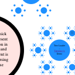
<h3>Tree Loader</h3>
An infinite, zoomable fractal displaying capabilities of Tapspace.js TreeLoader 
<a href="examples/treeloader/index.html">[Try app]</a> <a href="https://github.com/taataa/tapspace/blob/master/docs/examples/treeloader/">[See source]</a>

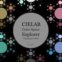
<h3>CIELAB Color Space Explorer</h3>
A fractal of colors using Tapspace.js TreeLoader 
<a href="examples/cielab/index.html">[Try app]</a> <a href="https://github.com/taataa/tapspace/blob/master/docs/examples/cielab/">[See source]</a>

<h3>Tiles</h3>
Pinch-zoomable grid of 400 tile images 
<a href="examples/tiles/index.html">[Try app]</a> <a href="https://github.com/taataa/tapspace/blob/master/docs/examples/tiles/">[See source]</a>

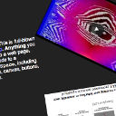
<h3>HTML</h3>
An arrangement of custom HTML content, including a YouTube video 
<a href="examples/html/index.html">[Try app]</a> <a href="https://github.com/taataa/tapspace/blob/master/docs/examples/html/">[See source]</a>

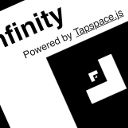
<h3>Infinity</h3>
Zoom into infinity 
<a href="examples/infinity/index.html">[Try app]</a> <a href="https://github.com/taataa/tapspace/blob/master/docs/examples/infinity/">[See source]</a>

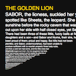
<h3>Book</h3>
Infinite amount of content within a finite space. 
<a href="examples/book/index.html">[Try app]</a> <a href="https://github.com/taataa/tapspace/blob/master/docs/examples/book/">[See source]</a>

<h3>Go</h3>
Play Go! 
<a href="examples/go/index.html">[Try app]</a> <a href="https://github.com/taataa/tapspace/blob/master/docs/examples/go/">[See source]</a>

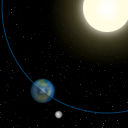
<h3>Canvas</h3>
Animated zoomable HTML5 Canvas 
<a href="examples/canvas/index.html">[Try app]</a> <a href="https://github.com/taataa/tapspace/blob/master/docs/examples/canvas/">[See source]</a>

<h3>Semantic Zoom</h3>
Content that reacts to zoom level 
<a href="examples/semanticzoom/index.html">[Try app]</a> <a href="https://github.com/taataa/tapspace/blob/master/docs/examples/semanticzoom/">[See source]</a>

<h3>Gears</h3>
Gears with rotation handles 
<a href="examples/gears/index.html">[Try app]</a> <a href="https://github.com/taataa/tapspace/blob/master/docs/examples/gears/">[See source]</a>

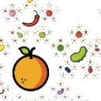
<h3>Fractal Password</h3>
What if passwords were just fruits hid deep in a fractal? 
<a href="examples/password/index.html">[Try app]</a> <a href="https://github.com/taataa/tapspace/blob/master/docs/examples/password/">[See source]</a>

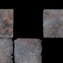
<h3>Grid</h3>
A snapping grid that snaps translations and rotations 
<a href="examples/grid/index.html">[Try app]</a> <a href="https://github.com/taataa/tapspace/blob/master/docs/examples/grid/">[See source]</a>

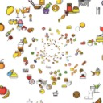
<h3>Tunnel of Foods</h3>
Foods positioned with 3D coordinates. 
<a href="examples/tunnel/index.html">[Try app]</a> <a href="https://github.com/taataa/tapspace/blob/master/docs/examples/tunnel/">[See source]</a>

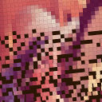
<h3>Pixels</h3>
Lenna, a `SpaceGroup` of `SpacePixels` 
<a href="examples/pixels/index.html">[Try app]</a> <a href="https://github.com/taataa/tapspace/blob/master/docs/examples/pixels/">[See source]</a>

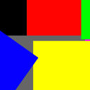
<h3>Modes</h3>
Modes of direct manipulation allowed by `Touchable` 
<a href="examples/modes/index.html">[Try app]</a> <a href="https://github.com/taataa/tapspace/blob/master/docs/examples/modes/">[See source]</a>

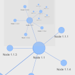
<h3>Vis.js Network</h3>
Interactive and recursive <a href="https://visjs.github.io/vis-network/docs/network/">Vis.js networks</a> on Tapspace 
<a href="examples/visjs/index.html">[Try app]</a> <a href="https://github.com/taataa/tapspace/blob/master/docs/examples/visjs/">[See source]</a>

See also [early Tapspace.js v2 examples](https://demos.akselipalen.com/tapspace-demos/).

## Thanks to

Members of LINCS team at [Texas A+M University](https://www.tamu.edu/) and [University of Guelph](https://www.uoguelph.ca/), 2023.
- Bryan Tarpley
- Susan Brown
- Jordan Lum

Fellows of Infant Cognition Laboratory at [Tampere University](https://www.tuni.fi/en), 2016.
- Jussi Kaatiala
- Jukka Leppänen

Members of the Tapspace v0 code inspection group on 2013-Nov-18
- Mikko Nurminen
- Mika Kunnas
- Elina Lukkarinen
- Johanna Issakainen
- Timo Ruostila
- Mikko Teuho
