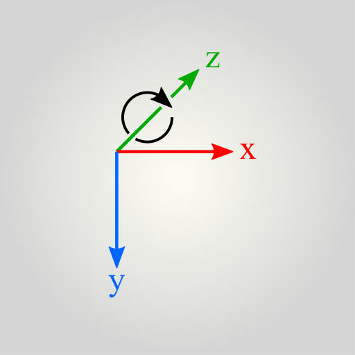

# Tutorial

Ready to build your first Tapspace app? You have come to the right place. Here we go through the basics from setting up a *space* to hold your content, a *viewport* to navigate your content, and how to place elements into the space.

In this tutorial we assume you have basic knowledge on web programming concepts such as HTML, CSS, DOM, and JavaScript.

## Create a web app

Create a directory named `tapspace-hello` and in it a file `index.html` with the following content:

    insert html boilerplate here

Adjust the title to your liking.

## Install tapspace

Add script line:

    

Let us also add empty script tag in which we begin to write the app.

    

## Create a space

Create an empty container element. This will contain all the space elements and also act as a viewport to the space.

    

In the script init the space.

    const space = tapspace.create('#mytapspace')

## Create a space element

Then we create our first space element. This does not yet add the element to the space, that we do later.

    const hello = tapspace.element('<strong>Hello</hello>', {
      size: { width: 300, height: 300 },
      anchor: { x: 150, y: 150 }
    })

Why size? Unlike normal web pages, the space is infinite. Therefore, we must set the size for the elements. The default size is 256x256 pixels.

The anchor point defines the default point on the element. For example, if you place the element at viewport (200,100) the element will be moved so that its anchor point aligns with the viewport at (200,100).

## Add elements to the space

Now we can add the element to the space. First we have to create an *origin plane*.

    const plane = space.createPlane()

The origin plane works as the *frame of reference* for the content. If you are familiar with photo editing software, You can thing the origin planes as the *main layers*. Simply, an origin plane gives rise to a coordinate system, that you can use to position your content content. The space can have many origin planes.

    const firstLayer = space.createPlane()
    const secondLayer = space.createPlane()

Does the space itself have a coordinate system? No. In order to achieve infinite zoomability, Tapspace has no fixed world coordinates. You must always define positions relative to things like the viewport, planes, or elements.

    const viewport = space.getViewport()
    plane.add(hello, viewport.at({ x: 200, y: 100 }))

The code above will append our hello element into the plane element. The hello element will be placed so that its anchor matches the viewport at the specified position.

## Move the element

Tapspace follows right-handed coordinate system. The three axes are perpendicular to each other. The default orientation is x-axis right, y-axis down, and z-axis away from the viewer.

Space elements can be rotated around their *anchor point* causing their inner x- and y-axes be rotated also.

    const deg15 = Math.PI / 12
    hello.rotateBy(deg15)

You can move the element around with the [translateBy(vec)](../api#tapspacecomponentsabstractplanetranslateby) method.

    hello.translateBy({ x: 10, y: -20, z: 5 })

Each move updates the CSS3 transform property of your hello element. You can animate the move with the [animate(...)](../api#tapspacecomponentsabstractplaneanimate) method.

    hello.animate({
      duration: '200ms',
      easing: 'linear'
    })
    hello.scaleBy(2)

## Make the viewport zoomable

    const viewport = space.getViewport()
    viewport.zoomable()

## Make the element interactive

    hello.tappable()
    hello.on('tap', function () {
      hello.html('<em>Hello World!</em>')
    })

## What next?

See the [example apps](../#examples) and [API documentation](../api). The source code of each example is filled with tutoring comments and useful techniques.
