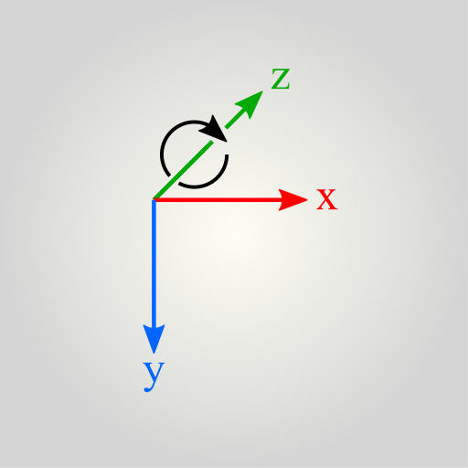

[1.6.0](../v1/) [2.0.0-alpha.4](#)

# Tutorial

Ready to build your first Tapspace app? You have come to the right place. Here we go through the basics from setting up a *space* to hold your content, a *viewport* to navigate your content, and how to place elements into the space.

In this tutorial we assume you have basic knowledge on web programming concepts such as HTML, CSS, DOM, and JavaScript.

This tutorial is for Tapspace.js version v2.0.0-alpha.4

## Step 1: Prepare a web page for the app

Create a directory named `tapspace-hello` and in it a file `index.html` with the following content:

    <!DOCTYPE html>
    <html lang="en">
    <head>
      <meta charset="utf-8">
      <title>Hello Tapspace</title>
    </head>
    <body>
    </body>
    </html>

Adjust the title to your liking.

Import Tapspace script by adding the following line before the ending head tag:

    ...
      
    </head>
    ...

The bundle hosted by unpkg.com delivery network is okay for development and toy apps. If you need production-grade performance and reliability, it is best to host the bundle along your other assets or even bundle it with your app code.

Note the [defer](https://developer.mozilla.org/en-US/docs/Web/HTML/Element/script) keyword. It ensures the script download does not block the browser from loading the rest of the page.

Let us also add a script tag into which we begin to write the app.

    ...
      
    </head>
    ...

We listen for the [DOMContentLoaded](https://developer.mozilla.org/en-US/docs/Web/API/Window/DOMContentLoaded_event) event to ensure the page and its assets are fully loaded before running our app.

## Step 2: Create a space with content

Inside the body tag, create an empty container element for the *viewport* of our space. This element will contain all the space elements, content, and navigation controls.

    

In the script, add the following to register the container element as a viewport.

    ...
    // My first tapspace app
    const viewport = tapspace.createView('#mytapspace')
    ...

Then create a *space* and connect it to the viewport. The space provides us a coordinate system, also called a *basis* or the *frame of reference*, onto which we can place our content.

    const space = tapspace.createSpace()
    viewport.addChild(space)

With a space we can construct *Point* objects:

    const p = space.at(200, 100)

Let us create our first content item. The item wraps HTML content and provides various methods for interaction and moving it in the space.

    const hello = tapspace.createItem('<strong>Hello</strong>')

The item is not yet added to the space nor DOM. Let us do that.

    space.addChild(hello, p)

This will add the hello item at the `p` coordinates { x: 200 y: 100 } relative to the origin of the space.

Now you can open your `index.html` in your web browser. The result should look something like this:

    TODO insert screenshot here

Great!

## Step 3: Positioning and sizing space elements

Tapspace follows right-handed coordinate system. The three axes are perpendicular to each other. The default orientation is x-axis right, y-axis down, and z-axis away from the viewer.

Unlike normal web pages, the space is infinite. Web browsers like to stretch HTML elements to the width of their container but in infinite space this does not make sense. Therefore, each space item has a fixed size. The default size is 256x256 pixels and resizing is easy:

    hello.setSize({ w: 400, h: 200 })

Fortunately, the inner contents of space elements do not need fixed size. The browsers lay out the contents as usual, treating the space element as the container.

Each space element has also an *anchor*. The anchor gives the otherwise rectangular element a single point-like location in space. This simplifies element placement, for example:

    hello.moveTo(view.atCenter())

Set the anchor with `setAnchor` method:

    hello.setAnchor({ x: 200, y: 100 })

In addition to positioning, the anchor acts as the default pivot point when you scale or rotate the element:

    const deg45 = Math.PI / 4
    hello.rotateBy(deg45)

Also, such transformation methods usually allow a custom pivot point to be used instead of the anchor:

    hello.rotateBy(deg45, hello.atTopRight())

You can move the element around with the [translateBy(vec)](../api#tapspacecomponentstransformertranslateby) method.

    hello.translateBy({ x: 10, y: -20, z: 5 })

Each move updates the CSS3 transform property of your hello element. You can animate the move with the [animate(...)](../api#tapspacecomponentstransformeranimate) and `animateOnce` methods.

    hello.animate({
      duration: '200ms',
      easing: 'linear'
    })
    hello.scaleBy(2)

## Step 4: Navigating the space

Our zoomable app still lacks the zoomability! Let us make the viewport zoomable. We access the viewport through the space.

    viewport.zoomable()

If you need only panning without zooming:

    viewport.pannable()

By default the viewport uses orthogonal "flat" projection. To make things feel more 3D, enable the perspective projection:

    viewport.perspective()

You can also chain the ability methods for a bit more compact code:

    viewport.zoomable().perspective()

In most parts the viewport behaves as any other space element. Thus it can be moved around, scaled, and rotated.

    viewport.translateTo(hello.atCenter())

The viewport also provides a basis. Initially, when the space is empty, the viewport it is the only basis we have.
We can use it to position spaces with respect to the current viewport position.

    const anotherSpace = tapspace.createSpace()
    viewport.addChild(anotherSpace, viewport.atCenter())

See [Viewport](../api#tapspacecomponentsviewport) for all available viewport methods.

## Step 5: Make elements interactive

Let us allow the hello element to be interactive. Like with the viewport we give the space element interactive abilities by calling one or more ability methods.

    hello.tappable()
    hello.on('tap', function () {
      hello.html('<em>HELLO!</em>')
    })

To allow users to move the element around:

    hello.draggable()
    hello.on('gestureend', function () {
      hello.html('You dragged me!')
    })

There are also ability methods for resizing, linear sliding, rotation, and more.

To prevent interaction with the HTML content of the space element, like form input or text selection, use `hello.setContentInput(false)`. In a similar fashion, if you want to dedicate pointer input to content but keep mouse wheel input for zooming, use `hello.setContentInput('pointer')`

## What next?

See the [example apps](../#examples) and [API documentation](../api). The source code of each example is filled with tutoring comments and useful techniques.
